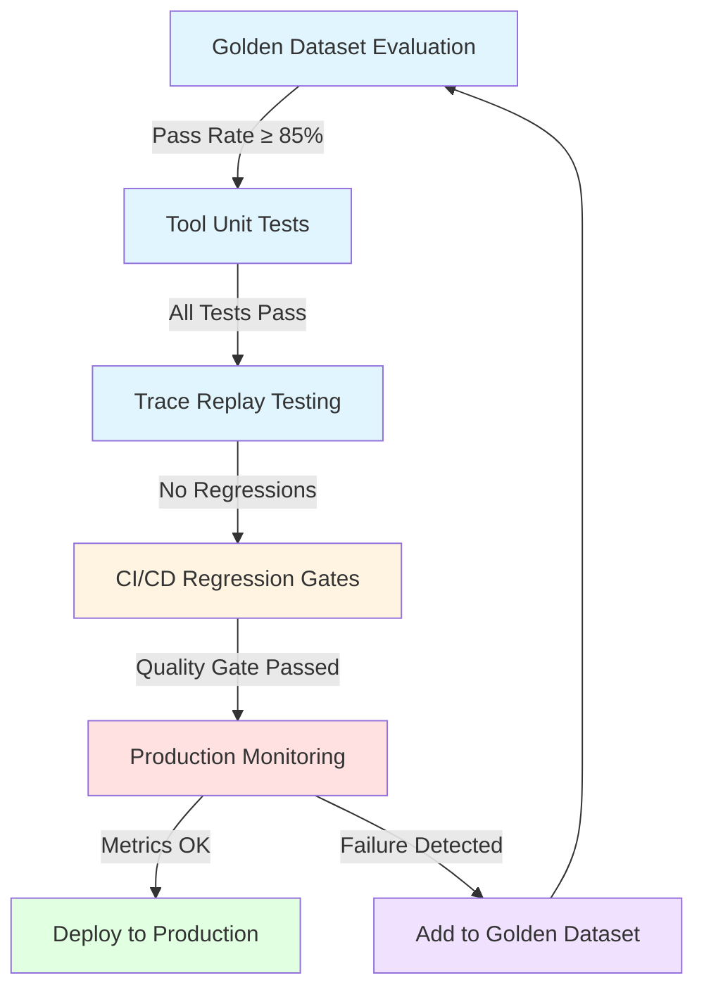

# AI Agent Testing and Evaluation Strategies

Production AI agent testing — golden dataset eval, unit tests for tools, trace replay, regression gates, and continuous monitoring patterns for reliable agent deployment.

## Contents

1. [Why agent testing matters](#why-agent-testing-matters)
2. [Golden dataset evaluation](#golden-dataset-evaluation)
3. [Unit tests for agent tools](#unit-tests-for-agent-tools)
4. [Trace replay testing](#trace-replay-testing)
5. [Regression gates for CI/CD](#regression-gates)
6. [Production monitoring](#production-monitoring)
7. [Implementation checklist](#implementation-checklist)
8. [Related guides](#related-guides)

## Why agent testing matters

AI agents ship with non-deterministic behavior, tool dependencies, and complex decision trees. Without structured testing, you're deploying prompt changes blind — no way to catch regressions before users hit them.

Consider a real scenario: you update your agent's system prompt to improve response quality. The change works well in your local tests, but after deployment you discover it broke the agent's ability to call the right tools in multi-step workflows. Users start reporting incomplete tasks. By the time you realize the issue, hundreds of failed runs have accumulated, customer trust is damaged, and you're scrambling to roll back.

This is the agent testing problem. Unlike traditional software where bugs are deterministic and reproducible, agent failures are probabilistic and context-dependent. A prompt change that improves performance on one task type can degrade it on another. Model provider updates can silently shift behavior. Tool API changes can break agent workflows without throwing errors.

### The production agent testing stack

Production agent testing means:

- **Measuring agent quality** on representative tasks before deploy
- **Catching tool failures** and permission errors in CI
- **Verifying agents** produce correct outputs on golden examples
- **Monitoring live agent behavior** and catching drift
- **Turning production failures** into regression tests

### The five-layer testing architecture

This guide covers a complete testing stack that production AI teams use in 2026. Each layer catches different types of failures:



**Layer 1: Golden dataset evaluation** runs your agent against curated test cases and measures pass rate.

**Layer 2: Tool unit tests** verify individual tool functions work correctly in isolation.

**Layer 3: Trace replay** captures and replays successful agent runs to catch behavior changes.

**Layer 4: Regression gates** block CI/CD deploys when quality drops below thresholds.

**Layer 5: Production monitoring** tracks live metrics and turns failures into new test cases.

Together, these layers give you confidence to ship agent changes fast while maintaining reliability. Let's dive into each one.

## Golden dataset evaluation

A golden dataset is a curated set of real user queries paired with expected agent outcomes. Run your agent against the dataset before every deploy and measure pass rate.

Think of it as integration testing for AI agents. Just as you wouldn't ship a web API without verifying it handles expected requests correctly, you shouldn't ship an agent without proving it completes representative tasks. The difference is that agent behavior is probabilistic, so you need multiple examples per task type and statistical pass rates rather than binary pass/fail.

### Building your golden dataset: Start with failures

The fastest path to a useful golden dataset is capturing real production failures. Every time an agent fails a task, that failure becomes a regression test. Start with 20-50 examples covering:

- **Common tasks** — The top 5-10 workflows your users run daily
- **Edge cases** — Missing data, ambiguous queries, multi-step dependencies
- **Past failures** — Every bug that reached production becomes a test
- **Tool coverage** — At least one example using each tool your agent has

### Dataset structure

Each example contains:

- **Input:** User query or task description
- **Expected outcome:** Success criteria (specific tool calls, file changes, or output format)
- **Context:** Files, state, or environment setup needed

### Example golden dataset entry

```json
{
  "id": "create-api-endpoint",
  "input": "Add a POST /users endpoint that accepts email and name",
  "context": {
    "files": ["app/main.py", "app/models.py"]
  },
  "expected": {
    "tool_calls": ["edit_file", "run_tests"],
    "files_modified": ["app/main.py"],
    "test_pass": true
  }
}
```

### Evaluation harness

Run the agent on each example, capture traces, and score results:

```python
def evaluate_agent(dataset, agent):
    results = []
    for example in dataset:
        # Set up context
        reset_workspace(example["context"])
        
        # Run agent
        trace = agent.run(example["input"])
        
        # Score outcome
        score = score_trace(trace, example["expected"])
        results.append(score)
    
    return {
        "pass_rate": sum(results) / len(results),
        "details": results
    }
```

### When to run

- Before every deploy (CI gate)
- After prompt or tool changes
- Weekly on the full dataset to catch model drift

## Unit tests for agent tools

Agent tools are functions the agent calls. Test them like any API — inputs, outputs, error handling, and permission boundaries.

### Tool test example

```python
def test_search_codebase():
    # Setup
    workspace = create_test_workspace({
        "main.py": "def hello(): pass"
    })
    
    # Call tool
    result = search_codebase(
        query="def hello",
        workspace=workspace
    )
    
    # Assert
    assert len(result["matches"]) == 1
    assert result["matches"][0]["file"] == "main.py"
```

### What to test

- **Happy path:** Tool works with valid inputs
- **Error handling:** Tool returns useful errors on bad input
- **Permissions:** Tool respects file boundaries and access rules
- **Idempotency:** Running the same tool call twice is safe

Run tool tests in CI. They're fast and catch breaking changes before they reach the agent.

## Trace replay testing

Trace replay takes a real agent execution (the "trace"), saves it, and replays it later to verify behavior stayed consistent. It's the agent equivalent of snapshot testing in frontend development — you capture what "good" looks like, then verify future versions match.

The power of trace replay is catching regressions you didn't anticipate. When you change a system prompt or switch models, golden dataset eval tells you if pass rate dropped. Trace replay tells you _how_ behavior changed — which tool calls are different, where the agent took a different path, what specific steps regressed.

### What's in a trace

A trace is the full log of one agent run:

- User input
- Model responses
- Tool calls with arguments
- Tool results
- Final output

### Replay workflow

1. Capture traces from production or staging
2. Mark "good" traces as regression tests
3. Replay traces after prompt or model changes
4. Flag if new behavior diverges from the golden trace

### Replay assertion example

```python
def test_trace_replay():
    # Load golden trace
    trace = load_trace("golden/add-endpoint-001.json")
    
    # Replay with current agent
    new_trace = agent.replay(trace["input"])
    
    # Assert key outcomes match
    assert new_trace["tool_calls"] == trace["tool_calls"]
    assert new_trace["files_modified"] == trace["files_modified"]
```

Trace replay catches regressions fast. If a prompt tweak breaks a working flow, the test fails.

## Regression gates for CI/CD

Regression gates block deploys when agent quality drops below a threshold. Run golden dataset eval + trace replay in CI, and fail the build if pass rate falls.

### CI pipeline example

```yaml
# .github/workflows/agent-eval.yml
name: Agent Evaluation
on: [pull_request]

jobs:
  eval:
    runs-on: ubuntu-latest
    steps:
      - uses: actions/checkout@v4
      - name: Run golden dataset eval
        run: python eval/run_golden_dataset.py
      - name: Check pass rate
        run: |
          PASS_RATE=$(cat eval/results.json | jq '.pass_rate')
          if (( $(echo "$PASS_RATE < 0.85" | bc -l) )); then
            echo "Pass rate $PASS_RATE below threshold"
            exit 1
          fi
```

### Threshold tuning

- Start with 80% pass rate, increase as dataset quality improves
- Allow manual override for intentional breaking changes
- Track pass rate over time to measure drift

## Production monitoring

Testing in CI catches most regressions. Production monitoring catches the rest — model API changes, upstream tool failures, and real-world edge cases your test suite hasn't seen yet.

The key difference between development testing and production monitoring is scale and diversity. In production, you see traffic patterns, query distributions, and failure modes that synthetic tests miss. A working test suite with 95% pass rate can still fail 10% of real user tasks because production queries are weirder, noisier, and more adversarial than your golden dataset.

### What production monitoring actually looks like

Modern LLMOps platforms provide three monitoring layers:

1. **Infrastructure metrics** — Latency, error rates, token costs per request
2. **Quality metrics** — LLM-as-judge scores on a sample of production traffic
3. **Business metrics** — Task completion rate, user satisfaction, manual override frequency

The second layer is what separates mature agent deployments from prototypes. Instead of only tracking whether requests succeed or fail, run automated quality judges on 5-10% of production traffic daily. This catches silent quality degradation — when prompt changes or model updates cause gradual decline that no single user reports, but that accumulates into measurable churn.

### LLMOps platforms for agent monitoring

Leading production teams use specialized observability platforms rather than building from scratch:

- **MLflow** — Open source, full-lifecycle platform with tracing, evaluation, and production monitoring. Apache 2.0 licensed, no enterprise paywalls.
- **Langfuse** — Self-hosted observability with decorator-based tracing. Best for teams with data residency requirements (HIPAA, GDPR).
- **LangSmith** — Native for LangChain/LangGraph users. Automatic tracing with `LANGCHAIN_TRACING_V2=true`.
- **Braintrust** — Evaluation-first platform with strong dataset versioning and comparison tools.
- **Arize Phoenix** — Observability focused on embedding drift detection and trace analysis.

All support attaching quality scores to production traces. The workflow: run an LLM judge on a sample of traffic, plot score distribution over a rolling window, alert when it drops below baseline.

### Metrics to track

| Metric | What it measures | Alert threshold |
|--------|------------------|-----------------|
| Tool success rate | % of tool calls that succeed | < 95% |
| Task completion rate | % of agent runs that finish successfully | < 85% |
| Average turns per task | Efficiency — fewer is better | > 15 turns |
| Cost per task | LLM API spend | > $0.50 |
| Error rate | % of runs with exceptions | > 5% |

### Logging setup

Log every agent run with structured fields:

```json
{
  "run_id": "run_abc123",
  "timestamp": "2026-09-14T10:30:00Z",
  "input": "Add user endpoint",
  "tool_calls": ["edit_file", "run_tests"],
  "success": true,
  "turns": 3,
  "cost_usd": 0.12,
  "latency_ms": 4500
}
```

Push logs to Datadog, Grafana, or CloudWatch. Set up alerts when metrics cross thresholds.

## Implementation checklist

Start with these steps to add production-grade testing to your agent. Each layer adds value independently — you don't need all five to start seeing benefit.

### Week 1: Foundation (Golden dataset + Tool tests)

1. **Build a golden dataset**
   - Collect 20-50 real examples from production logs or user support tickets
   - Cover your top 5 user workflows plus known edge cases
   - Define clear success criteria for each example (specific tool calls, outputs, or states)

2. **Write an eval harness**
   - Create a runner that executes your agent against each example
   - Capture full traces (inputs, tool calls, outputs, errors)
   - Build scorers — deterministic checks first, LLM judges second
   - Target: 200-400 lines of Python, runs in under 5 minutes

3. **Add tool unit tests**
   - Write pytest/unittest cases for each tool function
   - Test happy path, error handling, permissions, idempotency
   - Mock external APIs to keep tests fast and stable

### Week 2: Regression protection (Trace replay + CI gates)

4. **Set up trace capture**
   - Save successful agent runs as structured JSON
   - Store traces in a `tests/golden_traces/` directory
   - Mark 10-20 traces as regression baselines
   - Write replay tests that verify tool call sequences stay consistent

5. **Add CI regression gate**
   - Run golden dataset eval on every PR
   - Fail build if pass rate drops below 85-90%
   - Report which specific examples failed in PR comments
   - Track pass rate trends over time in a dashboard

### Week 3: Production reliability (Monitoring + Feedback loop)

6. **Instrument production**
   - Log every agent run with structured fields (run ID, input, tools, outcome, cost, latency)
   - Set up dashboards in Datadog, Grafana, or an LLMOps platform
   - Define alert thresholds for tool success rate, task completion, and cost
   - Run LLM judges on 5-10% of production traffic daily

7. **Close the feedback loop**
   - Every production failure becomes a candidate for the golden dataset
   - Review failed runs weekly, add reproducible failures as regression tests
   - Track which test cases came from production vs synthetic

**Minimum viable stack:** Golden dataset eval alone catches 70-80% of regressions. If you can only ship one layer, ship that. Add the other layers as agent complexity grows.

## Related guides

- [How to Build a Cursor-Like AI Coding Agent](/blog/posts/how-to-build-cursor-like-ai-coding-agent/)
- [AI Agents + MCP for Data Engineering Automation](/blog/posts/ai-agent-mcp-data-engineering-automation/)
- [How to Build a Production RAG Chatbot](/blog/posts/how-to-build-a-production-rag-chatbot/)
- [Autonomous Agent Orchestration Platform](/solutions/autonomous-agent-orchestration-platform/)

---

© stackcone 2026 · [Privacy](https://stackcone.com/privacy/)
