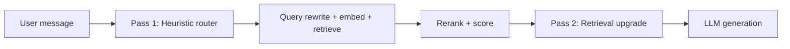

# Auto Model Routing Without Calling an LLM to Pick an LLM

**July 2026 · Published by Amar Kumar**

Most production chat products offer an **Auto** model mode. The obvious implementation: call a cheap LLM to classify the user's question, then route to the right tier. That works — but it adds latency, tokens, and failure modes on **every request**.

We built a different approach for a production RAG chatbot: **heuristic routing** (regex + feature scoring) before retrieval, then a **post-retrieval tier bump** when the knowledge base returns weak matches. No classifier call. Deterministic. Testable with plain pytest.

This guide walks through the full design — tier ladder, rule priority, complexity scoring, retrieval-driven upgrades, and how to wire it into a FastAPI chat endpoint.

> **Who is this for?** Teams running multi-provider RAG chat (Gemini, OpenRouter, OpenAI) who want Cursor-style Auto routing without paying for a routing LLM on every turn.

## Table of contents

1. [Why not use an LLM classifier?](#why-not-classifier)
2. [Two-pass routing architecture](#two-pass)
3. [The tier ladder](#tier-ladder)
4. [Pre-retrieval heuristics](#pre-retrieval)
5. [Complexity scoring](#complexity-score)
6. [Rule priority and examples](#rule-priority)
7. [Post-retrieval tier upgrade](#post-retrieval)
8. [Auto pool vs manual picker](#auto-pool)
9. [Wiring into the chat pipeline](#pipeline)
10. [Testing with pytest](#testing)
11. [Tuning checklist](#checklist)
12. [FAQ](#faq)

## Why not use an LLM classifier?

The classifier pattern looks like this:

```
User message → cheap LLM ("classify complexity") → pick model → RAG → answer
```

Problems in production:

| Issue | Impact |
|-------|--------|
| Extra LLM call every turn | +200–400 ms latency, +500–1500 input tokens |
| Classifier drift | Model updates change routing behavior silently |
| Hard to test | Non-deterministic; flaky CI |
| Double billing | You pay for routing *and* answering |
| Failure coupling | Classifier 503 blocks the whole chat |

**Heuristic routing** inverts the trade-off: accept imperfect classification on edge cases, gain zero routing cost, instant routing, and full test coverage.

Cursor's Auto mode uses a similar philosophy — feature-based routing, not a meta-LLM call. Our implementation follows that pattern.

## Two-pass routing architecture

Routing happens in **two passes**:



**Pass 1 (pre-retrieval):** Inspect the message text, word count, conversation history, and regex patterns. Pick a starting model tier.

**Pass 2 (post-retrieval):** After Pinecone search and optional Cohere rerank, check retrieval confidence. If the top rerank score is low, bump the model up one or two tiers on the ladder.

This split matters because a short FAQ ("how do I zoom in?") needs a cheap model when retrieval is confident — but the same cheap model fails when retrieval returns weak chunks on a troubleshooting question.

## The tier ladder

Define a fixed ladder of models from economy to premium:

| Tier | Model role | Example IDs |
|------|------------|-------------|
| 0 — Economy | Cheapest; high-volume FAQs | `gemini-2.5-flash-lite`, `deepseek-v4-flash` |
| 1 — Standard | Routine support, moderate explain | `deepseek-chat-v3.1`, `mistral-small-2603` |
| 2 — Capable | Deep guides, long questions, first-turn debug | `gemini-2.5-flash`, `qwen3-235b-a22b` |
| 3 — Premium | Hard multi-turn troubleshoot | `gemini-3-flash-preview` |

The router never jumps to an arbitrary model — it always moves along this ladder via `_bump_model_tier(model, steps)`.

```python
_TIER_LADDER = (
    "gemini-2.5-flash-lite",   # 0 economy
    "deepseek-chat-v3.1",      # 1 standard
    "gemini-2.5-flash",        # 2 capable
    "gemini-3-flash-preview",  # 3 premium
)
```

## Pre-retrieval heuristics

Before any vector search, `resolve_auto_model()` inspects the user message.

### Regex signal patterns

| Pattern | Regex intent | Routes to |
|---------|--------------|-----------|
| Hard troubleshoot | `not working`, `error`, `crash`, `debug` | Capable or Premium |
| Compare / either-or | `compare`, `vs`, `pros and cons`, `A or B` | Mistral (comparison reasoning) |
| Deep / guide | `in detail`, `step by step`, `walk me through` | Capable Flash |
| Support / account | `license`, `activate`, `subscription` | Standard tier |

Hard troubleshoot runs **before** support keywords — so "My license export keeps failing with an error" routes to debug tier, not routine support.

### Length and structure signals

| Signal | Threshold | Effect |
|--------|-----------|--------|
| Word count | > 45 words | +2 complexity; route to Capable |
| Multiple questions | > 1 `?` in message | +2 complexity |
| Long paste | > 2500 chars | Route to Capable |
| Follow-up turn | prior assistant message exists | +1 complexity; may bump tier |

## Complexity scoring

A numeric score aggregates structural features:

```python
def _complexity_score(lower, words, chars, prior_assistant, conversation_summary=None):
    score = 0
    if words > 12:  score += 1
    if words > 28:  score += 1
    if words > 45:  score += 2
    if chars > 1200: score += 1
    if chars > 2500: score += 2
    if lower.count("?") > 1: score += 2
    if prior_assistant > 0: score += 1
    if _DEEP_RE.search(lower) or _GUIDE_RE.search(lower): score += 2
    if _HARD_RE.search(lower): score += 2
    if conversation_summary and len(conversation_summary.strip()) > 800: score += 1
    return score
```

Score ≥ 6 routes to Capable tier regardless of other rules.

## Rule priority and examples

Rules are evaluated in **priority order** — first match wins:

| Priority | Condition | Model | Reason code |
|----------|-----------|-------|-------------|
| 1 | Hard troubleshoot + follow-up or score ≥ 5 | Premium | `hard_troubleshoot_premium` |
| 2 | Hard troubleshoot (first turn) | Capable | `hard_troubleshoot` |
| 3 | Compare / either-or | Mistral | `compare_or_either_or` |
| 4 | Deep explanation or step-by-step | Capable | `deep_or_guide` |
| 5 | Very long message (> 2500 chars or > 85 words) | Capable | `long_context` |
| 6 | Multi-question or score ≥ 6 | Capable | `high_complexity` |
| 7 | Follow-up + elaboration | Capable | `follow_up_elaboration` |
| 8 | Follow-up (generic) | Standard | `follow_up` |
| 9 | Support keywords or 14–40 words | Standard | `routine_support` |
| 10 | "explain" + > 18 words | Standard | `moderate_explain` |
| 11 | Short FAQ (> 8 words) | Economy+ | `short_faq` |
| 12 | Very short (4–8 words) | Ultra-cheap | `very_short` |
| 13 | Minimal (≤ 3 words) | Default economy | `minimal` |

### Worked examples

| User message | Resolved model | Why |
|--------------|----------------|-----|
| `"how do I zoom in?"` | `gemini-3.1-flash-lite` | Short FAQ |
| `"How do I activate my license?"` | `deepseek-chat-v3.1` | Support keyword |
| `"Compare frameless vs framed cabinets"` | `mistral-small-2603` | Compare pattern |
| `"explain the export folder in very detail"` | `gemini-2.5-flash` | Deep pattern |
| `"export keeps crashing when I click export"` (turn 1) | `gemini-2.5-flash` | Hard troubleshoot |
| Same message (turn 2, after assistant reply) | `gemini-3-flash-preview` | Hard + follow-up → premium |

Log the `reason` code on every route — essential for tuning.

## Post-retrieval tier upgrade

After retrieval and rerank, `adjust_auto_model_for_retrieval()` may bump the tier:

| Condition | Bump |
|-----------|------|
| Rerank ran, top score < 0.08 | +2 tiers |
| Rerank ran, top score < 0.15 | +1 tier |
| No rerank, top cosine < 0.72 | +1 tier |
| Otherwise | No change |

Example: economy model selected for a short question, but rerank top score is 0.04 → bump +2 from tier 0 to tier 2.

This aligns with the soft no-results gate (score < 0.05 skips LLM entirely) — the upgrade catches the gray zone between 0.05 and 0.15 where a stronger model can synthesize weak context.

Thresholds should match your rerank gate and caveat logic — we use 0.15 because that's where we inject a "retrieval confidence is low" caveat into the system prompt.

## Auto pool vs manual picker

**Auto mode** routes only within a fixed pool of budget-to-mid models accessed via OpenRouter and Gemini. **Premium manual models** (Claude Sonnet, Claude Haiku) stay in the UI picker but are never Auto-selected.

Why exclude Claude from Auto:

- Cost control — Sonnet at default would erase routing savings
- Predictability — Auto should stay within a known cost envelope
- User choice — power users pick Claude explicitly when they need it

```python
AUTO_MODEL_POOL = frozenset({
    "gemini-2.5-flash-lite",
    "gemini-3.1-flash-lite",
    "deepseek-v4-flash",
    "deepseek-chat-v3.1",
    "mistral-small-2603",
    "gemini-2.5-flash",
    "qwen3-235b-a22b",
    "gemini-3-flash-preview",
})
# Claude models available in manual picker only
```

## Wiring into the chat pipeline

In the FastAPI chat handler, routing fits between request parsing and retrieval:

```python
def _resolve_chat_model(request):
    requested = request.model or default_chat_model()
    if requested == "auto":
        resolved = resolve_auto_model(
            request.message,
            request.conversation_history,
            conversation_summary=request.conversation_summary,
        )
        return resolved, "auto"
    return requested, None

# ... after retrieval + rerank ...
if auto_requested == "auto":
    model_name = adjust_auto_model_for_retrieval(
        model_name,
        top_rerank_score=top_rerank_score,
        rerank_ran=rerank_scores is not None,
        top_cosine=top_cosine,
    )
```

Return both `requested_model: "auto"` and `resolved_model: "<actual-id>"` in usage headers so billing dashboards show what Auto picked.

Full pipeline order:

1. Resolve Auto model (Pass 1)
2. Query rewrite (optional, separate cheap LLM)
3. Embed + Pinecone search
4. Conditional Cohere rerank
5. Adjust Auto model (Pass 2)
6. Soft no-results gate
7. MMR selection
8. LLM generation with resolved model

## Testing with pytest

Heuristic routers are fully deterministic — write table-driven tests:

```python
def test_heuristic_short_faq():
    assert resolve_auto_model("how do I zoom in?") in (
        "deepseek-v4-flash",
        "gemini-2.5-flash-lite",
        "gemini-3.1-flash-lite",
    )

def test_heuristic_compare_routes_to_mistral():
    assert resolve_auto_model("Compare option A vs option B") == "mistral-small-2603"

def test_heuristic_hard_troubleshoot_premium_on_follow_up():
    history = [{"role": "assistant", "content": "Try restarting."}]
    assert resolve_auto_model(
        "export keeps crashing when I click export", history
    ) == "gemini-3-flash-preview"

def test_retrieval_upgrade_bumps_on_low_rerank():
    assert adjust_auto_model_for_retrieval(
        "gemini-2.5-flash-lite",
        top_rerank_score=0.10,
        rerank_ran=True,
    ) == "deepseek-chat-v3.1"
```

Run these on every PR. When you tune a regex or threshold, update the test — the test suite *is* your routing spec.

## Tuning checklist

### Must have

- Fixed tier ladder (no arbitrary model jumps)
- Reason codes logged on every route
- Post-retrieval bump tied to rerank scores
- pytest coverage for top 10 message patterns
- Usage header with `requested_model` + `resolved_model`

### Should have

- Hard-troubleshoot priority over support keywords
- Compare questions routed to a model good at structured comparison
- Claude/frontier models excluded from Auto pool
- Conversation summary length as complexity signal

### Measure

- Auto resolution distribution by tier (% economy vs capable vs premium)
- Cost per request: Auto vs always-Sonnet baseline
- User-reported quality on hard-troubleshoot routes
- How often Pass 2 bumps tier (and whether quality improves)

## FAQ

**Why not use token count alone?**
Word count misses intent. "Compare X vs Y" is 4 words but needs a comparison-capable model. Regex patterns catch intent; length catches paste dumps and multi-question messages.

**Doesn't heuristic routing miss edge cases?**
Yes — occasionally. Pass 2 (retrieval upgrade) catches the worst misses. Manual model picker covers power users. The goal is 90% cost savings on 95% of traffic, not perfect classification.

**How is this different from query rewrite?**
Query rewrite expands follow-ups into standalone search queries (an LLM call). Model routing picks which generator model to use. They are separate decisions — rewrite runs before retrieval; routing Pass 1 runs before rewrite; Pass 2 runs after rerank.

**Can I add an LLM classifier as a fallback?**
You can, but we don't. If heuristics fail often enough to justify a classifier, fix the heuristics first — they're cheaper to iterate.

**What about routing by user tier (free vs paid)?**
Keep that in the API layer, not the router. Auto routing is about question complexity and retrieval confidence, not billing plan.

---

**Related guides**

- [Best Economical LLM Models for RAG](./best-economical-llm-models-rag-openai-gemini-anthropic.html)
- [Cohere Reranking for Production RAG](./cohere-reranking-production-rag-retrieval.html)
- [How to Build a Production RAG Chatbot](./how-to-build-a-production-rag-chatbot.html)
