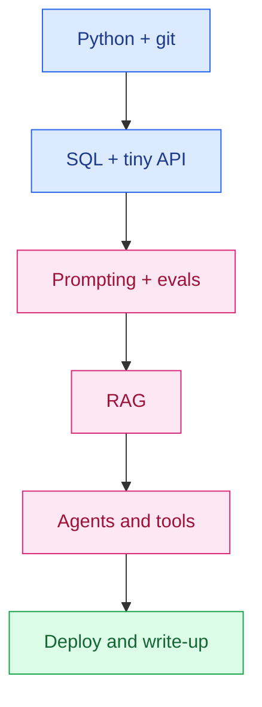

# Best AI Courses and Skills to Learn

The internet will sell you a 40-hour "Complete AI Bootcamp" every week. Hiring managers will ask whether you can retrieve the right document, measure that it was right, and ship it behind an API. Those are different products.

This guide is for two audiences that keep getting the same bad advice: **people upskilling in India** (campus, service companies, career switch inside IT) and **career changers in the US** who already have a domain. The plan is skills, not certificates. There is no guaranteed job at the end of it. There is a stack that shows up in real interviews.

## Table of contents

- [Skills, not certificates](#skills)
- [The core stack](#core)
- [Course types worth your time](#course-types)
- [A six-month plan](#six-months)
- [What not to waste time on](#skip)
- [Skill to hiring signal](#signal)
- [Learning path](#path)
- [India upskilling and US career changers](#audiences)
- [FAQ](#faq)

## Skills, not certificates {#skills}

A certificate proves you clicked through a vendor's content and maybe passed a multiple-choice quiz. A hiring signal is a repo, a write-up, and twenty minutes of being able to explain why retrieval failed. Collect the second. Use the first only if a specific employer's ATS still filters on brand names.

That sounds harsh because the market is noisy. DeepLearning.AI-style programs, Google/OpenAI/Anthropic badges, and university micromasters all have a place as *structured practice*. They are not a substitute for Python, SQL, git, and one ugly project that actually answers questions from a folder of PDFs.

If you need a language decision before this plan, read [Python vs Java with AI](/blog/posts/python-vs-java-with-ai/). The rest of this post assumes Python as the AI-shaped default, with Java as a parallel path if that is who hires you.

## The core stack {#core}

Seven skills. You do not need a PhD. You do need to be able to use each one without a tutorial open.

| Skill | What "good enough" looks like | Where to practice |
|-------|-------------------------------|-------------------|
| **Python** | Functions, files, virtualenv, HTTP calls, a small FastAPI app | [stackcone Python track](/learn/programming/python/hello-world/) |
| **SQL** | Joins, filters, aggregates, indexes at a basic level | [SQL course](/learn/programming/sql/introduction/) |
| **Git** | Branch, commit, PR, undo a mistake, read a diff | [Git course](/learn/programming/git/command-line/); your own GitHub |
| **Prompting vs evals** | You write a prompt *and* a set of cases that can fail it | Vendor cookbooks + a spreadsheet of questions |
| **RAG** | Chunk, embed, retrieve, answer from context, cite | [What Is RAG](/blog/posts/what-is-rag/), then [production RAG](/blog/posts/how-to-build-a-production-rag-chatbot/) |
| **Agents / tools** | A loop that calls a function (search, DB, HTTP) and stops | Official tool-use docs; one tiny agent, not a multi-agent demo |
| **Basic cloud** | Deploy an API, set a secret, read logs, estimate a bill | One provider: Fly, Railway, Cloud Run, or AWS Lightsail |

### Prompting vs evals

Prompting is how you talk to the model. Evals are how you know whether that talk worked yesterday and still works after you change the chunk size. Teams that only prompt thrash. Teams that keep a golden set of 30–100 questions can tell whether a change helped. If you learn one "AI-native" habit, learn evals. Retrieval evals are the version that matters for RAG: see [how to evaluate RAG retrieval](/blog/posts/how-to-evaluate-rag-retrieval/).

### Agents without the science-fair

An agent is a model that can call tools in a loop. That is useful. A slide with seven agents passing notes to each other is usually a demo. Learn one tool-calling loop, timeouts, and what you log when it goes wrong. Then stop adding agents until a real task needs them.

### Cloud, not certifications

You need to deploy. You do not need all twelve AWS associate tracks. One working URL, environment variables that are not in git, and a sense of token cost will beat a badge that you cannot map to a running service.

## Course types worth your time {#course-types}

Do not shop SKUs. Shop formats. These five types cover almost every useful hour. I am not listing twenty Udemy titles on sale this week; those listings rot and they are rarely the bottleneck.

| Type | What it is good for | What it is bad for |
|------|---------------------|--------------------|
| **Official docs and cookbooks** | Current APIs: OpenAI, Anthropic, Google, your vector DB | Curriculum and motivation; you have to set the project |
| **Fast.ai-style** | Code-first, notebooks, you train something real early | Not a job-search program; you still need to productize |
| **DeepLearning.AI-style** | Clear sequence, short videos, brand that HR recognizes | Easy to collect certificates and skip the repo |
| **Vendor courses** (OpenAI / Anthropic / Google) | How *this* API wants to be used; free or cheap; up to date | Vendor-shaped thinking; still need evals and your data |
| **stackcone Learn tracks** | Python, Java, SQL, git, FastAPI, Django, Spring, LangChain — exercises, not lectures | Not a degree and not an interview coaching service |

A sane mix for six months: stackcone (or equivalent) for language and git; one Fast.ai-style or vendor project course for ML/LLM intuition; official docs as the daily driver once you have a project. Skip the "400-lecture complete bootcamp" unless you already know you finish long video series. Most people do not.

Start on [stackcone Learn](/learn/) if you want a free, exercise-based path for the non-hype layer (language, SQL, git, frameworks). Use vendor docs the day you call a paid API, so you are not learning last year's SDK from a pirated zip.

## A six-month plan {#six-months}

Assume 8–10 focused hours a week. If you have more, do more projects, not more courses. Months overlap; the labels are so you do not start with transformers from scratch in week one.

| Month | Focus | Output you can show |
|-------|-------|---------------------|
| **1** | Python + git. Files, functions, tests, GitHub. | A CLI or script repo with a README. |
| **2** | SQL + a tiny API (FastAPI). One table, one deploy. | A live URL that reads and writes data. |
| **3** | LLM API + prompting + a 20-question eval set. | A script that scores answers; you can explain misses. |
| **4** | RAG: ingest a folder of docs, retrieve, cite. | A chatbot that answers from *your* files. |
| **5** | One tool-using agent (search or DB). Logging. Cost cap. | A loop you can demo and that you can stop. |
| **6** | Harden: evals, a simple UI, a write-up, apply or freelance. | One public project and a page that explains tradeoffs. |

Month 4 is where most people finally have something interview-shaped. Use the RAG explainer and the production guide rather than a 20-hour video that hides the index in a framework. Month 6 is packaging: people hire the write-up as much as the code.

If you already write production Python, skip months 1–2 and spend them on evals and RAG. If you are a Java Spring developer in a service company, keep Java at work and run this plan in Python in the evenings so you can take internal AI tickets. Do not quit a job because a course timeline looks neat.

## What not to waste time on {#skip}

- **Certificate collecting.** Three badges and no repo is a red flag, including to you.
- **Training an LLM from scratch.** You will not beat a lab. Use APIs. Fine-tune later if a job needs it.
- **Prompt-only courses** that never mention evals, retrieval, or cost.
- **Multi-agent frameworks in week two.** Learn one tool loop first.
- **Every new model launch.** Pick one API, ship, then compare. Routing can wait.
- **Paper-reading as a substitute for shipping.** Read papers that unblock the project in front of you.
- **Waiting for the perfect bootcamp.** Official docs plus a folder of PDFs is enough to start RAG.
- **Guaranteed-job programs.** Nobody reputable can promise a role. If the landing page does, leave.

Tools still matter. A coding agent will speed up the six-month plan if you can review diffs — see [best AI for coding](/blog/posts/best-ai-for-coding/). It will also happily generate a RAG demo that never ingested your files. You still have to check.

## Skill to hiring signal {#signal}

Interviewers (and clients) do not score your Udemy library. They look for evidence. Map the skill to something they can see.

| Skill | Weak signal | Strong signal |
|-------|-------------|---------------|
| Python | "I completed a course" | A repo with tests and a README that runs in five minutes |
| SQL | A certificate of completion | You can explain an index you added because a query was slow |
| Git | Commits named `update` | PRs with small diffs and a reason in the description |
| Prompting | A screenshot of a clever chat | A prompt file in git with comments about what failed |
| Evals | "It feels better" | A table of hit@k or pass/fail over a frozen question set |
| RAG | A LangChain hello-world | Citations, ingest story, one known failure you fixed |
| Agents | A multi-agent GIF | One tool, timeouts, logs, a cost cap |
| Cloud | An unused AWS account | A URL, a bill you can explain, secrets not in git |

Write the strong-signal column into your resume as bullets. "Built a RAG chatbot over 120 internal markdown files; hit@5 0.81 on a 40-question set; FastAPI on Cloud Run." That sentence beats "Passionate about AI" in every market this post is written for.

## Learning path {#path}

Do not start at RAG if you cannot ship a small API. Do not stay on courses after you can retrieve from your own docs.

## India upskilling and US career changers {#audiences}

### India

If you are on a campus track toward TCS / Infosys / Wipro, do not drop Java because this post likes Python. Keep the placement language, and run the six-month plan in parallel so you can take AI-adjacent work inside the company or leave later with a portfolio. If you are off-campus, Python + a public RAG project + English writing is a more direct path to product and remote roles. Details on language choice are in [Python vs Java with AI](/blog/posts/python-vs-java-with-ai/); remote logistics are in [how to get a remote tech job from India](/blog/posts/how-to-get-a-remote-tech-job-from-india/).

Beware of Indian "100% placement" institutes that resell recorded courses. The skills list above is cheaper and more honest.

### US career changers

You probably already have a domain: ops, support, finance, healthcare, teaching. That domain is the differentiator. Pair it with one shipped system (RAG over a public corpus in that domain, or an internal tool if you can talk about it). You will not out-LeetCode new grads. You can out-context them. Do not spend a year on theory you will not use; spend it on a project a hiring manager in your old industry can understand.

Both audiences: this plan improves your odds. It does not guarantee a title, a salary, or a visa. Anyone who says otherwise is selling something.

## FAQ {#faq}

### Which AI course should I buy first?

None, until you can write a small Python script, query a table in SQL, and use git. After that, prefer official docs and one project-based course (Fast.ai-style or a vendor cookbook) over a certificate bundle. The hiring signal is a repo you can demo, not a PDF badge.

### Do AI certificates get you a job?

They almost never get you the job by themselves. They can help HR pass a resume filter. Interviews still ask you to explain a system you built. Treat certificates as optional labels on work you already did.

### Is prompting enough to work in AI?

No. Prompting is a thin layer. The hired skills are retrieval, evals, tools/agents, data hygiene, and enough engineering to ship. People who only prompt hit a ceiling the first time a bot is wrong in production.

### I am in India / switching careers in the US. Same plan?

Same skills, different packaging. In India, pair the plan with a language employers already hire (often Java on campus, Python off-campus) and a public GitHub. In the US, career changers need a tighter story: one domain you already know plus one shipped AI-shaped project. Neither path is a guaranteed job.

### Should I learn to train my own LLM?

Not as your first six months. Use APIs, learn RAG and evals, maybe fine-tune a small model later if a job needs it. Pre-training from scratch is a research-lab problem, not an upskilling shortcut.

## Related guides

- [What Is RAG](/blog/posts/what-is-rag/)
- [How to Build a Production RAG Chatbot](/blog/posts/how-to-build-a-production-rag-chatbot/)
- [Python vs Java with AI](/blog/posts/python-vs-java-with-ai/)
- [How to Get a Remote Tech Job from India](/blog/posts/how-to-get-a-remote-tech-job-from-india/)
- [Best AI for Coding](/blog/posts/best-ai-for-coding/)
- [stackcone Learn](/learn/)

Buy fewer courses. Ship one retrieval system you can explain. The certificate can come later, if a form still asks for it.
