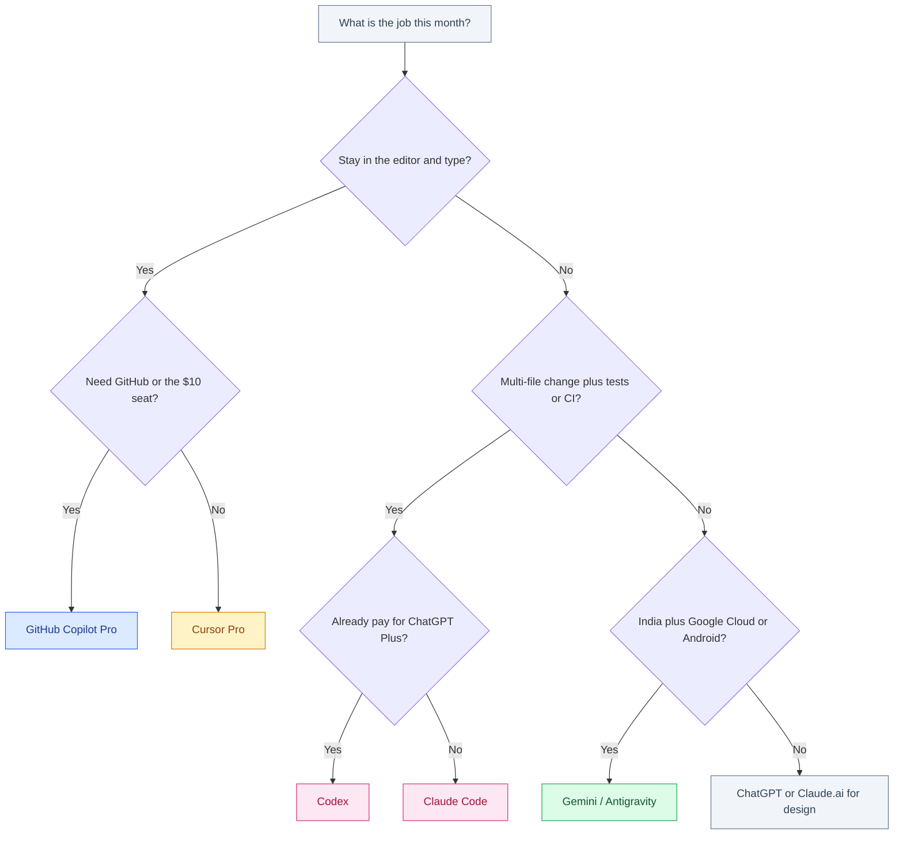

# Best AI for Coding

September 2026 · Published by Amar Kumar

“Best AI for coding” is a bad question if you treat every product as the same chatbot with a logo. Tab complete, chat, multi-file agents, CI, and GitHub PRs are different purchases. Buying Claude Code because a friend loves Cursor Tab — or skipping Copilot because ChatGPT can write a function — is how you waste a month and a subscription.

This is a one-page buyer’s guide covering **Claude Code, Cursor, Copilot, Codex, and Gemini (chat plus Antigravity)**. Pairwise bake-offs already exist: [Claude Code vs Cursor vs Copilot](/blog/posts/claude-code-vs-cursor-vs-copilot/) and [Codex vs Google Antigravity](/blog/posts/codex-vs-google-antigravity/). This page is the roundup: which job maps to which SKU, what it costs at list price, and which stack to buy first.

JetBrains’ May–July 2026 survey of more than 15,000 professional developers is the adoption map underneath the recommendations. Agents are no longer an experiment: **90% use an AI coding agent at work at least weekly, 68% daily, and about 70% run two to four tools.** Plan for a stack, not a trophy.


## Table of contents

1. [Who actually uses what](#adoption)
2. [Four product shapes](#shapes)
3. [What you can buy](#tools)
4. [Decision table by job](#jobs)
5. [Pricing](#pricing)
6. [What to buy](#recommend)
7. [A simple decision tree](#which)
8. [India notes](#india)
9. [FAQ](#faq)

## Who actually uses what {#adoption}

Adoption is not quality. Developers pick tools for price, employer policy, and IDE habit as much as capability. Treat the table as a map of where documentation and muscle memory are heading.

| Tool | Adoption (May–Jul 2026) | Notes |
|------|-------------------------|-------|
| **Claude Code** | 39% | Largest share; terminal agent |
| GitHub Copilot | 21% | Still the GitHub default |
| Codex | 16% (from 3%) | Bundled with ChatGPT; fastest climber |
| Cursor | 12% | Still the AI-native IDE many ICs live in |
| JetBrains AI | 9% | If you already live in IntelliJ / PyCharm |
| OpenCode | 7% | No corporate backing |
| Google Antigravity | 6% global / **15% India** | Largest regional skew in the survey |

Three things matter for a buying decision. Claude Code converted usage into a primary tool for a lot of people — it is the agent you run when the job is the repo, not a sidebar. Copilot still owns GitHub-shaped work even as its share fell. Codex’s jump from 3% to 16% is mostly bundling: if Plus is already a household bill, the agent is free at the margin. Cursor at 12% is not “dead”; it is the editor that still does Tab better than a terminal agent ever will.

## Four product shapes {#shapes}

Match the job to the shape first. Brand second. Prompting an agent is not the same skill as accepting a Tab; see [Prompt engineering vs AI agents](/blog/posts/prompt-engineering-vs-ai-agents/) if that fork is still fuzzy.

| Shape | What it does | You still do | Typical products |
|-------|--------------|--------------|------------------|
| **Chat** | Answers questions, drafts snippets, reviews pasted diffs | Copy, paste, decide, apply | ChatGPT, Claude.ai, Gemini app |
| **Tab complete** | Predicts the next line(s) while you type | Stay in flow; accept or keep typing | Cursor Tab, GitHub Copilot, Gemini in IDEs |
| **Agent** | Reads the repo, edits many files, runs commands, loops on tests | Specify the task, review the diff, own the merge | Claude Code, Codex, Cursor Agent, Copilot coding agent |
| **IDE** | The editor itself is built around AI | Live in that editor; learn its rules files | Cursor, Google Antigravity |

Claude Code has **no Tab model**. ChatGPT in a browser has **no editor**. Copilot without agent mode is mostly Tab plus chat. If you collapse those into one ranking, the ranking is meaningless. For Tab-model taste, use [Best autocomplete models for coding](/blog/posts/best-autocomplete-models-for-coding/) instead of this page.

## What you can buy {#tools}

### Claude Code (Anthropic)

A **terminal agent**. You describe a task; it greps, edits, runs tests, and asks before destructive commands. Claude.ai remains the chat surface for specs and review. Rules live in `CLAUDE.md`. It is bundled with **Claude Pro at $20/month** (about $17/month if you pay $200 annually). Max starts from $100 when Pro limits are the job. Setup habits: [How to use Claude Code effectively](/blog/posts/how-to-use-claude-code-effectively/).

Buy this when multi-file work and test loops are the job. Do not buy it for inline suggestions.

### Cursor

A **VS Code fork** that sells Tab, inline edit (Cmd+K), chat, and Agent in one window. Project memory is `.cursor/rules`. This is the default “I want AI in the editor I live in” purchase for many ICs. **Pro is $20, Pro+ is $60, Ultra is $200.** In India, **Cursor Start is ₹649/month and includes Cursor models only** — not the third-party frontier models on Pro.

Buy this when Tab plus in-editor agent is the daily loop. Watch usage-based agent credits: the $20 headline is not always the bill if you run Agent all day.

### GitHub Copilot

An **extension** for VS Code, JetBrains, Neovim, and Xcode, plus GitHub-native agents (issue → PR). Deepest enterprise policy and “it is already on our GitHub contract” story. **Copilot Pro is $10/month** with **1,500 AI credits**; **completions stay unlimited on paid**. **Copilot Pro+ is $39.**

Buy this for org standardisation, Microsoft/GitHub shops, and people who refuse to switch editors. Measure accept rate on *your* repo before you assume Cursor-level Tab magic.

### Codex (OpenAI)

OpenAI’s coding agent: CLI, cloud tasks, IDE hooks, `AGENTS.md`. It rides **ChatGPT Plus at $20** (Go at ~$8 does not replace this; Pro at ~$200 is capacity). GPT-5.6 **Sol** is the agent flagship; **Terra/Luna** are volume. If Plus is already paid, Codex is the cheapest way to try an agent. It is a poor substitute for Tab complete.

Chat-level coding in ChatGPT or Gemini is a different workflow — paste, decide, apply. That loop is covered in [How to use ChatGPT and Gemini for coding](/blog/posts/how-to-use-chatgpt-and-gemini-for-coding/) and the everyday comparison [ChatGPT vs Gemini vs Claude](/blog/posts/chatgpt-vs-gemini-vs-claude/).

### Gemini chat and Google Antigravity

**Gemini chat** (gemini.google.com, Workspace, Android Studio assistant) is the Google-shaped coding helper: Android, Gradle, Firebase, a Drive full of design docs. Google AI Pro at $19.99 includes **Gemini 3.1 Pro** and is the usual paid on-ramp. It is not a Cursor replacement.

**Antigravity** is Google’s **agent-first IDE**: you delegate work rather than bolt a sidebar onto VS Code. Globally it sat at 6% in the JetBrains survey; in India it hit **15%**. Evaluate it if you are a Gemini/Cloud shop or hiring in India. Full comparison: [Codex vs Google Antigravity](/blog/posts/codex-vs-google-antigravity/).

## Decision table by job {#jobs}

| Job | First pick | Runner-up | Usually skip |
|-----|------------|-----------|--------------|
| **Tab complete** while typing | Cursor Tab, or Copilot if you stay in your current IDE | Gemini in Android Studio (mobile) | Claude Code, ChatGPT chat |
| **Multi-file agent** + tests | Claude Code or Cursor Agent | Codex | Plain chat with copy-paste |
| **CI / headless** | Claude Code (`claude -p`) or Codex CLI | Copilot coding agent on Issues | Cursor (editor-bound) |
| **GitHub PRs** | Copilot (issue → PR, review on github.com) | Claude.ai / ChatGPT on the diff | Tab complete (wrong shape) |
| **Google / India** | Gemini in Android Studio, or Antigravity | Cursor Start (₹649) for Tab-only | Stacking four USD seats on day one |
| Learning a new stack | Cursor (index + chat) or Claude.ai | ChatGPT | Unsupervised agents on a repo you do not understand |
| Enterprise / policy | GitHub Copilot Business / Enterprise | ChatGPT Enterprise or Gemini for Workspace | Personal Plus on client code |

If two tools both “can” do the task, pick the one that matches the *shape* you will sit in for an hour. Agents you babysit in a browser lose to Tab when the job is typing. Tab you accept blindly loses to an agent when the job is twenty files and a red CI run.

## Pricing {#pricing}

USD list prices unless noted. Credits, GST, and FX change the invoice.

| Purchase | List price | What you get | Value trap |
|----------|------------|--------------|------------|
| GitHub Copilot Pro | $10/mo | Unlimited completions on paid; 1,500 AI credits | Cheapest seat can still be the wrong shape |
| GitHub Copilot Pro+ | $39/mo | Higher agent / premium headroom | Buying Pro+ before you used the 1,500 credits |
| Cursor Pro | $20/mo | IDE + Tab + Agent credits | Agent usage can exceed the headline |
| Cursor Pro+ | $60/mo | More Agent | Paying $60 to fix a Tab problem |
| Cursor Ultra | $200/mo | Power-user Agent capacity | US YouTuber stack on an India freelance rate |
| Cursor Start (India) | ₹649/mo | Cursor models only | Expecting Claude/GPT-class Agent on Start |
| ChatGPT Plus (Codex included) | $20/mo | Chat platform + coding agent | No Tab; you may still want Copilot or Cursor |
| Claude Pro (Claude Code included) | $20/mo, or ~$17/mo annual ($200 up front) | Chat + terminal agent | Limits; Max from $100 if you live in the agent |
| Google AI Pro | $19.99/mo | Gemini 3.1 Pro + ~5TB storage; Studio / Antigravity on-ramp varies | Paying this and never opening a Google IDE |

Value is **hours saved on the job you actually do**, not model IQ. A $10 Copilot you accept 200 times a day can beat a $20 agent you open twice a week. A $20 Claude Code that lands a refactor you would have billed four hours for pays for a year of Pro. Enterprise value is different: one vendor, one DPA, one SSO. That can make Copilot or Gemini “best” even when ICs prefer Cursor.

## What to buy {#recommend}

Four defaults cover almost every honest buyer. Everything else is a bake-off you should calendar a cancel date for.

### Power users: Cursor + Claude Code

Two jobs, two bills, about $40/month. Cursor owns Tab, inline edit, and visual diff review. Claude Code owns the multi-file loop, tests, SSH, and CI. This is the stack that matches how ~70% of surveyed developers already work (two to four tools). Put the same project rules in both places so the agent does not invent a second house style:

```text
# Same idea, three files — keep them in sync

# CLAUDE.md
Prefer small diffs. Run tests before claiming done.

# AGENTS.md
Prefer small diffs. Run tests before claiming done.

# .cursor/rules/project.mdc
Prefer small diffs. Run tests before claiming done.
```

Do not buy both on week one if you only type or only delegate. Add the second seat when the first shape is clearly the bottleneck.

### Cheapest GitHub-centric: Copilot Pro

$10 is the lowest entry among these tools, completions are unlimited on paid, and the product sits on the PRs you already review. Stay here if the team is Microsoft/GitHub, nobody will switch to a VS Code fork, and agent work is occasional. Move to Pro+ at $39 only after the 1,500 credits are a real monthly wall.

### Already on ChatGPT Plus: Codex

Do not pay a second $20 for an agent until Codex has failed you on *your* repo. Sol for hard agent jobs, Terra/Luna for routine. Pair with Copilot or Cursor later if Tab is the pain — Codex will not grow a completion model because you prompt harder.

### India + Google Cloud: Gemini / Antigravity

If the product is Android or GCP, and especially if the team is in India (Antigravity at 15% locally vs 6% globally), start in the Google IDE you already have. Google AI Pro at $19.99 is a storage bundle as much as an AI seat. Cursor Start at ₹649 is the Tab experiment if you are not in Google’s editors yet. Full USD stacks of Plus + Cursor Pro + Claude Pro are a US habit; earn the second seat.

## A simple decision tree {#which}



Tab vs agent is the fork that saves the most money. Power users add the other fork later: Cursor plus Claude Code.

## India notes {#india}

In the US, a $20 seat is a rounding error. In India, the same list price is a visible share of monthly gross for many freelancers and early-career engineers. Treat it like a tool budget.

- **One paid surface first.** Tab *or* agent *or* Google IDE — not four logos from a Twitter thread.
- **Cursor Start at ₹649/month** is the local on-ramp, Cursor models only. Upgrade to Pro ($20) when you need third-party models or heavier Agent.
- **Antigravity at 15% in India** (vs 6% globally) is a real local option, not a curiosity. Try it if GCP/Android is the product.
- **Payment rails and GST.** Google often bills in-account with UPI. OpenAI, Anthropic, Cursor, and Copilot more often want an international card. USD list plus GST on digital services is the planning number; read the INR invoice.
- **Client matching.** If the US client lives in GitHub Copilot, install Copilot even if you personally prefer Cursor. Collaboration cost beats personal taste.

Do not convert $20 at a made-up FX rate and call it science. Open checkout. If the number stings, you want the $10 Copilot or the ₹649 Cursor Start, not Ultra.

## FAQ {#faq}

### What is the best AI for coding?

There is no single best tool. **Cursor plus Claude Code** is the power-user stack (Tab plus a terminal agent). **GitHub Copilot Pro at $10** is the cheapest GitHub-centric seat. **Codex** is the right agent if you already pay for ChatGPT Plus. **Gemini chat plus Antigravity** is the India and Google Cloud path.

### Should I use Cursor and Claude Code together?

Yes if you can spend about $40/month on two jobs: Cursor for Tab, inline edit, and visual diffs; Claude Code for multi-file loops, tests, and CI. JetBrains found about 70% of developers already run two to four tools. Do not buy both on day one if you only type or only delegate.

### Is GitHub Copilot enough on its own?

Often yes for GitHub-centric teams who want unlimited completions, PR help, and the lowest list price. Copilot Pro is $10/month with 1,500 AI credits; completions stay unlimited on paid. Heavy multi-file agent work usually wants Claude Code or Cursor Agent on top.

### Codex or Claude Code if I already have ChatGPT Plus?

Start with Codex. It is bundled with ChatGPT Plus at $20, so the agent is marginal cost. Add Claude Code when you want a terminal loop that follows `CLAUDE.md` and you are willing to pay a second $20. Pairwise detail: [Claude Code vs Cursor vs Copilot](/blog/posts/claude-code-vs-cursor-vs-copilot/) and [Codex vs Google Antigravity](/blog/posts/codex-vs-google-antigravity/).

### What is Cursor Start in India?

Cursor Start is **₹649/month** in India and includes **Cursor’s own models only** — not the frontier third-party models on Pro. It is a Tab-and-chat experiment, not a substitute for Cursor Pro at $20 or Claude Code. Upgrade when you need those models or heavier Agent.

### Where does Google Antigravity fit?

Antigravity is Google’s agent-first IDE. Globally it sat at 6% in JetBrains’ May–July 2026 survey and **15% in India** — the largest regional skew in that dataset. Evaluate it if you are a Gemini or Google Cloud shop, especially in India. It is not a drop-in for Cursor Tab or Claude Code.

### How many coding AI tools do developers actually use?

JetBrains surveyed more than 15,000 professional developers in May–July 2026: **90% use an AI coding agent at least weekly, 68% daily, and about 70% run two to four tools.** The common stack is a Tab product plus an agent, not a single winner.

## Related guides

- [Claude Code vs Cursor vs Copilot](/blog/posts/claude-code-vs-cursor-vs-copilot/)
- [How to use Claude Code effectively](/blog/posts/how-to-use-claude-code-effectively/)
- [How to use ChatGPT and Gemini for coding](/blog/posts/how-to-use-chatgpt-and-gemini-for-coding/)
- [ChatGPT vs Gemini vs Claude](/blog/posts/chatgpt-vs-gemini-vs-claude/)
- [Best autocomplete models for coding](/blog/posts/best-autocomplete-models-for-coding/)
- [Codex vs Google Antigravity](/blog/posts/codex-vs-google-antigravity/)
- [Prompt engineering vs AI agents](/blog/posts/prompt-engineering-vs-ai-agents/)
