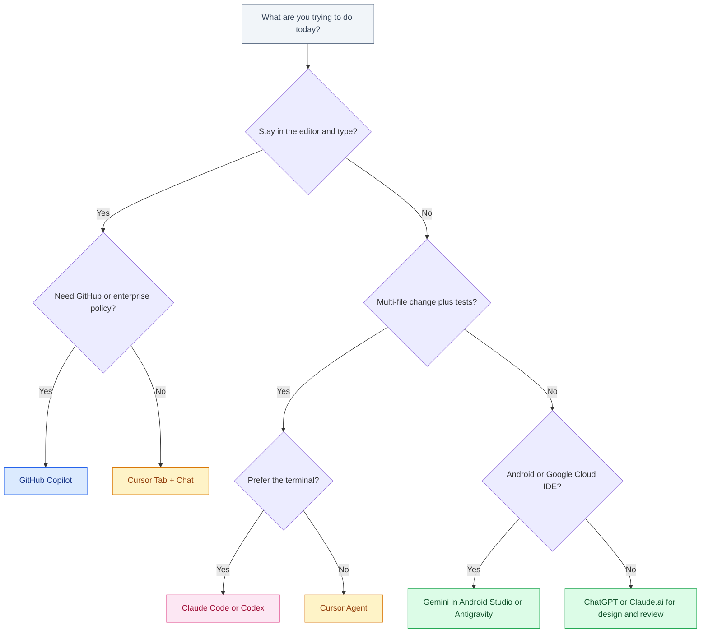

# Best AI for Coding

September 2026 · Published by Amar Kumar

“Best AI for coding” is a bad question if you treat every product as the same chatbot with a logo. Tab complete, chat, agents, and IDEs are four different purchases. Buying Claude Code because a friend loves Cursor Tab — or skipping Copilot because ChatGPT can write a function — is how you waste a month and a subscription.

This is a **buyer’s guide**: what shape of tool you need, which vendor sells that shape, what it costs at list price, and when a second tool is worth it. It is not a Tab-model latency bake-off (that is [Best Autocomplete Models for Coding](/blog/posts/best-autocomplete-models-for-coding/)) and not an adoption scoreboard (that is [Claude Code vs Codex vs Cursor vs Copilot](/blog/posts/claude-code-vs-cursor-vs-copilot/)).

Prices are **list prices**. Usage credits, regional tax, and promo bundles change. Verify before you put it on a card.


## Table of contents

1. [Four product shapes](#shapes)
2. [What you can actually buy](#tools)
3. [Decision matrix by task](#matrix)
4. [Pricing versus value](#pricing)
5. [India cost-to-income](#india)
6. [Which tool: a flowchart](#which)
7. [Sensible stacks](#stack)
8. [Glossary](#glossary)
9. [FAQ](#faq)

## Four product shapes {#shapes}

Match the job to the shape first. Brand second.

| Shape | What it does | You still do | Typical products |
|-------|--------------|--------------|------------------|
| **Chat** | Answers questions, drafts snippets, reviews pasted diffs | Copy, paste, decide, apply | ChatGPT, Claude.ai, Gemini app |
| **Tab complete** | Predicts the next line(s) while you type | Stay in flow; accept or keep typing | Cursor Tab, GitHub Copilot, Gemini in IDEs |
| **Agent** | Reads the repo, edits many files, runs commands, loops on tests | Specify the task, review the diff, own the merge | Claude Code, Codex, Cursor Agent, Copilot coding agent |
| **IDE** | The editor itself is built around AI (or an agent-first shell) | Live in that editor; learn its rules files and shortcuts | Cursor, Google Antigravity, Android Studio / Firebase Studio (IDX-lineage) with Gemini |

Claude Code has **no Tab model**. ChatGPT in a browser has **no editor**. Copilot without agent mode is mostly Tab + chat. If you collapse those into one “AI coding” ranking, the ranking is meaningless.

Author scoring for this guide (0–5), not a survey and not a benchmark. Use it to see *shape*, not to declare a winner. Tab scores for Claude Code stay low on purpose — it is an agent.

## What you can actually buy {#tools}

### ChatGPT and Codex (OpenAI)

**Chat** is chatgpt.com and the apps: architecture debates, error pastes, throwaway scripts. **Codex** is the agent that comes along with a ChatGPT subscription — terminal, cloud tasks, IDE hooks, `AGENTS.md`. If Plus is already a household bill, Codex is the cheapest way to try an agent. It is a poor substitute for Tab complete.

Buy this when the team is already standardized on OpenAI, or when you want one invoice for chat + agent. Skip it as your only tool if you type in an editor eight hours a day.

### Claude Code (Anthropic)

A **terminal agent**. You describe a task; it greps, edits, runs tests, and asks before destructive commands. Claude.ai remains the chat surface for specs and review. Together they are Anthropic’s coding offer. Rules live in `CLAUDE.md` and `.claude/rules`.

Buy this when multi-file work and test loops are the job. Do not buy it for inline suggestions. Setup and habits: [How to Use Claude Code Effectively](/blog/posts/how-to-use-claude-code-effectively/).

### Cursor

A **VS Code fork** that sells all four shapes in one window: Tab, inline edit, chat, and Agent. Project memory is `.cursor/rules`. This is the default “I want AI in the editor I live in” purchase for many ICs.

Buy this when Tab + in-editor agent is the daily loop. Watch usage-based agent credits — the $20 headline is not always the bill if you run Agent all day.

### GitHub Copilot

An **extension** (VS Code, JetBrains, Neovim, Xcode) plus GitHub-native agents (issue → PR). Deepest enterprise policy, SSO, and “it is already on our GitHub contract” story. List price is usually the lowest seat among these tools.

Buy this for org standardisation, Microsoft/GitHub shops, and people who refuse to switch editors. Do not expect Cursor-level Tab magic on every codebase; measure accept rate on *your* repo.

### Gemini in Android Studio and the IDX line

Google’s coding AI shows up where Google already owns the IDE: **Android Studio** (Gemini assistant), and the cloud-editor lineage that ran as Project IDX and now sits in Firebase Studio / Google’s cloud IDEs. Chat + inline help against Android, Gradle, and Firebase context is the point — not a generic Python agent.

Buy this (or lean on it) when mobile/Android is the product. Using Gemini chat in the browser for a Kotlin PR is a weaker version of the same idea.

### Google Antigravity (brief)

Google’s **agent-first IDE**: you delegate work rather than bolt a sidebar onto VS Code. Globally it is still a niche seat; it has shown a much larger share in India. Evaluate it if you are a Gemini/Cloud shop or hiring in India. It is not the default recommendation for an existing Cursor or JetBrains team. Full comparison: [Codex vs Google Antigravity](/blog/posts/codex-vs-google-antigravity/).

## Decision matrix by task {#matrix}

| Task | First pick | Runner-up | Usually skip |
|------|------------|-----------|--------------|
| **Boilerplate / glue while typing** | Cursor Tab or Copilot | Gemini in Android Studio (mobile) | Claude Code, ChatGPT chat |
| **Multi-file refactor + tests** | Claude Code or Cursor Agent | Codex | Plain chat with copy-paste |
| **PR review** | ChatGPT or Claude.ai on the diff; Copilot on GitHub PRs | Cursor chat on the branch | Tab complete (wrong shape) |
| **Learning a new stack** | Cursor (index + chat) or Claude.ai | ChatGPT | Unsupervised agents on a repo you do not understand |
| **Mobile / Android** | Gemini in Android Studio | Cursor with Kotlin project rules | Codex as the only surface |
| **Enterprise / policy** | GitHub Copilot Business/Enterprise | ChatGPT Enterprise or Gemini for Workspace | Personal Plus on client code |
| **Headless / CI agent** | Claude Code (`claude -p`) or Codex CLI | Copilot coding agent on Issues | Cursor (editor-bound) |

If two tools both “can” do the task, pick the one that matches the *shape* you will sit in for an hour. Agents that you babysit in a browser lose to Tab when the job is typing. Tab that you accept blindly loses to an agent when the job is twenty files and a red CI run.

## Pricing versus value {#pricing}

USD list prices — not what your invoice will say after tax, FX, or overage.

| Purchase | Typical list | What you get | Value trap |
|----------|--------------|--------------|------------|
| GitHub Copilot Pro | Often ~$10 / month | Tab + chat in your current IDE | Cheapest seat can still be the wrong shape |
| Cursor Pro | ~$20 / month | IDE + Tab + Agent credits | Agent usage can exceed the headline |
| ChatGPT Plus (incl. Codex) | ~$20 / month | Chat platform + coding agent | No Tab; you may still want Copilot/Cursor |
| Claude Pro (incl. Claude Code) | ~$20 / month | Chat + terminal agent | Limits; Max is $100–$200 if you live in the agent |
| Google AI Pro | ~$19.99 / month | Gemini + often storage; Studio features vary | Paying this and never opening Android Studio / Workspace |
| Power tiers (ChatGPT Pro, Claude Max, Ultra) | ~$100–$200+ | Limits, not a new shape | Buying Ultra before you maxed the $20 plan |

Value is **hours saved on the job you actually do**, not model IQ. A $10 Copilot that you accept 200 times a day can beat a $20 agent you open twice a week. A $20 Claude Code that lands a refactor you would have billed four hours for pays for a year of Pro.

Enterprise value is different: one vendor, one DPA, one SSO. That can make Copilot or Gemini “best” even when ICs prefer Cursor.

## India cost-to-income {#india}

In the US, a $20 seat is a rounding error against a professional salary. In India, the same list price is a **visible share of monthly gross** for many freelancers and early-career engineers. Treat it like a tool budget, not like a default stack of three logos.

- **One paid surface first.** Pick the shape you use daily (Tab *or* agent *or* Workspace), not the brand that won a Twitter thread.
- **Payment rails.** Google often bills in a Google account with UPI. OpenAI, Anthropic, and Cursor more often want an international card. Compare the *INR total including GST*, not the $19.99 headline.
- **Do not stack Plus + Cursor + Claude + Copilot** until each one has a named job. Two tools is a common ceiling; four is a US habit that does not travel well.
- **Client matching.** If the US client lives in GitHub Copilot, install Copilot even if you personally prefer Cursor. Collaboration cost beats personal taste.

There is no universal INR conversion worth putting in a table — FX and tax change. Open the checkout page. If the number stings, you want the $20 plan that matches the job, not a $200 power tier you saw in a US YouTuber’s setup video.

## Which tool: a flowchart {#which}



Start from the job. Tab vs agent is the fork that saves the most money. Antigravity is on the Google/Android branch, not a generic replacement for Cursor.

## Sensible stacks {#stack}

| Situation | Buy | Why |
|-----------|-----|-----|
| Solo, types all day, one bill | Cursor Pro | Tab + agent in one IDE |
| Solo, already on ChatGPT Plus | Keep Plus (Codex); add Copilot only if Tab hurts | Do not pay twice for agents |
| Solo, agent-heavy refactors | Claude Pro + any editor | Claude Code is the product |
| Pro combo (US-style) | Cursor + Claude Code | Tab and terminal agent, two jobs |
| GitHub Enterprise shop | Copilot Business; optional IC Cursor | Policy first, taste second |
| Android product team | Gemini in Android Studio; chat in Claude or ChatGPT as needed | IDE context beats a generic agent |
| India freelancer, tight budget | Exactly one of: Cursor, Claude Pro, ChatGPT Plus, Google AI Pro | Shape match; second seat after a month of daily use |

```text
# Cheap way to see which shape you actually need (one week)

Mon-Tue: only Tab (Copilot or Cursor Tab on). Note accept vs ignore.
Wed-Thu: only an agent (Claude Code or Codex or Cursor Agent). Note review time.
Fri: only chat (paste diffs). Note copy-paste tax.

Keep the shape that ate the most hours. Cancel the rest.
```

Skills still matter more than seats. If the bottleneck is “I cannot tell if the diff is wrong,” buy practice, not Ultra: [Best AI courses and skills to learn](/blog/posts/best-ai-courses-and-skills-to-learn/).

## Glossary {#glossary}

| Term | Meaning here |
|------|----------------|
| **Tab / autocomplete** | Inline prediction as you type; latency-sensitive |
| **Agent** | Tool that edits the repo and runs commands in a loop |
| **IDE** | The editor you live in; Cursor and Antigravity are AI-native IDEs |
| **Codex** | OpenAI’s coding agent, bundled with ChatGPT plans |
| **Claude Code** | Anthropic’s terminal coding agent |
| **IDX lineage** | Google’s cloud IDE thread (Project IDX → Firebase Studio / cloud workspaces) |
| **List price** | Sticker USD before tax, FX, and usage overage |

## FAQ {#faq}

### What is the best AI for coding?

There is no single best tool. Tab, chat, agents, and IDEs solve different jobs. Cursor or Copilot for typing; Claude Code or Codex for multi-file agents; ChatGPT or Claude.ai for design discussion; Gemini when you work in Android Studio or Google’s editors.

### Is Cursor better than GitHub Copilot?

Cursor is the better default if you want an AI-native IDE with strong Tab and a built-in agent. Copilot is the better default if you must stay in your current editor, need GitHub enterprise policy, or want the lower list price.

### Do I need Claude Code if I already pay for Cursor?

Not on day one. Add Claude Code when you want a terminal loop, SSH, or headless CI. The common pro setup is Cursor for Tab plus Claude Code for the heavy agent — two bills, two jobs.

### Is ChatGPT Codex enough on its own?

Enough if you already pay for Plus and want an agent, not Tab. Not enough if inline suggestions are the job. Pair with Copilot or Cursor if you still live in an editor all day.

### What should Indian freelancers spend?

One paid surface that matches the day’s work. A $20 plan is a real share of income; stack a second only after the first is daily. Verify INR totals including GST.

### Where does Google Antigravity fit?

Agent-first IDE for Gemini/Cloud shops, with a notably larger footprint in India. Not a drop-in replacement for Cursor Tab or Claude Code. See [Codex vs Google Antigravity](/blog/posts/codex-vs-google-antigravity/).

## Related guides

- [Claude Code vs Codex vs Cursor vs Copilot](/blog/posts/claude-code-vs-cursor-vs-copilot/)
- [Best Autocomplete Models for Coding](/blog/posts/best-autocomplete-models-for-coding/)
- [ChatGPT vs Gemini vs Claude](/blog/posts/chatgpt-vs-gemini-vs-claude/)
- [How to Use Claude Code Effectively](/blog/posts/how-to-use-claude-code-effectively/)
- [Best AI courses and skills to learn](/blog/posts/best-ai-courses-and-skills-to-learn/)

Buy the shape you sit in: Tab if you type, an agent if you delegate, an IDE if you want both in one window, chat if you are still deciding what to build. The logo on the receipt matters less than that fork.
