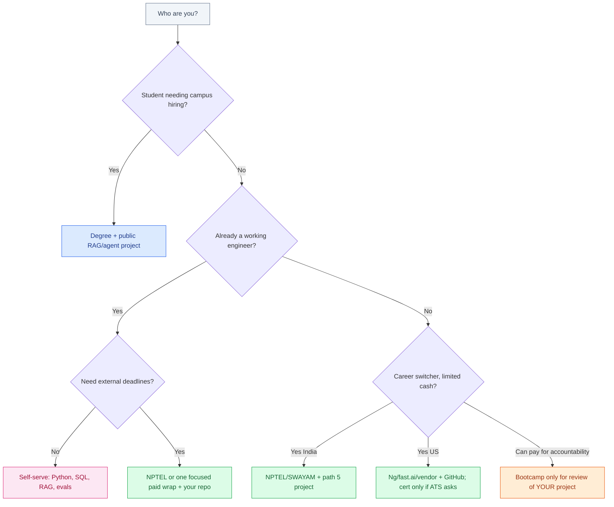

# Best AI, ML, and Data Science Courses

Choosing an AI, ML, or data science course is not the same problem in India as it is in the US. Costs sit in different currencies, hiring still reads different signals, and a certificate that impresses one HR screen is wallpaper to another. This guide compares **paths**, not a fake number-one ranking.

There is no honest “best AI ML course” SKU. There are five workable routes: a CS degree plus projects, NPTEL/SWAYAM and IIT-branded online study, Indian paid bootcamps, US-style platform and university certificates, and a self-serve stack that ends in a portfolio RAG or agent project. Pick the route that matches your time, money, and the market that will actually interview you.

## Table of contents

- [Search demand is not a ranking](#demand)
- [What “best” actually means](#best)
- [Path 1: CS degree plus projects](#degree)
- [Path 2: NPTEL, SWAYAM, IIT online](#nptel)
- [Path 3: Indian paid bootcamps](#bootcamps)
- [Path 4: US platforms and university certificates](#us)
- [Path 5: Self-serve Python, SQL, one library, one project](#self)
- [India vs US: cost, hiring, certificate vs GitHub](#india-us)
- [Why RAG, LLM engineering, and evals beat a generic diploma](#niche)
- [A 90-day check on any path](#ninety)
- [Decision tree](#decision)
- [FAQ](#faq)

## Search demand is not a ranking {#demand}

People in India really are looking for this. Kantar has reported that searches for AI/ML courses in India rose about 49 percent. That is **search demand**, not a ranking of institutes, and not a placement statistic. Ads will get louder. The useful question is which path produces work you can explain in an interview.


Python is the default language on every serious path below. If you still need a language decision, read [Python vs Java vs JavaScript](/blog/posts/python-vs-java-vs-javascript/).

## What “best” actually means {#best}

“Best” splits into three different scores. Rankings that mash them together are marketing.

| Score | What it measures | Who cares |
|-------|------------------|-----------|
| **Learning** | Can you do the next hard thing without a tutorial open? | You, six months from now |
| **Hiring signal** | Will a human or an ATS let you into a round? | Campus cells, HR, startups |
| **Cost and time** | INR or USD out of pocket, hours per week, opportunity cost | Anyone who is not a full-time student |

A CS degree can win hiring in India campus placements and still leave you unable to ship a retrieval system. A free NPTEL series can teach you more than a ₹3 lakh bootcamp if you actually finish the assignments. A Coursera certificate can pass a US HR filter and still lose to a public GitHub repo in a startup screen.

Decide which score you are optimizing. Then pick a path. Do not buy a path because it won someone else’s YouTube roundup.

## Path 1: CS degree plus projects {#degree}

A computer science (or related) degree is still the default **credential** in both countries. In India it is often the ticket into the placement cell. In the US it is still the default filter at large companies, even as bootcamp and self-taught hires exist around the edges.

The degree is not an AI course. Most undergraduate programs still teach discrete math, DSA, OS, and a programming language. ML, if it appears, is one elective with a numpy notebook and a midterm. That is enough foundation and not enough product skill.

What makes the degree path work is **projects on top of the degree**, not the transcript line “Introduction to Machine Learning.”

| Degree path | Use it for | Do not expect |
|-------------|------------|----------------|
| Indian public university / NIT / IIT | Campus hiring, credibility, math | A modern RAG syllabus |
| Indian private university | Same, with wider quality variance | Placement as a purchased outcome |
| US bachelor’s in CS | Broad filter for Big Tech and established product companies | That electives equal LLM engineering |
| US master’s (CS, DS, MSDS) | Career switchers who can afford time and tuition | A guaranteed role; it is a costly signal |

If you are already in a degree, do not pause it for a bootcamp. Finish, and spend evenings on one public project. The degree gets you in the building. The project is what you talk about once you are there. If you already write production software, do not start a four-year degree just to “learn AI” — paths 2, 4, and 5 are faster.

## Path 2: NPTEL, SWAYAM, IIT online {#nptel}

India’s public online stack is under-advertised because it does not buy ads like private academies.

**NPTEL** and **SWAYAM** host semester-style courses from IITs, IISc, and other institutes: Python, ML, deep learning, data science, statistics. Many are free to audit. An optional proctored exam (typically a modest INR fee) yields a certificate with an institute name on it.

| Piece | What you get | What you do not get |
|-------|----------------|---------------------|
| Video + assignments | Structured, academic, often rigorous | A job desk or interview coaching |
| Exam certificate | A recognizable Indian academic brand | A US HR brand, usually |
| IIT/IISc instructor name | Signal inside India, especially for students | Hands-on LLM product work in most older courses |

This path is strong if you need **discipline and theory** without a large invoice. It is weak if you need a career-switch wrapper: there is no placement cell, no resume workshop, and the syllabus may stop at classical ML while the job post asks for RAG.

Use NPTEL/SWAYAM as the *course*, not as the *portfolio*. Pair a completed ML or DL course with a repo that calls a current LLM API. Working engineers can skip what they know, sit the exam if HR likes institute names, and put saved hours into a RAG prototype.

## Path 3: Indian paid bootcamps {#bootcamps}

Scaler, upGrad, Great Learning, and similar brands sell structured programs: recorded plus live, mentors, “career services,” EMI, and a lot of advertising. They are a **product category**, not a single quality bar.

Talk about them the way you would talk about any expensive course:

- **Cost** is typically in the **low-lakh to several-lakh INR** range depending on program length and brand. That is real money. Compare it to a year of focused evenings on path 5, not to a US master’s tuition.
- **Outcomes** are mixed and **not something this post will invent**. Bootcamps publish placement stories. They do not publish the full distribution of people who paid and did not get the role they wanted. Ask for the unglamorous numbers (completion rate, median time-to-offer, how many already had CS degrees) and assume marketing is the best case.
- **Hiring signal** inside India is “I did a known paid program” plus whatever GitHub you actually produced. Startups will look at the GitHub. Service-company HR may look at the brand. Neither is a substitute for being able to explain a system.

Paid bootcamps can be rational if you need **external deadlines** and live review of *your* project. They are a poor buy if you already finish self-paced work, or if you are paying for lectures you could get from NPTEL, Andrew Ng, or official docs. If a counselor quotes a starting CTC as if it were a contract, walk away. Salaries are not course features.

## Path 4: US platforms and university certificates {#us}

The US (and global English-language) stack is different: lower sticker prices for *starting points*, higher prices for university wrapping, and HR that sometimes searches for Coursera/edX/DeepLearning.AI strings.

Starting points that are actually useful:

| Starting point | Role | Limit |
|----------------|------|--------|
| **Andrew Ng** (ML / Deep Learning Specialization and similar) | Conceptual backbone, widely recognized | Not a production RAG course |
| **fast.ai** | Code-first; you train something early | You still have to productize |
| **Coursera / edX** professional certificates | Structure + a brand HR has seen | Easy to collect badges and skip the repo |
| **University certificates / micromasters** | Stronger US academic signal; costs hundreds to thousands of USD | Time and money; still not a degree |
| **Vendor courses** (OpenAI, Google, Anthropic) | Current APIs | Vendor-shaped; you still need evals and your data |


Vendor material from OpenAI, Google, and Anthropic tracks current APIs and is cheap relative to an Indian bootcamp. US career switchers often stack Ng-style vocabulary, a fast.ai or vendor project course, then a university certificate only if an ATS still cares. That can cost **tens to a few hundred USD** on platforms, or **low thousands of USD** with a university wrap — cheaper than a US master’s, and still not a job. Full-time US career bootcamps get the same caution as Indian ones: pay for review, not lectures.

For coding-tool practice while you learn, see [best AI tools for students, writers, and developers](/blog/posts/best-ai-tools-for-students-writers-developers/). This post is about curriculum paths, not chat apps.

## Path 5: Self-serve Python, SQL, one library, one project {#self}

This is the path stackcone would hire for, and the path that most “AI diploma” programs still under-teach.

Minimum stack:

1. **Python** — files, functions, virtualenv, HTTP, a small API.
2. **SQL** — joins, filters, aggregates. Interviews still use this as a filter.
3. **One ML library** — scikit-learn if you need classical ML literacy; or skip straight to an LLM SDK if your target role is RAG/LLM engineering, not Kaggle.
4. **One portfolio project** — a RAG chatbot or a small tool-using agent over *your* documents, with citations, a short eval set, and a write-up.

A sketch of the project shape (not a framework dump):

```python
def chunk_text(text: str, size: int = 800) -> list[str]:
    return [text[i:i + size] for i in range(0, len(text), size)]

# 1. chunk docs  2. embed  3. retrieve  4. answer only from context
# 5. keep a 30-question eval set and score retrieval
```

That last line is the one generic diplomas skip. Retrieval that you cannot score is a demo. Retrieval you can score is a skill. See [how to build a production RAG chatbot](/blog/posts/how-to-build-a-production-rag-chatbot/) when you are ready to leave notebook-land.

Self-serve cost is mostly **time plus API spend**. API spend for learning can stay in the low tens of USD per month if you are disciplined. The hiring signal is the public repo and the twenty-minute explanation. In US startups and Indian product companies, this signal often beats a certificate. In campus mass-hiring, it is a complement to the degree, not a replacement.

## India vs US: cost, hiring, certificate vs GitHub {#india-us}

Same skills. Different packaging.

| Dimension | India | US |
|-----------|-------|----|
| **Cash cost** | NPTEL ~free + exam fee; bootcamps often **₹1–4 lakh+**; degrees already paid or financed | Platforms **tens–hundreds USD**; university certificates **hundreds–thousands USD**; bootcamps and master’s much more |
| **Time cost** | Evenings around a service-company job, or a student calendar | Career switchers often buy time with savings; employed learners look like India |
| **Primary hiring signal (campus / large co.)** | Degree, sometimes institute-branded certificates | Degree still default; certificates as ATS keywords |
| **Primary hiring signal (startups / product)** | GitHub, shipped demo, English writing | Same, plus domain story for career switchers |
| **Certificate vs GitHub** | Certificates help some HR teams; GitHub helps the people who can hire you | Certificates help filters; GitHub (or a private write-up you can discuss) decides interviews |
| **Language overlay** | Campus services still Java-heavy; AI teams Python | Bootcamps often JS; AI/ML roles Python |

Remote work from India sits in the middle: US-shaped GitHub plus India-shaped logistics. [How to get a remote software job from India](/blog/posts/how-to-get-a-remote-software-job-from-india/) covers the job-search mechanics; this post only cares that **the portfolio you build is the same one a US hiring manager can clone**.

Do not convert bootcamp INR to “equivalent US salary outcomes.” Markets, visas, and role mix are different. Cost comparison is fair. Outcome comparison from marketing PDFs is not.

## Why RAG, LLM engineering, and evals beat a generic diploma {#niche}

A generic “data science diploma” still means pandas, a classifier, and a dashboard. That work exists. It is also crowded, and it is not what most teams mean when they say they need AI help.

What shows up in production work — the stackcone niche — is narrower:

- **RAG** — ingest, chunk, retrieve, cite, refuse when the index is empty.
- **LLM engineering** — prompts as code, tool calling, cost caps, logging.
- **Evals** — a golden set that can fail you when you change a chunk size.

Those skills fit on path 5 in weeks, not years, if you already program. They also fit on top of a degree or NPTEL course as the *project layer*. They do not require a new diploma title.

Prompting alone is not that layer. Prompting is how you talk to the model. Evals are how you know the talk worked. Agents are a loop with tools, not a slide with seven personas. For the distinction, see [prompt engineering vs AI agents](/blog/posts/prompt-engineering-vs-ai-agents/).

If you are choosing between “one more certificate in data science” and “one retrieval system you can demo,” pick the system. [Will AI replace software engineers](/blog/posts/will-ai-replace-software-engineers/) is the longer argument for owning a system that can be wrong in production.

## A 90-day check on any path {#ninety}

Whatever you bought or did not buy, you should be able to show this in three months of focused evenings:

| Check | Pass | Fail |
|-------|------|------|
| **Code** | A public repo with a README that a stranger can run | A folder of certificates and screenshots |
| **Data** | Answers grounded in *your* documents, with citations | A chatbot that hallucinates with confidence |
| **Evals** | ≥20 questions you scored before and after a change | “It felt better after I tweaked the prompt” |
| **Ops** | A URL or a clear local run; secrets not in git | A notebook that only works on your laptop |
| **Talk** | You can explain one retrieval miss | You can recite architecture buzzwords |

If your paid program does not leave you with that table, the program is entertainment. Switch to path 5 for the next 90 days and keep the lectures as background audio only.

## Decision tree {#decision}



- **Student:** keep the degree. Add a public project. NPTEL for extra theory if your college ML elective is thin.
- **Working engineer:** do not quit to “go do AI.” Path 5 (or NPTEL + path 5) on evenings. A bootcamp is optional glue, not a new identity.
- **Career switcher:** buy the smallest wrap that makes you finish. In India that is often NPTEL plus a repo. In the US that is often Andrew Ng / fast.ai / vendor docs plus a repo. A large bootcamp is a last resort for accountability, not a first click from an ad.

## FAQ {#faq}

### Which AI, ML, or data science course is best in India?

None as a SKU. If you need campus hiring, the degree plus a public project is the path. If you need theory on a budget, NPTEL/SWAYAM. If you need someone to force deadlines, a paid bootcamp can be rational — judge it on project review, not on advertised CTC.

### Do I need a certificate or is GitHub enough?

In campus and some HR filters, a degree or a known certificate still helps. In product, startup, and most remote interviews, GitHub (and being able to explain it) wins. Build the repo either way. Add a certificate only if a specific filter asks.

### Are Scaler, upGrad, or Great Learning worth the fees?

They can be, if you would not finish alone and you get live review of *your* work. They are a bad buy if you are paying for recordings you could get cheaper, or if you treat placement stories as a contract. This post will not invent salary outcomes.

### What should a US beginner take first?

Andrew Ng or equivalent for vocabulary, fast.ai or a vendor cookbook for code, then one RAG/agent project. Add a university certificate only if you know an employer’s ATS cares. Do not start with a full master’s unless you want the degree for other reasons.

### Is a data science diploma enough for LLM jobs?

Usually no. Classical ML literacy helps. Production LLM work wants retrieval, evals, and enough engineering to ship. Put those on top of the diploma, or skip the diploma if you already program.

### Kantar said AI/ML course searches in India jumped. Should I enroll now?

Search demand is not a ranking and not a reason to sign an EMI. Pick a path from the tree, then enroll only in the slice you cannot do yourself.

## Related guides

- [Python vs Java vs JavaScript](/blog/posts/python-vs-java-vs-javascript/)
- [Will AI Replace Software Engineers?](/blog/posts/will-ai-replace-software-engineers/)
- [How to Build a Production RAG Chatbot](/blog/posts/how-to-build-a-production-rag-chatbot/)
- [How to Get a Remote Software Job from India](/blog/posts/how-to-get-a-remote-software-job-from-india/)
- [Best AI Tools for Students, Writers, and Developers](/blog/posts/best-ai-tools-for-students-writers-developers/)
- [Prompt Engineering vs AI Agents](/blog/posts/prompt-engineering-vs-ai-agents/)

Buy the smallest path that produces a retrieval system you can explain. The certificate, if you still need one, should describe that work — not replace it.
