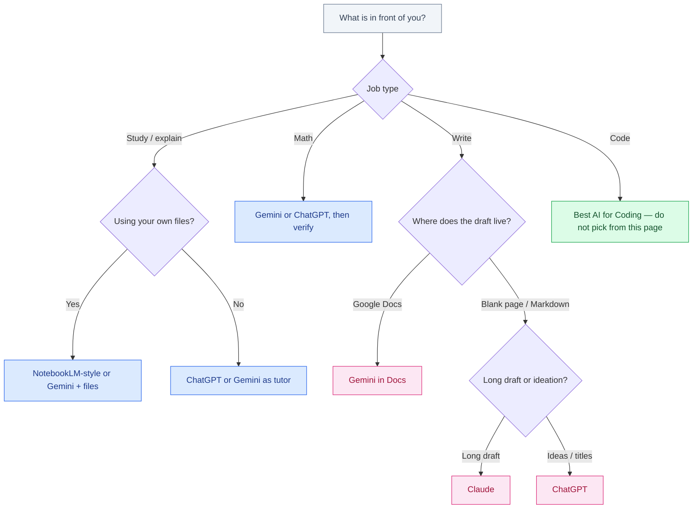

# Best AI Tools for Students, Writers, and Developers

September 2026 · Published by Amar Kumar

Most people do not have one job. A CS undergrad writes lab reports, fights a calculus set, and pastes a compiler error into chat before dinner. A journalist outlines in the morning and codes a scraper at night. Buying a separate “best AI” for each hat is how three $20 plans show up on the same card.

This is one list with three sections — students, writers, developers — not three unrelated buyer guides taped together. Brand comparisons of the chat apps live in [ChatGPT vs Gemini vs Claude](/blog/posts/chatgpt-vs-gemini-vs-claude/). Coding IDEs and agents are covered properly in [Best AI for Coding](/blog/posts/best-ai-for-coding/). What follows is which *shape* of tool to open for the work in front of you, and when a second subscription is wasted money.


## Table of contents

1. [A one-screen map](#map)
2. [Students](#students)
3. [Writers](#writers)
4. [Developers](#developers)
5. [Do not pay for three subscriptions](#subscriptions)
6. [Which tool to open](#flowchart)
7. [Glossary](#glossary)
8. [FAQ](#faq)

## A one-screen map {#map}

Match the job, then the product. Rankings that collapse “writing,” “math,” and “coding” into one winner are advertising.

| Job | First open | Runner-up | Skip as your only tool |
|-----|------------|-----------|------------------------|
| Explain a concept like a tutor | ChatGPT or Gemini | Claude when the explanation is long | A coding agent with no syllabus |
| Notes from *your* PDFs and slides | NotebookLM-style (Gemini/Drive) | Gemini with files in the chat | A blank ChatGPT thread with no sources |
| Math with worked steps | Gemini or ChatGPT, then verify | Claude for wordy proofs | Copying the final number into the homework |
| Long draft (essay, article, brief) | Claude | ChatGPT for a second voice | Gemini if you are not in Docs |
| Ideas, titles, outlines | ChatGPT | Gemini | Paying Max/Pro Ultra for brainstorming |
| Draft already in Google Docs | Gemini in Docs / Workspace | Paste into Claude for a rewrite pass | Exporting to Word just to use another logo |
| Write or repair code | See [Best AI for Coding](/blog/posts/best-ai-for-coding/) | Chat or Gemini for errors you still type yourself | Treating this page as the IDE buyer guide |

Free tiers are enough to learn the difference. Paid tiers buy limits, file size, and (for developers) agents — not a new personality. List prices move; verify on the vendor site.

## Students {#students}

The useful student pattern is a **tutor that never gets tired**, not a ghostwriter. If the model produces the artifact you turn in, you skipped the part school is measuring. If it interrogates *your* attempt, you kept the learning and still went faster.

### Explainers: ChatGPT and Gemini

For “explain this like I have the lecture notes but not the intuition,” ChatGPT and Gemini are close enough that habit matters more than a leaderboard. ChatGPT is the broader default: plugins, memory, and a UI students already know. Gemini is the better default if the course lives in Google Classroom, Drive, or YouTube transcripts you can point at.

Ask for the shape of help you actually need:

- **Socratic:** “Do not give the answer. Ask me questions until I can state the definition.”
- **Contrast:** “What is the difference between X and Y in one table, then one paragraph.”
- **Gap check:** paste your outline, ask what a grader would say is missing.

Claude is a strong explainer on long, careful material (a 40-page reading, a messy lab protocol). It is rarely worth a third student subscription if ChatGPT or Gemini already sits on the phone.

```text
# Tutor mode you can paste at the top of a thread
You are a tutor, not an answer key.
I will paste my attempt first.
Reply with: (1) what is correct, (2) the first mistake,
(3) one hint, (4) a similar practice item.
Do not write the full solution unless I ask after I retry.
```

### Notes: NotebookLM-style, on purpose

Generic chat will happily summarize a paper it has not read, or mix your slides with something it remembers from training. A **NotebookLM-style** product — Google’s NotebookLM is the named example — is built for the opposite: you upload the syllabus, PDFs, and lecture notes, and the answers are supposed to stay inside that pile.

Use that shape when the job is “what did *this* professor assign?” Use open chat when the job is “I do not understand induction at all.” Mixing them is how students get confident, wrong study guides. If you only have Gemini or ChatGPT, attach the files in the thread and say “quote the slide or say you cannot find it.” That is a weaker NotebookLM, but it beats a source-free recap.

### Math: useful, and not a calculator you trust

People search “best AI for math” as if one model had finished algebra. Gemini and ChatGPT both produce plausible worked solutions. Both also skip a sign, invent a theorem name, or solve a slightly different problem than the one you pasted. Claude can narrate a proof clearly; it is not magically more numeric.

A workable loop:

1. Do a first attempt on paper (even a bad one).
2. Ask the model for **steps**, not only the boxed answer.
3. Recompute the arithmetic yourself, or plug the result back into the original equation.
4. If the course allows a CAS (Wolfram, a graphing calculator, Python), use that as the check, not as a second chatbot.

Programming homework that is secretly math (linear algebra in NumPy, probability sims) still needs the same check. Generating the script is easy; knowing whether the distribution is the one in the prompt is the actual exercise.

### Citations: assume the source is invented until you open it

Models still fabricate papers, page numbers, and quotes that “sound academic.” That is not a rare glitch; it is the default failure mode when you ask for references. Honest use looks like this:

- Ask for **search terms and claims**, then find the source in the library, Google Scholar, or the reading list.
- If the model quotes a paper, open the PDF. If you cannot, drop the citation.
- Never let a chatbot invent a bibliography you submit. Many course policies treat fake citations as academic misconduct even when the prose is “in your own words.”

Gemini’s grounding in Drive/Workspace helps when the source is a file you uploaded. It does not make web citations automatically real. ChatGPT browsing (when you have it) is a search assistant, not a librarian who already verified the DOI.

### Exams, essays, and cheating

This guide will not help you cheat, and you should not use these tools to produce graded answers when the point of the assignment is to see what you know. Course and university rules win. When the rule is silent, the ethical line is still clear: **the artifact being marked has to be yours.**

| Use as a tutor (usually fine) | Outsourcing the assessment (do not) |
|-------------------------------|-------------------------------------|
| Explain a lecture you attended | Generate the take-home exam answers |
| Quiz you from your own notes | Write the essay and submit it |
| Find the hole in *your* proof | Paste the problem set and turn in the dump |
| Practice oral-exam questions | Live-prompt during a closed-book test |
| Plain-language recap you then rewrite | Translate a banned resource into “original” prose |

If you are a teacher reading this: require process (attempts, drafts, oral defense) if you care. Banning chatbots on paper while grading only the PDF is how you get undetectable cheating and worse learning.

## Writers {#writers}

“Best AI for writing” is three different purchases: a partner for a 3,000-word draft, a machine that emits twenty titles, and a sidebar inside Google Docs. One product can fake all three. Only one of them will be the surface you live in.

### Claude for long drafts

Claude is the default I reach for when the job is to hold a brief: tone, audience, constraints, and a document that has to stay coherent past the first screen. It is less eager to pad, and it takes “cut this by 30% without losing the examples” as a real instruction. For reports, explainers, and revision passes on something you already outlined, start here.

It is not an excuse to skip reporting. Claude will write a confident paragraph about a market it has not seen. Your job is the same as it was with a human intern: mark what needs a source, delete what you cannot stand behind, and keep the sentences that sound like you.

### ChatGPT for ideation

ChatGPT is faster at **volume of angles**: ten outlines, a skeptical version, a version for a US reader and an India reader, a list of objections. Custom GPTs and saved instructions help if you write the same genre every week. Use it at the start of the piece and when you are stuck, not as the only editor of a finished draft unless you like the house voice.

A practical split: ChatGPT to choose the structure, Claude to write and tighten, a human (you) for facts and ending. That split does not require two paid plans — free plus one $20 seat covers it for most freelance weeks.

### Gemini for Google Docs

If the document already lives in Docs, Drive comments, and a shared folder, Gemini is the tool that does not make you copy-paste through a separate website. Side-panel rewrite, summarize a long Doc, pull context from related files — that is the product pitch, and it is real when your team is already on Workspace.

It is a weaker reason to subscribe if you write in Markdown, Word, or a CMS and never open Drive. In that case Claude or ChatGPT in the browser is the writing surface; Gemini is optional. Product differences and privacy defaults are in [ChatGPT vs Gemini vs Claude](/blog/posts/chatgpt-vs-gemini-vs-claude/).

### What still does not automate

- **Reporting** — calls, documents you actually read, numbers you can show.
- **Voice** — models regress to generic LinkedIn. Keep a swipe file of your own sentences.
- **Legal and medical claims** — YMYL; you need a human who can be sued, not a fluent paragraph.
- **SEO stuffing** — a model will repeat the keyword until the piece is unreadable. Cut it.

If writing is how you earn, treat the model as a junior who drafts. You still file. That habit also transfers to code review later.

## Developers {#developers}

This section is a pointer, not a second buyer’s guide. Tab complete, chat, agents, and AI-native IDEs are different purchases. Collapsing them into “best AI for coding” on a students-and-writers page is how people buy Claude Code when they needed Copilot, or skip Cursor because ChatGPT can emit a function.


Language choice still matters more than which chat logo you paste errors into. See [Python vs Java vs JavaScript](/blog/posts/python-vs-java-vs-javascript/).

Read [Best AI for Coding](/blog/posts/best-ai-for-coding/) for shapes, list prices, and India vs US value. For getting ChatGPT and Gemini to help inside an actual repo without treating chat as an IDE, use [How to Use ChatGPT and Gemini for Coding](/blog/posts/how-to-use-chatgpt-and-gemini-for-coding/).

### What to do before you buy a coding IDE

| If you are… | Start with | Add later |
|-------------|------------|-----------|
| A student learning syntax | ChatGPT or Gemini chat on *your* code | Tab complete once you can reject bad suggestions |
| Shipping a small project | One editor AI (Cursor or Copilot) *or* chat | An agent when the change is many files + tests |
| Already paying ChatGPT Plus | Codex as the bundled agent | Tab only if typing is the bottleneck |
| In Android / Workspace | Gemini in Android Studio or Docs | Claude or ChatGPT for design discussion |

The skill that transfers from the student and writer sections is **verification**. A model that explains Dijkstra in prose will also invent an API. If you cannot tell, you are not ready to let an agent touch the repo unsupervised. Skills and course types that hire are in [Best AI / ML / Data Science Course (India & US)](/blog/posts/best-ai-ml-data-science-course-india-us/) — projects beat certificates.

## Do not pay for three subscriptions {#subscriptions}

ChatGPT Plus, Claude Pro, and Google AI Pro (the plan people still call Gemini Advanced) all sit near **$20/month** at list price. Stacking all three is a US-influencer default. It is a painful share of a student stipend or an early Indian freelance month. The comparison of those three seats — what you actually get, cheaper rungs, when two plans make sense — is [ChatGPT Plus vs Gemini Advanced vs Claude Pro](/blog/posts/chatgpt-plus-vs-gemini-advanced-vs-claude-pro/).

| You mostly… | Pay for one of | Keep free |
|-------------|----------------|-----------|
| Study in Drive / Docs / YouTube | Google AI Pro if you hit free limits | ChatGPT, Claude |
| Write long pieces every week | Claude Pro | ChatGPT, Gemini |
| Want one ecosystem + a coding agent | ChatGPT Plus (Codex rides along) | Claude, Gemini until a job appears |
| Type in an editor all day | Cursor or Copilot (not a third chat bill) | Use the free chat you already have |

A month of “free for the other two” will tell you whether the unpaid logo is actually a daily tool. If you never open it, you did not need it. If you open it daily and hit caps, then — and only then — add the second seat. Do not start at a $100–$200 power tier because a YouTuber’s setup video did.

## Which tool to open {#flowchart}



Start from the job, not the brand. Coding has its own buyer guide; this flowchart only routes you there.

## Glossary {#glossary}

| Term | Meaning here |
|------|----------------|
| **Tutor mode** | The model critiques your attempt and withholds the full answer until you retry |
| **NotebookLM-style** | A notes product grounded in files you uploaded, not a general web chat |
| **Grounding** | Answering from attached sources (Drive, PDFs) instead of only training memory |
| **List price** | Sticker USD before tax, FX, GST, and usage overage |
| **Agent** | A coding tool that edits the repo and runs commands in a loop — not a chat box |
| **YMYL** | Your-money-your-life topics where fluent wrong answers cause real harm |

## FAQ {#faq}

### What is the best AI for writing?

Claude is the better default for long drafts you will actually edit. ChatGPT is stronger for outlines, titles, and trying several angles fast. Gemini wins when the draft already lives in Google Docs or Drive. None of them replace a human pass for voice, facts, or citations.

### What is the best AI for math?

Gemini and ChatGPT are both usable tutors if you demand step-by-step work and then check it. Treat every numeric answer as a draft. Recalculate, compare with the textbook, or plug values back into the original equation. Do not submit unverified model output as homework.

### What is the best AI for coding if I am still learning?

Start with chat: ChatGPT or Gemini to explain errors and walk through a small program you typed yourself. Add a coding agent or IDE only after you can read a diff. The full buyer guide is [Best AI for Coding](/blog/posts/best-ai-for-coding/) — this article does not replace it.

### Should I pay for ChatGPT, Gemini, and Claude at once?

Usually no. Pick the product you open every day, stay on the free tier for the other two for a month, then add a second seat only if a named job remains uncovered. Details: [ChatGPT Plus vs Gemini Advanced vs Claude Pro](/blog/posts/chatgpt-plus-vs-gemini-advanced-vs-claude-pro/).

### Is NotebookLM better than ChatGPT for studying?

For notes grounded in files you uploaded, a NotebookLM-style tool is the better shape: it is built to stay inside your sources. ChatGPT and Gemini are better at explaining a topic from scratch. Use both jobs; do not treat one chat as your only library.

### Can I use AI on exams or graded essays?

Follow the course rules. If the assessment is meant to measure what you know, using a model to produce the answers is cheating. Use AI as a tutor before the exam: explanations, practice questions, gap checks. Do not outsource the work that is being graded.

## Related guides

- [ChatGPT vs Gemini vs Claude](/blog/posts/chatgpt-vs-gemini-vs-claude/)
- [ChatGPT Plus vs Gemini Advanced vs Claude Pro](/blog/posts/chatgpt-plus-vs-gemini-advanced-vs-claude-pro/)
- [Best AI for Coding](/blog/posts/best-ai-for-coding/)
- [How to Use ChatGPT and Gemini for Coding](/blog/posts/how-to-use-chatgpt-and-gemini-for-coding/)
- [Python vs Java vs JavaScript](/blog/posts/python-vs-java-vs-javascript/)
- [Best AI / ML / Data Science Course (India & US)](/blog/posts/best-ai-ml-data-science-course-india-us/)
