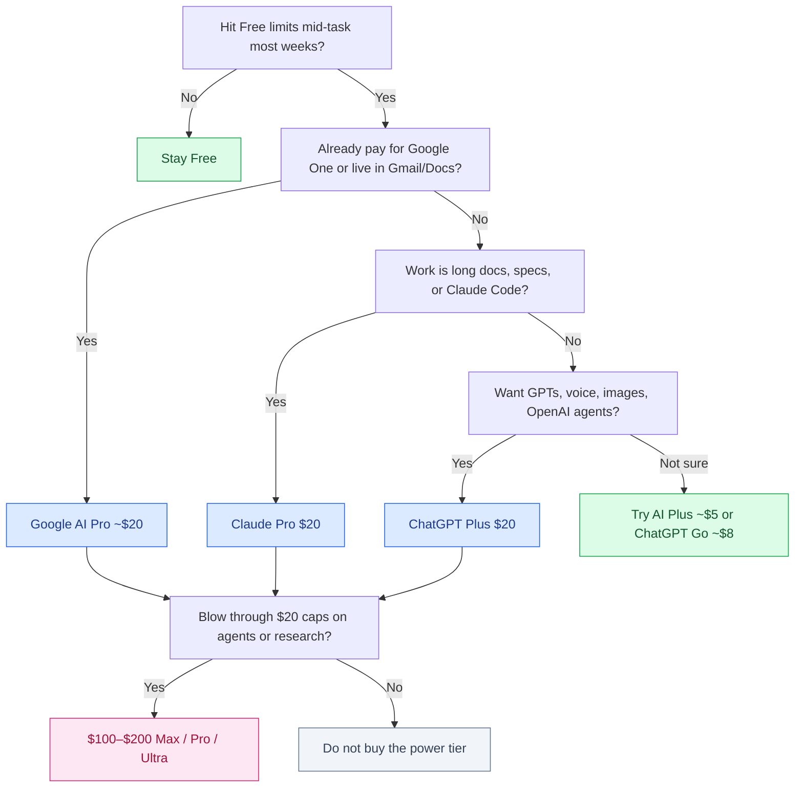

# ChatGPT Plus vs Claude Pro vs Gemini Advanced

Twenty dollars a month is the new default for consumer AI. OpenAI, Anthropic, and Google all parked a flagship plan in that band. The question is not which logo is “best.” It is whether paying beats the free tier for the work you actually do — and whether India’s ~₹1,700 hits differently than a US salary.

**Prices below are list prices and change.** Confirm on [OpenAI](https://openai.com/chatgpt/pricing/), [Anthropic](https://www.anthropic.com/pricing), and [Google AI plans](https://one.google.com/about) before you subscribe. This is not a review of every model version, and it is not a set of fake user testimonials.

**Name note:** Google rebranded **Gemini Advanced** to **Google AI Pro** at **$19.99/month**. Search still uses “Gemini Advanced.” This article uses that title on purpose. In the product UI and on your card statement you will usually see Google AI Pro (often bundled with Google One storage).

## Table of contents

1. [The $20 club at a glance](#glance)
2. [Free vs paid: what actually changes](#free-vs-paid)
3. [What you actually get at ~$20](#what-you-get)
4. [Usage limits without fake message counts](#limits)
5. [Cheap middle tiers: Go, AI Plus, and Claude’s gap](#middle)
6. [When $100 and $200 plans make sense](#power)
7. [A decision tree](#decide)
8. [Illustrative monthly cost](#cost-chart)
9. [India: ₹1,700 vs salary](#india)
10. [Students](#students)
11. [When free is enough](#free-enough)
12. [When to pay for two](#two-plans)
13. [The cancel test](#cancel)
14. [Privacy](#privacy)
15. [FAQ](#faq)

## The $20 club at a glance {#glance}

Approximate consumer list prices. Converted INR uses ~₹85/USD for orientation only — your bank’s rate and any GST on digital services will differ.

| Plan (common name) | Vendor name you may see | List USD / month | Rough INR / month | Typical buyer |
|--------------------|-------------------------|------------------|-------------------|---------------|
| ChatGPT Free | ChatGPT | $0 | ₹0 | Occasional questions; ads in some markets |
| ChatGPT Go | ChatGPT Go | ~$8 | ~₹680 | People who hit Free limits but do not need Plus |
| ChatGPT Plus | ChatGPT Plus | $20 | ~₹1,700 | Daily driver: tools, images, custom GPTs, agents |
| ChatGPT Pro / Max-class | ChatGPT Pro / Pro Max | ~$100–$200 | ~₹8,500–₹17,000 | Heavy research, coding agents, all-day use |
| Claude Free | Claude | $0 | ₹0 | Writing and coding in short bursts |
| Claude Pro | Claude Pro | $20 (~$17 annual) | ~₹1,700 | Long docs, careful reasoning, Claude Code |
| Claude Max | Claude Max 5× / 20× | ~$100–$200 | ~₹8,500–₹17,000 | All-day Claude Code; no cheap middle tier below Pro |
| Gemini Free | Gemini | $0 | ₹0 | Search-adjacent chat; 15 GB Google storage |
| Google AI Plus | Google AI Plus | ~$4.99 | ~₹425 | Cheapest paid AI + extra Drive/Photos storage |
| Google AI Pro (was Gemini Advanced) | Google AI Pro | $19.99 | ~₹1,700 | Workspace AI + large Google One storage |
| Google AI Ultra | Google AI Ultra | ~$100–$200 | ~₹8,500–₹17,000 | Highest Gemini limits, video/research extras |

Same headline price, different boxes. ChatGPT Plus is a **toolkit**. Claude Pro is a **thinking and writing surface** (and the on-ramp to Claude Code). Google AI Pro is an **AI + storage + Workspace** bundle.

## Free vs paid: what actually changes {#free-vs-paid}

Free is not a demo of the paid product. It is a **metered sample** of a weaker or throttled stack.

What usually improves when you pay ~$20:

- **Reliability of the good model.** Free often rotates you onto a faster/cheaper model after a few turns. Paid keeps you on the flagship (or near-flagship) for most of a work session.
- **Headroom.** You stop planning around a reset clock in the middle of a refactor or a long brief.
- **Features that are not “more chat.”** Custom GPTs, Deep Research-style jobs, image/video quotas, NotebookLM Plus, Gemini in Gmail/Docs, Claude Code usage — these live on paid tiers.
- **Less product friction.** Fewer “you’ve reached your limit” walls, fewer ads (where they exist), fewer surprise model downgrades.

What does **not** magically appear at $20:

- A private, legally reviewed assistant for client secrets. Consumer plans are still consumer plans. See [Privacy](#privacy).
- Unlimited everything. Paid is a higher cap, not a hose.
- Better judgment than you. A paid model still needs you to specify the task and check the output.

If your employer already pays for ChatGPT Team, Claude Team, Gemini for Workspace, Copilot, or Cursor, a personal $20 plan is often **duplicate spend** unless you need a second vendor for personal projects.

## What you actually get at ~$20 {#what-you-get}

### ChatGPT Plus (~$20)

You are buying **breadth**: chat, voice, image generation, custom GPTs, browsing/research modes, and — if you already live in OpenAI’s world — the coding agent (Codex) that rides along with the ChatGPT subscription rather than a separate seat. That distribution story is why Codex showed up in so many developer surveys; it is bundled. See [Codex vs Google Antigravity](/blog/posts/codex-vs-google-antigravity/) for the agent side, and [ChatGPT vs Gemini vs Claude](/blog/posts/chatgpt-vs-gemini-vs-claude/) for model-by-model behavior.

Plus is the right $20 if your week looks like: “explain this error, draft a mail, generate an image, build a small GPT for a checklist, then ask it to research a vendor.”

### Claude Pro (~$20)

You are buying **depth on long context and careful prose** — specs, memos, code review, multi-file reasoning — and a smoother path into **Claude Code** if you work in a terminal agent. Anthropic still does not sell a Go-like $5–$8 rung. The jump is Free → Pro → Max.

Claude Pro is the right $20 if your week looks like: “here is a 80-page PDF and a repo; tell me what is inconsistent, then draft the change.” For coding-tool comparisons, see [Best AI for coding](/blog/posts/best-ai-for-coding/).

### Google AI Pro / Gemini Advanced (~$19.99)

You are buying **Gemini plus Google One**. The AI features matter (Gemini in Gmail, Docs, Sheets; NotebookLM; long context; image/video extras), but the **storage bundle** is the sleeper. If you were already going to pay for 2 TB-class Google One, part of the $19.99 is storage you would have bought anyway. That is why Google AI Pro can be the best *bundle* even when it is not the best *chatbot* for your task.

Google AI Pro is the right ~$20 if your week lives in Gmail and Drive and you keep hitting 15 GB.

## Usage limits without fake message counts {#limits}

Vendors publish and silently revise caps. Screenshots of “messages remaining” go stale in weeks. Treat the following as **orders of magnitude**, not a billing guarantee.

| Tier | Chat / flagship-model feel | Extra features (images, video, deep research, agents) |
|------|----------------------------|--------------------------------------------------------|
| Free | A **handful to a few dozen** strong turns per rolling window of a few hours, then a cheaper model or a wait | Tight or occasional |
| Cheap paid (Go / AI Plus) | **Noticeably more** than Free — enough for a light workday if you are not running agents | Still capped; not the full Plus/Pro toolbox |
| ~$20 Plus / Pro / AI Pro | Typically **low hundreds** of ordinary turns per window for chat-scale work; you still hit walls on research, video, and always-on agents | The real reason many people upgrade |
| ~$100–$200 | Marketed as roughly **5×–20×** the standard paid allotment | Makes sense only if you already blow through $20 limits on purpose |

If you only hit a wall **once or twice a month**, you do not have a $20 problem. You have a calendar problem. If you hit a wall **mid-task, several days a week**, the $20 plan is paying for continuity, not for a logo.

API spend is a different bill. A ChatGPT Plus seat does not replace [economical API models for RAG](/blog/posts/best-economical-llm-models-rag-openai-gemini-anthropic/). Mixing them up is how side projects get a $200 surprise.

## Cheap middle tiers: Go, AI Plus, and Claude’s gap {#middle}

Not everyone needs the $20 club.

**Google AI Plus (~$4.99)** is the cheapest way to pay for a name-brand assistant, and it throws in **hundreds of GB** of Google storage (recently advertised around 400 GB — verify). If your pain is “Free Gemini is stingy *and* my Drive is full,” start here, not at $20.

**ChatGPT Go (~$8)** is OpenAI’s lighter paid rung: more access than Free, not the full Plus toolbox. It is the right experiment if you already prefer ChatGPT’s voice and GPTs but Plus feels rich. It is a worse *bundle* than AI Plus if you also need cloud storage.

**Claude has no cheap middle tier.** You either live with Free’s short leash or you pay Pro. That is not a moral failing by Anthropic; it is a product shape. If you want Claude’s writing quality as a daily driver, budget $20, not $5.

A practical sequence:

1. Exhaust Free for two weeks. Write down the *tasks* that failed, not the feelings.
2. If the failures are “I needed more Gemini + storage,” take AI Plus.
3. If the failures are “I needed more ChatGPT, not Google,” take Go or jump to Plus.
4. If the failures are “I needed Claude’s long-doc / coding quality,” skip the middle — there isn’t one — and take Pro.

## When $100 and $200 plans make sense {#power}

The power tier has three honest use cases. Most people do not have them.

1. **You are already hitting $20 caps on purpose.** Claude Code or Codex running for hours, Deep Research every day, video generation as part of the job. The $100–$200 plan is cheaper than losing a billable afternoon.
2. **You are evaluating for a team** and need the highest model and the highest cap for a bounded trial. Calendar a cancel date.
3. **Your time is priced in US dollars** and a 20-minute wait for a reset is more expensive than the seat.

They do **not** make sense because a YouTuber called the $200 plan “the only way to get the real model.” Flagship quality at $20 is already the product most professionals use. Max/Pro/Ultra are **capacity and extras**, not a secret IQ upgrade for casual chat.

If you freelance from India, compare the seat to **one hour of your rate**, not to Silicon Valley disposable income. A $200 plan is ~₹17,000/month. That is a serious line item until your [in-hand Upwork math](/blog/posts/upwork-hourly-rate-india-new-tax-regime/) says otherwise.

## A decision tree {#decide}

Start at Free. Buy capacity you can describe in a sentence. Skip the power tier until the $20 plan is the bottleneck.

## Illustrative monthly cost {#cost-chart}

USD list prices, not discounted annual, not INR GST. Use the chart as a **shape**, then check the vendor.

| Setup | Illustrative USD / month | What it is |
|-------|--------------------------|------------|
| Free only | $0 | Fine for light use |
| Google AI Plus | ~$5 | Cheapest paid + storage |
| ChatGPT Go | ~$8 | Extra ChatGPT, not full Plus |
| One flagship seat | ~$20 | Plus, Claude Pro, or Google AI Pro |
| Two flagship seats | ~$40 | Common power-user combo |
| Power tier | ~$100 | 5×-class capacity |
| Top consumer tier | ~$200 | 20×-class / Ultra |

## India: ₹1,700 vs salary {#india}

At ~₹85/USD, **$20 ≈ ₹1,700/month** (card conversion and GST on online services can push it higher). Context:

| Situation | Monthly money (order of magnitude) | ₹1,700 feels like |
|-----------|------------------------------------|-------------------|
| Student / first job | ₹15k–₹40k in-hand | A visible bill — run the [cancel test](#cancel) |
| Early-career engineer | ₹50k–₹90k | 2–3% of in-hand; easy to justify if it saves a few hours |
| Mid-level / remote USD | ₹1L+ or USD rates | Cheaper than one billable hour; the question is *which* vendor |
| Unemployed job hunt | Tight | Prefer Free + one cheap tier, not Ultra |

Paying in INR on an Indian card is still a **USD-priced** product. Annual billing (Claude often advertises a lower monthly equivalent) is worth it only if you already passed a month of use.

If you invoice clients, a personal AI seat used for client work is a normal tool cost — like a domain or a cloud VM. That is not tax advice; your CA decides deductibility.

## Students {#students}

Student discounts exist **some years, some countries, some campuses**. OpenAI and Google have run education offers; Anthropic’s consumer student path is thinner. A `.edu` or university mail is not a lifetime coupon.

Rules of thumb:

- Check the vendor’s student page the week you pay. Do not trust a 2024 screenshot.
- Campus-wide Gemini or ChatGPT licenses beat a personal Plus seat. Ask IT before you subscribe.
- If you only need help with assignments, Free plus a library of past papers is enough. Paid is for **projects, internships, and portfolio work** that hit limits.

## When free is enough {#free-enough}

Stay on Free if most of these are true:

- You ask a burst of questions, then disappear for days.
- Your job already includes Copilot, Cursor, ChatGPT Team, or Gemini for Workspace.
- You hit a limit **rarely**, and waiting an hour does not break the work.
- You do not need image/video quotas, custom GPTs, NotebookLM Plus, or a coding agent.
- You are still learning prompting. Paying does not teach that.

Free is also enough as a **second vendor**. Many people should pay for one model and keep the other two on Free for a second opinion.

## When to pay for two {#two-plans}

Two ~$20 seats ≈ **$40 / ~₹3,400**. That is rational when the vendors fail in different ways.

| Combo | Why it exists | Who it is for |
|-------|----------------|---------------|
| Claude Pro + ChatGPT Plus | Depth + breadth (docs/code vs tools/images/GPTs) | Freelancers who write *and* ship artifacts |
| Claude Pro + Google AI Pro | Coding/writing + Workspace/storage | People already in Gmail who also live in Claude Code |
| ChatGPT Plus + Google AI Pro | OpenAI tools + Drive/Workspace | Weaker combo unless storage was a real purchase |
| All three at $20 | Almost never | A one-month bake-off, then cancel one or two |

Do not stack ChatGPT Plus **and** ChatGPT Go. Do not stack Google AI Plus **and** Google AI Pro. Same family, pick one rung.

Pay for two only after a month on one paid seat, when you can name the task the second vendor still wins.

## The cancel test {#cancel}

Subscriptions survive on inertia. Run a bounded test.

1. Pick **one** paid plan. Not Ultra. Not two logos.
2. Put **cancel by** on the calendar 21–25 days out (before auto-renew).
3. Keep a three-column note: date, task, would Free have finished it?
4. In week three, ask: if this vanished tomorrow, would I resubscribe the same day?
5. If no, cancel. Your account usually drops to Free; you are not burned.

If yes, keep it. If yes *and* you still needed a second vendor three times that week, add the second seat and repeat the test.

This is also how you evaluate $100/$200: only after the $20 plan is clearly the bottleneck.

## Privacy {#privacy}

A $20 consumer plan is not a BAA and not a client-data vault.

| Topic | Practical default |
|-------|-------------------|
| Training | Consumer chats may be used to improve models unless you turn off the toggle (wording differs by vendor and region). Check Settings → Data. |
| Team / Enterprise / Workspace | Usually **not** used for training the public model. If you handle client code, this is the real upgrade — not Plus vs Pro. |
| Secrets | Do not paste production keys, customer PII, unpublished M&A drafts, or “the whole repo” into a consumer chat. |
| Retention | You can often disable history or delete threads. Deletion is not a legal hold. |
| Google | Workspace and consumer Gemini have different data paths. AI Pro on a personal Gmail is not the same as Gemini in a company Workspace. |
| Anthropic / OpenAI | Read the current consumer vs API vs Team policy. Policies move. |

If you need a private assistant for client work, buy **Team/Business** or run models via API under a contract. A personal Plus screenshot in a security review will not help.

## FAQ {#faq}

### Is ChatGPT Plus worth it compared with Free?

Yes if you use ChatGPT as a daily tool and Free cuts you off or downgrades the model mid-task. No if you ask a few questions a week. The value is continuity and extras (GPTs, images, agents), not a mystical intelligence jump.

### What happened to Gemini Advanced?

Google renamed the ~$20 consumer plan to **Google AI Pro** ($19.99). It still is the Gemini flagship seat, typically bundled with a large Google One storage allotment and Gemini in Gmail/Docs. People (and search) still say Gemini Advanced.

### Should I get ChatGPT Go or Google AI Plus instead of $20?

If you want the cheapest paid AI and you use Drive/Photos, **Google AI Plus (~$4.99)** is the usual starting point. If you specifically want more ChatGPT and not Google, **Go (~$8)** is the experiment. Neither replaces Claude.

### Does Claude have a cheap plan like Go?

No. Claude’s consumer ladder is Free, Pro (~$20), then Max (~$100–$200). If you want Claude quality every day, budget Pro.

### When is a $100 or $200 plan worth it?

When you already saturate the $20 cap with agents, deep research, or video, and the wait costs more than the seat. It is a capacity purchase. It is a poor first subscription.

### Is ₹1,700 a lot in India?

It is a lot on a student stipend and a rounding error on a US-billed freelance month. Compare it to hours saved and to [your real in-hand rate](/blog/posts/upwork-hourly-rate-india-new-tax-regime/), not to the US sticker shock debate.

### Can I subscribe to two plans?

Yes. A common professional pair is Claude Pro plus either ChatGPT Plus or Google AI Pro. Run the [cancel test](#cancel) on the second seat. Three $20 plans are usually a bake-off, not a lifestyle.

### Do these companies train on my chats?

On consumer plans, often yes unless you opt out. Team, Enterprise, and many API/Workspace products default to not training on your data. Read the current toggle; do not paste secrets into a personal account.

### Will prices stay at $20?

No promise. These are list prices that have already grown extra rungs (Go, AI Plus, Ultra). Re-check the vendor before you write a year of annual billing into a budget.

## Related guides

- [ChatGPT vs Gemini vs Claude](/blog/posts/chatgpt-vs-gemini-vs-claude/)
- [Best AI for Coding](/blog/posts/best-ai-for-coding/)
- [Best Economical LLM Models for RAG](/blog/posts/best-economical-llm-models-rag-openai-gemini-anthropic/)
- [How Much Should Your Upwork Hourly Rate Be in India?](/blog/posts/upwork-hourly-rate-india-new-tax-regime/)
