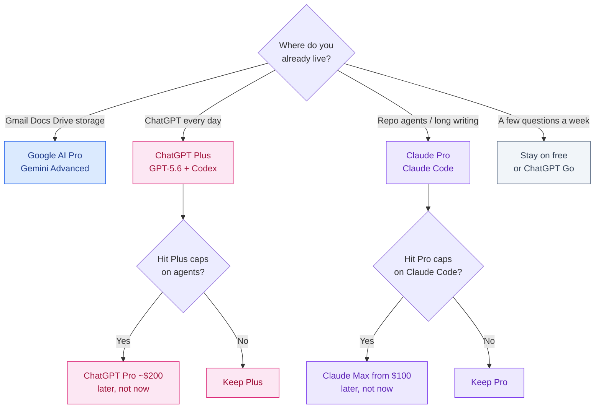

# ChatGPT Plus vs Gemini Advanced vs Claude Pro

September 2026 · Published by Amar Kumar

Twenty dollars a month is the default price of a serious consumer AI seat. OpenAI, Google, and Anthropic all parked a flagship plan in that band. The useful question is not which logo wins a screenshot. It is **which ecosystem you already live in** — and whether you should pay at all.

Google renamed **Gemini Advanced** to **Google AI Pro**. Search, YouTube, and old bookmarks still say Gemini Advanced. This article uses that search name on purpose. On your credit-card statement and in Google One you will usually see **Google AI Pro**.

This is a high-intent comparison of the three ~$20 plans: list price, what you actually get, how usage limits feel, India GST/INR, student options, and who should stay on free. The verdict up front: **pay for one stack. Do not buy all three.** Claude Pro if you want coding agents. ChatGPT Plus if you want a general assistant plus Codex. Google AI Pro if you live in Gmail, Docs, and storage. Confirm live prices on the vendor site before you subscribe — tiers and names move.

## Table of contents

1. [Quick verdict](#verdict)
2. [Name check: Gemini Advanced is Google AI Pro](#rename)
3. [Side-by-side list prices](#prices)
4. [What you actually get](#what-you-get)
5. [Usage limits without fake message counts](#limits)
6. [The $20 seat versus the $200 seat](#tiers)
7. [India: INR, GST, and what hits the card](#india)
8. [Students](#students)
9. [Who should pay versus stay free](#who-pays)
10. [Pick one: a decision flow](#flow)
11. [Do not buy all three](#not-three)
12. [FAQ](#faq)

## Quick verdict {#verdict}

| If you already… | Pay for | Skip for now |
|-----------------|---------|--------------|
| Live in Gmail, Docs, Drive, Android | **Google AI Pro** (~$19.99) | A second $20 chat until Pro is saturated |
| Use ChatGPT daily, want Custom GPTs / Codex | **ChatGPT Plus** ($20) | Claude until Plus is the bottleneck |
| Write long docs or run **Claude Code** | **Claude Pro** ($20, ~$17 annual) | Google AI Pro unless you need Workspace AI |
| Hit free caps a few times a month | Stay free, or **ChatGPT Go** (~$8, some markets including India) | Any $100–$200 plan |
| Are a student with a school Google account | Check **Gemini for Education** / Copilot Student | Paying twice for the same homework |

None of these is “the smartest model.” They are **product bundles**. For a product tour of the three assistants, see [ChatGPT vs Gemini vs Claude](/blog/posts/chatgpt-vs-gemini-vs-claude/). For IDE and agent shopping, see [Best AI for Coding](/blog/posts/best-ai-for-coding/). For how to actually write code in the two chat apps, see [How to use ChatGPT and Gemini for coding](/blog/posts/how-to-use-chatgpt-and-gemini-for-coding/).

## Name check: Gemini Advanced is Google AI Pro {#rename}

Google’s ~$20 Gemini plan used to be marketed as **Gemini Advanced**. It is now **Google AI Pro** at **$19.99/month**. Ultra sits above it (about **$99.99** and up). People still type “Gemini Advanced vs ChatGPT Plus.” If you search that, you are in the right article.

What did not change: you are buying **Gemini** (currently **Gemini 3.1 Pro** on the Pro seat, plus Deep Research), **long context** on the order of **1 million tokens**, **Gemini in Gmail and Docs**, and a large **Google One** storage allotment (about **5TB** on Pro). The storage is why this plan can be rational even if you barely open the Gemini chat URL.

If a comparison table on the internet still says only “Gemini Advanced,” read it as Google AI Pro unless the date is ancient.

## Side-by-side list prices {#prices}

Published consumer list prices as of this writing. Not invoices. India adds FX conversion and GST; the US price is the sticker.

| Plan people search | Vendor name on the bill | List USD / month | What the $20 is for |
|--------------------|-------------------------|------------------|---------------------|
| ChatGPT Free | ChatGPT | $0 | Try the UI; caps arrive fast for coding |
| ChatGPT Go | ChatGPT Go | ~$8 in some markets (including India) | Cheaper paid ChatGPT; not a Plus replacement |
| **ChatGPT Plus** | ChatGPT Plus | **$20** | Expanded GPT-5.6, deep research, Codex usage, Custom GPTs |
| ChatGPT Pro | ChatGPT Pro | **~$200** | All-day capacity, not a first purchase |
| Claude Free | Claude | $0 | Short writing and coding bursts |
| **Claude Pro** | Claude Pro | **$20** (~**$17** billed annually) | Claude Code, Cowork, Projects, long context |
| Claude Max | Claude Max 5× / 20× | **from ~$100** | Multiplier on Pro usage for heavy agents |
| Gemini Free | Gemini | $0 | Search-adjacent chat; default Google storage |
| **Gemini Advanced** | **Google AI Pro** | **$19.99** | Gemini 3.1 Pro, Deep Research, ~1M context, Workspace, ~5TB |
| Google AI Ultra | Google AI Ultra | **$99.99+** | Higher Gemini limits and extras |

Same neighborhood of twenty dollars. Completely different boxes. ChatGPT Plus is a **toolkit** (GPTs, research, Codex). Claude Pro is a **writing surface plus the on-ramp to Claude Code**. Google AI Pro is **Gemini plus Workspace plus storage**.

API prices are a different market. If you are wiring RAG, start with [Best economical LLM models for RAG](/blog/posts/best-economical-llm-models-rag-openai-gemini-anthropic/), not a consumer chat plan. If you care which frontier checkpoint sits behind the logo this quarter, that is [GPT-5.6 Sol vs Claude Fable 5 vs Kimi K3](/blog/posts/gpt-5-6-sol-vs-claude-fable-5-vs-kimi-k3/).

## What you actually get {#what-you-get}

### ChatGPT Plus (~$20)

- **Expanded GPT-5.6** compared with Free’s throttled or smaller models.
- **Deep research** for multi-step web work.
- **Custom GPTs** — saved instructions and tools you reuse.
- **Codex usage** on the ChatGPT subscription — OpenAI’s coding agent path, not just a smarter chat box.
- Image, voice, and memory features as currently bundled (they shift; check the plan page).

Plus is the default if ChatGPT is already your home screen. It is a weak buy if you open the app twice a week.

### Google AI Pro / Gemini Advanced (~$19.99)

- **Gemini 3.1 Pro** as the flagship chat/Workspace model on that seat.
- **Deep Research**.
- **~1M token context** — whole PDFs, long transcripts, fat source files.
- **Gemini in Gmail and Docs** (and the rest of the Workspace side panel where Google has enabled it).
- **~5TB Google One storage** — the silent reason this plan wins for people who were going to buy storage anyway.
- Ultra (~$99.99+) if you exhaust Pro.

Pro is the default if your life is already a Google account. Buying it *and* a second $20 chat on day one is usually waste.

### Claude Pro (~$20, ~$17 annual)

- **Claude Code** — terminal coding agent, the main reason developers pay Anthropic.
- **Cowork** and **Projects** — longer-running workspaces than a throwaway chat.
- **Long context** relative to typical free chats (Gemini still wins the “paste the whole book” headline).
- **Max from ~$100** (5× / 20×) when Pro’s usage cap is the problem.

Pro is the default if the job is careful writing, code review, or an agent in the repo. It does not include 5TB of Drive. It does not include Custom GPTs.

### Feature matrix

| Capability | ChatGPT Plus | Google AI Pro (Gemini Advanced) | Claude Pro |
|------------|--------------|----------------------------------|------------|
| Consumer list | $20/mo | $19.99/mo | $20/mo (~$17 annual) |
| Flagship chat model (this generation) | Expanded GPT-5.6 | Gemini 3.1 Pro | Claude on Pro |
| Deep Research | Yes | Yes | Research-style workflows; check current UI |
| Coding in chat | Strong | Strong, especially whole files | Strong, careful diffs |
| Coding agent | **Codex** on the ChatGPT plan | Workspace / apps, not Claude Code | **Claude Code** |
| Custom mini-apps | Custom GPTs | Gems | Projects / artifacts, not a GPT store |
| Headline context | Large; not the 1M story | **~1M tokens** | Long; Gemini still the 1M headline |
| Workspace / email | Weak unless you connect tools | **Gmail, Docs, Drive** | Weak |
| Storage bundle | No | **~5TB Google One** | No |
| Power tier | Pro ~$200 | Ultra $99.99+ | Max from ~$100 |
| Cheap middle tier | Go ~$8 (some markets) | Google AI Plus exists below Pro | **No** cheap rung under Pro |

## Usage limits without fake message counts {#limits}

Vendors do not publish a stable “messages per day” number you can treat as a contract. Caps move with demand, model, and whether you are using chat, research, or an agent. Treat these as **how it feels**, not a benchmark.

- **Free:** enough to evaluate the UI. For coding, you will hit the wall in a long debug session. That is normal.
- **~$20 Pro/Plus:** enough for daily professional chat plus moderate agent or research use. Heavy Claude Code or all-day Codex is how people graduate to Max / ChatGPT Pro.
- **$100–$200:** you are buying **capacity**, not a new personality. If you have not exhausted $20, do not buy $200.

If a blog quotes “80 GPT-4 messages,” ignore it. That was a different year and a different meter.

## The $20 seat versus the $200 seat {#tiers}

The dangerous upsell is not Plus versus Pro at twenty dollars. It is jumping to **ChatGPT Pro (~$200)**, **Claude Max (from ~$100)**, or **Google AI Ultra ($99.99+)** because the marketing page looks busy.

| Tier | Typical USD / month | Buy it when |
|------|---------------------|-------------|
| Free | $0 | You are still learning the product |
| Middle (ChatGPT Go / Google AI Plus) | ~$5–$8 | You want paid without the $20 toolkit |
| **Flagship consumer** | **~$20** | Daily driver: this article’s three plans |
| Power | **~$100–$200** | You already saturate $20 with agents or research |

The $20 row is the consumer default. The $200 row is a **usage multiplier**. Students, hobbyists, and most working professionals should not start there.

## India: INR, GST, and what hits the card {#india}

List prices above are **USD stickers**. In India, USD subscriptions are typically billed in **INR**, and **GST** on digital services is added. Your bank’s FX markup may sit on top. The honest comparison is the **INR total at checkout**, not a blogger’s ₹/USD snapshot.

Practical differences:

- **Google AI Pro** often bills through an existing Google account. UPI and local methods appear more often than on OpenAI/Anthropic. The **storage bundle** can replace a separate Google One purchase.
- **ChatGPT** and **Claude** more often want an international-capable card. ChatGPT **Go** (~$8) has shown up in India as a cheaper on-ramp; it is not Plus.
- A $20 plan is a rounding error on many US salaries and a real line item for a lot of Indian students and early-career freelancers. That does not make the plan “not worth it.” It means **one seat**, not three.

Do not convert $20 × 83 in your head and call it the price. Open the checkout.

## Students {#students}

Do not invent a discount.

- **GitHub Copilot Student** (or the current GitHub Education pack) is the usual “free-ish coding copilot” path where you qualify.
- **Gemini for Education** appears on some school Google accounts — check whether your institute enabled it before you pay Google AI Pro.
- **ChatGPT** and **Claude** have offered student programs in some regions. They come and go. **Check current student offers** on the vendor site.

If homework is Docs and Slides, a school Gemini seat can beat a personal ChatGPT Plus. If the course is VS Code and GitHub, Copilot Student may beat all three $20 chats. Paying ChatGPT Plus on a personal card while the college already gave you Gemini is a common waste.

## Who should pay versus stay free {#who-pays}

**Stay on free** if you ask a few questions a week, you are evaluating which UI you like, or you only need the model to explain a traceback now and then. Free coding **hits limits fast**; when that happens, wait or switch tools before you assume you must pay.

**Pay $20** if any of these is true:

- Free cuts you off in the middle of real work more than once a week.
- You want the bundle (GPTs + Codex, or Claude Code, or Workspace + 5TB), not just “a slightly longer reply.”
- You will open the app on workdays for the next three months.

**Do not pay $200** until the $20 cap is a calendar problem — you are waiting on resets during billable hours.

Beginners who only need chat-and-paste coding should read [How to use ChatGPT and Gemini for coding](/blog/posts/how-to-use-chatgpt-and-gemini-for-coding/) and stay on Free until the loop is a habit.

## Pick one: a decision flow {#flow}

Ecosystem first. Agent second. Power tier last.

## Do not buy all three {#not-three}

Three $20 plans is $60/month before GST. You will not learn three UIs. You will tab-search which chat you used on Tuesday.

A year of overlapping subscriptions teaches you less than **30 days on one paid seat** with a cancel reminder. If a second job appears that the first tool cannot do — Claude Code after a year of Plus, or Gemini in Docs after a year of Claude — add **one** seat. Drop the one you open least after a month.

The anti-pattern is collecting logos: ChatGPT Plus + Google AI Pro + Claude Pro + Cursor + Copilot. Pick a chat home and, if you code for a living, **one** agent/IDE. Details: [Best AI for Coding](/blog/posts/best-ai-for-coding/) and [How to use ChatGPT and Gemini for coding](/blog/posts/how-to-use-chatgpt-and-gemini-for-coding/).

## FAQ {#faq}

### Is Gemini Advanced the same as Google AI Pro?

Yes for practical shopping. Google renamed the ~$20 plan to Google AI Pro at $19.99. Search still says Gemini Advanced. Ultra is the higher Gemini plan.

### ChatGPT Plus vs Gemini Advanced vs Claude Pro: which is worth it?

The one whose files and tools you already use. Claude Pro for coding agents. ChatGPT Plus for general work plus Codex and GPTs. Google AI Pro for Gmail/Docs/storage. Paying for all three is usually a mistake.

### Should I buy ChatGPT Pro at ~$200 instead of Plus?

Not as a first purchase. Pro is a capacity plan. Exhaust Plus (or confirm Codex/research is the daily bottleneck) before you 10× the bill.

### Does Claude Pro include Claude Code?

Yes on the current consumer Pro bundle: Claude Code, Cowork, Projects, and long context. Max (from about $100, 5×/20×) is for people who burn Pro’s usage cap. Claude has no ChatGPT-Go-priced middle tier.

### I am in India. Which plan is cheapest?

USD list prices are similar. Checkout INR plus GST is what you pay. Google may be easier to bill and bundles storage. ChatGPT Go (~$8) exists in some markets including India as a cheaper ChatGPT rung. Compare the invoice, not a forex guess.

### Are there student discounts?

Sometimes. Check Copilot Student, Gemini for Education, and current ChatGPT/Claude student offers. Do not assume last year’s campus deal still exists.

### Can I stay on the free tier for coding?

Yes until the cap interrupts you. Free hits limits fast once you paste files all evening. That irritation is the signal to pay **one** $20 plan, not to jump to $200.

### Do I need all three for “best quality”?

No. Quality for your work is “the model plus the files it can see plus the agent that can run tests.” One paid ecosystem beats three idle subscriptions.

## Related guides

- [ChatGPT vs Gemini vs Claude](/blog/posts/chatgpt-vs-gemini-vs-claude/)
- [Best AI for Coding](/blog/posts/best-ai-for-coding/)
- [How to use ChatGPT and Gemini for coding](/blog/posts/how-to-use-chatgpt-and-gemini-for-coding/)
- [Best economical LLM models for RAG](/blog/posts/best-economical-llm-models-rag-openai-gemini-anthropic/)
- [GPT-5.6 Sol vs Claude Fable 5 vs Kimi K3](/blog/posts/gpt-5-6-sol-vs-claude-fable-5-vs-kimi-k3/)
