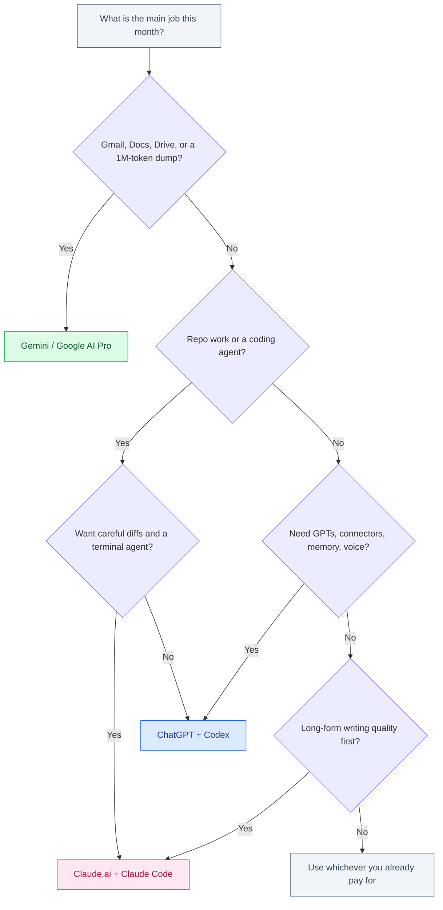

# ChatGPT vs Gemini vs Claude

September 2026 · Published by Amar Kumar

Most comparisons of ChatGPT, Gemini, and Claude treat them as three chat boxes with different logos. They are not. You are choosing an app, a file ecosystem, a coding agent, and a privacy default — not a leaderboard row.

This is a product guide for consumers and working professionals. It is not a bake-off of GPT-5.6 Sol against Claude Fable 5 against Kimi. Frontier model names move every quarter. The products you log into — ChatGPT, Gemini in Google, Claude.ai plus Claude Code — change slower, and they are what you actually pay for.

Prices below are **published list prices**. Providers change tiers, regional billing, and names without much warning. Verify on the vendor site before you subscribe.


## Table of contents

1. [Quick pick](#quick-pick)
2. [What each product actually is](#products)
3. [Strengths](#strengths)
4. [Weaknesses](#weaknesses)
5. [Pricing snapshot](#pricing)
6. [Privacy and training defaults](#privacy)
7. [India and the US](#india-us)
8. [Decision table](#decision)
9. [Which one should you open?](#flowchart)
10. [Glossary](#glossary)
11. [FAQ](#faq)

## Quick pick {#quick-pick}

| If you mostly… | Start here |
|----------------|------------|
| Live in Gmail, Docs, Drive, and Android | **Gemini** (Google AI Pro) |
| Want plugins, Custom GPTs, memory, and Codex | **ChatGPT** (Plus) |
| Write long docs, review diffs, or run a terminal agent | **Claude** (Pro + Claude Code) |
| Need ~1M tokens of PDF / repo / transcript in one shot | **Gemini**, then Claude where 1M is offered |
| Already pay for one of them at work | Stay on that stack until it clearly fails |
| Ship product features with mixed chat + agents | Claude or ChatGPT; Gemini as the Workspace layer |

If the question is which *model checkpoint* to call from an API, that is a different article: [GPT-5.6 Sol vs Claude Fable 5 vs Kimi K3](/blog/posts/gpt-5-6-sol-vs-claude-fable-5-vs-kimi-k3/) and [Best economical LLM models for RAG](/blog/posts/best-economical-llm-models-rag-openai-gemini-anthropic/).

## What each product actually is {#products}

The brand names hide several surfaces. Mixing them up is how people buy the wrong $20 plan.

### ChatGPT (OpenAI)

**ChatGPT** is the consumer and team app: web, iOS, Android, desktop. Behind it sits OpenAI’s current GPT family, image tools, voice, memory, and a plugin / connector ecosystem. **Custom GPTs** are shareable mini-apps. **Codex** is the coding agent that rides the same subscription — CLI, cloud tasks, and IDE hooks — not a separate chat site.

- **Free** — capped model access, enough to evaluate the UI.
- **Plus (~$20/mo)** — the default paid plan for individuals; this is where most professionals land.
- **Team / Enterprise** — admin, SSO, and stricter data defaults.
- **Pro / power tier (~$200/mo list)** — higher limits and frontier access when Plus rate-limits you.

Think of ChatGPT as a **platform**: chat is the front door; Codex, GPTs, and connectors are why people stay.

### Gemini (Google)

**Gemini** is Google’s assistant inside Google. The chat app (gemini.google.com and the Gemini mobile apps) is only half the product. The other half is Gemini in **Gmail, Docs, Sheets, Drive, and Android**, plus the 1M-token context window on current Gemini models, plus storage when the plan is bundled with Google One.

- **Free Gemini** — tied to a Google account; enough for search-like questions.
- **Google AI Pro (~$19.99/mo)** — the paid consumer plan formerly marketed as **Gemini Advanced**. Same job, newer name. Confirm what is bundled (model access, Workspace features, storage) at checkout.
- **Google AI Ultra / higher tier** — power-user limits; list price has sat in the expensive band — verify, do not assume it matches the $200 OpenAI number.
- **Gemini for Workspace / Cloud** — the work product, billed through Google Cloud or Workspace, with different training defaults.

If your files already live in Drive, Gemini is not “another chatbot.” It is the assistant that can see the corpus you already have.

### Claude (Anthropic)

**Claude.ai** is the chat app: Projects, Artifacts, file uploads, and a writing tone that many professionals prefer for memos, specs, and careful analysis. **Claude Code** is the terminal agent — a different product shape that uses the same Anthropic account and quota. You can (and many people do) use Claude.ai for thinking and Claude Code for the repo.

- **Free** — useful for drafts; limits show up fast on coding and long docs.
- **Pro (~$20/mo)** — the individual default.
- **Max (~$100–$200/mo list)** — for people who burn Pro limits with agents.
- **Team / Enterprise / API** — org controls; API billing is usage, not a flat $20.

Claude is the weakest *platform* of the three and the strongest *writer and coding partner* for a lot of knowledge work. That tradeoff is the whole product.

## Strengths {#strengths}

### ChatGPT — ecosystem and Codex

- **Distribution.** It is the name non-engineers already know. Switching cost is social, not technical.
- **Ecosystem.** Custom GPTs, connectors, browsing, image generation, voice, and memory in one account.
- **Codex.** If you already pay for Plus, the coding agent is a marginal-cost trial, not a second procurement. See [Codex vs Google Antigravity](/blog/posts/codex-vs-google-antigravity/) for how that agent compares to Google’s IDE.
- **Team habits.** “Paste it into ChatGPT” is a workflow you do not have to teach.

### Gemini — Workspace, 1M context, storage

- **Workspace.** Drafting in Docs, summarizing threads in Gmail, and asking questions over Drive files without an export step.
- **Long context.** A million-token window is the practical reason to open Gemini for huge PDFs, meeting dumps, or a wide code drop.
- **Storage bundle.** Google AI Pro is often sold with Google One storage. That is real money if you were going to pay for Drive anyway.
- **Android and India distribution.** The Google account is already on the phone. That matters more than benchmark charts in markets where Android is the default computer.

### Claude — writing, coding, agents

- **Prose.** Specs, RFCs, client emails, and “make this precise” edits are where Claude still earns the $20.
- **Coding taste.** Many developers prefer Claude diffs: fewer drive-by refactors, more instruction-following. Pair with [How to Use Claude Code Effectively](/blog/posts/how-to-use-claude-code-effectively/).
- **Claude Code.** Terminal-native agent that reads the repo, runs tests, and loops. This is not a chat sidebar with ambition; it is the product.
- **Projects and Artifacts.** Sticky context for a client or codebase without building a Custom GPT.

## Weaknesses {#weaknesses}

| | ChatGPT | Gemini | Claude |
|---|---------|--------|--------|
| **Where it is weak** | Google-docs workflow; training opt-out is easy to miss on Free/Plus | Writing can feel generic; coding agents lag Claude Code / Codex for many repo tasks | Smaller plugin ecosystem; no native Gmail/Docs; Pro limits hit agent users |
| **Easy to misuse** | Treating it as the only tool because it is famous | Pasting confidential Drive files without checking Workspace vs consumer defaults | Using Claude.ai for Tab-complete (it is not an IDE) |
| **Org friction** | Shadow IT: everyone has a personal Plus | Confused with “Google search” by leadership | Harder to expense if the company is already an OpenAI shop |

None of these are secret. They are why a competent professional often keeps **two** subscriptions and ignores the third until a job needs it.

## Pricing snapshot {#pricing}

List prices in USD. Taxes, INR conversion, and promotional bundles are extra. Recheck the vendor page — this table is a map, not an invoice.

| Plan | List price (typical) | What you are buying |
|------|----------------------|---------------------|
| ChatGPT Plus | ~$20 / month | Paid ChatGPT + Codex access at consumer limits |
| Claude Pro | ~$20 / month | Paid Claude.ai + Claude Code at consumer limits |
| Google AI Pro | ~$19.99 / month | Paid Gemini (formerly Gemini Advanced), often with Google One storage |
| ChatGPT Pro / power | ~$200 / month list | Higher caps, frontier models; only if Plus is the bottleneck |
| Claude Max | ~$100–$200 / month list | Agent-heavy usage that burns Pro |
| Google AI Ultra / higher | Power-user band; verify | Higher Gemini limits; do not assume it matches $200 |
| Team / Enterprise / API | Seat or usage | Admin, SSO, no-training defaults, invoices |

Indicative USD list prices for the common consumer plan (~$20) versus the power tier. Google Ultra pricing moves; treat the power bar as a placeholder and verify. Not a promotion and not including tax.

The $20 question is not “which model is smartest.” It is “will I open this every day.” A $200 tier is for people who already know they are hitting caps — usually agent users, not occasional chat. For a subscription ROI walkthrough, see [Are ChatGPT Plus, Claude Pro, and Gemini Advanced worth it?](/blog/posts/chatgpt-plus-claude-pro-gemini-advanced-worth-it/).

API prices are a different spreadsheet. If you are building a product that calls models per request, use [the RAG cost guide](/blog/posts/best-economical-llm-models-rag-openai-gemini-anthropic/) instead of these consumer plans.

## Privacy and training defaults {#privacy}

Defaults matter more than the policy PDF, because nobody reads the PDF until after a leak scare. These are the usual consumer patterns — **confirm in-app**, because vendors flip toggles.

| Surface | Typical training default | What to check |
|---------|--------------------------|---------------|
| ChatGPT Free / Plus | Chats may be used to improve models unless you opt out | “Improve the model for everyone” (or current wording) off; Temporary Chat for one-offs |
| ChatGPT Team / Enterprise / API | Generally not trained on your business data by default | Workspace admin settings; DPA if you need one |
| Gemini Apps (personal Google account) | Activity may be used when Gemini Apps Activity is on | Gemini Apps Activity; whether you are in a personal vs Workspace account |
| Gemini for Workspace / Cloud API | Generally not used to train foundational models | Your admin’s Gemini / AI settings; region |
| Claude.ai consumer | Anthropic has generally not trained on chats unless you opt in | Privacy / training toggle; Projects with client files still leave Anthropic as processor |
| Claude API / Enterprise | Not trained by default | Zero-data-retention options if offered |

Practical rules that survive policy churn:

- Client source code, credentials, and unpublished financials do not belong in a personal Free/Plus/Apps chat. Use Team/Enterprise/API or a redacted excerpt.
- A Google *personal* account is not the same as Google Workspace, even if the UI looks similar.
- Turning off training does not mean the vendor never stores the prompt. It means a narrower use of that stored data.

```text
# Personal hygiene for mixed client work (all three vendors)

1. Separate accounts: personal experiments vs client work
2. Disable training / activity on the client account
3. Never paste .env, ID tokens, or production dumps
4. Prefer Team/Enterprise or API with a DPA for retained corpora
5. If you must use consumer chat, strip names and secrets first
```

## India and the US {#india-us}

The products are global. The *deal* is not.

### United States

- $20/month is noise against a professional salary. People stack Plus + Pro + a coding IDE without thinking.
- Enterprise procurement cares about SSO, retention, and which vendor is already on the MSA. That, not writing quality, often locks ChatGPT or Gemini in.
- Claude still wins individual IC taste for writing and agents, then loses the bake-off when IT already paid OpenAI.

### India

- The same $20 is a visible slice of a freelancer or early-career engineer’s month. Two plans is a real decision; three is usually waste.
- **Gemini / Google AI Pro** often wins on rails: Google account, UPI, and storage you might have bought anyway. Gemini’s consumer familiarity in India is high; that lowers the activation energy.
- **ChatGPT and Claude** more often bill in USD on an international card. Add GST at checkout where it applies. Compare the INR total, not the $19.99 headline.
- If you sell to US clients from India, match the client’s stack for collaboration (they live in ChatGPT or Gemini) and keep Claude for your own drafting if that is where your quality comes from.

Do not convert $20 at a made-up FX rate and call it science. Look at the Google Play / Stripe / vendor invoice in INR. For take-home math on freelance income, the tax posts on this blog are a better companion than any AI pricing page.

## Decision table {#decision}

| Job | ChatGPT | Gemini | Claude |
|-----|---------|--------|--------|
| Everyday Q&A and brainstorming | **Best default** | Fine if you already live in Google | Excellent, slightly less “everyone knows it” |
| Long-form writing / editing | Strong | Adequate | **Best default** |
| Gmail / Docs / Drive | Weak (export first) | **Best default** | Upload files into a Project |
| Huge transcript or PDF (~1M context) | Depends on current model caps | **Best default** | Strong when 1M is on your plan |
| Multi-file coding agent | Codex — strong if you already pay Plus | Improving; better in Google IDEs | **Claude Code — best default for many repos** |
| Custom internal GPT / connector mashup | **Best default** | Gems / Workspace add-ons | Projects, not a GPT store |
| Privacy-sensitive client work on a consumer plan | Opt out; prefer Team | Prefer Workspace, not Apps | **Least surprising consumer default** — still verify |
| India freelancer, one paid slot | If US clients live here | **Best value if you need Drive storage** | If writing/coding is the job |
| US company with an existing MSA | Often already chosen | Often already chosen | Buy for ICs who hit a quality wall |

## Which one should you open? {#flowchart}



Start from the job, not the brand. If you already pay for one of these at work, that subscription usually wins until a specific job (Workspace, agents, prose) forces a second plan.

For coding-tool shape — chat vs Tab vs agent vs IDE — use the buyer’s guide: [Best AI for Coding](/blog/posts/best-ai-for-coding/). That article is about Cursor, Copilot, Codex, and Claude Code as *tools*. This one is about which assistant account to keep.

## Glossary {#glossary}

| Term | Meaning here |
|------|----------------|
| **ChatGPT** | OpenAI’s consumer/team app, not the underlying model name |
| **Codex** | OpenAI coding agent bundled with ChatGPT subscriptions |
| **Gemini** | Google’s assistant brand: chat apps plus Workspace/Android integrations |
| **Google AI Pro** | Paid consumer Gemini plan; replaced the Gemini Advanced name |
| **Claude.ai** | Anthropic’s chat app (Projects, Artifacts, uploads) |
| **Claude Code** | Anthropic’s terminal coding agent, billed against the Claude plan |
| **Context window** | How much text the model can see in one request (Gemini’s 1M is the headline) |
| **List price** | Vendor sticker price before tax, FX, and promo bundles |

## FAQ {#faq}

### Which is better: ChatGPT, Gemini, or Claude?

None wins every job. ChatGPT wins on ecosystem and Codex. Gemini wins on Google Workspace, 1M context, and bundled storage. Claude wins on writing quality, careful coding, and Claude Code. Pick the product surface you will actually live in.

### Is ChatGPT Plus, Claude Pro, or Google AI Pro worth $20?

Usually yes if you use the product daily. List prices sit around $20 / $20 / $19.99. The $100–$200 tiers are for usage caps, not for first-time buyers. Verify current list prices; they move.

### Does Claude train on my chats by default?

Anthropic’s consumer default has generally been not to train on Claude.ai chats unless you opt in. ChatGPT Free/Plus historically used chats unless you turned that off. Gemini Apps may use activity when Gemini Apps Activity is on. Team, Enterprise, Workspace, and API are stricter. Check the live toggle.

### Which is best for coding?

Claude + Claude Code is the default for many multi-file agent jobs. ChatGPT + Codex is the default if Plus is already paid. Gemini is the default when the work sits in Google’s editors or Android Studio. Details: [Best AI for Coding](/blog/posts/best-ai-for-coding/).

### Which assistant is cheapest in India?

USD list prices are similar. The difference is UPI vs international cards, GST, and whether storage is bundled. Compare the INR invoice. One paid plan is enough for most people; add a second only for a daily job the first cannot do.

### Can I subscribe to more than one?

Yes. A common split is Gemini for Workspace, Claude for drafts and agents, ChatGPT for GPTs and Codex. Two $20 plans are cheaper than the wrong $200 tier. Cancel the one you do not open after a month.

## Related guides

- [Are ChatGPT Plus, Claude Pro, and Gemini Advanced worth it?](/blog/posts/chatgpt-plus-claude-pro-gemini-advanced-worth-it/)
- [Best AI for Coding](/blog/posts/best-ai-for-coding/)
- [GPT-5.6 Sol vs Claude Fable 5 vs Kimi K3](/blog/posts/gpt-5-6-sol-vs-claude-fable-5-vs-kimi-k3/)
- [Best economical LLM models for RAG](/blog/posts/best-economical-llm-models-rag-openai-gemini-anthropic/)

The useful comparison is not which logo is “smartest.” It is which product already holds your files, which agent you will actually run, and which privacy default you can live with. Buy that — then stop shopping until a real job breaks it.
