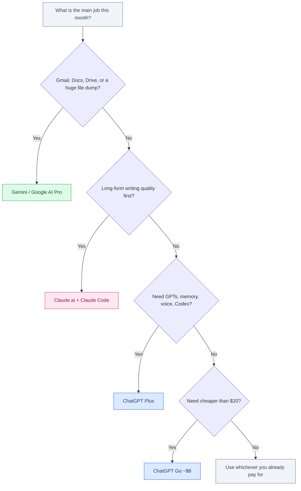

# ChatGPT vs Gemini vs Claude

September 2026 · Published by Amar Kumar

Most people compare ChatGPT, Gemini, and Claude as if they were three chat boxes with different logos. That is the wrong purchase. You are choosing a file ecosystem, a research habit, a writing voice, and (if you code) whether the agent lives in chat or in an IDE — not a leaderboard row.

This is an everyday and work comparison: writing, research, files, price, and when chat is enough versus when you need an editor. It is **not** a coding-agent shootout. That already exists in [Claude Code vs Cursor vs Copilot](/blog/posts/claude-code-vs-cursor-vs-copilot/) and [Best AI for Coding](/blog/posts/best-ai-for-coding/). Frontier checkpoints also move faster than the apps: for model routing see [GPT-5.6 Sol vs Claude Fable 5 vs Kimi K3](/blog/posts/gpt-5-6-sol-vs-claude-fable-5-vs-kimi-k3/).

List prices below are published consumer rates. Vendors rename plans and change caps without much warning. Verify on the vendor site before you subscribe.


## Table of contents

1. [Quick verdict](#verdict)
2. [What each product is](#products)
3. [Writing](#writing)
4. [Coding: chat vs IDE](#coding)
5. [Research and the web](#research)
6. [Context and files](#context)
7. [Price](#price)
8. [Which to pick](#which)
9. [India notes](#india)
10. [FAQ](#faq)

## Quick verdict {#verdict}

| If you mostly… | Open this |
|----------------|-----------|
| Live in Gmail, Docs, Drive, and Android | **Gemini** (Google AI Pro) |
| Want one toolkit: GPTs, voice, memory, images, Codex | **ChatGPT** (Plus) |
| Write long docs, edit carefully, or run a terminal agent | **Claude** (Pro, includes Claude Code) |
| Need a cheaper ChatGPT rung than Plus | **ChatGPT Go** (~$8 in some markets, including India) |
| Need ~1M tokens of PDF, transcript, or a wide file dump | **Gemini**, then Claude where long context is on the plan |
| Already pay for one of them at work | Stay until a specific job (Workspace, prose, agents) forces a second seat |

If the question is “which $20 plan is worth the invoice,” use the subscription walkthrough: [ChatGPT Plus vs Gemini Advanced vs Claude Pro](/blog/posts/chatgpt-plus-vs-gemini-advanced-vs-claude-pro/). If the question is API unit cost for a product, that is [Best economical LLM models for RAG](/blog/posts/best-economical-llm-models-rag-openai-gemini-anthropic/) — consumer chat seats do not replace token billing.

## What each product is {#products}

The brand names hide several surfaces. Mixing them up is how people buy the wrong $20 plan, then blame the model.

### ChatGPT (OpenAI)

**ChatGPT** is the consumer and team app: web, iOS, Android, desktop. Behind it sits OpenAI’s current GPT-5.6 family. **Sol** is the agent flagship; **Terra** and **Luna** are the volume tiers you should actually use for routine chat. Treating every prompt as a Sol job is how Plus limits disappear by Wednesday.

The reason people stay is not a single chat box. It is the **platform**: Custom GPTs, connectors, memory, voice, image tools, and **Codex** — the coding agent that rides the same subscription rather than a second procurement. Free is a metered sample. **Plus is $20/month**, the default paid plan. **ChatGPT Go** is a cheaper paid rung (~$8) in some markets, including India: more than Free, not the full Plus toolbox. **ChatGPT Pro is about $200/month** when Plus rate-limits you on purpose.

### Gemini (Google)

**Gemini** is Google’s assistant *inside Google*. gemini.google.com and the mobile apps are only half the product. The other half is Gemini in **Gmail, Docs, Sheets, Drive, and Android**. The paid consumer plan is **Google AI Pro at $19.99/month**. Searchers still say **Gemini Advanced**; that is the same job with a newer name. It typically includes **Gemini 3.1 Pro** and a large **Google One** storage bundle (about **5TB**). **Google AI Ultra starts at $99.99+**.

If your files already live in Drive, Gemini is not “another chatbot.” It is the assistant that can see the corpus you already have, then write the answer back into a Doc. That workflow beats any paste-into-a-new-tab ritual.

### Claude (Anthropic)

**Claude.ai** is the chat app: Projects, Artifacts, file uploads, and a writing tone many professionals prefer for memos, specs, and careful analysis. **Claude Fable 5** is the current careful-reasoning flagship — the model you want when the job is “do not invent a confident wrong answer.” **Claude Code** is the terminal agent that uses the same Anthropic account and quota. You can (and many people do) use Claude.ai for thinking and Claude Code for the repo.

**Claude Pro is $20/month, or about $17/month if you pay $200 up front annually.** That seat **includes Claude Code**. There is no Go-like $8 rung. **Max starts from $100** for people who burn Pro with all-day agents.

Claude is the weakest *platform* of the three (no GPT store, no native Gmail) and the strongest *writer and coding partner* for a lot of knowledge work. That tradeoff is the whole product.

## Writing {#writing}

Writing is where brand loyalty is most honest, because you can feel the difference in a 1,200-word draft without a benchmark chart.

**Claude** is the default for long-form that has to survive a client or a manager: RFCs, proposals, policy docs, “make this precise,” and edits that keep your voice instead of replacing it with newsletter English. Fable 5’s useful habit is caution. It asks when the brief is ambiguous instead of filling the gap with a confident paragraph you will later delete.

**ChatGPT** is the default for *versatile* drafts: emails in three tones, outlines, marketing variants, meeting notes into bullets, and anything that benefits from a Custom GPT you reuse every week. It is faster to “just start.” It is also faster to over-produce: extra sections, extra adjectives, extra confidence. If you already know the structure, Claude often wastes less of your editing time. If you do not know the structure yet, ChatGPT is a better whiteboard.

**Gemini** is the default when the document already exists in Google Docs. Rewriting a shared Doc in place, summarizing a thread into a reply, or turning a Drive folder of notes into a one-pager is a different job from opening a blank Claude Project. Gemini’s prose can feel generic if you paste a cold brief into the chat app. It feels much better when the context is the Doc you are already staring at.

| Writing job | First pick | Why |
|-------------|------------|-----|
| Long spec, RFC, careful client email | **Claude** | Instruction-following and restraint |
| Brainstorm, outline, three tone variants | **ChatGPT** | Breadth and GPTs you can rerun |
| Rewrite a Google Doc / reply in Gmail | **Gemini** | The file is already there |
| Slide-ish one-pager from messy notes | ChatGPT or Gemini | ChatGPT if notes are pasted; Gemini if notes are in Drive |
| Legal-adjacent or high-stakes wording | Claude, then a human | Still not a lawyer; fewer drive-by flourishes |

A practical rule: **draft where your files live, polish where your taste lives.** Gemini or ChatGPT to get words on the page; Claude when the paragraph has to be exact. Two seats for that split is normal. Three is usually a bake-off you forgot to cancel.

## Coding: chat vs IDE {#coding}

This is the section people collapse, and then they buy the wrong product. Chat that explains an error is not the same purchase as an IDE that tabs in completions or an agent that edits twenty files and runs tests.

**Chat** (chatgpt.com, Claude.ai, gemini.google.com) is for architecture debates, pasted stack traces, throwaway scripts, and “what does this diff do.” You copy, you paste, you decide, you apply. That loop is slow on a real repo and excellent when you are still deciding what to build.

**IDE / agent** is a different SKU on the same invoice:

- **ChatGPT Plus** includes **Codex** — CLI and cloud agent, not “ask ChatGPT to write a function.”
- **Claude Pro** includes **Claude Code** — terminal agent that greps, edits, and loops on tests. Claude.ai is still the chat surface.
- **Gemini** in the browser is chat. Gemini in **Android Studio** and **Google Antigravity** are the Google coding products. Do not judge Gemini’s coding by a paste into the Gemini app.

For day-to-day chat-and-paste coding, Claude and ChatGPT are both competent. Claude tends to smaller, more instruction-following diffs. ChatGPT (especially if you let it use Sol on hard jobs and Terra on glue) is faster at “here is a snippet, make it run.” Gemini chat is the weakest of the three as a generic Python/JS pair programmer and the strongest when the project is Android, Firebase, or a Google Cloud repo you already have open in a Google IDE.

If you type in an editor eight hours a day, stop shopping among these three chat apps and go read [Best AI for Coding](/blog/posts/best-ai-for-coding/) and [How to use ChatGPT and Gemini for coding](/blog/posts/how-to-use-chatgpt-and-gemini-for-coding/). Tab complete and multi-file agents are Cursor, Copilot, Claude Code, Codex, and Antigravity — not a better prompt in a browser.

## Research and the web {#research}

Research is where product surfaces diverge more than “smartness.”

**ChatGPT** is the default web-research workstation for a lot of professionals: browse, a deeper research mode on paid plans, and the habit of turning a messy question into a structured brief with links. It will also hallucinate citations if you let it. The mitigation is boring: ask for URLs, open them, and treat anything without a source as a hypothesis. Memory helps on recurring research (same industry, same competitors) and hurts when last month’s context leaks into this month’s brief — start a temporary chat when the topic is clean-room.

**Gemini** is strongest when the “web” you care about is *Google’s* web plus *your* Drive. Summarizing a search-shaped question, then asking follow-ups against a folder of PDFs, is a native loop. It is weaker when you need a careful, sourced memo that will be forwarded to a client without you rewriting the hedges. Long context helps you dump primary sources in; it does not automatically make the synthesis trustworthy.

**Claude** is the default when the research is already in files you uploaded: a 80-page PDF, a transcript, a zip of notes. Fable 5 is better at “what is inconsistent across these documents” than at “what did the internet say this morning.” Live web is available depending on plan and product surface, but it is not why you buy Claude. You buy Claude so the write-up of the research is something you can send.

Do not run the same query on all three and pick a winner by length. Run it on the one that already holds the sources. If the sources are public web, start in ChatGPT. If they are Gmail/Drive, start in Gemini. If they are a pile of PDFs and a question about contradictions, start in Claude.

## Context and files {#context}

Context windows are marketed in millions of tokens. The useful question is **where the files already sit** and **whether the product remembers the project tomorrow.**

| | ChatGPT | Gemini | Claude |
|---|---------|--------|--------|
| **Where files live** | Uploads + connectors | Drive, Gmail, Docs natively | Uploads + Projects |
| **Sticky project memory** | Memory + Custom GPTs | Workspace / Gems, depending on surface | Projects (instructions + files) |
| **Huge dump in one shot** | Depends on current model caps | **Best default** (~1M-class Gemini) | Strong on long docs when the plan allows |
| **Artifacts / canvases** | Canvases / GPTs | Docs / Workspace side panel | Artifacts in Claude.ai |
| **Privacy default (consumer)** | Opt out of training on Free/Plus | Gemini Apps Activity vs Workspace | Generally not trained unless you opt in — still verify |

Gemini’s ~1M window is the practical reason to open it for a huge transcript, a repo dump, or a due-diligence PDF pack. Claude Projects are the practical reason to open Claude for a client that lasts three months: instructions stay put, files stay attached, and you are not re-explaining the tone every Monday. ChatGPT memory is the practical reason it feels “like it knows you,” which is a feature for personal productivity and a bug for mixed client work.

Hygiene that survives all three vendors:

```text
# Personal vs client work (all three apps)

1. Separate accounts: experiments vs client work
2. Disable training / activity on the client account
3. Never paste .env, ID tokens, or production dumps
4. Prefer Team / Workspace / API when the corpus is retained
5. If you must use consumer chat, strip names and secrets first
```

Turning off training does not mean the vendor never stores the prompt. It means a narrower use of that stored data. Client source code still does not belong in a personal Free/Plus/Apps window.

## Price {#price}

USD list prices. Tax, FX, and regional offers change the invoice. Recheck the vendor page.

| Plan | List price | What you are actually buying |
|------|------------|------------------------------|
| ChatGPT Go | ~$8/mo in some markets (including India) | More ChatGPT than Free; not full Plus |
| ChatGPT Plus | $20/mo | Daily ChatGPT + Codex at consumer limits |
| ChatGPT Pro | ~$200/mo | Capacity and frontier access when Plus is the bottleneck |
| Claude Pro | $20/mo, or ~$17/mo annual ($200 up front) | Claude.ai + **Claude Code included** |
| Claude Max | From $100/mo | Agent-heavy usage that burns Pro |
| Google AI Pro (still searched as Gemini Advanced) | $19.99/mo | Gemini 3.1 Pro + Workspace AI + ~5TB Google One |
| Google AI Ultra | $99.99+/mo | Highest Gemini limits and extras |

The $20 question is not which model is smartest. It is **will I open this every day.** Google AI Pro can be the best *bundle* even when it is not the best chatbot, because ~5TB of storage is money you might have spent on Google One anyway. Claude Pro is the worst *bundle* (no storage, no GPT store) and the best *writing and agent* seat. ChatGPT Plus is the toolkit. ChatGPT Go is the experiment if Plus feels rich and you already prefer ChatGPT’s voice.

A $200 ChatGPT Pro or a $100+ Claude Max is a **capacity** purchase. Buy it after you have hit $20 caps on purpose — usually agents and deep research, not casual chat. Full ROI walkthrough: [ChatGPT Plus vs Gemini Advanced vs Claude Pro](/blog/posts/chatgpt-plus-vs-gemini-advanced-vs-claude-pro/).

## Which to pick {#which}

Start from the job this month, not the brand you used last year.



Pick the product surface you will live in. Add a second seat only for a daily job the first cannot do.

- **One paid seat, Google life:** Google AI Pro. Storage plus Gemini in the apps you already open.
- **One paid seat, writing and repo work:** Claude Pro. You get Claude.ai and Claude Code on the same bill.
- **One paid seat, mixed everyday work:** ChatGPT Plus. GPTs, research, Codex if you later want an agent.
- **Tight budget, already like ChatGPT:** ChatGPT Go where it is offered, including India.
- **Power users:** Claude for drafts and agents, Gemini for Workspace, ChatGPT only if you still need GPTs or Codex. Two seats beat three.

If your employer already pays for one of these, a personal $20 is often duplicate spend. Keep it only for a second vendor you actually open on nights and weekends.

## India notes {#india}

The products are global. The deal is not. A $20 US list price is noise against a US professional salary and a visible line item for many Indian freelancers and early-career engineers.

### ChatGPT Go

OpenAI sells a cheaper paid rung, **ChatGPT Go at about $8/month**, in some markets including India. That is the right experiment if Free ChatGPT is the bottleneck and Plus feels like buying a toolbox you will not open. It is the wrong experiment if you need Custom GPTs, heavy research, or Codex every day — those still sit on Plus. Do not stack Go and Plus.

### Gemini in the Google ecosystem

Most Indian professionals already have a Google account, Android, and a Drive that is full. **Google AI Pro** is often the highest-leverage ~$20 because it is Gemini *plus* about 5TB of Google One, plus Gemini in Gmail and Docs. Payment more often goes through Google with local rails (UPI / Play / Google billing) instead of a USD-denominated card. If you were going to buy storage anyway, part of the $19.99 is not “AI spend.”

### GST on USD subscriptions

ChatGPT and Claude more often bill in **USD on an international card**. The $20 headline is not the INR total. Indian GST on imported digital services commonly shows up at checkout or on the statement — treat **18% as the planning assumption** and read the invoice. Bank FX markup is extra. Compare the rupee number, not the dollar marketing page.

Claude Pro’s annual option ($200 up front, ~$17/month equivalent) only helps if you already know you will keep Claude for a year. A GST-inclusive annual charge is a real cash-flow hit; monthly is easier to cancel after the bake-off.

If you sell to US clients from India, match the client’s stack for collaboration (they live in ChatGPT or Gemini) and keep Claude for your own drafting if that is where quality comes from. One paid plan is enough for most people; add a second only for a daily job the first cannot do. For the invoice-level comparison of the $20 club, see [ChatGPT Plus vs Gemini Advanced vs Claude Pro](/blog/posts/chatgpt-plus-vs-gemini-advanced-vs-claude-pro/).

## FAQ {#faq}

### Which is better: ChatGPT, Gemini, or Claude?

None wins every job. ChatGPT is the default everyday toolkit (GPTs, voice, memory, Codex). Gemini wins when your work already lives in Gmail, Docs, Drive, or Android. Claude wins on long-form writing, careful analysis, and Claude Code. Pick the product you will open daily.

### Is ChatGPT Plus worth it if ChatGPT Go exists?

Go (~$8 in some markets, including India) is extra ChatGPT headroom, not the full Plus toolbox. Take Plus at $20 if you need Custom GPTs, heavier research, images, or Codex as a daily agent. Stay on Go if Free was the only problem and you do not live in the extras.

### What happened to Gemini Advanced?

Google renamed the roughly $20 consumer plan to **Google AI Pro at $19.99**. Searchers still say Gemini Advanced. The plan typically includes Gemini 3.1 Pro and a large Google One storage bundle (about 5TB). Google AI Ultra starts at $99.99+.

### Which is best for writing and research?

Claude is the usual pick for long specs, careful edits, and tone you can ship. ChatGPT is stronger when you need browsing, a research mode, and a versatile draft in one place. Gemini is strongest when the source material is already in Drive or Gmail and you want the rewrite to land back in Docs.

### Which is best for coding?

For chat-and-paste coding, Claude and ChatGPT are both strong; Gemini is fine for Android and Workspace-adjacent code. For IDE and agent work, that is a different purchase: Claude Code, Codex, Cursor, Copilot, or Antigravity. See [Best AI for Coding](/blog/posts/best-ai-for-coding/).

### How does GST work on USD AI subscriptions in India?

USD list prices are not the invoice. International-card charges for ChatGPT and Claude often add GST on digital services at checkout or on the statement. Google AI Pro more often bills through a Google account with local rails. Compare the INR total, not the $19.99 headline.

### Can I subscribe to more than one?

Yes. A common split is Gemini for Workspace files, Claude for writing and Claude Code, and ChatGPT for GPTs and Codex. Two $20 plans are usually cheaper than the wrong $200 tier. Drop the seat you do not open after a month.

## Related guides

- [ChatGPT Plus vs Gemini Advanced vs Claude Pro](/blog/posts/chatgpt-plus-vs-gemini-advanced-vs-claude-pro/)
- [Best AI for Coding](/blog/posts/best-ai-for-coding/)
- [How to use ChatGPT and Gemini for coding](/blog/posts/how-to-use-chatgpt-and-gemini-for-coding/)
- [GPT-5.6 Sol vs Claude Fable 5 vs Kimi K3](/blog/posts/gpt-5-6-sol-vs-claude-fable-5-vs-kimi-k3/)
- [Best economical LLM models for RAG](/blog/posts/best-economical-llm-models-rag-openai-gemini-anthropic/)
