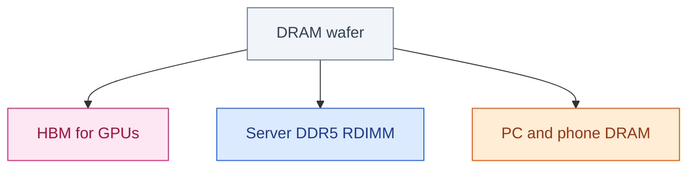

# The DRAM Supercycle

**September 2026 · Published by Amar Kumar**

The first time this cycle got personal for me was not a GPU quote. It was a boring 64 GB DIMM kit for a workstation that used to be a rounding error on the invoice. Same SKU. Same vendor. The price had quietly grown a personality. That is the tell of a memory supercycle: the unglamorous parts get expensive while everyone is still arguing about FLOPS.

AI did not “make RAM cost more” in the way a meme coin makes a ticker twitch. It stole the wafers. There are only so many square millimeters of DRAM coming out of Micron, SK hynix, and Samsung. Those millimeters can become HBM stacked on a GPU, fat DDR5 sticks in a server, or the chips in a laptop. This year the first two ate the third for lunch, then started eating each other.

If you rent cloud, ship RAG, or buy anything with “AI server” in the BOM, you are already in this story. The rest of this post is the version I wish someone had written before we sized a cluster like memory was still a commodity.

## Table of contents

1. [What a supercycle is](#what-a-supercycle-is)
2. [The scoreboard](#the-scoreboard)
3. [HBM vs DDR5 vs consumer](#hbm-vs-ddr5-vs-consumer)
4. [Why supply cannot catch up](#why-supply-cannot-catch-up)
5. [What this does to AI systems](#what-this-does-to-ai-systems)
6. [How to buy around it](#how-to-buy-around-it)
7. [FAQ](#faq)

## What a supercycle is

Memory people use “cycle” the way weather people use “season.” DRAM is famous for boom-and-bust: overbuild, crash, underbuild, squeeze, repeat. A *supercycle* is when the squeeze lasts long enough that you stop treating it as a quarter and start treating it as the weather.

The boring definition: **bit demand grows faster than bit supply** for years, not months. Suppliers get pricing power. The mix of what they make shifts toward whatever pays the most per wafer. Right now that mix looks like a triage ward. HBM first. Fat server RDIMMs second. Your gaming laptop last, and only if someone forgot a pallet.

| Signal | What it looks like now |
| --- | --- |
| Mix shift | Wafers go to HBM and server RDIMMs first |
| Inventory | Supplier stocks at historic lows — not “lean,” empty-ish |
| Pricing | Server DRAM still up quarter on quarter; consumer DRAM often up more |
| Duration | People who sell this stuff still talk about 2027, not Black Friday |

Here is the part that still surprises smart teams: the same silicon can become HBM for a GPU or DDR5 for a CPU. Once a wafer is committed to stacked memory, it is not sitting in a warehouse waiting for your dual-rank kit. It is already spoken for. A general-purpose server does not lose because the industry forgot how to make DRAM. It loses because someone with a bigger purchase order asked first.

## The scoreboard

TrendForce’s mid-year updates are the closest thing this industry has to a box score. They are not poetry. They are also not a press release from a GPU company. Read them like a mechanic reads oil pressure.
- **2Q26 DRAM industry revenue** landed around **$154.7 billion**, up **59.5% quarter on quarter**. That is not “they shipped a lot more chips.” Bits barely moved. Prices did.
- Whatever extra supply existed went to servers. Consumer channels got the leftovers and a lecture.
- **3Q26 conventional DRAM contracts** were still expected up **13–18%** — which sounds almost polite until you remember some earlier quarters this year were up *ninety percent*. The spike cooled. The squeeze did not end.
- A handful of US cloud buyers locked **multi-year LTAs** (long-term agreements). If you do not have one, you are shopping in the gift shop while they eat in the kitchen.
- Full-year commentary still talks about inflation and tightness running into 2027. Anyone telling you “it normalizes next quarter” is selling you something, or selling you RAM.

Revenue jumping while bits crawl is the fingerprint of a price supercycle. You can argue about how long it lasts. You cannot argue that this is a capacity boom. The fabs are not magically twice as big. The invoices are.

Revenue jumped far faster than bits. That is a price supercycle, not a capacity boom.

## HBM vs DDR5 vs consumer

Think of three products that used to live in different aisles and now fight over one factory.

**HBM** is the celebrity. It sits on NVIDIA, AMD, and custom AI ASICs, stacked like a tiny apartment building and wired with through-silicon vias that make yield engineers age in dog years. Highest revenue per wafer. Decode and long-context inference cannot fake their way around it. If you want the GPU-side math — KV cache, Rubin, 192 GB versus 288 GB — that lives in [NVIDIA and the AI Memory Wall](/blog/posts/nvidia-ai-memory-wall/). This post is the other half: the wafers that never become GPUs at all.

**Server DDR5** is the unloved sibling that suddenly got rich. Retrieval, orchestration, host-side KV offload, vector indexes that “will totally fit in RAM.” Cloud buyers raised DDR5 content per server the way restaurants raised portion sizes in reverse: more food, same kitchen, higher check. High-capacity modules take a rising share of bits because a 128 GB stick is a better use of scarce silicon than four 32 GB sticks you have to socket and cool.

**Consumer DRAM** is leftover pizza. Suppliers cut PC and phone allocation on purpose. That is why a laptop upgrade can hurt more than a server DIMM this year, which feels insane until you remember nobody at Micron is losing sleep over your 32 GB kit when a hyperscaler will take the whole lot.

HBM3e used to cost four to five times server DDR5. That gap is compressing toward **1–2×**. Do not clap. DDR5 did not get cheap. It caught up. The premium shrank because the floor rose.

The HBM premium shrank because DDR5 caught up, not because stacked memory became abundant.

## Who pays more

### Pick a buyer

Cloud buyers with a long-term agreement, everyone else on the spot market, and PC/phone channels are not in the same movie. They just share a soundtrack of “RAM is fine, actually.”

## Why supply cannot catch up

One wafer, three products. HBM and servers win the allocation fight. Your laptop gets whatever fell off the truck.

People ask “why don’t they just build more fabs?” the way people ask why restaurants don’t just add a second kitchen during dinner rush. They can. It takes years, tens of billions, and a process node that does not care about your sprint board.
- Through 2027 the majors grow bits mainly by **migrating existing lines** — squeezing more from tools they already own — not by opening a magic HBM Disneyland next quarter.
- HBM burns more wafer time per usable bit than commodity DDR5. Stacking, TSV, and yield tax mean you spend a wafer and get fewer “happy gigabytes” than a boring DIMM would have given you.
- Earlier CPU shortages let US clouds **buffer DRAM inventory**. Demand did not vanish. It sat on shelves waiting for sockets. When the CPUs showed up, the DRAM walked out with them. That is parked demand, not cancelled demand.

So yes, someone will eventually overbuild. Memory always overbuilds. The question for anyone shipping product this year is whether you can afford to wait for the hangover.

## What this does to AI systems

This is where the supercycle stops being a semiconductor story and starts being your architecture review.
- **GPU HBM SKUs** may ship thinner stacks. Same marketing FLOPS, less KV residency. The card looks identical in the SKU picker. The context window you thought you bought does not.
- **Host DIMMs** — vector databases and KV offload get more expensive per gigabyte. “Just keep it in RAM” is a strategy from 2023. In 2026 it is a budget line.
- **Cloud list prices** — memory-heavy instances reprice first, because they are made of the thing everyone is fighting over. CPU-heavy instances will feel it later. GPU instances already felt it.

RAG is a memory product wearing a language-model costume. The retrieval set, the reranker, the working context, the host cache — that is DRAM talking. Which is why [retrieval quality](/blog/posts/how-to-evaluate-rag-retrieval/) and [model routing](/blog/posts/auto-model-routing-without-llm-classifier/) are not “MLOps nice-to-haves.” They are how you stop buying memory you do not use.

A team that pins a 70B model “just in case” and retrieves 40 chunks “because we can” is not being thorough. They are donating margin to SK hynix.

## How to buy around it

You cannot fab your way out of this quarter. You can stop shopping like memory is still a rounding error.

| Lever | Why it works |
| --- | --- |
| Smaller working set | Rerank so you do not pay HBM and DDR5 for tokens nobody reads |
| Right-size models | A resident 8–32B that stays on the card beats a frontier model that pages like it’s 1998 |
| Reserved cloud | Spot memory instances are riding the supercycle. Reserved capacity is a boring adult decision |
| Don’t future-proof DIMMs | If 64 GB fits the working set, skip the 256 GB “for growth.” Growth is priced like a luxury good |
| One TCO line | GPU HBM + host DDR5 is a single bill. Splitting them in two spreadsheets is how overbuy happens |

Do not assume next year is cheap. Supplier commentary still has server DRAM rising through the second half of 2027, just more slowly — the difference between a punch and a grind. Plan for the grind. If prices collapse, you will look conservative. If they do not, you will still have a product.

## FAQ

### Is the DRAM shortage real, or is this vendor theater?

It is real enough that industry revenue jumped on price, not bits, and inventories are at historic lows. Vendors always have a speech. The wafers do not care about the speech.

### Why is PC RAM up if AI is the story?

Because wafers moved. Consumer DRAM is leftover capacity by policy, not by accident. Your laptop is competing with a GPU stack it will never meet.

### Will HBM stay many times more expensive than DDR5?

The multiple is shrinking because DDR5 repriced, not because stacked memory became abundant. Both parts stay scarce. The interesting number is no longer “HBM is 5×.” It is “DDR5 is no longer cheap.”

### What should a RAG team change first?

Cut retrieved tokens, add a reranker that earns its keep, and stop pinning an oversized model “for quality” you have not measured. Measure, then buy silicon. The other order is how supercycles get paid.

### Should we wait for 2027?

Only if your users will wait with you. The industry may loosen. Your customers will not pause their tickets while SK hynix builds a building.

You cannot fab your way out of this quarter. You can stop buying memory you do not use — which is less exciting than a new cluster, and much closer to a strategy.
