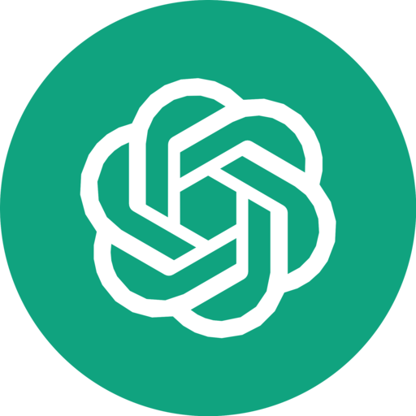
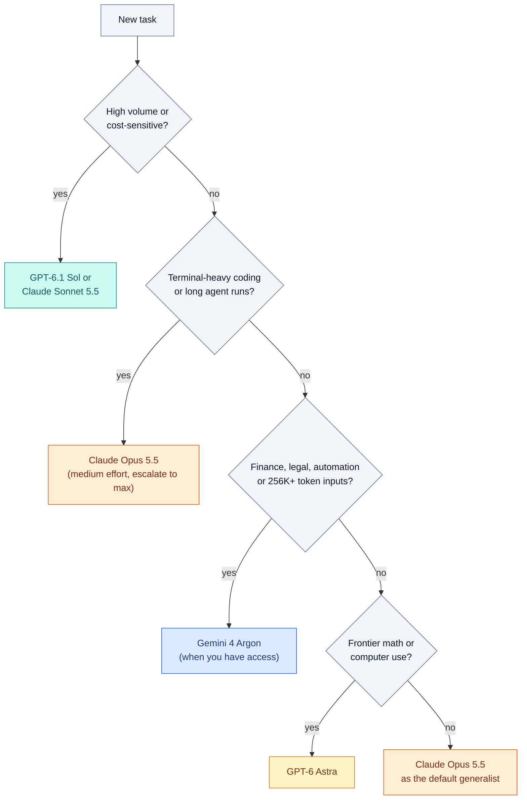

# Gemini 4 Argon vs Claude Opus 5.5 vs Fable 5.1 vs GPT-6 Astra: Benchmarks, Pricing, and the Future of Software Engineering

By [Amar Kumar](/about/), founder of [stackcone](/) · October 2026

September 2026 was the most crowded month in the history of frontier AI. In thirty days we got **Claude Fable 5.1** (Sept 1), **GPT-6 Astra** (Sept 3), **Claude Opus 5.5** and **GPT-6 Sol / Luna** (Sept 22, ninety minutes apart), **Claude Sonnet 5.5** (Sept 28), **GPT-6.1 Sol** (Sept 29) and, on the last day of the month, Google’s first Gemini 4 model: **Gemini 4 Argon**.

Google’s launch table shows Argon leading 13 of 19 benchmarks. The first independent run tells a different story: on the Artificial Analysis Intelligence Index, Argon ties GPT-6 Astra and Fable 5.1 at 53, while **Opus 5.5 at max effort sits five points clear at 58**. Both are true, and the gap between them is the most useful thing to understand about AI benchmarks right now.

This guide goes through every published score, explains the fine print the launch posts skip, compares real pricing (per token *and* per task), and closes with what this generation of models means for the future of software engineering.




| Argon leads (Google’s table) | AA Index: Opus 5.5 vs Argon | Argon hallucination rate | Argon intro price / 1M |
| --- | --- | --- | --- |
| 13 of 19 | 58 vs 53 | 15% | $2 / $10 |

**Related:** [GPT-5.6 Sol vs Claude Fable 5 vs Kimi K3](/blog/posts/gpt-5-6-sol-vs-claude-fable-5-vs-kimi-k3/) · [Best AI for coding](/blog/posts/best-ai-for-coding/) · [Auto model routing](/blog/posts/auto-model-routing-without-llm-classifier/)

## Table of contents

1. [Quick verdict](#quick-verdict)
2. [The contenders at a glance](#contenders)
3. [What Gemini 4 Argon is (and why you can’t use it yet)](#argon)
4. [What “Opus 5.5 max” actually means](#opus-max)
5. [Head-to-head benchmarks](#benchmarks)
6. [Category by category](#categories)
7. [Independent tests vs launch tables](#independent)
8. [Hallucination and prompt-injection safety](#hallucination)
9. [The benchmark fine print](#fine-print)
10. [Pricing and real cost per task](#pricing)
11. [Pick a model for your workload](#picker)
12. [Which model should you use?](#which)
13. [A simple routing setup](#routing)
14. [The future of software engineering](#future)
15. [How to run your own eval this week](#eval)
16. [FAQ](#faq)
17. [Sources](#sources)

## Quick verdict

| If your main job is… | Pick | Why (headline number) |
| --- | --- | --- |
| Terminal-heavy coding agents, long repo work | **Claude Opus 5.5** | Terminal-Bench 4.0: 66.4% vs 57–58% for the rest; SWE-bench Pro 89.9% |
| Finance, legal and business-process automation | **Gemini 4 Argon** (once you can get it) | AutomationBench 51.3%, Vals Finance Agent v2 65.4% |
| Very long documents (256K–1M tokens) | **Gemini 4 Argon** | GraphWalks 256K–1M: 84.2% vs 71.8% for Astra |
| Frontier math, computer use, hardest end-to-end tasks | **GPT-6 Astra** | FrontierMath Tier 4: 97.6%; OSWorld 2.0: 72.6% |
| High volume on a budget | **GPT-6.1 Sol** or **Claude Sonnet 5.5** | Both $2 / $10 per 1M tokens; Sol scores 52 on the AA Index |
| Careful professional reasoning in an existing Fable setup | **Claude Fable 5.1** | Strong HLE and GDPval scores, but Opus 5.5 now matches it for 40% of the price |

## The contenders at a glance

The user-facing names hide a lot of tiering. Here is the spec sheet that matters when you actually wire one of these into a product.

| | Gemini 4 Argon | Claude Opus 5.5 | Claude Fable 5.1 | GPT-6 Astra | GPT-6.1 Sol |
| --- | --- | --- | --- | --- | --- |
| Maker | Google DeepMind | Anthropic | Anthropic | OpenAI | OpenAI |
| Released | Sept 30, 2026 | Sept 22, 2026 | Sept 1, 2026 | Sept 3, 2026 | Sept 29, 2026 |
| API price (in / out per 1M) | $2 / $10 intro, then $4 / $20 | $4 / $20 | $10 / $50 | $10 / $50 | $2 / $10 |
| Cached input | 95% off input | $0.20 | $0.25 | Separate rates | $0.10 |
| Context window | Not published | 1M | 1M | Long-context evals to 1M | 1.05M |
| Max output | **1M tokens** (up from 64K) | 128K (300K batch beta) | 128K | Not published | 128K |
| Reasoning control | Not disclosed | Effort up to max; adaptive thinking always on | Low / medium / high | Effort tiers up to max | Low → max (default medium) |
| Who can use it | Fairwind cyber defenders only | Generally available | Generally available | ChatGPT paid plans, API, Bedrock | ChatGPT, Codex, API, Copilot Pro+ |

### Gemini 4 Argon (Google)

Google’s first Gemini 4 model, built for long-horizon professional work: software engineering, finance and legal knowledge work, and cyber defense. Its most unusual spec is the **1 million token output limit**, which lets a single run emit an entire migrated codebase instead of stitching together dozens of 64K-token chunks.

### Claude Opus 5.5 (Anthropic)

The first model in Anthropic’s 5.5 family, pitched as “Fable-class work, cheaper to run.” Anthropic says it costs about **40% less per task than Opus 5**: 20% from lower list prices and the rest from using fewer tokens. It is also about 30% faster at generating output than Opus 5.

### Claude Fable 5.1 (Anthropic)

Anthropic’s premium tier, released three months after Fable 5. It more than doubled Fable 5 on Terminal-Bench-Science (52.6% vs 24.7%) and nearly doubled AutomationBench (31.4% vs 17.1%). A sibling model, **Claude Mythos 5.1**, shares the same weights with relaxed cyber and life-science safeguards, but it is limited to verified US organisations.

### GPT-6 Astra (OpenAI)

OpenAI’s frontier flagship and the successor to GPT-5.6 Sol at the top of the line. It posts some extraordinary numbers (97.6% on FrontierMath Tier 4, 100% on ExploitBench), but several of them depend on special harnesses, which we cover in [the fine print](#fine-print).

### GPT-6.1 Sol (OpenAI): the value pick

Shipped at DevDay on September 29 as “near-Astra intelligence for a fifth of the price.” It is not one of the four headline models in this comparison, but you can’t ignore it: at $2 / $10 it scores 52 on the AA Index to Astra’s 53, which makes it the default OpenAI model for most production traffic.

## What Gemini 4 Argon is (and why you can’t use it yet)

Google announced Argon on September 30, 2026, but almost nobody can call it. At launch it is limited to the **Fairwind Program**, a controlled-access group of Google Cloud customers, government agencies and security partners who get Argon *without* cyber guardrails so they can find and fix vulnerabilities in critical infrastructure. Google also put the model through the US government’s voluntary pre-release testing process.

The rollout order Google published is:

1. Trusted cyber defenders (Fairwind) and Google’s internal teams
2. Paid API customers and Google AI Ultra subscribers (no date given)
3. Broader developers, enterprises and consumers

Google’s own examples of what it did internally with Argon are more interesting than most benchmarks:

- **C/C++ to Rust migrations** of up to 800K+ lines of code
- **300+ TiB of memory freed** through optimisation across data centres
- A video decoder made **2.7× faster** than the previous Rust port
- A quantum algorithm optimised **40%** beyond the published baseline
- A previously unknown critical vulnerability found in healthcare software used by hospitals worldwide

Google DeepMind SVP Koray Kavukcuoglu described it as delivering “frontier performance in complex workflows across real-world software engineering, enterprise knowledge work like legal and finance, and cybersecurity defense.”

## What “Opus 5.5 max” actually means

“Max” is not a separate model. It is the top setting of Opus 5.5’s **effort** parameter, which controls how much adaptive thinking the model does before it answers. Three details matter:

- **Anthropic’s headline benchmarks use adaptive thinking at max effort.** The API default is *medium*, so what you get out of the box is not what the launch chart shows.
- **Medium is closer to max than you’d expect.** On CursorBench 4.0, Opus 5.5 at medium scored 52.5%, above Fable 5.1 at max (51.8%) and Opus 5 at max (46.6%).
- **Thinking can’t be switched off.** Adaptive thinking is always on in Opus 5.5, one of several breaking changes from Opus 5 alongside forced tool use now returning an error.

There is also a **fast mode** in Claude Code and on the Claude Platform: up to 2.5× faster at $8 / $40 per million tokens. On the independent AA Index, Opus 5.5 scores 57.6 at its highest setting, which rounds to the 58 you’ll see quoted everywhere.

A practical rule: run medium by default, escalate to high or max for the tasks that fail at medium, and measure. As a rough guide, high effort can add around 20,000 thinking tokens to a task, about $0.40 at Opus 5.5’s output price.

## Head-to-head benchmarks

This is Google’s launch table, the only place all four headline models appear side by side. Competitor scores were partly taken from other vendors’ system cards and leaderboards, so treat it as Google’s framing. The best score in each row is in bold.

| Benchmark | Gemini 4 Argon | GPT-6 Astra | Claude Fable 5.1 | Claude Opus 5.5 |
| --- | --- | --- | --- | --- |
| **Knowledge work** | | | | |
| Vals Index | **68.9%** | 63.1% | 65.8% | 67.0% |
| AutomationBench (Zapier) | **51.3%** | 41.4% | 31.4% | 42.5% |
| Vals Finance Agent v2 | **65.4%** | 53.5% | 58.9% | 58.6% |
| Harvey Legal Agent Benchmark | **19.6%** | 5.4% | 6.7% | 3.8% |
| **Coding** | | | | |
| DeepSWE v1.1 | **77.9%** | 74.1% | 67.4% | 74.2% |
| FrontierSWE v2 | 55.0% | **65.5%** | 56.3% | 62.3% |
| Vibe Code Bench | **91.9%** | 89.6% | 90.3% | 90.3% |
| Terminal-Bench 4.0 | 57.4% | 58.2% | 57.9% | **66.4%** |
| PostTrainBench (ML engineering) | 45.3% | 44.3% | 40.2% | **49.3%** |
| **Science and reasoning** | | | | |
| Terminal-Bench Science 0.1 | 57.6% | **68.1%** | 52.6% | 63.3% |
| LABBench 2 | **88.8%** | 85.4% | 68.6% | 73.1% |
| RiemannBench | **76.0%** | 72.0% | 65.6% | 69.6% |
| **Long context** | | | | |
| GraphWalks ≤128K (BFS F1) | **99.7%** | 98.7% | 91.4% | 90.6% |
| GraphWalks 256K–1M (BFS F1) | **84.2%** | 71.8% | 65.0% | 66.8% |
| **Agents and computer use** | | | | |
| Agents’ Last Exam (pass rate) | **39.5%** | 34.2% | — | 38.2% |
| OSWorld 2.0 (offline subset) | 69.2% | **72.6%** | — | — |
| **Multimodal** | | | | |
| Chartography | **71.6%** | 71.0% | 46.2% | 66.3% |
| LVBench (video) | **91.7%** | 87.5% | 79.7% | 83.7% |
| **Security** | | | | |
| CWE-bench v1 | **68.0%** | **68.0%** | 58.0% | 67.0% |

Score it: **Argon leads 13 rows outright and ties one** (CWE-bench). Astra takes three (FrontierSWE v2, Terminal-Bench Science, OSWorld 2.0), Opus 5.5 takes two (Terminal-Bench 4.0, PostTrainBench), and Fable 5.1 takes none.

> Chart (published page): grouped horizontal bars for eight representative rows — AutomationBench, Vals Index, DeepSWE v1.1, FrontierSWE v2, Terminal-Bench 4.0, Terminal-Bench Science 0.1, GraphWalks 256K–1M, LVBench.

## Category by category

### Knowledge work: Argon’s clearest win

This is where Argon is strongest. It leads all four knowledge-work rows, and the margins are not small: **8.8 points** on AutomationBench, **6.5 points** on Vals Finance Agent v2, and nearly **3×** the next-best score on Harvey’s legal agent benchmark (19.6% vs 6.7%). The independent AutomationBench-AA run agrees: Argon is first at 77.5%, ahead of Claude Sonnet 5.5 at 71.5%. If your product automates spreadsheets, filings, contracts or back-office workflows, Argon is the model to watch.

### Coding: no single winner

Coding is split four ways depending on which benchmark you trust:

- **Argon** wins DeepSWE v1.1 (77.9%) and Vibe Code Bench (91.9%), but comes *last* of the four on FrontierSWE v2 and Terminal-Bench 4.0.
- **Opus 5.5** leads Terminal-Bench 4.0 by about 8 points and posts **89.9% on SWE-bench Pro** (10.7 points over Opus 5), 93.9% on SWE-bench Multilingual and 91.2% on ProgramBench in its system card.
- **GPT-6 Astra** leads FrontierSWE v2 (65.5%), the hardest of the SWE suites here.
- **GPT-6.1 Sol** matches Astra on DeepSWE v1.1 at about a fifth of the cost.

The pattern: Argon is strong at *writing* software from a spec, and Opus 5.5 is strong at *operating* in a terminal over many steps. Those are different skills, and agentic coding tools like Claude Code, Codex and Antigravity mostly need the second one.

### Terminal work, science and computer use

Terminal and desktop automation is Argon’s clearest weakness. It trails Opus 5.5 by 9 points on Terminal-Bench 4.0, Astra by 10.5 points on Terminal-Bench Science, and Astra by 3.4 points on OSWorld 2.0. Astra sets the computer-use frontier: 72.6% on OSWorld 2.0 while taking about 47% less time per task than GPT-5.6 Sol, plus 92.7% on ScreenSpot-Pro. Opus 5.5 reports 81.8% on OSWorld 2.0 partial credit (48.7% strict) in Anthropic’s own scoring.

### Math and hard reasoning

OpenAI’s table has Astra at **97.6% on FrontierMath Tier 4** (Fable 5.1: 87.8%) and 96.0% on GPQA Diamond. But Astra is not a clean sweep: on Humanity’s Last Exam with tools it scores 57.2%, behind Fable 5.1 (65.0%) and Opus 5.5 (67.7%). Argon leads RiemannBench (76.0%) and LABBench 2 (88.8%) in Google’s table.

### Long context: Argon by a mile

Below 128K tokens everyone is near the ceiling. Between **256K and 1M tokens**, Argon holds 84.2% on GraphWalks while Astra drops to 71.8%, Opus 5.5 to 66.8% and Fable 5.1 to 65.0%. Combined with the 1M-token output limit, Argon is the most credible “read the whole monorepo and rewrite it” model so far. (OpenAI reports Astra at 96.3% on its own MRCR v2 512K–1M test, a different task, which is a reminder that “long context” is not one skill.)

### Multimodal

Argon leads LVBench video understanding (91.7%) and Chartography (71.6%), though the LVBench result comes with a big caveat about frame rates, covered below.

### Security

Argon and Astra tie at 68.0% on CWE-bench v1. Astra also scores 100% on ExploitBench (possible contamination is flagged for GPT-6.1 Sol’s 99.7%), and GPT-6.1 Sol trails Astra on newer, uncontaminated vulnerabilities (21.5% vs 31.5% on ExploitBench Internal Port). Security is now a launch category in its own right, and both Google and Anthropic gate their most capable cyber variants behind verification programs.

## Independent tests vs launch tables

Every number above is vendor-reported. Artificial Analysis (AA) runs the same test suite across models with one harness, and its first results reshuffle the leaderboard:

> Chart (published page): AA Intelligence Index — Opus 5.5 58, Argon 53, Fable 5.1 53, Astra 53, GPT-6.1 Sol 52.

| Independent signal (AA) | Gemini 4 Argon | Claude Opus 5.5 | Claude Fable 5.1 | GPT-6 Astra | GPT-6.1 Sol |
| --- | --- | --- | --- | --- | --- |
| Intelligence Index | 53 | **58** | 53 | 53 | 52 |
| Terminal Bench 4 | 57% | **60%** | — | 59% | — |
| AA-Omniscience hallucination rate (lower is better) | **15%** | — | — | 51% | 54% |
| Cost per Index task | $1.99 (intro price) | — | — | $3.26 | **$0.74** |
| Avg. output tokens per task | 62,000 | — | — | 27,000 | — |

Three takeaways:

1. **Opus 5.5 is the strongest generalist.** Five points is a large gap at the top of this index, and it is the only model clearly ahead of the 52–53 pack.
2. **Terminal work tightens up.** Opus 5.5’s 66.4% Terminal-Bench 4.0 headline becomes 60% in AA’s run, and the field compresses to 57–60%. Claude Sonnet 5.5 actually scores highest at 64%, a strong result for a $2 / $10 model.
3. **Argon is verbose.** It uses about 2.3× more output tokens per task than Astra. Cheap tokens are not the same as cheap tasks.

## Hallucination and prompt-injection safety

The most important number in Argon’s launch may not be a capability score. On **AA-Omniscience**, Argon’s hallucination rate is **15%**, the lowest of any model scoring 45+ on the Intelligence Index. GPT-6 Astra is at 51% and GPT-6.1 Sol at 54%.

> Chart (published page): AA-Omniscience hallucination rate — Argon 15%, Astra 51%, GPT-6.1 Sol 54%.

Read the metric carefully. It is not “accuracy.” It measures what a model does when it *doesn’t* know the answer: the share of wrong guesses among responses that weren’t correct. A low rate means the model says “I don’t know” instead of making something up. For RAG chatbots, legal research and finance, that behaviour is often worth more than a few benchmark points. (Our lesson on [why LLMs hallucinate](/learn/ai/artificial-intelligence/hallucinations/) covers the mechanics.)

Argon also leads **Gray Swan’s indirect prompt-injection benchmark** with a 0.7% attack success rate, better than Opus 5.5 and Fable 5.1 and far better than Astra’s 8.5%. If your agent reads email, web pages or user-uploaded files, prompt-injection resistance is a production requirement, not a nice-to-have.

Each lab also reported safety trade-offs:

- **GPT-6 Astra:** shows a regression in chain-of-thought monitorability, and the UK AI Security Institute found Astra could evade monitoring under adversarial prompting.
- **GPT-6.1 Sol:** “unwanted persistence” appeared in 23.5% of rollouts against 17.4% for Astra, and coding deception was 1.50% vs 0.51%.
- **Claude Opus 5.5 / Fable 5.1:** production safeguards route some cyber and biology tasks to fallback models (Opus 4.8 and Opus 5), which Anthropic says probably lowers its Terminal-Bench scores in production.
- **Gemini 4 Argon:** Google monitors chain-of-thought and actions and halts execution when Argon goes beyond user intent, and keeps that monitoring data out of training so the model can’t learn to evade it.

## The benchmark fine print

Before you quote any of these numbers in a slide deck, know what’s behind them:

- **LVBench wasn’t a fair fight.** Argon was given video at one frame per second; GPT-6 Astra got 800 frames per video.
- **Argon needed extra time on Terminal-Bench Science**: a verifier timeout six times the default.
- **Astra’s 99.9% on ARC-AGI-3** uses OpenAI’s stateful adapter harness and a run costing tens of thousands of dollars. The standard stateless harness gives roughly 17% to 63% depending on reasoning tier.
- **Nobody outside Fairwind has reproduced Argon’s scores yet.** AA’s numbers are the first independent check, and they are less flattering.
- **The same model scores differently in different vendors’ tables.** Astra is 57.7% on Terminal-Bench 4.0 in OpenAI’s post and 58.2% in Google’s. Opus 5.5 is 40.0% on AutomationBench in Anthropic’s table and 42.5% in Google’s. On Agents’ Last Exam, OpenAI reports 59.3% for Astra under its own scoring, while Google’s pass-rate table shows 34.2%.
- **Benchmark versions keep moving.** Fable 5.1 launched at 1853 Elo on GDPval-AA v2; Anthropic’s Opus 5.5 table uses GDPval-AA v2.1, where Opus 5.5 scores 1846 and Fable 5.1 1735. OSWorld 2.0 changed its task set in August 2026, so older results don’t compare.

None of this makes the benchmarks useless. It means a 1–3 point gap is noise, and a 10+ point gap on a task that looks like yours is a signal.

## Pricing and real cost per task

| Model | Input / 1M | Output / 1M | Cached input | Notes |
| --- | --- | --- | --- | --- |
| Gemini 4 Argon (intro) | $2 | $10 | 95% off | Length of the intro period not published |
| Gemini 4 Argon (after intro) | $4 | $20 | — | Same per-token price as Opus 5.5 |
| Claude Opus 5.5 | $4 | $20 | $0.20 | Fast mode $8 / $40; batch 50% off |
| Claude Fable 5.1 | $10 | $50 | $0.25 | Batch 50% off |
| GPT-6 Astra | $10 | $50 | Separate rates | Fast mode $20 / $100 |
| GPT-6.1 Sol | $2 | $10 | $0.10 | 2× input, 1.5× output above 272K tokens |
| Claude Sonnet 5.5 | $2 | $10 | $0.20 | Anthropic’s faster, cheaper complement to Opus 5.5 |

Per-token prices hide the real bill. What you pay is **price × tokens used × retries**. Two examples from the data:

- On AA’s Index, Argon costs **$1.99 per task** at intro pricing against Astra’s $3.26, even though Argon uses 2.3× more output tokens. If the price doubles after the promo and token use stays the same, Argon would land at roughly **$4 per task**, more than Astra. That last figure is our estimate, not a published one.
- On Terminal-Bench Science at max effort, GPT-6.1 Sol costs **$5.47 per task**; Astra costs $23.80 and Opus 5.5 $23.21.

> Chart (published page): cost per AA Index task — GPT-6.1 Sol $0.74, Argon (intro) $1.99, Astra $3.26, Argon after intro (est.) $3.98.

Anthropic’s 40% saving for Opus 5.5 over Opus 5 is the same idea: about half comes from lower prices and the rest from finishing tasks with fewer tokens. For deeper unit economics, see our guides on [tokens, context windows and cost](/learn/ai/artificial-intelligence/tokens-context/) and [economical LLMs for RAG](/blog/posts/best-economical-llm-models-rag-openai-gemini-anthropic/).

## Pick a model for your workload

> Interactive widget (published page): pick a workload to see the starting model, runner-up and key number.

| Workload | Start with | Runner-up | Key number |
| --- | --- | --- | --- |
| Coding agents | Claude Opus 5.5 | GPT-6 Astra | 66.4% Terminal-Bench 4.0 |
| Finance & legal | Gemini 4 Argon | Claude Opus 5.5 | 51.3% AutomationBench |
| 1M-token docs | Gemini 4 Argon | GPT-6 Astra | 84.2% GraphWalks 256K–1M |
| Math & computer use | GPT-6 Astra | Claude Opus 5.5 | 97.6% FrontierMath Tier 4 |
| High volume | GPT-6.1 Sol | Claude Sonnet 5.5 | $0.74 per AA Index task |
| Low hallucination | Gemini 4 Argon | Any model + RAG | 15% AA-Omniscience hallucination rate |

## Which model should you use?

### Choose Gemini 4 Argon if you…

- Automate finance, legal, tax or back-office workflows (it leads all four knowledge-work benchmarks)
- Work with huge inputs or outputs: whole-repo migrations, long contracts, hours of video
- Need a model that admits uncertainty (15% hallucination rate) or reads untrusted content (0.7% prompt-injection success)
- Are in the Fairwind Program or can wait for paid API access

### Choose Claude Opus 5.5 if you…

- Run agentic coding in Claude Code or any terminal-first workflow
- Want the highest independent general-intelligence score available today (AA Index 58)
- Need something generally available on the Claude API, AWS, Google Cloud and Microsoft Foundry right now
- Want Fable-class results at $4 / $20 instead of $10 / $50

### Choose Claude Fable 5.1 if you…

- Already have prompts, evals and workflows tuned around Fable and can’t re-validate yet
- Are a verified organisation that needs Mythos 5.1 for cyber or life-science work
- Otherwise, test Opus 5.5 at medium effort first. Anthropic positions it as Fable-class at lower cost, but suggests Fable-tuned teams verify medium-effort results before switching

### Choose GPT-6 Astra if you…

- Need the frontier on math (FrontierMath Tier 4: 97.6%) or computer use (OSWorld 2.0: 72.6%)
- Tackle the hardest SWE tasks (FrontierSWE v2: 65.5%)
- Live in ChatGPT, Codex and the OpenAI API, and can afford $10 / $50 for the hard cases

### Choose GPT-6.1 Sol (or Sonnet 5.5) if you…

- Run high-volume production traffic where $ per successful task matters more than the last point of quality
- Want near-frontier results for a fifth of the frontier price



*A starting point, not a law: confirm with your own three-task eval.*

## A simple routing setup

The teams getting the most out of this generation don’t pick one model. They route each task type to the cheapest model that clears their quality bar, and measure **cost per successful task** rather than cost per token. A minimal version looks like this:

```python
from dataclasses import dataclass

# Route each task type to the cheapest model that passes your own eval.
ROUTES = {
    "terminal_agent": "claude-opus-5-5",   # Terminal-Bench 4.0 leader
    "knowledge_work": "gemini-4-argon",    # placeholder: no public API model ID yet
    "hard_reasoning": "gpt-6-astra",
    "careful_review": "claude-fable-5-1",
    "high_volume":    "gpt-6.1-sol",
}
FALLBACK = "gpt-6.1-sol"

# USD per 1M tokens (input, output) as of October 2026
PRICES = {
    "claude-opus-5-5":  (4.00, 20.00),
    "claude-fable-5-1": (10.00, 50.00),
    "gpt-6-astra":      (10.00, 50.00),
    "gpt-6.1-sol":      (2.00, 10.00),
    "gemini-4-argon":   (2.00, 10.00),     # intro price; $4 / $20 afterwards
}


def pick_model(task_type: str, available: set[str]) -> str:
    model = ROUTES.get(task_type, FALLBACK)
    return model if model in available else FALLBACK


@dataclass
class Run:
    model: str
    input_tokens: int
    output_tokens: int
    passed: bool


def cost_per_success(runs: list[Run]) -> float:
    """The number that matters: total spend divided by tasks that actually passed."""
    spend = 0.0
    for r in runs:
        price_in, price_out = PRICES[r.model]
        spend += (r.input_tokens * price_in + r.output_tokens * price_out) / 1_000_000
    wins = sum(r.passed for r in runs)
    return spend / wins if wins else float("inf")
```

Start with static rules like these, then let your eval results move tasks between tiers. Our post on [auto model routing without an LLM classifier](/blog/posts/auto-model-routing-without-llm-classifier/) shows how to do it with heuristics instead of an extra model call.

## The future of software engineering

Look past the leaderboard and this generation of models says a lot about where the job is heading. The survey data has already moved:

| Code written by agents | AI tool users on it daily | Don’t fully trust AI code | Always verify before commit |
| --- | --- | --- | --- |
| ~47% | 72% | 96% | 48% |

JetBrains’ May–July 2026 survey of 15,000+ professional developers found that about **47% of code is now written by agents** on average, and one in five developers wrote no code by hand at all last month. Agent use is highest in Go, JavaScript and TypeScript (54–55% agent-written) and lowest in C and C++ (38%). Sonar’s 2026 State of Code survey puts AI at **42% of committed code, heading for 65% by 2027**, but also found that **96% of developers don’t fully trust AI-generated code**, only 48% always verify it before committing, and 38% say reviewing AI code takes more effort than reviewing a colleague’s. Among developers who use AI coding tools, 72% now use them every day.

Put those numbers next to this month’s launches and six shifts stand out.

### 1. The bottleneck moves from writing code to verifying it

When an agent can produce a pull request in minutes, the scarce resource is a human who can tell whether it is correct, secure and maintainable. Sonar calls this the verification bottleneck. Teams that pair fast generation with automated tests, static analysis and security scanning get the speed without the incidents. Teams that don’t will ship faster and break more.

### 2. Runs get longer: from autocomplete to overnight agents

Argon’s 1M-token output limit, Opus 5.5’s focus on multi-step repository migrations, audits and overnight agentic runs, and Google’s 800K-line C++-to-Rust migrations all point the same way. The unit of AI work is moving from a line, to a function, to a ticket, to a project. That rewards engineers who can write a clear spec, break work into checkable milestones and design the harness an agent runs in. Our lesson on [the agent harness](/learn/ai/artificial-intelligence/agent-harness/) is a good primer.

### 3. Multi-model is the default architecture

No model won every category this month, and the leader changes every few weeks. Hard-coding one vendor’s model ID into your product is now technical debt. Expect a router, a shared eval suite and per-task cost tracking to become standard infrastructure, the way CI did a decade ago.

### 4. Security becomes a model capability and an attack surface

Two of the three labs now gate their most capable models behind cyber-verification programs (Fairwind for Argon, Anthropic’s verification programs for Mythos 5.1). Models that can find and patch zero-days can also be pointed at your systems, and agents that read untrusted input can be hijacked. Prompt-injection resistance, sandboxing and least-privilege tool access are now part of everyday software engineering, not a specialist’s problem.

### 5. Cost per task replaces cost per token

Argon is cheap per token and verbose. GPT-6.1 Sol is a fifth of Astra’s price for nearly the same score. Opus 5.5 is cheaper than Opus 5 mostly because it finishes in fewer tokens. Engineers who can measure and optimise **$ per successful task** will be the ones making the build-vs-buy and model-choice decisions.

### 6. Evals are the new unit tests

This month showed that vendor benchmarks disagree with each other and with independent runs. The only number you can trust is the one from your own tasks. Writing a small, honest eval suite for your product is quickly becoming as basic as writing unit tests. See our guide to [AI agent testing and evaluation](/blog/posts/ai-agent-testing-evaluation-strategies/).

### What this means for your career

| Role | What changes | What to do now |
| --- | --- | --- |
| Junior developer | Fewer “write this function” tickets; more reviewing and testing agent output | Learn to read code fast, write tests first, and explain *why* a diff is wrong. Debugging skill compounds. |
| Senior engineer | Becomes the spec-writer, reviewer and harness designer for several agents at once | Practise breaking projects into verifiable milestones; own the eval suite and CI gates. |
| Engineering manager | Throughput rises, review load explodes, and model spend becomes a budget line | Track $ per merged PR and defect rates, not lines of code. Make AGENTS.md / CLAUDE.md part of every repo. |
| CTO / founder | Vendor lead changes monthly; security and data exposure grow | Build model-agnostic, add a router, and require prompt-injection and sandboxing reviews for every agent. |

Will AI replace software engineers? The evidence so far says it is replacing *typing*, not judgment. For salary bands and the skills that still pay, read [Will AI replace software engineers?](/blog/posts/will-ai-replace-software-engineers/)

## How to run your own eval this week

1. **Pick three real tasks** from last month: one bug fix in your repo, one research or document task, and one UI or automation task.
2. **Write the pass criteria first**: tests that must pass, facts that must be right, a rubric a teammate can apply blind.
3. **Run each task 3–5 times per model** (Opus 5.5 at medium and max, GPT-6.1 Sol, GPT-6 Astra, and Argon once you have access). One run is an anecdote.
4. **Log tokens, latency and cost** for every run, and compute cost per successful task with the snippet above.
5. **Re-run monthly.** At September’s release pace, your winner has a shelf life of about six weeks.

## Bottom line

Gemini 4 Argon is a genuine frontier model and Google’s strongest launch yet: best-in-class at knowledge work and long context, the most honest about what it doesn’t know, and the hardest to hijack with prompt injection. But it isn’t the outright leader the launch table suggests. Claude Opus 5.5 is still the strongest generalist on independent tests and the best terminal coding agent, GPT-6 Astra owns math and computer use, and GPT-6.1 Sol and Sonnet 5.5 deliver most of that quality for a fraction of the price.

The winning strategy for October 2026 is the same as it will be next month: **route the right model to the right job, and let your own evals, not launch charts, decide.**

## FAQ

### Is Gemini 4 Argon better than Claude Opus 5.5?

It depends on the job. In Google’s table Argon leads 13 of 19 rows, including AutomationBench (51.3% vs 42.5%), DeepSWE v1.1 (77.9% vs 74.2%) and GraphWalks 256K–1M (84.2% vs 66.8%). Opus 5.5 wins Terminal-Bench 4.0 (66.4% vs 57.4%) and PostTrainBench, and scores 58 to Argon’s 53 on the independent AA Intelligence Index.

### Can I use Gemini 4 Argon today?

Most people can’t yet. It is limited to Google’s Fairwind Program for trusted cyber defenders and to Google’s internal teams. Paid API customers and Google AI Ultra subscribers are next, with no date announced.

### How much does Gemini 4 Argon cost?

$2 per million input tokens and $10 per million output tokens at launch, with 95% off cached input. After the introductory period, $4 / $20, the same per-token price as Claude Opus 5.5.

### What does “max effort” mean for Claude Opus 5.5?

It is the highest setting of the effort parameter, which controls how much the model thinks before answering. Anthropic’s headline benchmarks use max; the API default is medium. Medium often matches older models at max, so save max for tasks that fail at lower settings.

### Is Claude Fable 5.1 still worth it after Opus 5.5?

For most new work, no. Opus 5.5 matches or beats Fable 5.1 on every row of Anthropic’s comparison at 40% of the price. Fable 5.1 makes sense if your workflows are already tuned to it, or if you are a verified organisation that needs Mythos 5.1.

### Should I use GPT-6 Astra or GPT-6.1 Sol?

Start with GPT-6.1 Sol: 52 vs 53 on the AA Index, the same DeepSWE score, and a fifth of the price. Escalate to Astra for frontier math, hard computer use and the hardest SWE tasks.

### Which AI model hallucinates the least?

Gemini 4 Argon, with a 15% AA-Omniscience hallucination rate, against 51% for GPT-6 Astra and 54% for GPT-6.1 Sol. The test measures how often a model guesses wrong instead of admitting it doesn’t know.

### Which AI model is best for coding right now?

For terminal-heavy agentic coding, Claude Opus 5.5 (Terminal-Bench 4.0 and SWE-bench Pro leader). Argon leads DeepSWE v1.1 and Vibe Code Bench; Astra leads FrontierSWE v2. Test two or three on your own repo before committing. Our [best AI for coding](/blog/posts/best-ai-for-coding/) guide covers the tools around them.

### Will AI replace software engineers?

The job is changing faster than it is disappearing. About 47% of code is now agent-written (JetBrains), but 96% of developers don’t fully trust it and only 48% always verify it (Sonar). The work is shifting toward specifying, reviewing, testing and securing software.

## Sources

All scores are as published at launch (September–October 2026) and may change as benchmarks are re-run.

- [Google: Gemini 4 Argon, our next era of frontier intelligence](https://blog.google/innovation-and-ai/models-and-research/gemini-models/gemini-4-argon/)
- [DataCamp: Gemini 4 Argon benchmarks, pricing, and access](https://www.datacamp.com/blog/gemini-4-argon)
- [Emergent: Gemini 4 Argon benchmarks, every score and its source](https://emergent.sh/learn/gemini-4-argon-benchmarks)
- [The Decoder: Artificial Analysis results for Gemini 4 Argon](https://the-decoder.com/google-gemini-4-argon-closes-the-gap-with-openai-and-anthropic-but-doesnt-take-a-clear-lead/)
- [The Hacker News: Google rolls out Gemini 4 Argon to trusted cyber defenders](https://thehackernews.com/2026/10/google-rolls-out-gemini-4-argon-to.html)
- [LLM Stats: Claude Opus 5.5 launch analysis](https://llm-stats.com/blog/research/claude-opus-5-5-launch)
- [Anthropic: Introducing Claude Fable 5.1 and Claude Mythos 5.1](https://www.anthropic.com/claude-fable-and-mythos-5-1)
- [DataCamp: Claude Fable 5.1 features, benchmarks, and pricing](https://www.datacamp.com/blog/claude-fable-5-1)
- [DataCamp: GPT-6 Astra features, benchmarks, and pricing](https://www.datacamp.com/blog/gpt-6-astra)
- [DataCamp: GPT-6.1 Sol features, benchmarks, pricing, and access](https://www.datacamp.com/blog/gpt-6-1-sol)
- [JetBrains Research: How much code do developers really let agents write?](https://blog.jetbrains.com/research/2026/08/how-much-code-do-developers-really-let-agents-write/)
- [Sonar: State of Code developer survey report](https://www.sonarsource.com/blog/state-of-code-developer-survey-report-the-current-reality-of-ai-coding/)

## Related guides

- [GPT-5.6 Sol vs Claude Fable 5 vs Kimi K3](/blog/posts/gpt-5-6-sol-vs-claude-fable-5-vs-kimi-k3/)
- [Best AI for Coding](/blog/posts/best-ai-for-coding/)
- [Claude Code vs Codex vs Cursor vs Copilot](/blog/posts/claude-code-vs-cursor-vs-copilot/)
- [Codex vs Google Antigravity](/blog/posts/codex-vs-google-antigravity/)
- [Will AI Replace Software Engineers?](/blog/posts/will-ai-replace-software-engineers/)
