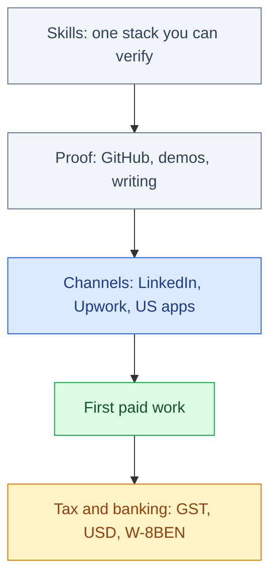

# How to Get a Remote Software Job from India

Applying to 200 listings is not a strategy. From India, a remote software job is a funnel: a stack you can defend, public proof, a channel that actually pays, then tax and banking so the first invoice does not bounce. This is a playbook for that funnel — not a claim that anyone can place you, and not a count of engineers allegedly shipped overseas.

The market is real. Product companies, GCCs, and USD contractors hire Indian software engineers every week. The failure mode is mixing employee, contractor, and “US W-2 remote” into one PDF, then wondering why US-hour jobs ghost you.

## Table of contents

1. [The funnel, not the lottery](#funnel)
2. [Skills that convert](#skills)
3. [Proof: GitHub, demos, writing](#proof)
4. [LinkedIn: headline, proof, overlap](#linkedin)
5. [Upwork: profile, rate, first clients](#upwork)
6. [Applying to US companies](#us-companies)
7. [Typical rate bands](#rates)
8. [GST when it matters](#gst)
9. [USD repatriation](#usd)
10. [W-8BEN and US tax residency](#w8ben)
11. [You compete with people using agents](#ai)
12. [Red flags](#red-flags)
13. [FAQ](#faq)

## The funnel, not the lottery {#funnel}

Work the stages in order. Skipping proof and spraying applications is how you burn a month.

Pick a **primary channel** for 90 days. A GCC packet (resume, notice period, CTC) is the wrong artifact for an Upwork client who wants a two-week sprint. An Upwork profile at $18/hr fights a product-company application that asks for senior ownership.

## Skills that convert {#skills}

You do not need seven languages. You need one stack you can ship and explain: what broke last time, how you tested it, what you would not do again.

| Goal | Stack to show | What “done” looks like |
|------|---------------|------------------------|
| Backend / APIs | Python or Java + SQL + one cloud | A service with auth, tests, and a deploy |
| Frontend / product | JavaScript/TypeScript + one framework | A UI that talks to a real API |
| Data / ML adjacent | Python + a dataset you own | A notebook is not enough; ship an eval or a small app |
| Mobile | Kotlin/Swift or Flutter | Store build or TestFlight/Play internal track |

Language wars are a distraction. If you are choosing between Python, Java, and JavaScript for jobs, read [Python vs Java vs JavaScript](/blog/posts/python-vs-java-vs-javascript/). If the job is AI-adjacent, [Python vs Java with AI](/blog/posts/python-vs-java-with-ai/) is the shorter argument. Course shopping is optional; [best AI courses and skills](/blog/posts/best-ai-courses-and-skills-to-learn/) and [best AI/ML courses India vs US](/blog/posts/best-ai-ml-data-science-course-india-us/) are for people who already know they need a structured path — not a substitute for a public repo.

Depth beats a certificate wall. A hiring manager will open GitHub before they open your Coursera PDF.

## Proof: GitHub, demos, writing {#proof}

Proof is not “I know React.” Proof is an artifact a stranger can run in fifteen minutes.

**Minimum viable proof**

- One repo with a README that states the problem, how to run it, and what is *not* in scope.
- Tests you actually ran (even a small pytest/Jest suite).
- A live demo or a 3-minute screen recording. Screenshots of localhost are weak.
- Two or three PRs (yours or on someone else’s project) that show review comments, not just “initial commit.”

**What does not count as proof**

- Tutorial clones with the tutorial author’s comments left in.
- Private repos you “can share on request” with no demo.
- A résumé line that says “worked on microservices” with nothing to click.

Keep a `proof.md` or a pinned GitHub README that lists: problem, users, stack, tradeoffs, and a link to the demo. That document is what you paste into LinkedIn Featured, Upwork Portfolio, and the first email to a US hiring manager.

If a day job forbids public code, write about the *class* of problem without leaking employer IP: an incident pattern, a tiny open-source tool. Empty GitHub is still a choice.

## LinkedIn: headline, proof, overlap {#linkedin}

LinkedIn is the default inbound channel for software roles that look like jobs (Indian payroll, EOR, or “full-time contractor”). Treat the profile as a landing page, not a biography.

**Headline that a stranger can hire from**

Bad: `SDE-2 | Passionate developer | Open to work`

Better: `Backend engineer (Python, Postgres) · 4 yrs APIs · overlap 7–11 pm IST for US East`

The headline should answer: stack, seniority signal, and **when you are actually online**. US-hour overlap is a product constraint, not a personality trait. IST is UTC+5:30. US East morning is late evening India. US West is worse. UK/EU overlap is the afternoon. Put the hours you will keep in the headline or About — then keep them.

**About and Featured**

- First five lines: who you help, stack, one shipped outcome with a number you can defend (latency, cost, users — not “improved performance”).
- Featured: demo, GitHub, a short post that explains a production bug.
- Experience bullets: verb + system + constraint. “Owned payments webhooks under 200ms p95” beats “responsible for various modules.”

**Outbound:** a 6-line note. Name the company, one thing they shipped, your overlap hours, the demo. No 4 MB PDF. No “Dear Sir/Madam.”

**US-hour overlap, honestly**

| Client region | Overlap that usually works | What to offer | What not to promise |
|---------------|----------------------------|---------------|---------------------|
| UK / EU | ~1:30 pm–6:30 pm IST | Standups, pairing, same-day review | 11 pm IST every night forever |
| US East | ~6:30 pm–12:30 am IST for their day | Async-first plus 3–4 live hours | Full US office hours unless they pay for it |
| US West | Their 9 am is 9:30 pm IST | Written updates, recorded demos, 2–3 live hours | Pretending you are in California |

If sleep is part of the offer, prefer EU/UK or async-first US teams. All-night US hours belong in compensation, not in a guilt clause.

## Upwork: profile, rate, first clients {#upwork}

Upwork is a contractor channel. It is not a job board that owes you a salary. Use it when you want USD invoices and can tolerate proposal volume.

**Profile**

- Title = the job you want this quarter, not a list of every library.
- Overview: three short paragraphs — who you help, a before/after story from a real project (anonymize if needed), how you work (hours, tools, what you will not do).
- Portfolio: the same artifacts as GitHub, with a 30-second video if you can.
- Skills: five that match the jobs you will actually take. Twenty skills is a filter miss.

**Proposals**

Custom, short, specific. Quote a line from the job post. State the first milestone in two sentences. Link one relevant artifact. AI-generated proposals are obvious now; hiring managers skim for a sentence only a human who read the brief would write.

**First clients**

The first two or three paid jobs are for reviews and a working payout path, not for peak rate. Scope them small enough to finish. Over-deliver on communication: daily written update, even if the code is slow. After three JSS-safe jobs, raise the rate; do not wait for a “feeling.”

**Rate**

Do not copy $15/hr because a Twitter thread said Indian developers “should start low.” Work backwards from monthly in-hand INR after platform fees, TDS, forex, and tax. The full 44ADA / new-regime math lives in [How much should your Upwork hourly rate be in India?](/blog/posts/upwork-hourly-rate-india-new-tax-regime/) — use that calculator instead of inventing a USD number and hoping GST and slabs work out. Bands below are planning ranges, not quotes.

## Applying to US companies {#us-companies}

“Remote US job from India” usually means one of: Indian entity / GCC, employer of record (Deel, Remote, Indian PEO), or contractor. Direct US W-2 from Pune is the wrong mental model. Postings that say “must be authorized to work in the US” are not puzzles; they mean you will be rejected.

**Timezone and async**

Sell a defined overlap window plus artifacts: written design notes, recorded demos, tickets that a US teammate can pick up at 9 am their time. If the job requires 9–5 Pacific on camera five days a week, either the pay includes that pain or you should pass.

**Portfolio packet for US apps**

- One-page résumé (PDF), no photo, no marital status, no “objective.”
- Links: GitHub, live demo, LinkedIn.
- A 4-bullet “how I work async” block: standup time, response SLA, how you hand off at 1 am IST.

**Interviews**

US software loops are often: recruiter screen, hiring-manager chat, coding (LeetCode-style or a take-home), system design, values. From India, two extra failure modes show up:

1. **Audio and scheduling.** Confirm the overlap. Use a wired connection. Have a backup phone hotspot. Do not take a system-design round on 4G in a moving cab.
2. **Take-homes that are unpaid labour.** Timebox them. A 4-hour scoped sample is normal. A “build our product for free this weekend” is a [red flag](#red-flags).

For coding rounds, say out loud what you are checking. Interviewers hire the verification habit — the same one you need when an agent writes the first draft.

## Typical rate bands {#rates}

These are **order-of-magnitude bands** for software work sold from India, not a promise and not a substitute for the tax calculator.

| Shape | Typical band | What has to be true |
|-------|--------------|---------------------|
| Upwork, first paid jobs | $20–40 / hr | Thin reviews; small scope |
| Upwork, proven profile | $45–85 / hr | Specialists (RAG, mobile, infra) can sit higher |
| Direct US contractor | $50–120 / hr | You invoice; you own GST and payouts |
| EOR / “full-time remote” | ~$40k–90k USD / year common for mid | Senior bands exist; they are not the median |
| Indian GCC / product co. | CTC in INR | Notice period, PF, appraisal cycle |

$50/hr on Upwork is **not** ₹4 lakh/month in your bank. Fees, forex, and income tax sit in the middle. For the fee chain, Section 44ADA presumptive 50%, new-regime slabs, and reverse rates for in-hand targets, use [the Upwork hourly rate guide](/blog/posts/upwork-hourly-rate-india-new-tax-regime/). Add a 10–15% buffer for dry months and FX drift before you quote.

Full-time employee offers: convert to **monthly in-hand INR**, not CTC. Contractors: convert to **hours you will actually bill**, not 40 × 52.

## GST when it matters {#gst}

Two different GST problems get mixed up:

1. **GST Upwork charges on their platform fee** (and whether adding a GSTIN stops that deduction).
2. **GST on your export of services** as a freelancer once you are in the GST system.

You do not need a GST treatise on day one of a $400 job. You do need to know when registration starts to matter, and that export of services has conditions. Walkthrough: [Stop Upwork GST deduction (India)](/blog/posts/stop-upwork-gst-deduction-india-gst-registration/). Confirm with a CA. This is not tax advice.

## USD repatriation {#usd}

The USD that leaves the client is not the INR that hits your Indian account. Upwork’s default conversion is rarely the best rate. A common pattern that already worked for many Indian freelancers: free ACH from Upwork into a US virtual account, then convert with a forex app that publishes a transparent spread.

Compare options in [Best USD exchange rate from Upwork (India)](/blog/posts/stop-upwork-usd-best-exchange-rate-india/). Set this up **before** the first large invoice, not the week you need rent. Keep FIRC / SWIFT evidence your CA asked for last year; payout apps change labels, the need for a paper trail does not.

## W-8BEN and US tax residency {#w8ben}

US companies and platforms often ask foreign contractors for **Form W-8BEN**. At a high level, that form is how you tell a US payer you are **not a US person**, so they generally do not treat you like a US taxpayer for backup withholding. Filling it does **not** make you a US tax resident, and it is **not** a US work visa.

Working from Bengaluru on a laptop does not create US tax residency. US residency is a separate set of tests (typically green card or substantial presence — days physically in the US). Remote work from India is not “I am now taxed like a Californian.”

What you *do* have: Indian tax on your professional income, plus whatever your CA says about GST and foreign remittance paperwork. Treaty claims, PE risk if you travel, and dual-status years if you actually spend months in the US are specialist topics. Do not copy a YouTube “just put N/A on line 9” script.

**This is not legal or tax advice.** Use a CA (and a cross-border advisor if a US company is putting you on an EOR). The only operational point here: when a US client sends a W-8BEN, it is usually onboarding, not a trick to make you a US resident. Read the current IRS instructions; forms change.

## You compete with people using agents {#ai}

Everyone in the funnel is using ChatGPT, Claude, Cursor, or Copilot. Clients see AI-smoothed proposals. Take-homes arrive half-written by an agent. That does not make the job disappear. It raises the floor of mediocre work and makes **verification** the scarce skill.

What to show instead of “I use AI”:

- You can read a diff and say what is wrong.
- You can write a failing test before you accept the patch.
- You can explain a production constraint the model cannot see (PII, on-call, the one table you must not lock).
- You can refuse a hallucinated API and cite the real one.

The longer argument is in [Will AI take coding jobs?](/blog/posts/will-ai-take-coding-jobs/) and [Will AI replace software engineers?](/blog/posts/will-ai-replace-software-engineers/). For which tool to actually buy, use [Best AI for coding](/blog/posts/best-ai-for-coding/). Agents without evals are a liability — the same reason [prompt engineering vs AI agents](/blog/posts/prompt-engineering-vs-ai-agents/) is a career question, not a Twitter poll.

A 90-second demo of you driving an agent **and then catching its bug** is stronger proof than a certificate in “prompt engineering.”

## Red flags {#red-flags}

| Signal | Why it is bad | What to do |
|--------|---------------|------------|
| “Training fee,” “registration fee,” “laptop deposit” to start | Classic extraction | Walk. Real employers pay you. |
| Crypto-only salary, gift cards, or “we’ll PayPal after you buy software” | Payment scam | Walk. |
| Unpaid “trial project” that is their actual backlog | Free labour | Timebox a sample or decline. |
| Job posted by a person with no company page, asking for Aadhaar + PAN + passport in the first DM | Identity harvest | Company email or a known ATS first. |
| “US W-2, must relocate in 30 days, we handle visa, pay us” | Visa mill | Walk. |
| Telegram interview only, no calendar link, no entity name | Often fake | Ask for the legal entity and a Zoom from a company domain. |
| Rate far above market with urgency and a vague product | Money-mule / fake check patterns exist | Slow down; verify the company. |

If it feels like a rush and they want your documents or money before a signed contract, it is not a software job.

## FAQ {#faq}

### Can I get a remote software job in the US from India without moving?

Yes, as an employee of an Indian entity, through an EOR, or as a contractor. Direct US W-2 from India is the wrong default. Skip postings that require US work authorization unless you have it.

### Should I start on LinkedIn or Upwork?

Match the shape. If you want a job-shaped role (payroll, EOR, product company), LinkedIn first. If you want USD invoices and can write proposals, Upwork. Running both with the same generic résumé wastes a month.

### What hourly rate should I put on Upwork?

Not $15 because a thread said so, and not $150 as a junior with no reviews. Work backwards from in-hand INR: [Upwork hourly rate in India](/blog/posts/upwork-hourly-rate-india-new-tax-regime/).

### Do I need GST registration before my first client?

Not always. You do need to know when Upwork’s GST on *their* fees and GST on *your* exports kick in. Read [Stop Upwork GST deduction](/blog/posts/stop-upwork-gst-deduction-india-gst-registration/) and confirm with a CA.

### Does a W-8BEN mean I pay US tax?

Usually it means the US payer is documenting that you are a foreign person. It does not by itself make you a US tax resident. You still have Indian tax. This is not legal advice.

### How do I survive US time zones?

Sell a defined evening-IST overlap plus async artifacts. Prefer EU/UK if sleep is non-negotiable. All-night Pacific hours belong in the offer, not in unpaid goodwill.

### Will AI make this plan pointless?

It raises the quality bar and automates some junior implementation. Teams still hire people who own outcomes, communicate async, and verify machine output. See [Will AI take coding jobs?](/blog/posts/will-ai-take-coding-jobs/).

### What are the common scams?

Training fees, crypto salary, unpaid real work, Aadhaar harvests, and offers with no legal entity. See [Red flags](#red-flags).

## Related guides

- [How Much Should Your Upwork Hourly Rate Be in India?](/blog/posts/upwork-hourly-rate-india-new-tax-regime/)
- [Stop Upwork GST Deduction (India)](/blog/posts/stop-upwork-gst-deduction-india-gst-registration/)
- [Best USD Exchange Rate from Upwork (India)](/blog/posts/stop-upwork-usd-best-exchange-rate-india/)
- [Will AI Take Coding Jobs?](/blog/posts/will-ai-take-coding-jobs/)
- [Will AI Replace Software Engineers?](/blog/posts/will-ai-replace-software-engineers/)
- [Python vs Java vs JavaScript](/blog/posts/python-vs-java-vs-javascript/)
- [Best AI for Coding](/blog/posts/best-ai-for-coding/)
- [Best AI/ML Data Science Course: India vs US](/blog/posts/best-ai-ml-data-science-course-india-us/)

Remote software work from India is proof, then a channel, then paperwork. Pick one stack, ship one artifact, and run a funnel you can measure — not a two-hundredth listing.
