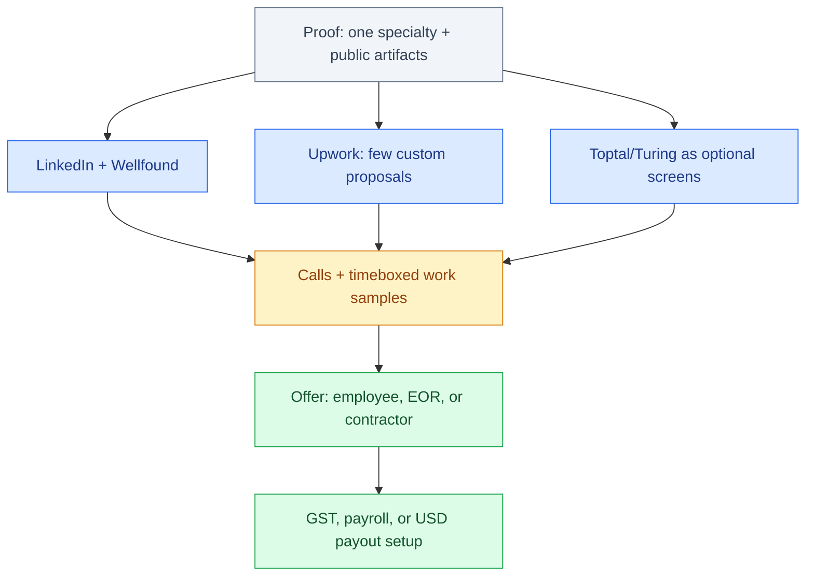

# How to Get a Remote Tech Job from India

Remote tech work from India is not a lottery ticket and not a scam mill. It is a funnel: proof of skill, a channel that actually pays, a contract shape Indian tax law understands, and enough async English to survive Slack at 9:30 pm IST. This is a playbook for that funnel — not a claim that anyone can “place” you, and not a count of engineers we allegedly shipped overseas.

The market is real. Captive GCCs, product companies hiring through an employer of record, and freelance contractors on USD invoices all hire Indians every week. The failure mode is mixing those three shapes up, then applying to all of them with the same PDF.

## Table of contents

1. [Three shapes of “remote,” not one](#shapes)
2. [Time zones are a product constraint](#timezones)
3. [A portfolio that converts](#portfolio)
4. [LinkedIn that a stranger can hire from](#linkedin)
5. [Wellfound and the startup path](#wellfound)
6. [Turing and Toptal without the hype](#networks)
7. [Upwork as a channel, not a slot machine](#upwork)
8. [Rates, GST, and USD](#money)
9. [Interviews from India](#interviews)
10. [English and async communication](#async)
11. [AI tools as leverage, not a substitute](#ai)
12. [Red flags](#red-flags)
13. [A 90-day plan](#ninety)
14. [The funnel](#funnel)
15. [FAQ](#faq)

## Three shapes of “remote,” not one {#shapes}

US “W-2 remote” almost never means a US company putting you on US payroll from Pune. US W-2 is for people with US work authorization. From India you usually land in one of these:

| Shape | Who pays you | How it feels | Tax / compliance | Stability | Typical door |
|-------|--------------|--------------|------------------|-----------|--------------|
| **Indian employer / GCC** | Indian payroll in INR | Job, PF, laptop, office optional or hybrid | TDS, labour law | Highest | Referrals, Naukri, LinkedIn, campus |
| **EOR / “full-time remote”** | Employer of record (Deel, Remote, an Indian PEO) in INR or USD | Looks like a job, client is abroad | Employee-like; EOR handles withholding | Medium–high | Wellfound, LinkedIn, agencies |
| **Contractor / freelance** | Client USD (Upwork, Wise, direct) | You are the company | Presumptive tax, GST on exports, invoices | Variable | Upwork, network, outbound |
| **Indian product company, remote-first** | Indian payroll | Startup or product org | Employee | High variance | Wellfound, Twitter, referrals |

Pick a **primary** shape for the next 90 days. A GCC application packet (resume + Notice Period + CTC) is the wrong artifact for an Upwork client who wants a two-week sprint. A Upwork profile with “open to $15/hr” fights a Wellfound application that asks for $80k equivalent.

Contractors: you will deal with GST, FIRA, and forex whether you like it or not. Employees: you will deal with notice periods and joining dates. Do not fight the paperwork of the shape you chose.

## Time zones are a product constraint {#timezones}

IST is UTC+5:30. That is not a personality trait. It is coverage.

| Client region | Overlap that actually works | What to offer | What not to promise |
|---------------|-----------------------------|---------------|---------------------|
| **UK / EU** | ~1:30 pm–6:30 pm IST (and later if you want) | Standups, pairing, same-day review | “I’ll be on at 11 pm IST every day forever” |
| **US East** | Late evening IST (roughly 6:30 pm–12:30 am for their morning/afternoon) | Async-first plus 3–4 scheduled hours | Full US office hours five days a week unless they pay for it |
| **US West** | Worse; their 9 am is 9:30 pm IST | Written updates, recorded demos, 2–3 live hours | Pretending you are in California |
| **APAC / Middle East / Africa** | Often excellent | Live collaboration | Ignoring them because US jobs pay more on paper |

EU/UK remote is underrated from India: the overlap is humane, English is the working language, and you still get paid in a hard currency. US roles pay more on average and cost more in sleep.

Write your overlap in the first screen, not in round four. “Available 2 pm–11 pm IST for live work; remaining hours async” is a product spec. “Flexible with time zones” is a shrug.

## A portfolio that converts {#portfolio}

Hiring managers do not need your CGPA. They need evidence you can own a slice of a system.

**Ship three artifacts, not thirty tutorials:**

1. **A production-shaped project** — auth, data, a deploy, a README that states tradeoffs. A Flutter+Firebase app or a small RAG chatbot is enough if it is *finished*. Half-finished course clones are noise.
2. **A writing sample** — a post-mortem, an architecture note, or a public guide that sounds like you. This is how async teams audition communication.
3. **A before/after** — a PR, a performance chart, a migration. Screenshots of Figma are not a backend portfolio.

Host it. GitHub Pages, a custom domain, or a tight README with a live URL. If the demo is “run locally,” include a 60-second screen recording.

**What to cut:** 40 Udemy certificates as the hero. “Familiar with 18 languages.” Unrelated college projects above the fold.

AI-generated portfolios that you cannot explain in a call will fail the call. See [AI as leverage](#ai).

## LinkedIn that a stranger can hire from {#linkedin}

Treat LinkedIn as a landing page, not a diary.

- **Headline:** role + domain + location reality. `Backend (Python/RAG) · Remote from India · IST overlap for EU/US East` beats `SDE | Passionate | Open to work`.
- **About:** 8–12 lines. What you ship, stack, time zone, employment shape you want (employee vs contractor).
- **Featured:** the three artifacts above, not a selfie with a conference lanyard.
- **Open to work:** use it, but set the job types honestly (remote, contract, full-time).
- **Outbound:** 5–10 tailored notes a week to hiring managers or founders *after* you have a URL to send. “I’d like to join your journey” without a repo is spam.

Do not scrape and mass-message. Recruiters block patterns. A short note that quotes *their* job post and points to *one* relevant artifact is the whole strategy.

Indian GCC recruiters still live here. US startup hiring managers still live here. The same profile can serve both if the About section names both shapes and you send different notes.

## Wellfound and the startup path {#wellfound}

[Wellfound](https://wellfound.com/) (formerly AngelList Talent) is where product startups post equity-heavy roles. Reality:

- Many listings want **US time zone or US work authorization**. Read the location line. Apply only when remote-India is explicit or the founder has hired internationally.
- Compensation is often **salary + equity** with a salary below FAANG GCC. Model total compensation honestly.
- Reply speed matters. Startups ghost. Follow up once in five days with a tighter artifact, then move on.
- A crisp Wellfound profile (same three artifacts) beats a 4-page resume PDF.

Wellfound is a **channel**, not a personality. If you want stability and PF, spend more time on GCC/LinkedIn. If you want product work and can tolerate variance, give it a real 30 days in the [90-day plan](#ninety).

## Turing and Toptal without the hype {#networks}

These firms sell access to foreign clients. They are not magic, and they are not scams by default. They are **filters with a take**.

**Toptal.** Long, selective screening. Most people do not pass. If you do, rates and clients are often stronger than commodity platforms. Do **not** build a 90-day plan that assumes you will pass. Take the tests if you have spare evenings. Keep applying elsewhere the same week.

**Turing and similar “AI-matched talent” networks.** Higher volume, more standardized tests, more mixed outcomes. Some engineers get solid full-time remote seats. Others report lower-than-market rates, slow matching, or work that looks like staffing. Read the contract: non-compete, IP, moonlighting, notice, who is the legal employer.

**Staffing / “partner” firms on LinkedIn.** Some are real GCCs. Some are body shops that want your resume to shop to clients without a role. Ask: who is the employer of record, where is the laptop from, and can you speak to the actual hiring manager before resigning.

If a network demands an **unpaid multi-day build that looks like client work**, that is a [red flag](#red-flags), not a privilege.

## Upwork as a channel, not a slot machine {#upwork}

Upwork works from India when you treat it like outbound sales with a public reputation system. It fails when you burn Connects on generic cover letters.

**Profile.** One specialty on the hero (e.g. “RAG chatbots in Python” or “Flutter + Firebase”), not “full stack + ML + web3.” A video is optional; a case study with numbers is not. Rate: see [the hourly-rate guide](/blog/posts/upwork-hourly-rate-india-new-tax-regime/) before you pick a vanity number.

**Proposals.** Five good ones beat forty templates. Structure:

```
Opening line that names their exact problem (not “I read your job post carefully”).
2–4 sentences of proof: similar artifact + constraint you already solved.
A proposed first slice (scope, time, what “done” looks like).
One clarifying question that shows you read the brief.
Availability window in IST and overlap.
```

**Do not:** paste ChatGPT’s “Dear Hiring Manager, I am a passionate developer.” Clients can smell it. Do not bid $8/hr to “get the review” if you cannot live on it — you will attract the clients who want $8/hr forever.

**Do:** answer invites with the same structure, decline bad fits in one polite sentence, and keep a swipe file of *your* wins.

Connects are a budget line. Track cost per interview, not proposals sent.

## Rates, GST, and USD {#money}

Headline USD is not in-hand INR. Before you quote:

1. **Rate math** after platform fee, tax, and a realistic utilization — not 40 billable hours as a fantasy. Walk through [How much should your Upwork hourly rate be in India?](/blog/posts/upwork-hourly-rate-india-new-tax-regime/).
2. **GST on Upwork’s fee** vs GST on *your* export invoice. They are different. If Upwork is collecting GST on its commission, read [Stop Upwork GST deduction](/blog/posts/stop-upwork-gst-deduction-india-gst-registration/) and talk to a CA about whether you need a GSTIN.
3. **How USD becomes INR.** Direct-to-Indian-bank conversions are often the expensive path. Compare [USD exchange options from Upwork](/blog/posts/stop-upwork-usd-best-exchange-rate-india/). Keep FIRA for export records.

Employees on Indian payroll can skip most of this and still should know it, because the first “side freelance” invoice is how people accidentally create a GST problem.

None of this is tax advice. Rules move. A CA who files for freelancers is cheaper than a notice.

## Interviews from India {#interviews}

Expect the same loops as everyone else, plus logistics.

- **Home setup.** Quiet room, wired connection if you can, camera at eye level, timezone on the calendar invite (IST *and* their zone).
- **DSA vs practical.** GCCs still run LeetCode-style screens. Startups and freelance clients often want a take-home or a live debug. Practice both; do not only grind 500 problems.
- **Take-homes.** Bound them. A 3-hour exercise is a screen. A 3-day unpaid product is a [red flag](#red-flags). Ask: “Is this evaluated as a work sample, and what’s the timebox?”
- **System design.** Remote teams hire for communication. Talk through tradeoffs out loud. Silence on Zoom reads as absence.
- **Notice period.** Indian 30–90 day notices surprise US startups. Say it in the first call. If you can buy out or split time, say how.
- **Salary / rate.** Know CTC vs in-hand vs USD hourly. Do not convert with a fantasy 40-hour week and 0% tax.

Record (with permission) or write notes immediately. Remote hiring is slow; your follow-up mail is part of the interview.

## English and async communication {#async}

This is the unglamorous hiring criterion. Foreign teams are buying **reduced coordination cost**.

- Write in short paragraphs. Lead with the decision, then the context.
- In Slack, do not send six fragments. Send one message with links.
- On calls, let people finish. Confirm the action item in chat after.
- Accent is not the problem. **Unintelligible audio and rambling** are. A $1,000 mic is optional; a quiet room and slower speech are not.
- Over-explain dates: `2026-10-02, 18:00 IST / 08:30 EDT`.
- If you use AI to draft, rewrite until it sounds like you. Teams now treat generic LLM English as a smell, same as a generic Upwork proposal.

You do not need IELTS theatre. You need to be the person whose standup update a New York manager can forward without editing.

## AI tools as leverage, not a substitute {#ai}

Use models to draft tests, explore APIs, and tighten writing. Do not use them as the portfolio or the interview.

Hiring is tightening around **people who can verify machine output**. That is the same squeeze described in [Will AI take coding jobs?](/blog/posts/will-ai-take-coding-jobs/). A candidate who pastes a hallucinated design doc will fail a senior interviewer in ten minutes.

Practical rules:

- Disclose when a take-home allowed AI; be ready to change a function on the call without the chat window.
- Keep a stack you can defend (see [Best AI courses and skills to learn](/blog/posts/best-ai-courses-and-skills-to-learn/) if you are still choosing).
- Never send a proposal or architecture note you have not read.

AI makes the **floor** of applications look better. That means your **specific proof** has to work harder.

## Red flags {#red-flags}

Walk away, or at least slow down:

| Signal | Why it is a problem |
|--------|---------------------|
| Unpaid “trial” that is clearly client work | You are the vendor, unpaid |
| “Pay for training / laptop / visa processing” | Classic extractive pattern |
| Salary in tokens or “we’ll figure crypto later” | Compensation you cannot eat |
| Hiring only on Telegram/WhatsApp, no company domain | Easy impersonation |
| No video call ever, even after an offer | You may not know who hired you |
| Offer letter with no legal entity, no EOR, no GST invoice path | You cannot cash it cleanly |
| “We’ll hire 20 people this week, send Aadhaar now” | Data harvest |
| Rate far above market for juniors with no screen | Advance-fee and fake-check variants exist |
| Client wants full source before a contract | IP theft |

Legitimate remote hiring is slightly annoying (calendars, HRIS, I-9 equivalents for EOR, NDAs). It is not *secretive*.

## A 90-day plan {#ninety}

Assume you already have a job or college in parallel. This is 8–12 focused hours a week, not a full-time second job.

### Days 1–30 — positioning

- Choose **one** primary shape: GCC/employee, EOR remote, or contractor.
- Choose **one** specialty sentence.
- Ship or finish **one** public artifact with a live URL.
- Rewrite LinkedIn headline + About. Add Featured.
- If contractor-track: read the GST and USD posts; talk to a CA if you will invoice.
- Apply to 8–12 *fitting* roles. Quality bar: you can point to an artifact in the note.

### Days 31–60 — volume with a filter

- Add artifact two (writing or before/after).
- LinkedIn: 5 tailored outreaches a week.
- If contractor: Upwork profile live, 5 custom proposals a week, zero templates.
- Wellfound: only roles that allow India or international contractors.
- Optional: one Toptal/Turing screen, never as the only pipeline.
- Weekly review: applications, replies, interviews, Connects spent. Kill channels with zero replies after 15 honest shots.

### Days 61–90 — convert

- Interviews: timeboxed take-homes, written follow-ups.
- Rate/CTC sheet: walk-away number in INR in-hand.
- If an offer: entity, equipment, time zone, moonlighting, IP — in writing.
- If no offer: do not “learn 4 more frameworks.” Improve the artifact that came closest and repeat days 31–60.

After day 90, either you have a live pipeline (regular conversations) or you need a sharper specialty, not a fifth job board.

## The funnel {#funnel}



Everything above the calls is **proof and matching**. Everything below is **paperwork you should not improvise after you resign**.

## FAQ {#faq}

### Can I get a US remote job from India without moving?

Yes, as an employee of an Indian entity, through an EOR, or as a contractor. Direct US W-2 is the wrong mental model. The job posts that say “must be authorized to work in the US” are not puzzles; they mean you will be rejected.

### Upwork vs LinkedIn vs Wellfound — which first?

Match the [shape](#shapes). GCC/employee: LinkedIn first. Product startup: Wellfound + LinkedIn. Contractor: Upwork plus network. Running all three with the same generic resume wastes a month.

### Do I need GST registration to freelance?

Not always on day one, but Upwork GST on *their* fees and GST on *your* exports are easy to mix up. Read [Stop Upwork GST deduction](/blog/posts/stop-upwork-gst-deduction-india-gst-registration/) and confirm with a CA. This article is not tax advice.

### What hourly rate should I start at on Upwork?

Not $15 because Twitter said so, and not $150 as a junior. Work backwards from in-hand INR after fees and tax: [Upwork hourly rate in India](/blog/posts/upwork-hourly-rate-india-new-tax-regime/).

### Are Turing and Toptal worth the screening time?

Toptal: high effort, low pass rate, sometimes high payoff — never your only plan. Turing-like networks: try one round if the contract is readable; keep a parallel pipeline. Neither replaces a portfolio.

### Will AI make this plan pointless?

It raises the floor of mediocre applications and automates some junior implementation. Teams still hire people who own outcomes and communicate async. Treat models as tools; see [Will AI take coding jobs?](/blog/posts/will-ai-take-coding-jobs/).

### How do I survive US time zones?

Sell a defined overlap (evening IST) plus async artifacts. Prefer EU/UK if sleep is part of the offer. All-night US hours belong in the compensation, not in a guilt clause.

### What are the common scams?

Unpaid real work, crypto salary, pay-for-visa/training, Aadhaar harvests, and offers with no legal entity. See [Red flags](#red-flags).

## Related guides

- [How Much Should Your Upwork Hourly Rate Be in India?](/blog/posts/upwork-hourly-rate-india-new-tax-regime/)
- [Stop Upwork GST Deduction (India)](/blog/posts/stop-upwork-gst-deduction-india-gst-registration/)
- [Best USD Exchange Rate from Upwork (India)](/blog/posts/stop-upwork-usd-best-exchange-rate-india/)
- [Will AI Take Coding Jobs?](/blog/posts/will-ai-take-coding-jobs/)
- [Best AI Courses and Skills to Learn](/blog/posts/best-ai-courses-and-skills-to-learn/)
