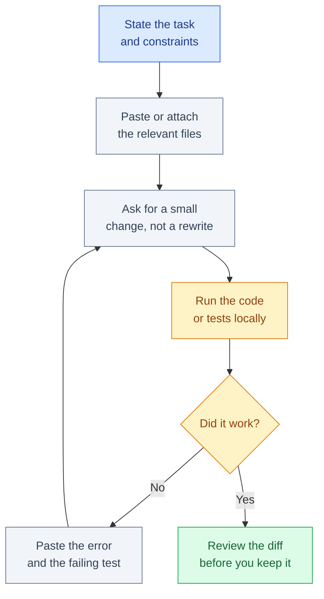

# How to Use ChatGPT and Gemini for Coding

September 2026 · Published by Amar Kumar

ChatGPT and Gemini will write a function that looks finished. Then you paste it into your file, run it, and the traceback points at a line the model invented. The gap is not “you need a better model.” It is that a chat box is a rubber duck with a keyboard — useful if you give it the right slice of code, useless if you treat it like an IDE that already knows your repo.

This is a beginner how-to for people who want to **write, debug, and test code in ChatGPT or Gemini**, not a tour of coding agents. You will create an account, send a first coding prompt, learn when to paste versus attach files, run a debug loop, write tests, and review diffs before you keep anything. You will also learn what **not** to paste, when ChatGPT is the better chat, when Gemini is, and when it is time to graduate to Cursor or Claude Code.

Free tiers exist. They hit usage caps fast once you start pasting whole files. That is expected. Start free, then pay only if the cap interrupts real work. List prices and student offers move; check the vendor page before you subscribe.

## Table of contents

1. [What a chat coder actually is](#what-it-is)
2. [Create an account](#accounts)
3. [Your first coding prompt](#first-prompt)
4. [Paste versus attach files](#paste-vs-attach)
5. [The beginner coding loop](#loop)
6. [Debug until the test fails for a real reason](#debug)
7. [Ask it to write tests](#tests)
8. [Review the diff before you keep it](#diffs)
9. [Copy-paste prompt recipes](#recipes)
10. [ChatGPT versus Gemini for coding](#chatgpt-vs-gemini)
11. [What not to do](#dont)
12. [When to graduate to Cursor or Claude Code](#graduate)
13. [FAQ](#faq)

## What a chat coder actually is {#what-it-is}

ChatGPT (OpenAI) and Gemini (Google) are **chat products**. You type, they reply with text. They can explain a traceback, draft a function, sketch a SQL query, or walk through a regex. They cannot see your unsaved buffer, run your test suite, or know which branch you are on unless you tell them.

That is the whole skill: **you are the file system and the terminal**. You copy the relevant code in, copy a suggestion out, run it locally, and send back what broke.

Do not start with Custom GPTs, Gems, Canvas, or Codex. Those are useful later. First, get a tight loop: small prompt → small change → run locally → paste the error.

If you want a product-level comparison of the three big assistants, read [ChatGPT vs Gemini vs Claude](/blog/posts/chatgpt-vs-gemini-vs-claude/). If you already know you will pay, the subscription comparison is [ChatGPT Plus vs Gemini Advanced vs Claude Pro](/blog/posts/chatgpt-plus-vs-gemini-advanced-vs-claude-pro/). This page is the keyboard-level how-to.

## Create an account {#accounts}

You need two things: a browser, and an email you control. Phone OTP is common. Use a personal email for homework and side projects. Use a work email only if your employer already has a policy for these tools.

### ChatGPT

1. Open [chatgpt.com](https://chatgpt.com) and sign up with Google, Apple, or email.
2. Complete the phone check if asked.
3. Stay on **Free** until you know you will use it daily.
4. Later, Plus is about **$20/month** and is the usual paid seat: expanded GPT-5.6, deep research, Custom GPTs, and Codex usage inside ChatGPT. Some markets (including India) have offered **ChatGPT Go** around **$8/month**. **ChatGPT Pro** is about **$200/month** — skip it until Plus is clearly not enough.

### Gemini

1. Open [gemini.google.com](https://gemini.google.com) while signed into a Google account.
2. If you already use Gmail, you already have an account. Gemini lives next to Docs, Drive, and Colab.
3. Free Gemini is enough to try coding prompts. Paid is **Google AI Pro** at **$19.99/month** (people still search **Gemini Advanced** — that was the old name). It typically includes Gemini 3.1 Pro, Deep Research, roughly **1M tokens** of context, Gemini in Gmail/Docs, and a large **Google One** storage allotment (about **5TB** on Pro). **Ultra** starts around **$99.99/month**.

### India and students

USD subscriptions billed to an Indian card usually convert to **INR plus GST** on digital services. The number on the checkout page is the one that matters, not a blog’s rupee guess.

Students: GitHub **Copilot Student**, **Gemini for Education**, and occasional ChatGPT or Claude student programs exist in some regions and years. **Check current student offers** on the vendor site rather than assuming a discount still applies.

Do not create a second Google account “just for Gemini” if your school or office already gave you Workspace. You will spend the next month moving files.

## Your first coding prompt {#first-prompt}

A good first prompt has four parts: language, goal, constraints, and the code you already have (even if it is empty).

Bad:

```text
write a python login page
```

Better:

```text
I am learning Python 3. I need a function `is_valid_email(s: str) -> bool`
that returns True only for simple emails like name@domain.tld.
Do not use a third-party library. Include 4 pytest examples.
Explain the regex in comments. Keep it under 40 lines.
```

Then run whatever it gives you. If you do not have pytest yet:

```bash
python3 -m pip install pytest
pytest test_email.py -q
```

The first prompt is a **contract**. “Write an app” is not a contract. “Write this function, in this language, with these tests, without this dependency” is.

## Paste versus attach files {#paste-vs-attach}

| Situation | Do this | Why |
|-----------|---------|-----|
| One function, one traceback | Paste into the chat | The model sees exactly the slice that failed |
| A 200-line file | Attach the file, then say which function | Less copy-paste error; still tell it where to look |
| A whole repo | Do not dump it into chat | You will hit context and privacy walls; use an IDE agent later |
| Screenshots of errors | Paste the text of the traceback | OCR misses line numbers; text search works |
| Jupyter / Colab | Gemini + Google ecosystem, or paste cells | Gemini sits closer to Drive and Colab-style notebooks |
| Secrets in `.env` | Never attach the file | Redact or use dummy values |

ChatGPT: paste is the default. Attachments work for source files, logs, and screenshots. **Canvas** is useful when you want to iterate on one artifact (a function, a short script) without drowning in chat history. **Custom GPTs** help once you repeat the same instructions (style, stack, “always write pytest”). **Codex in ChatGPT** is the in-product coding agent — treat it as a later step, not day one.

Gemini: attach files or fold them into **Canvas / apps** when Google offers that surface. **Gems** are the Gemini analogue of Custom GPTs — saved instructions. The headline advantage is **long context** (on the order of **1M tokens** on paid Gemini): whole files and long logs fit when ChatGPT’s window feels tight. If your homework already lives in Google Docs or Colab, stay in Gemini so you are not exporting every five minutes.

Rule of thumb: **paste the smallest thing that still reproduces the bug**. Attach when the file is the unit. Do not attach `node_modules`, build folders, or anything with credentials.

## The beginner coding loop {#loop}

This is the whole method. Skip a step and you will “feel productive” while shipping code that never ran.



Stay in one chat thread for one bug. New thread = the model forgets the last traceback. When the thread gets long and the model starts contradicting itself, start a new chat and paste only: the current file, the failing test, and the last error.

## Debug until the test fails for a real reason {#debug}

Debugging in chat is a loop, not a wish.

1. Run the code. Copy the **full traceback**, not the last line.
2. Paste the function that threw, plus three lines of calling code.
3. Ask: “What is the most likely cause? Propose a one-function fix. Do not rewrite the file.”
4. Apply the fix locally. Run again.
5. If it still fails, paste the **new** traceback. Do not say “it still doesn’t work.”

Example of a useful debug paste:

```text
Python 3.12. File: invoice.py. I only want a fix for format_inr().

def format_inr(paise: int) -> str:
    rupees = paise / 100
    return f"₹{rupees:.2f}"

I called format_inr("19900") and got:

TypeError: unsupported operand type(s) for /: 'str' and 'int'
  File "invoice.py", line 12, in format_inr
    rupees = paise / 100

Do not add a money library. Add a clear error if paise is not int.
```

The model will often guess the type error immediately. Your job is to **refuse extra architecture**. If it suggests a whole `Money` class for a student script, say no.

When the model starts “fixing” unrelated functions, stop and paste a smaller slice. Chat models over-help. That is the usual failure mode, not “too dumb.”

## Ask it to write tests {#tests}

Tests are the cheapest way to keep the model honest. Ask for tests **before** you ask for a rewrite.

```text
Here is `slugify` (paste). Write pytest tests for:
- empty string
- spaces and punctuation
- Unicode (Hindi or accented Latin)
- a name that is already a slug
Do not change slugify unless a test proves a bug.
Return only the test file.
```

Then run:

```bash
pytest test_slugify.py -q
```

If a test fails, you have a conversation with evidence. If all tests pass and you still do not trust the function, add one example from *your* homework spec — not from the model’s imagination.

ChatGPT is usually fine for pytest and Jest. Gemini is often convenient when the notebook already runs in Colab and you want assertions next to cells. Neither replaces reading the test. Models write tests that assert their own bugs.

## Review the diff before you keep it {#diffs}

Chat will happily replace a 80-line file with a 200-line “cleaner” version. That is how you lose working code.

Ask for a **diff-shaped** answer:

```text
Show only a unified diff for auth.py. Do not reprint the whole file.
Keep my logging. Do not add new dependencies.
```

Then, in your editor, look at the change like a code review:

- Did it rename things you did not ask to rename?
- Did it swallow exceptions?
- Did it hard-code an API key, URL, or password “for convenience”?
- Did it change behavior your tests do not cover?

If you cannot read the diff, you cannot ship the diff. Using ChatGPT or Gemini for coding does not skip learning the language. It skips typing boilerplate. The review is the job.

## Copy-paste prompt recipes {#recipes}

Reuse these. Swap the language and the names. Keep the constraints.

### Debug

```text
Language: {python|javascript|java}.
Goal: fix the failure, smallest change.
Here is the function:
{paste}

Here is the exact error:
{paste traceback}

Here is how I called it:
{paste}

Rules: do not rewrite unrelated code. do not add dependencies.
Explain the cause in two sentences, then show the patched function.
```

### Explain

```text
Explain this code as if I am a beginner who knows variables and loops
but not this library. Walk through it top to bottom. Flag anything
that looks like a bug or a security issue. Do not rewrite it unless
I ask.

{paste}
```

### Refactor

```text
Refactor only for readability. Same behavior. Same function names.
No new files. No new packages. Keep comments that explain "why".
Show a unified diff, not the whole file.

{paste}
```

### Write tests

```text
Write {pytest|jest} tests for the code below.
Cover: happy path, empty input, the error case in the docstring.
Do not mock the filesystem unless the code touches disk.
Return only the test file.

{paste}
```

### “Whole file, but carefully” (Gemini long context)

```text
I am attaching {filename}. Use the full file as context.
Task: {one sentence}.
Touch only {function or class names}.
After the change, list every function you edited.
If you are unsure, ask me instead of guessing APIs.
```

Save these as a Custom GPT or a Gem once you are tired of retyping the rules. Until then, paste them.

## ChatGPT versus Gemini for coding {#chatgpt-vs-gemini}

| Job | Lean ChatGPT | Lean Gemini |
|-----|----------------|-------------|
| Quick paste-debug of a function | Default: Custom GPTs, Canvas, Codex later | Fine; less plugin ecosystem |
| Whole-file / long log in one shot | Can get tight on context | **~1M context** on paid Gemini is the reason to switch |
| Homework already in Docs / Drive / Gmail | Export, then paste | Stay in Google: Gemini in Docs, Gems |
| Notebook / Colab-ish workflow | Works, more copy-paste | Closer to Google’s notebook and Drive world |
| Repeatable house style | Custom GPTs | Gems |
| Agent that edits the repo | Codex in ChatGPT (after you outgrow chat) | Not the beginner path; look at IDE agents |
| India checkout / UPI / Google One storage | Card, INR + GST typical | Google account billing; storage bundle on Pro |

Neither chat is “the best AI for coding” by itself. The buyer’s guide across chat, tab complete, and agents is [Best AI for Coding](/blog/posts/best-ai-for-coding/). The paid-seat comparison is [ChatGPT Plus vs Gemini Advanced vs Claude Pro](/blog/posts/chatgpt-plus-vs-gemini-advanced-vs-claude-pro/). The prompt-versus-agent distinction is [Prompt engineering vs AI agents](/blog/posts/prompt-engineering-vs-ai-agents/).

Pick ChatGPT if you already live in that app, want Custom GPTs, or will eventually turn on Codex. Pick Gemini if your files already sit in Google and you keep pasting 1,000-line logs. Switch only when the other tool clearly wins a **specific job**, not because a screenshot said so.

## What not to do {#dont}

- **Paste secrets.** API keys, `.env`, JWT secrets, database URLs, customer PII, internal hostnames. Replace with `sk-REDACTED` and fictional data. Assume chats can be retained according to each product’s current privacy toggle.
- **Blindly paste the reply into production.** Run it. Read it. Then commit.
- **Ask for a whole app in one shot.** You will get a pile of files you cannot debug. One function, then the next.
- **Trust invented APIs.** Models fabricate package names and parameters. If you did not see it in docs, search before `pip install`.
- **Upload the company repo to a personal free account.** That is an employer policy question, not a prompting trick.
- **Argue with the model for ten turns.** After two failed fixes, simplify the prompt or write the next three lines yourself.
- **Use chat as your only copy of the code.** The source of truth is git (or at least a file on disk).

Free ChatGPT and free Gemini will throttle you mid-debug. That is the product telling you the session is over, not a personal failure. Take a break, or try the other free product, or pay for the one you already use.

## When to graduate to Cursor or Claude Code {#graduate}

Stay in ChatGPT or Gemini while:

- you are learning syntax and reading other people’s code
- the unit of work is one file or one function
- you are willing to copy, run, and paste errors

Graduate when:

- you are tired of pasting the same three files
- the change spans many paths (rename a type, update tests, fix imports)
- you want the tool to **run the tests**, not just suggest them
- review in a real diff UI would be faster than scrolling a chat

Then the next step is an **agent in the repo**, not a smarter chat:

- [How to use Claude Code effectively](/blog/posts/how-to-use-claude-code-effectively/) — project memory, `CLAUDE.md`, verification loops. This is the usual next article after this one.
- [Claude Code vs Cursor vs Copilot](/blog/posts/claude-code-vs-cursor-vs-copilot/) — terminal agent versus AI IDE versus GitHub extension.

You do not need all of them. Chat plus one editor agent is plenty. Paying for ChatGPT Plus *and* Claude Pro *and* Cursor in the first month is how you learn nothing about any of them.

## FAQ {#faq}

### Can I learn to code only with ChatGPT or Gemini?

You can learn faster with them. You cannot skip running code, reading errors, and writing a few lines without autocomplete. Use the model to explain and to draft; use your runtime to tell the truth.

### Is the free plan enough for coding?

For an evening of exercises, often yes. For daily debugging of real files, free tiers **hit limits fast**. That is the main reason people upgrade, not a mysterious quality jump. Try Free for a week of actual homework before paying.

### Should I use ChatGPT or Gemini as a beginner?

Use the one you will actually open. If you already live in Gmail and Docs, start with Gemini. If your friends already share ChatGPT threads and GPTs, start there. You can keep a free account on the other one for the jobs the first tool fumbles (long files on Gemini, Custom GPTs / Codex path on ChatGPT).

### Do I need ChatGPT Plus to code?

No. Plus helps when Free cuts you off or you want expanded GPT-5.6, deep research, Custom GPTs, and Codex usage. It is not a beginner requirement. Same idea for Google AI Pro versus free Gemini.

### How do I keep the model from rewriting my whole file?

Say so. “Smallest change. Unified diff. Do not rename functions.” Paste only the function. If it still rewrites everything, start a new chat.

### When should I move to Claude Code or Cursor?

When paste-debug is the bottleneck — multi-file changes, test runs, PR-sized work. Read [How to use Claude Code effectively](/blog/posts/how-to-use-claude-code-effectively/) next, then the [Claude Code vs Cursor vs Copilot](/blog/posts/claude-code-vs-cursor-vs-copilot/) comparison.

## Related guides

- [How to use Claude Code effectively](/blog/posts/how-to-use-claude-code-effectively/)
- [ChatGPT vs Gemini vs Claude](/blog/posts/chatgpt-vs-gemini-vs-claude/)
- [Best AI for Coding](/blog/posts/best-ai-for-coding/)
- [ChatGPT Plus vs Gemini Advanced vs Claude Pro](/blog/posts/chatgpt-plus-vs-gemini-advanced-vs-claude-pro/)
- [Claude Code vs Cursor vs Copilot](/blog/posts/claude-code-vs-cursor-vs-copilot/)
- [Prompt engineering vs AI agents](/blog/posts/prompt-engineering-vs-ai-agents/)
