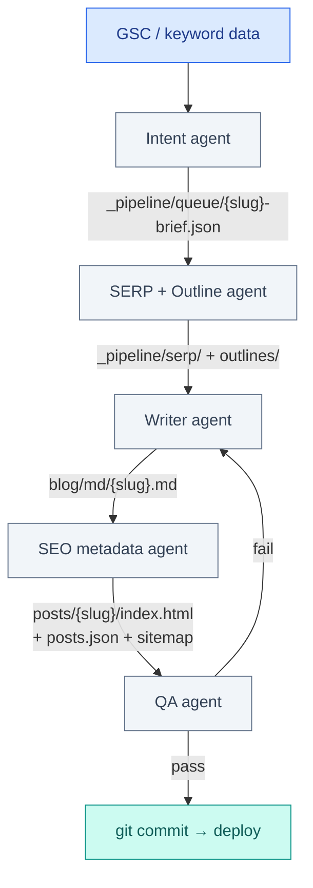

# Multi-Agent Pipeline for SEO and Content Automation

August 2026 · Published by Amar Kumar

Publishing one AI-generated blog post does not compound. You ship it, hope Google indexes it, and repeat the whole workflow manually next week. A multi-agent pipeline fixes that: specialized agents for intent, SERP research, writing, metadata, and QA — with machine-checkable gates between each phase.

A **multi-agent SEO pipeline** splits content work into specialized agents — research, writing, metadata, publishing, and reporting — each with a narrow job and a verification step. The pipeline reads search intent, produces publish-ready pages with correct metadata, and loops on Search Console feedback.

This guide covers agent roles, a concrete pipeline flow, copy-paste prompts, orchestration with `claude -p`, state/queue patterns, error handling, and how to measure whether the pipeline is actually working. Examples use the stackcone.com static-site layout; the same five roles apply to WordPress.

**Related:** [Skills vs Rules in Claude Code and Cursor](/blog/posts/skills-vs-rules-claude-code-cursor/) · [Multi-Agent SEO Pipeline for WordPress (solution)](/solutions/wordpress-seo-multi-agent-pipeline/)

## Table of contents

1. [Why multi-agent instead of one prompt](#why-multi-agent)
2. [Five agent roles](#five-agents)
3. [Intent agent prompt template](#intent-prompt)
4. [SERP analysis steps](#serp-analysis)
5. [Pipeline flow](#pipeline-flow)
6. [SEO metadata agent checklist](#seo-metadata)
7. [Metadata HTML head example](#html-head)
8. [Sample posts.json and sitemap entries](#registry-samples)
9. [Static site pattern (GitHub Pages)](#static-site)
10. [Complete ship-blog-post SKILL.md](#ship-skill)
11. [Orchestration with claude -p](#claude-p)
12. [State and queue patterns](#state-queue)
13. [Error handling between agents](#error-handling)
14. [Measuring pipeline success](#measuring-success)
15. [WordPress pattern](#wordpress)
16. [Agent design patterns that work](#design-patterns)
17. [GSC feedback loop](#gsc-loop)
18. [Common mistakes](#mistakes)
19. [FAQ](#faq)

## Why multi-agent instead of one prompt

A single “write me an SEO blog post” prompt mixes too many jobs:

| Job | Why isolate it |
|-----|----------------|
| Pick the topic from real search data | Needs GSC/Ahrefs context, not creative writing |
| Structure the outline | Needs SERP analysis — what ranks today |
| Write the draft | Needs tone, examples, code — long context |
| Generate metadata | Needs char limits, schema rules — precise |
| Publish + verify | Needs file paths, sitemap, lint — deterministic |

When one agent does all of this in one thread, context fills up, metadata gets skipped, and internal links are forgotten. Splitting into agents (or sequential phases with fresh context) keeps each step focused.

**Rule of thumb:** one agent = one verification criterion.

### What “done” means per agent

| Agent | Done when |
|-------|-----------|
| Intent | Brief JSON validates against schema; keyword + gap + 3+ internal links |
| Outline | H2/H3 list matches SERP gaps; FAQ questions drafted |
| Writer | `blog/md/{slug}.md` exists; word count in range; no placeholder text |
| SEO metadata | HTML head complete; registry + sitemap updated; highlights applied |
| QA | All grep/curl checks pass; no `.md` links in public HTML |

If you cannot state “done” as a boolean check, the agent boundary is too fuzzy.

## Five agent roles

### 1. Intent agent (research)

**Input:** GSC queries (impressions, zero clicks), competitor URLs, site sitemap, existing `posts.json`  
**Output:** Topic brief — target keyword, search intent, angle, internal links to include  
**Does not:** Write prose, pick titles, or edit files

The intent agent answers: *Should we write this post, for whom, and how does it differ from what already ranks?*

**Example brief (stackcone.com):**

```text
Query: "multi-agent pipeline seo" — 48 impressions, 0 clicks, avg position 14
Gap: no dedicated post on stackcone.com/blog/ covering agent roles + static workflow
Intent: informational / how-to (developer audience)
Angle: practical agent roles + GitHub Pages workflow, not framework hype
Primary keyword: multi-agent pipeline seo
Secondary: AI content pipeline automation, agent design patterns SEO metadata
Word target: 2,500–3,500
Internal links (HTML only):
  - /blog/posts/skills-vs-mcp-vs-subagents/
  - /blog/posts/skills-vs-rules-claude-code-cursor/
  - /blog/posts/how-to-use-claude-code-effectively/
  - /blog/posts/ai-agent-mcp-data-engineering-automation/
Exclude: brand-only queries, pages we already rank #1–3 for
```

**Data sources the intent agent should read:**

```bash
# Existing slugs — avoid duplicate topics
jq -r '.posts[].id' blog/posts.json

# Sitemap — confirm URL not already claimed
grep -o 'blog/posts/[^/]*/' sitemap.xml | sort -u

# GSC export (manual or API): queries.csv with query, impressions, clicks, position
```

Runs first. Output is a structured brief the outline agent consumes. See [Intent agent prompt template](#intent-prompt) for the full copy-paste prompt.

### 2. Outline agent (structure)

**Input:** Topic brief from intent agent  
**Output:** H2/H3 outline, FAQ questions, table/chart placeholders, word-count target  
**Does not:** Write full paragraphs or metadata

The outline agent maps **SERP expectations** to your brief. If every top result has a comparison table and you skip it, you are missing a ranking signal.

**Example outline fragment:**

```markdown
## H2: Five agent roles
### H3: Intent agent (research)
### H3: Outline agent (structure)
...

## H2: Intent agent prompt template
- fenced prompt block
- example brief output

## H2: FAQ (min 8 questions)
- Do I need LangGraph?
- Which agent writes JSON-LD?
- ...
```

**Outline agent verification:**

- Every H2 in the brief’s “angle” section has a matching H2 in the outline
- FAQ count ≥ 8 when brief targets informational intent
- At least one code block or file-path example per major section
- Internal link placeholders listed with full `/blog/posts/{slug}/` paths

See [SERP analysis steps](#serp-analysis) for how the outline agent should research competitors.

### 3. Writer agent (content)

**Input:** Approved outline + project rules (`.cursor/rules/blog-posts.mdc`, `CLAUDE.md`)  
**Output:** `blog/md/{slug}.md` with code examples, internal links, FAQ body  
**Does not:** Generate HTML, JSON-LD, or edit `sitemap.xml`

The writer agent follows repo conventions from rules — not from memory. It writes markdown source only; the SEO metadata agent owns the published HTML.

**Writer agent constraints (from stackcone rules):**

- Slug: lowercase, hyphenated (`multi-agent-pipeline-seo-content-automation`)
- Internal links: `/blog/posts/{slug}/` — never `/blog/md/`
- No AI-generated hero images; reference `blog/images/{slug}/` paths for later download
- Opening hook → TOC → H2 sections → FAQ → Related guides
- Meta line: `August 2026 · Published by Amar Kumar` (date label only; no “in 2026” in title/body)

**Example writer invocation:**

```text
Write blog/md/multi-agent-pipeline-seo-content-automation.md from the approved outline
at _pipeline/briefs/multi-agent-pipeline-seo.json.

Follow .cursor/rules/blog-posts.mdc. Target 2,800 words. Include real file paths,
bash snippets, and a complete SKILL.md example. Link only to HTML post paths.
Do not create HTML or update posts.json — writer phase only.
```

If the repo has linters or spell-check, the writer agent runs them before handoff:

```bash
# Optional: word count gate
wc -w blog/md/multi-agent-pipeline-seo-content-automation.md
# Target band from brief, e.g. 2500–3500
```

### 4. SEO metadata agent (publish layer)

**Input:** Markdown draft + site SEO rules (`.cursor/rules/seo-google.mdc`)  
**Output:** `blog/posts/{slug}/index.html`, `posts.json`, `sitemap.xml`, `blog/index.html` card  
**Does not:** Rewrite article body for “SEO flavor”; copy approved strings into exact fields

This agent is **deterministic-heavy**. It must not paraphrase the title for `<title>` or `og:title` — it copies approved strings into exact fields.

**Required fields per page:**

| Field | Rule |
|-------|------|
| `<title>` | Primary keyword near front, under ~60 chars |
| `meta description` | Value prop + keyword, under ~155 chars |
| `link rel="canonical"` | One canonical URL — no duplicates |
| `og:title`, `og:description`, `og:url`, `og:image` | Match article; absolute URLs |
| `twitter:card` | `summary_large_image` |
| JSON-LD `Article` | headline, datePublished, author, image |
| JSON-LD `FAQPage` | if FAQ section exists |
| JSON-LD `BreadcrumbList` | Home → Blog → Post |
| `sitemap.xml` | Add `<url>` with `lastmod` |
| `posts.json` | Registry entry for blog index |

Also updates static blog listing (`blog/index.html` post card) if the site uses a static index.

**Publish-phase commands:**

```bash
# After HTML written
python3 _dev/apply_highlights.py blog/posts/multi-agent-pipeline-seo-content-automation/index.html

# Fail if any public HTML links to markdown source
grep -r 'blog/md/' blog/posts/ blog/index.html && echo "FAIL: .md links in HTML" && exit 1

# Confirm sitemap has entry
grep "multi-agent-pipeline-seo-content-automation" sitemap.xml
```

See [Metadata HTML head example](#html-head) and [Sample posts.json and sitemap entries](#registry-samples).

### 5. QA agent (verification)

**Input:** All published files from metadata agent  
**Output:** Pass/fail report with file:line fixes  
**Does not:** Edit files (read-only); returns actionable errors to upstream agent

**QA checklist (automatable):**

```bash
#!/usr/bin/env bash
# _pipeline/scripts/qa-blog-post.sh
set -euo pipefail
SLUG="${1:?slug required}"
BASE="blog/posts/${SLUG}/index.html"
CANONICAL="https://stackcone.com/blog/posts/${SLUG}/"

# 1. No .md links in public HTML
! grep -q 'blog/md/' "$BASE" blog/index.html

# 2. Canonical present and matches sitemap
grep -q "rel=\"canonical\" href=\"${CANONICAL}\"" "$BASE"
grep -q "<loc>${CANONICAL}</loc>" sitemap.xml

# 3. posts.json entry exists
jq -e --arg id "$SLUG" '.posts[] | select(.id == $id)' blog/posts.json > /dev/null

# 4. Title length (rough)
TITLE=$(grep -o '<title>[^<]*</title>' "$BASE" | sed 's/<[^>]*>//g')
[ "${#TITLE}" -le 65 ] || { echo "Title too long: ${#TITLE}"; exit 1; }

# 5. JSON-LD Article block
grep -q '"@type": "Article"' "$BASE"

# 6. Syntax spans applied (sample)
grep -q 'class="kw"' "$BASE" || echo "WARN: run apply_highlights.py"

echo "QA PASS: ${SLUG}"
```

QA agent runs read-only. If fail → routes back to metadata agent (head/sitemap/registry issues) or writer agent (content/link issues) with specific fixes.

## Intent agent prompt template

Save as `_pipeline/prompts/intent-agent.md` or pass directly to a subagent. Replace `{SITE}`, `{GSC_EXPORT}`, `{POSTS_JSON}` with real paths.

```markdown
You are the Intent agent for {SITE} content pipeline. You produce topic briefs only.
You do NOT write article prose, titles for publication, or edit any files.

## Inputs
1. GSC query export: {GSC_EXPORT} (columns: query, impressions, clicks, position)
2. Existing posts: {POSTS_JSON}
3. Sitemap: sitemap.xml
4. Site niche: developer tools, AI agents, RAG, Claude Code, Cursor

## Task
Identify ONE content gap worth filling this week. Prefer:
- impressions >= 20, clicks = 0, position 8–25 (striking distance)
- query language matches something we can teach (how-to, comparison, architecture)
- no existing post with >80% keyword overlap in posts.json titles

## Output format (JSON only, no markdown fence)
{
  "slug": "lowercase-hyphenated-slug",
  "primary_keyword": "...",
  "secondary_keywords": ["...", "..."],
  "search_intent": "informational|commercial|transactional",
  "audience": "who reads this",
  "gap_summary": "why we lack this page today",
  "angle": "what makes our take different from SERP",
  "word_target_min": 2200,
  "word_target_max": 3500,
  "internal_links": [
    "/blog/posts/skills-vs-mcp-vs-subagents/",
    "/blog/posts/how-to-use-claude-code-effectively/"
  ],
  "exclude_reason_if_skip": null,
  "gsc_evidence": {
    "query": "...",
    "impressions": 48,
    "clicks": 0,
    "position": 14
  }
}

## Rules
- internal_links: HTML paths only (/blog/posts/.../), minimum 3, maximum 6
- Do not propose topics we already cover (check posts.json id and title)
- Do not propose YMYL medical/financial advice unless brief explicitly allows
- If no gap qualifies, set exclude_reason_if_skip and slug to null

Return JSON only.
```

**Example Claude Code invocation:**

```bash
claude -p "$(cat _pipeline/prompts/intent-agent.md)" \
  --add-dir blog \
  --output-format json > _pipeline/queue/intent-$(date +%Y%m%d).json
```

Validate output before queuing outline work:

```bash
jq -e '.slug != null and (.internal_links | length) >= 3' _pipeline/queue/intent-20260830.json
```

## SERP analysis steps

The outline agent (or an `explore` subagent) runs SERP analysis **after** intent brief approval. Goal: map what Google rewards for the primary keyword, not to copy competitors.

### Step 1 — Collect top results

```bash
# Manual: search primary keyword in browser, incognito, US or target geo
# Record top 10 organic URLs (skip ads, forums, video carousels unless dominant)

# Optional: Ahrefs/Semrush API via MCP — export top 10 titles + H2s
```

Create `_pipeline/serp/{slug}-serp.md`:

```markdown
# SERP: multi-agent pipeline seo
Date: 2026-08-30
Primary keyword: multi-agent pipeline seo

| Rank | URL | Title | Content type |
|------|-----|-------|----------------|
| 1 | example.com/... | ... | listicle |
| 2 | ... | ... | product doc |
...

## Common H2 patterns (3+ of 10)
- What is X
- How to build X
- Tools / frameworks
- Best practices

## Gaps (what top 10 miss)
- No static-site / GitHub Pages walkthrough
- No copy-paste SKILL.md for publisher agent
- No GSC feedback loop section

## Our outline must include
- Five agent roles with verification criteria
- claude -p orchestration
- posts.json + sitemap samples
```

### Step 2 — Extract structure signals

For each of the top 5 URLs, note:

| Signal | Record |
|--------|--------|
| Word count (estimate) | e.g. 1,800–2,400 |
| FAQ present? | Y/N, approximate count |
| Comparison table? | Y/N |
| Code samples? | language, depth |
| Schema types | Article, FAQPage, HowTo |
| Freshness | last updated if visible |

```bash
# Quick word count on competitor (respect robots.txt)
curl -sL "https://example.com/post" | wc -w
```

### Step 3 — Diff against our brief

Outline agent prompt core:

```text
Given brief at _pipeline/queue/intent-20260830.json and SERP notes at
_pipeline/serp/multi-agent-pipeline-seo-serp.md:

1. Produce H2/H3 outline that covers all "Common H2 patterns" PLUS our gaps.
2. FAQ: at least 8 questions targeting People Also Ask style queries.
3. Mark sections needing code (file paths, bash, JSON) with [CODE].
4. List internal_links from brief as a "Related context" section in outline.
5. Do not write full paragraphs.

Output: _pipeline/outlines/multi-agent-pipeline-seo-outline.md
```

### Step 4 — Human gate (optional)

For high-stakes topics, stop after outline and approve in GitHub issue or Slack before writer agent runs. Low-volume static blogs can auto-approve if brief + SERP files exist.

## Pipeline flow



Orchestration options:

| Scale | Orchestrator |
|-------|--------------|
| Solo dev, static site | Skill file (`ship-blog-post/SKILL.md`) + manual `/ship-blog-post` |
| Small team | Claude Code headless (`claude -p`) in CI after brief approval |
| High volume, YMYL | LangGraph + PostgreSQL queue — see [WordPress pipeline solution](/solutions/wordpress-seo-multi-agent-pipeline/) |

You do not need LangGraph on day one. A well-written skill with five numbered phases **is** a multi-agent pipeline when each phase gets a fresh context or subagent. See [Skills vs MCP vs Subagents](/blog/posts/skills-vs-mcp-vs-subagents/) for when to add MCP data tools.

## SEO metadata agent checklist

Copy into `.claude/rules/seo-publish.md` or the publisher skill:

```markdown
## Before marking publish complete

- [ ] Unique `<title>` and meta description (no duplicate across site)
- [ ] Canonical URL = `https://stackcone.com/blog/posts/{slug}/`
- [ ] OG and Twitter tags match title/description
- [ ] Article + BreadcrumbList JSON-LD present
- [ ] FAQPage JSON-LD if FAQ section exists
- [ ] sitemap.xml entry added with today's lastmod (YYYY-MM-DD)
- [ ] posts.json entry with author "Amar Kumar", category, tags
- [ ] blog/index.html static card updated (href, title, description, tags)
- [ ] No hotlinked images — all assets in blog/images/{slug}/
- [ ] No links to /blog/md/ from HTML
- [ ] python3 _dev/apply_highlights.py run on index.html
- [ ] QA script passes: _pipeline/scripts/qa-blog-post.sh {slug}
```

The metadata agent should treat unchecked boxes as **fail** — not “looks good enough.”

## Metadata HTML head example

Minimal `<head>` for `blog/posts/multi-agent-pipeline-seo-content-automation/index.html`. Title and description strings are copied verbatim from the approved brief — not rewritten.

```html
<!DOCTYPE html>
<html lang="en">
<head>
  <meta charset="UTF-8">
  <meta name="viewport" content="width=device-width, initial-scale=1.0">
  <meta name="robots" content="index, follow, max-image-preview:large, max-snippet:-1">
  <title>Multi-Agent Pipeline for SEO and Content Automation</title>
  <meta name="description" content="Multi-agent pipeline for SEO and content automation — five agent roles, metadata checklist, static site workflow, and GSC feedback loop with copy-paste patterns.">
  <link rel="canonical" href="https://stackcone.com/blog/posts/multi-agent-pipeline-seo-content-automation/">
  <meta property="og:type" content="article">
  <meta property="og:url" content="https://stackcone.com/blog/posts/multi-agent-pipeline-seo-content-automation/">
  <meta property="og:title" content="Multi-Agent Pipeline for SEO and Content Automation">
  <meta property="og:description" content="Multi-agent pipeline for SEO and content automation — five agent roles, metadata checklist, static site workflow, and GSC feedback loop with copy-paste patterns.">
  <meta property="og:image" content="https://stackcone.com/blog/images/multi-agent-pipeline-seo-content-automation/hero.png">
  <meta property="og:locale" content="en_US">
  <meta property="og:site_name" content="stackcone">
  <meta name="twitter:card" content="summary_large_image">
  <meta name="twitter:title" content="Multi-Agent Pipeline for SEO and Content Automation">
  <meta name="twitter:description" content="Multi-agent pipeline for SEO and content automation — five agent roles, metadata checklist, static site workflow, and GSC feedback loop with copy-paste patterns.">
  <meta name="twitter:image" content="https://stackcone.com/blog/images/multi-agent-pipeline-seo-content-automation/hero.png">
  <link rel="stylesheet" href="../../../styles.css">
  <link rel="stylesheet" href="../../../blog/blog.css">
  <script type="application/ld+json">
  {
    "@context": "https://schema.org",
    "@type": "Article",
    "headline": "Multi-Agent Pipeline for SEO and Content Automation",
    "description": "Multi-agent pipeline for SEO and content automation — five agent roles, metadata checklist, static site workflow, and GSC feedback loop with copy-paste patterns.",
    "author": { "@type": "Person", "name": "Amar Kumar" },
    "publisher": {
      "@type": "Organization",
      "name": "stackcone",
      "url": "https://stackcone.com",
      "logo": { "@type": "ImageObject", "url": "https://stackcone.com/logo/stackcone.png" }
    },
    "datePublished": "2026-08-30",
    "dateModified": "2026-08-30",
    "mainEntityOfPage": { "@type": "WebPage", "@id": "https://stackcone.com/blog/posts/multi-agent-pipeline-seo-content-automation/" },
    "image": "https://stackcone.com/blog/images/multi-agent-pipeline-seo-content-automation/hero.png",
    "articleSection": "Platform"
  }
  </script>
  <script type="application/ld+json">
  {
    "@context": "https://schema.org",
    "@type": "BreadcrumbList",
    "itemListElement": [
      { "@type": "ListItem", "position": 1, "name": "Home", "item": "https://stackcone.com/" },
      { "@type": "ListItem", "position": 2, "name": "Blog", "item": "https://stackcone.com/blog/" },
      { "@type": "ListItem", "position": 3, "name": "Multi-Agent Pipeline for SEO and Content Automation" }
    ]
  }
  </script>
</head>
```

Add `FAQPage` JSON-LD when the article body includes an FAQ section — mirror exact question/answer text from the HTML, not paraphrased.

## Sample posts.json and sitemap entries

### posts.json entry

Insert at the top of the `posts` array in `blog/posts.json` (newest first):

```json
{
  "id": "multi-agent-pipeline-seo-content-automation",
  "title": "Multi-Agent Pipeline for SEO and Content Automation",
  "description": "Multi-agent pipeline for SEO and content automation — five agent roles, metadata checklist, static site workflow, and GSC feedback loop with copy-paste patterns.",
  "href": "./posts/multi-agent-pipeline-seo-content-automation/",
  "date": "2026-08-30",
  "dateLabel": "August 2026",
  "author": "Amar Kumar",
  "category": "Platform",
  "tags": [
    "Multi-agent pipeline",
    "SEO automation",
    "AI content pipeline",
    "Agent design patterns",
    "SEO metadata",
    "Content automation"
  ]
}
```

Validate JSON after edit:

```bash
jq empty blog/posts.json && echo "posts.json OK"
```

### sitemap.xml entry

Add inside `<urlset>` in root `sitemap.xml`:

```xml
<url>
  <loc>https://stackcone.com/blog/posts/multi-agent-pipeline-seo-content-automation/</loc>
  <lastmod>2026-08-30</lastmod>
  <changefreq>monthly</changefreq>
  <priority>0.8</priority>
</url>
```

Rules:

- `<loc>` must match `rel="canonical"` exactly (trailing slash included)
- Update `lastmod` on substantive content refreshes, not typo fixes
- Never add `/blog/md/` URLs to sitemap

### blog/index.html card

Add a `<a class="post-card">` block matching sibling cards — same `href`, title, description, and `data-tags` as `posts.json`. The metadata agent must keep these in sync or the blog index drifts from the registry.

## Static site pattern (GitHub Pages)

stackcone.com uses this layout — one URL per post, no redirect stubs:

```text
blog/
├── md/{slug}.md                    ← source (stripped at deploy)
├── posts/{slug}/index.html         ← canonical public URL
├── posts.json                      ← blog registry
├── index.html                      ← static listing
└── images/{slug}/                  ← local assets only

_pipeline/                          ← optional orchestration (not deployed)
├── queue/                          ← brief JSON, job state
├── serp/                           ← SERP analysis notes
├── outlines/                       ← approved outlines
├── prompts/                        ← agent prompt templates
└── scripts/                        ← qa-blog-post.sh, validate-brief.sh

sitemap.xml                         ← root sitemap
robots.txt                          ← Disallow: /blog/md/
_dev/
├── apply_highlights.py
└── highlight_code.py
```

Deploy script (`.github/scripts/prepare-pages.sh`) removes `blog/md/`, `_dev/`, `_pipeline/`, and legacy redirect stubs before GitHub Pages upload. Only HTML is public.

**Intent agent data source:** Google Search Console → Queries with impressions but zero clicks = content gaps worth filling.

**Writer agent rules:** `.cursor/rules/blog-posts.mdc` — md source + html publish, never link to `.md`.

**Publisher skill steps:**

1. Write `blog/md/{slug}.md`
2. Write `blog/posts/{slug}/index.html` with full SEO head
3. Update `blog/posts.json`, `sitemap.xml`, `blog/index.html`
4. Run `python3 _dev/apply_highlights.py`
5. QA: `_pipeline/scripts/qa-blog-post.sh {slug}`

## Complete ship-blog-post SKILL.md

Place at `.claude/skills/ship-blog-post/SKILL.md` (Claude Code) or `.cursor/skills/ship-blog-post/SKILL.md` (Cursor). This skill covers **metadata + QA agents**; run intent/outline/writer phases separately or via `claude -p` first.

```markdown
---
name: ship-blog-post
description: >-
  Publish a stackcone blog post — convert md to HTML, update posts.json,
  sitemap.xml, blog/index.html, run apply_highlights.py, run QA script.
  Use when user asks to ship, publish, or deploy a blog post.
disable-model-invocation: true
---

# Ship a blog post

You are the SEO metadata + QA agent. Markdown draft already exists at
`blog/md/{slug}.md`. Follow `.cursor/rules/blog-posts.mdc` and
`.cursor/rules/seo-google.mdc`.

## Inputs required
- slug (lowercase-hyphenated)
- Approved title and meta description (do not invent new ones)
- Category and tags for posts.json

## Phase 1 — HTML publish

1. Create `blog/posts/{slug}/index.html` using the standard blog template
   (copy structure from `blog/posts/skills-vs-rules-claude-code-cursor/index.html`).
2. Convert md body to semantic HTML: one H1, H2/H3 hierarchy, `<pre><code>` for blocks.
3. Set canonical: `https://stackcone.com/blog/posts/{slug}/`
4. Add Article + BreadcrumbList JSON-LD; FAQPage if FAQ exists.
5. Download any needed images to `blog/images/{slug}/` — no hotlinks.

## Phase 2 — Registry and discovery

6. Prepend entry to `blog/posts.json` with `"author": "Amar Kumar"`.
7. Add `<url>` block to `sitemap.xml` with today's date as `lastmod`.
8. Add post card to `blog/index.html` matching posts.json fields.

## Phase 3 — Highlight and verify

9. Run: `python3 _dev/apply_highlights.py blog/posts/{slug}/index.html`
10. Run: `bash _pipeline/scripts/qa-blog-post.sh {slug}`
11. If QA fails, fix and re-run from step 9. Do not commit on failure.

## Handoff errors

| Failure | Route to |
|---------|----------|
| Missing sections vs outline | Writer agent — `blog/md/{slug}.md` |
| Wrong title/description length | Re-read brief; do not paraphrase in HTML head |
| Broken internal link target | Writer or intent agent for link list |
| Duplicate slug in posts.json | Human — slug collision |

## Do not

- Link to `blog/md/` from any HTML
- Create redirect stub files
- Commit unless user explicitly asked
- Generate AI hero images when real logos exist
- Paraphrase title for og:title — copy exact string

## Optional supporting files

.claude/skills/ship-blog-post/
├── SKILL.md
├── check-sitemap.sh          # grep slug in sitemap + canonical match
└── template-head.html        # head fragment with {TITLE} placeholders
```

Invoke manually:

```text
/ship-blog-post multi-agent-pipeline-seo-content-automation
```

See [Skills vs Rules in Claude Code and Cursor](/blog/posts/skills-vs-rules-claude-code-cursor/) for when to use skills vs rules for SEO constraints.

## Orchestration with claude -p

Headless Claude Code runs each pipeline phase in CI or a local script. Pattern from [Ralph Loop Alternatives](/blog/posts/ralph-loop-alternatives-claude-code/) and [How to Use Claude Code Effectively](/blog/posts/how-to-use-claude-code-effectively/): one phase per invocation, fresh context, exit code gates the next step.

### Directory layout for headless runs

```text
_pipeline/
├── run-pipeline.sh
├── prompts/
│   ├── intent-agent.md
│   ├── outline-agent.md
│   ├── writer-agent.md
│   └── qa-agent.md
└── queue/
    └── {slug}.state.json
```

### Example orchestrator script

```bash
#!/usr/bin/env bash
# _pipeline/run-pipeline.sh
set -euo pipefail
SLUG="${1:?usage: run-pipeline.sh <slug>}"
STATE="_pipeline/queue/${SLUG}.state.json"

init_state() {
  echo '{"slug":"'"$SLUG"'","phase":"intent","attempts":0,"errors":[]}' > "$STATE"
}

run_phase() {
  local phase="$1"
  local prompt="_pipeline/prompts/${phase}-agent.md"
  echo "==> Phase: $phase"
  claude -p "$(cat "$prompt")

Slug: $SLUG
State file: $STATE
Read brief/outline/md paths from state as needed.
" --add-dir . --allowedTools "Read,Write,Grep,Glob,Bash"
}

init_state
run_phase intent
run_phase outline
run_phase writer
claude -p "$(cat _pipeline/prompts/ship-via-skill.md)

Run ship-blog-post skill for slug: $SLUG
" --add-dir .
run_phase qa

jq '.phase = "done"' "$STATE" | sponge "$STATE"
echo "Pipeline complete: $SLUG"
```

### CI workflow (GitHub Actions)

```yaml
# .github/workflows/content-pipeline.yml
name: Content pipeline
on:
  workflow_dispatch:
    inputs:
      slug:
        description: Post slug
        required: true

jobs:
  ship:
    runs-on: ubuntu-latest
    steps:
      - uses: actions/checkout@v4
      - name: Run pipeline
        env:
          ANTHROPIC_API_KEY: ${{ secrets.ANTHROPIC_API_KEY }}
        run: bash _pipeline/run-pipeline.sh "${{ github.event.inputs.slug }}"
      - name: Open PR
        uses: peter-evans/create-pull-request@v6
        with:
          title: "content: ship ${{ github.event.inputs.slug }}"
          branch: "content/${{ github.event.inputs.slug }}"
```

**Rules for `claude -p` orchestration:**

- One agent role per invocation — do not combine writer + publisher in one prompt
- Pass `--add-dir` for repo root so agents read real `posts.json` / sitemap
- Use exit codes: QA script `exit 1` fails the job; no silent passes
- Human approval on PR before merge to main (deploy)

Compare with [Claude Code vs Cursor vs Copilot](/blog/posts/claude-code-vs-cursor-vs-copilot/) — only Claude Code targets headless CI today.

## State and queue patterns

Without state, agents lose track of which phase failed and retry from scratch. Use a small JSON state file per slug (or PostgreSQL at scale).

### Per-slug state file

`_pipeline/queue/multi-agent-pipeline-seo-content-automation.state.json`:

```json
{
  "slug": "multi-agent-pipeline-seo-content-automation",
  "phase": "writer",
  "attempts": { "intent": 1, "outline": 1, "writer": 2, "metadata": 0, "qa": 0 },
  "artifacts": {
    "brief": "_pipeline/queue/multi-agent-pipeline-seo-content-automation-brief.json",
    "serp": "_pipeline/serp/multi-agent-pipeline-seo-content-automation-serp.md",
    "outline": "_pipeline/outlines/multi-agent-pipeline-seo-content-automation-outline.md",
    "md": "blog/md/multi-agent-pipeline-seo-content-automation.md",
    "html": "blog/posts/multi-agent-pipeline-seo-content-automation/index.html"
  },
  "errors": [],
  "updated_at": "2026-08-30T14:22:00Z"
}
```

### File-based queue (solo dev)

```text
_pipeline/queue/
├── pending/
│   └── 001-multi-agent-pipeline-seo-content-automation.json
├── in_progress/
├── done/
└── failed/
```

Promotion rules:

```bash
# Move job to in_progress when intent starts
mv "_pipeline/queue/pending/001-${SLUG}.json" "_pipeline/queue/in_progress/"

# On QA pass
mv "_pipeline/queue/in_progress/${SLUG}.json" "_pipeline/queue/done/"

# On max retries
mv "_pipeline/queue/in_progress/${SLUG}.json" "_pipeline/queue/failed/"
```

### PostgreSQL queue (team / WordPress)

For high volume or YMYL human-review gates, use a `content_jobs` table:

| Column | Type | Purpose |
|--------|------|---------|
| id | uuid | job id |
| slug | text | unique per post |
| phase | enum | intent, outline, writer, metadata, qa, done |
| status | enum | pending, running, failed, blocked_review |
| payload | jsonb | brief, errors, artifact paths |
| locked_at | timestamptz | worker lease |
| created_at | timestamptz | queue order |

LangGraph or a simple worker polls `WHERE status = 'pending' ORDER BY created_at`. See [WordPress multi-agent SEO pipeline](/solutions/wordpress-seo-multi-agent-pipeline/) for full architecture.

**Idempotent publish:** same slug → update files in place; never create `/posts/{slug}-2/`. State should record `published_url` once metadata phase succeeds.

## Error handling between agents

Agents should return **structured errors**, not prose apologies. The orchestrator routes failures to the correct upstream agent.

### Error object schema

```json
{
  "agent": "qa",
  "code": "CANONICAL_SITEMAP_MISMATCH",
  "message": "canonical https://stackcone.com/blog/posts/foo/ not in sitemap.xml",
  "file": "blog/posts/foo/index.html",
  "fix_owner": "metadata",
  "retryable": true
}
```

### Routing table

| Error code | Fix owner | Action |
|------------|-----------|--------|
| `BRIEF_INVALID_JSON` | intent | Re-run intent agent |
| `SERP_STALE` | outline | Re-fetch SERP notes (>30 days) |
| `WORD_COUNT_LOW` | writer | Expand sections per outline |
| `MD_LINK_IN_HTML` | metadata | Remove links; grep `blog/md/` |
| `DUPLICATE_TITLE` | metadata | Check posts.json; unique title |
| `CANONICAL_SITEMAP_MISMATCH` | metadata | Align sitemap `<loc>` and canonical |
| `MISSING_FAQ_SCHEMA` | metadata | Add FAQPage JSON-LD |
| `HIGHLIGHTS_NOT_APPLIED` | metadata | Run `apply_highlights.py` |
| `INTERNAL_LINK_404` | writer | Fix href or remove link |

### Retry policy

```json
{
  "max_attempts": { "intent": 2, "outline": 2, "writer": 3, "metadata": 3, "qa": 1 },
  "backoff_seconds": [0, 30, 120]
}
```

After `max_attempts`, move job to `failed/` and notify (Slack webhook, GitHub issue). QA agent does not auto-fix — it reports. Metadata agent may auto-fix deterministic issues (run highlights, add sitemap line) once before failing.

### Verification loops

Borrow from [Ralph Loop Alternatives](/blog/posts/ralph-loop-alternatives-claude-code/): Stop hooks or CI exit codes enforce “no green, no merge.” Example Stop hook message in `CLAUDE.md`:

```markdown
Before ending a publish session, confirm qa-blog-post.sh passed.
If not, list failing checks and continue fixing.
```

## Measuring pipeline success

Publishing more posts is not success. Track whether the pipeline improves **discovery, clicks, and efficiency**.

### Search outcomes (monthly, from GSC)

| Metric | What it tells you |
|--------|-------------------|
| Impressions per new URL | Is Google testing the page? |
| Clicks / impressions (CTR) | Title + description fit intent? |
| Average position for target query | Moving from 15 → 8 = pipeline working |
| Indexed pages vs submitted sitemap | Discovery broken if gap grows |

**Per-post scorecard** (`_pipeline/reports/{slug}-90d.md`):

```markdown
# 90-day report: multi-agent-pipeline-seo-content-automation
Target query: multi-agent pipeline seo
Published: 2026-08-30

| Week | Impressions | Clicks | Position |
|------|-------------|--------|----------|
| 1–2 | 12 | 0 | 22 |
| 3–4 | 31 | 1 | 17 |
| 5–8 | 48 | 3 | 12 |

Actions: refresh meta description (CTR low), add link from /blog/posts/skills-vs-mcp-vs-subagents/
```

Feed scorecards back into the **intent agent** for refresh briefs (title tests, new internal links, content updates).

### Pipeline efficiency (per ship)

| Metric | How to measure |
|--------|----------------|
| Time per phase | timestamps in `.state.json` |
| Human minutes | review time before merge |
| QA failure rate | `failed / total ships` |
| Rework loops | writer vs metadata retry counts |
| Cost | API usage per phase (optional) |

```bash
# Ships last 30 days
ls _pipeline/queue/done/ | wc -l

# QA failure rate from logs
grep -c '"fix_owner":"writer"' _pipeline/logs/*.jsonl
```

### Quality gates (before calling a ship “successful”)

- [ ] QA passed on first or second metadata attempt
- [ ] No post-ship hotfix commits within 48 hours
- [ ] Target query enters GSC within 14 days (indexed)
- [ ] At least one internal link from an existing post (manual or automated)

If QA failure rate exceeds ~30%, fix skills/rules before scaling volume.

## WordPress pattern

For CMS sites, swap the publisher agent output:

| Static site | WordPress |
|-------------|-----------|
| `blog/posts/{slug}/index.html` | `POST /wp-json/wp/v2/posts` |
| `posts.json` | Categories + tags via REST |
| `sitemap.xml` manual entry | Yoast or Rank Math auto-sitemap |
| JSON-LD in HTML template | Plugin or custom fields |

The five agent roles stay the same. Only the publish layer changes. For YMYL sites (health, finance), add a human-review gate between Writer and Publisher agents (`status: blocked_review` in queue).

**WordPress metadata agent sketch:**

```bash
curl -X POST "https://example.com/wp-json/wp/v2/posts" \
  -u "$WP_USER:$WP_APP_PASSWORD" \
  -H "Content-Type: application/json" \
  -d '{
    "title": "Multi-Agent Pipeline for SEO",
    "content": "<!-- rendered HTML -->",
    "status": "draft",
    "meta": { "_yoast_wpseo_metadesc": "..." }
  }'
```

See the full [WordPress multi-agent SEO pipeline architecture](/solutions/wordpress-seo-multi-agent-pipeline/) for LangGraph orchestration, PostgreSQL queue, and GSC reporting agents.

## Agent design patterns that work

| Pattern | Use in SEO pipeline |
|---------|---------------------|
| **Specialist subagents** | Intent agent as `explore` subagent — SERP research without flooding writer context |
| **Skills for procedures** | `ship-blog-post` skill = publisher + QA checklist |
| **Rules for constraints** | SEO char limits, canonical format, no `.md` links |
| **Verification loops** | QA agent runs grep/curl before commit |
| **Fresh context per phase** | New session or subagent per agent role — avoids context rot |
| **Idempotent publish** | Same slug → update files in place, don't create duplicate URLs |
| **MCP for live data** | GSC API, Ahrefs, WordPress REST — tools, not instructions |

**Capability vs behavior vs procedure:**

- MCP = fetch GSC queries, check live SERP
- Rules = metadata format constraints in `.cursor/rules/seo-google.mdc`
- Skills = full publish workflow (`ship-blog-post`)
- Subagents = isolated SERP research

Deep dive: [Skills vs MCP vs Subagents](/blog/posts/skills-vs-mcp-vs-subagents/) and [AI Agents + MCP for Data Engineering](/blog/posts/ai-agent-mcp-data-engineering-automation/).

For building custom agent harnesses (tool loops, verification), see [How to Build a Cursor-Like AI Coding Agent](/blog/posts/how-to-build-cursor-like-ai-coding-agent/).

## GSC feedback loop

Close the loop — the Intent agent should re-run monthly:

1. Export GSC queries (impressions, clicks, position)
2. Flag **high impressions / zero clicks** → title or description mismatch
3. Flag **indexed but low impressions** → topic too narrow or weak internal links
4. Flag **404 or redirect URLs** in coverage report → fix canonicals, remove stubs
5. Queue refresh or new post in content backlog

```text
Publish → wait 2–4 weeks → GSC data → Intent agent → next brief
```

**Refresh brief example (existing post):**

```json
{
  "slug": "multi-agent-pipeline-seo-content-automation",
  "job_type": "refresh",
  "reason": "CTR 0.4% at position 11 — test new meta description",
  "changes": ["meta description", "add FAQ question on claude -p"],
  "internal_links_to_add": ["/blog/posts/ralph-loop-alternatives-claude-code/"]
}
```

Without this loop, the pipeline produces content but does not learn what searchers actually query.

## Common mistakes

1. **One mega-prompt for research + write + SEO** — metadata always gets short-changed
2. **Duplicate canonicals** — `/post/` and `/post/index.html` both indexed
3. **Redirect stub files** — client-side redirects confuse Google; use one clean URL
4. **AI-generated hero images** — break OG previews; use real logos or site default
5. **Skipping sitemap update** — page exists but Google never discovers it
6. **No QA agent** — broken internal links ship to production
7. **Writing for vanity keywords, not search intent** — impressions without matching query language in title/H1
8. **Skipping state files** — retries restart from intent, wasting API spend
9. **Publisher rewrites title** — OG/title drift from H1 confuses CTR testing
10. **No 90-day scorecard** — you cannot tell which agent phase to improve

## FAQ

### Do I need LangGraph for a multi-agent SEO pipeline?

No. For static sites and low volume, a skill with phased steps plus subagents is enough. LangGraph helps when you need scheduled runs, PostgreSQL queue state, and YMYL human-review gates at scale.

### Which agent writes JSON-LD?

The SEO metadata agent. Structured data has strict field names — the writer agent should not invent schema inline. FAQ answers in JSON-LD must match visible HTML text exactly.

### How do I pick topics from GSC?

Sort by impressions descending, filter clicks = 0, exclude brand queries. High impressions + zero clicks means Google shows your site but searchers don't click — often a title gap or missing dedicated page. Export Search Console → Performance → Queries to CSV for the intent agent.

### Static site or WordPress for SEO automation?

Static (GitHub Pages, Cloudflare Pages) is simpler — git is the CMS, agents commit files. WordPress when non-technical editors need admin UI or you publish daily at volume.

### How does this relate to MCP?

MCP connects agents to GSC, Ahrefs, WordPress, Slack. It does not replace skills or rules. Use MCP for **data fetch**; use skills for **publish procedure**; use rules for **constraints**. See [Skills vs MCP vs Subagents](/blog/posts/skills-vs-mcp-vs-subagents/).

### Can one person run the full pipeline?

Yes. Run intent + outline manually on Monday, writer Tuesday, `/ship-blog-post` Wednesday. `claude -p` automates the same sequence when you are ready. Start with the skill before building CI.

### What if the writer agent produces thin content?

Send back to outline agent with SERP word-count notes. Set a hard gate: `wc -w` below `word_target_min` fails the writer phase. Do not let the metadata agent pad content in HTML.

### How do I handle slug collisions?

Intent agent must `jq` existing `posts.json` ids before proposing a slug. If collision, append a disambiguator (`-guide`, `-static-site`) rather than overwriting an live URL.

### Should the QA agent fix issues automatically?

No for content; yes for deterministic tooling. QA should run `apply_highlights.py` only when the failure is `HIGHLIGHTS_NOT_APPLIED`. Canonical/sitemap mismatches get one metadata retry, then human review.

### How long until GSC shows results for a new post?

Typically 1–4 weeks for indexing, 4–12 weeks for stable position data. Do not judge the pipeline on day-three analytics. Use the 90-day scorecard pattern in [Measuring pipeline success](#measuring-success).

## Related guides

- [Skills vs Rules in Claude Code and Cursor](/blog/posts/skills-vs-rules-claude-code-cursor/)
- [How to Use Claude Code Effectively](/blog/posts/how-to-use-claude-code-effectively/)
- [Ralph Loop Alternatives for Claude Code and Cursor](/blog/posts/ralph-loop-alternatives-claude-code/)
- [AI Agents + MCP for Data Engineering](/blog/posts/ai-agent-mcp-data-engineering-automation/)
- [How to Build a Cursor-Like AI Coding Agent](/blog/posts/how-to-build-cursor-like-ai-coding-agent/)
- [Multi-Agent SEO Pipeline for WordPress (solution)](/solutions/wordpress-seo-multi-agent-pipeline/)
