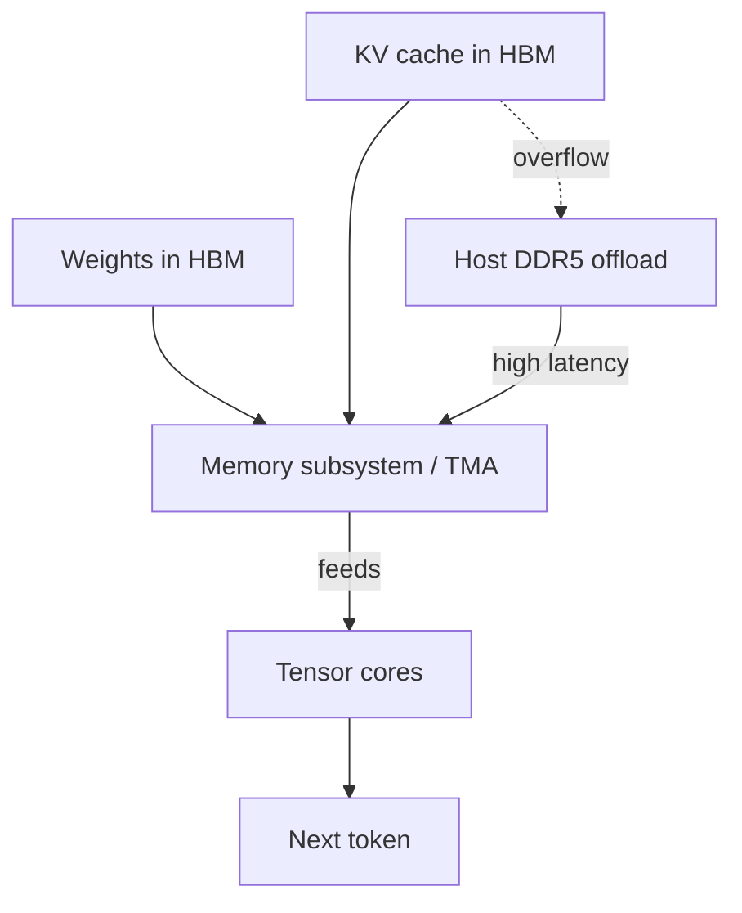
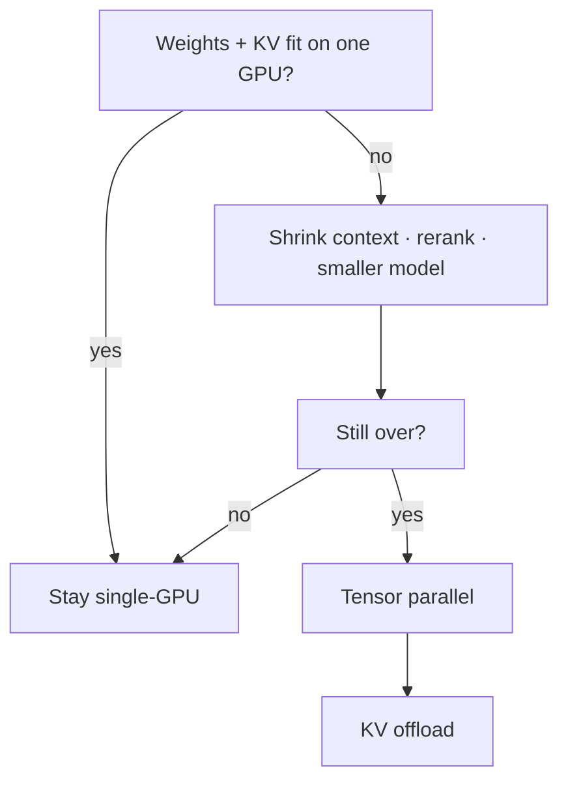

# NVIDIA and the AI Memory Wall

**September 2026 · Published by Amar Kumar**

For two years the AI infrastructure story was simple: more FLOPS, more GPUs, more NVIDIA. The bottleneck moved. Training and especially long-context inference are no longer limited by tensor cores first. They are limited by how fast weights and KV cache can move on and off the package — the **memory wall**.

NVIDIA still sits at the center of that stack. Rubin raised HBM4 bandwidth to about **22 TB/s** and **288 GB** per GPU. DRAM supply is tight enough that Rubin Ultra is being evaluated with *less* on-package memory than Rubin, not more.

This is a builder's read of that shift: the memory subsystem, why decode is bandwidth-bound, an interactive residency calculator, and how to size RAG when the next SKU might ship with 192 GB instead of 288 GB.

## Table of contents

1. [The bottleneck moved](#bottleneck)
2. [Prefill vs decode](#prefill-decode)
3. [KV cache math](#kv-math)
4. [Residency calculator](#calculator)
5. [What Rubin actually changed](#rubin)
6. [Why Ultra may ship with less HBM](#rubin-ultra)
7. [HBM vs DDR5](#hbm-ddr5)
8. [Inference and RAG](#inference-rag)
9. [Cluster sizing](#sizing)
10. [The bubble question](#bubble)
11. [FAQ](#faq)

## The bottleneck moved

Classic GPU marketing ranks chips by peak dense FLOPS. Decode barely cares. Each new token re-reads weights and a growing KV cache.



| Workload trait | Memory effect |
|----------------|---------------|
| Long context (100K–1M tokens) | KV cache grows linearly with sequence length |
| Multi-step tool loops | More time in decode vs prefill |
| High concurrency | Many KV caches resident at once |
| Multitrillion-parameter models | Weights alone can exceed a single package |
| GQA | Fewer KV heads than Q heads — why 70B still fits |

## Prefill vs decode

Prefill (reading the prompt) can look compute-heavy. User-visible latency for chat and agents is almost always **decode**. The published page has a toggle: prefill vs decode changes the bound, the metric, and the upgrade that helps.

## KV cache math

```
bytes_per_token = 2 * n_layers * n_kv_heads * head_dim * dtype_bytes
kv_gb = bytes_per_token * seq_len * sessions / 1e9
weights_gb ≈ n_params_B * bytes_per_param
```

The leading `2` is K and V. GQA keeps `n_kv_heads` far below query heads (often 8). A Llama-class 70B at FP16 KV is ~**0.31 MB/token** (`2 × 80 × 8 × 128 × 2`).

| Context | 1 session | 8 sessions | 32 sessions |
|---------|-----------|------------|-------------|
| 4K | 1.3 GB | 10 GB | 40 GB |
| 32K | 10 GB | 80 GB | 320 GB |
| 128K | 40 GB | 320 GB | 1.3 TB |

Add ~140 GB of FP16 weights for 70B and a 128K × 32-tenant plan does not fit on one card.

## Residency calculator

The published page includes an interactive widget: model class (8B / 32B / 70B / 405B), weight precision (FP16 / FP8 / INT4), context 4–256K, concurrency 1–64, and HBM SKUs (80 / 141 / 192 / 288 GB). It reports weights, KV, total, and whether the job fits on one GPU (12 GB overhead, FP16 KV).

## What Rubin actually changed

| Spec | Role |
|------|------|
| HBM4, up to 288 GB | Larger models and longer context without KV offload |
| ~22 TB/s HBM bandwidth | ~2.8× Blackwell / Blackwell Ultra |
| Wider HBM interface | HBM4 doubles width vs HBM3e |
| NVLink 6 (~3,600 GB/s) | Scale-up all-to-all |
| NVLink-C2C (~1,800 GB/s) | Coherent CPU–GPU spill path |
| PCIe Gen 6 x16 (~256 GB/s) | Host path — different sport from HBM |

## Why Ultra may ship with less HBM

[TrendForce](https://www.trendforce.com/presscenter/news/20260804-13166.html): NVIDIA evaluated 8-Hi HBM4e / 12-Hi HBM4 / 8-Hi HBM4. Previewed configs around **192 GB** vs Rubin's 288 GB, FLOPS held. Final SKU unset.

Causes: DRAM wafers through 2027; 12-Hi HBM4e yield. SOCAMM / LPDDR5X on Vera Rubin Superchip already cut.



## HBM vs DDR5

HBM is on-package residency. DDR5 is host retrieval, indexes, and offload. Buying GPUs without DIMM lead times still stalls.

## Inference and RAG

1. Measure decode, not prefill.
2. Budget KV — see [RAG retrieval](/blog/posts/how-to-evaluate-rag-retrieval/) and [Cohere reranking](/blog/posts/cohere-reranking-production-rag-retrieval/).
3. Route models — [economical LLMs](/blog/posts/best-economical-llm-models-rag-openai-gemini-anthropic/) and [heuristic routing](/blog/posts/auto-model-routing-without-llm-classifier/).
4. Offload as a config flag.

Checklist: prefix cache, paged KV, per-tenant max context, FP8 KV, tensor parallel only after one card is full.

## Cluster sizing

Recompute max sessions at p95 context, single-GPU fit, and $/M output tokens if you add nodes.

| Scenario | HBM | Software response |
|----------|-----|-------------------|
| Original Ultra pitch | ~288–384 GB | Fewer nodes |
| Rubin parity | 288 GB | Current assumption |
| Constrained Ultra | ~192 GB | More GPUs or earlier offload |

## The bubble question

A thinner HBM SKU is a bill-of-materials story, not proof demand vanished. The useful test: does serving survive 192 GB and expensive DIMMs?

## FAQ

**Is NVIDIA still the center of AI infrastructure?** Yes. The question is HBM per GPU and whether it ships.

**What is the memory wall?** Adding compute stops helping because weights and KV cannot be fed fast enough.

**How do you estimate KV cache?** `2 × layers × KV heads × head dim × dtype × seq × sessions`.

**Why would a newer GPU have less memory?** Wafer competition and tall-stack yield.

**How should RAG teams respond?** Shorter context, rerank, routing, explicit KV budget.
