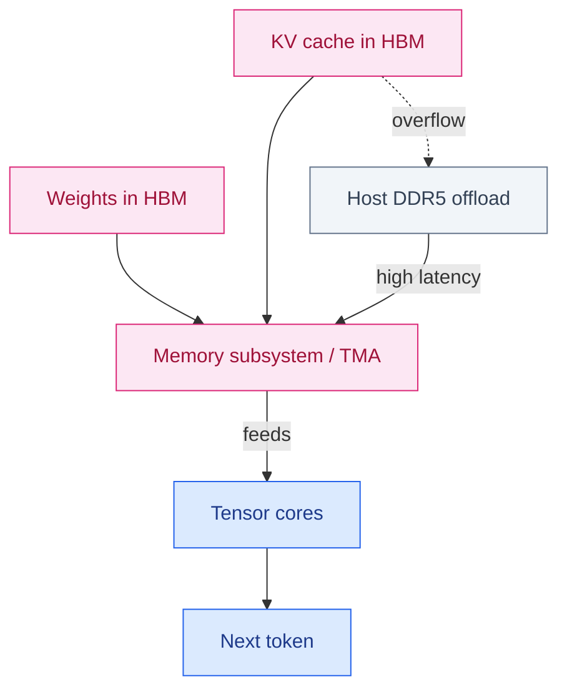
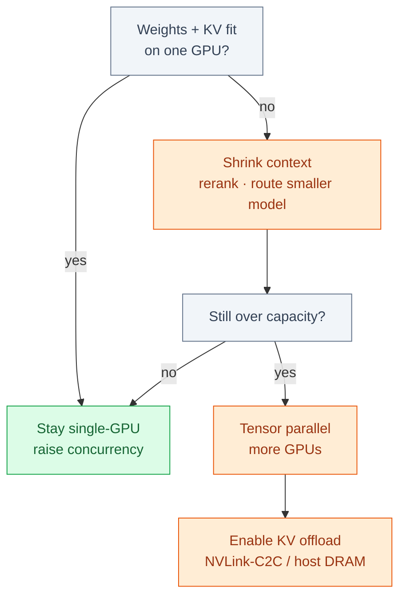

# NVIDIA and the AI Memory Wall

**September 2026 · Published by Amar Kumar**

For two years the AI infrastructure story was a gym slogan: more FLOPS, more GPUs, more NVIDIA. Buy the bigger rack. The bottleneck would sort itself out, presumably out of respect for the purchase order.

The bottleneck moved. Training and especially long-context inference are no longer limited by tensor cores first. They are limited by how fast weights and KV cache can move on and off the package — the **memory wall**, which is a boring name for the moment your expensive chip sits around waiting for data like a sports car in a school zone.

NVIDIA still sits at the center of that stack. Rubin raised HBM4 bandwidth to about **22 TB/s** and **288 GB** per GPU. DRAM supply is tight enough that Rubin Ultra is being evaluated with *less* on-package memory than Rubin, not more. Same marketing FLOPS. Smaller apartment. That is the plot twist nobody put on the keynote slide.

This is a builder’s read of that shift: why decode is a memory problem wearing a compute costume, the KV math that blows up your “128K for everyone” plan, an interactive residency calculator, and how to size RAG when the next SKU might ship with 192 GB instead of 288 GB. Bring a drink. The numbers are rude.

## Table of contents

1. [The bottleneck moved](#the-bottleneck-moved)
2. [Prefill vs decode](#prefill-vs-decode)
3. [KV cache math](#kv-cache-math)
4. [Residency calculator](#residency-calculator)
5. [What Rubin actually changed](#what-rubin-actually-changed)
6. [Why Ultra may ship with less HBM](#why-ultra-may-ship-with-less-hbm)
7. [HBM vs DDR5](#hbm-vs-ddr5)
8. [Inference and RAG](#inference-and-rag)
9. [Cluster sizing](#cluster-sizing)
10. [The bubble question](#the-bubble-question)
11. [FAQ](#faq)

## The bottleneck moved

Classic GPU marketing ranks chips by peak dense FLOPS, the way car ads rank horsepower. Decode — the generation phase of inference, the part users actually feel — barely cares. Each new token re-reads the model weights and a growing KV cache. Achieved **memory bandwidth** and **on-package capacity** decide tokens per second, concurrency, and whether you offload cache to host DRAM and wait for the bus like it’s 1999.


Decode is a memory-feed problem. Tensor cores only run after HBM (or a slow host spill) delivers weights and KV.

Agentic workloads make this worse:

| Workload trait | Memory effect |
| --- | --- |
| Long context (100K–1M tokens) | KV cache grows linearly with sequence length |
| Multi-step tool loops | More time in decode vs prefill; bandwidth-bound longer |
| High concurrency | Many KV caches resident at once |
| Multitrillion-parameter models | Weights alone can exceed a single package |
| Grouped-query attention (GQA) | Fewer KV heads than Q heads — the main reason 70B models still fit |

NVIDIA’s own Rubin write-up is explicit: decode is **memory-subsystem bound**. Peak FLOPS on a slide do not tell you whether a reasoning agent will stay interactive, or whether it will think for three seconds and then stall like a laptop with too many Chrome tabs. If the HBM cannot feed the cores, the cores are decorative.

## Prefill vs decode

Toggle the phase. The bound flips, which is the kind of detail that makes capacity planning feel like a magic trick until you remember users do not live in the prompt-ingestion phase. Prefill (reading the prompt) looks compute-heavy. User-visible latency for chat and agents is almost always **decode** — one token after another, each one rereading the biography of everything that came before.

### Which phase are you sizing for?

Same GPU. Different bottleneck. Pick a phase to see what to measure.

Each generated token re-reads weights and the entire KV cache. Extra FLOPS do little if HBM cannot keep up.

## KV cache math

Weights are the fixed tax. You pay them once per model, like rent. KV cache is the variable that blows up with RAG windows and concurrency — the utility bill that arrives when everyone leaves the lights on. This is the part of the post where a spreadsheet becomes a personality.

```
bytes_per_token = 2 * n_layers * n_kv_heads * head_dim * dtype_bytes
kv_gb = bytes_per_token * seq_len * sessions / 1e9
weights_gb ≈ n_params_B * bytes_per_param
```

The leading `2` is K and V. GQA keeps `n_kv_heads` far below query heads (often 8). FP16 KV uses 2 bytes; FP8 KV uses 1. A Llama-class 70B at FP16 KV is on the order of **~0.3 MB per token** — so 32K context is ~10 GB *per session* before activations.

**Worked 70B example (GQA, 80 layers, 8 KV heads, 128 dim, FP16)**

`2 × 80 × 8 × 128 × 2 = 327,680 bytes/token ≈ 0.31 MB/token`

| Context | 1 session | 8 sessions | 32 sessions |
| --- | --- | --- | --- |
| 4K | 1.3 GB | 10 GB | 40 GB |
| 32K | 10 GB | 80 GB | 320 GB |
| 128K | 40 GB | 320 GB | 1.3 TB |

Add ~140 GB of FP16 weights for 70B and you see why “we have an H100” is not a 128K × 32-tenant plan.

## Residency calculator

Play with this. It is the least boring way to internalize why “we have an H100” is not a 128K × 32-tenant plan. Indicative GQA-style models — not a vendor datasheet, not a promise, not a substitute for profiling your actual checkpoint. Change the sliders. The bar chart and fit verdict update live. Overhead is a flat 12 GB for kernels, activations, and fragmentation, because real cards are not as tidy as a tweet.

### Will this fit on one GPU?

Pick a model class, precision, context, concurrency, and an HBM SKU.

Move the sliders to compare used memory against the selected SKU.

## What Rubin actually changed

Rubin is NVIDIA’s answer to that wall for the current generation. The useful upgrade is not another FLOPS slide. It is **time on-package**: stay in HBM and decode stays fast. Spill to host DDR5 and you pay latency no tensor-core upgrade hides. Think of it as the difference between cooking in your kitchen and sending out for every ingredient, one shallot at a time, over PCIe.

        ****
        ****
        ****
        ****
        ****
        ****

| Spec | Role |
| --- | --- |
| HBM4, up to 288 GB | Larger models and longer context without KV offload |
| ~22 TB/s HBM bandwidth | ~2.8× Blackwell / Blackwell Ultra peak memory bandwidth |
| Wider HBM interface | HBM4 doubles interface width vs HBM3e |
| NVLink 6 (~3,600 GB/s) | Scale-up all-to-all between GPUs |
| NVLink-C2C (~1,800 GB/s) | Coherent CPU–GPU path when you must spill |
| PCIe Gen 6 x16 (~256 GB/s) | Host path — orders of magnitude behind HBM |

Indicative peak HBM bandwidth. Rubin’s ~22 TB/s is about 2.8× the Blackwell / Blackwell Ultra class.

Same token, four buses. Offload is not “a bit slower.” PCIe is a different sport from HBM.

## Why Ultra may ship with less HBM

Roadmaps assumed every flagship would add memory, the way sequels add explosions. Mid-year reporting broke that habit, and it is the most interesting hardware rumor of the year because it is not a rumor about FLOPS. It is a rumor about *running out of apartments*.

[TrendForce](https://www.trendforce.com/presscenter/news/20260804-13166.html) says NVIDIA expanded Rubin Ultra evaluation beyond a 12-Hi HBM4e baseline to include **8-Hi HBM4e**, **12-Hi HBM4**, and **8-Hi HBM4**. A configuration previewed to customers puts memory around **192 GB** — below Rubin's 288 GB — while keeping peak FLOPS. The final SKU is not locked.

### SKU scenarios

Click a column. The capacity chart highlights that plan. Software response changes with the number, not the FLOPS.

Rubin 288 GB is the shipping-class assumption. Constrained Ultra evaluations cluster near 192 GB.

Two supply constraints, not a silicon bug:
- **DRAM wafers through 2027** — HBM competes with server DDR5 and mobile LPDDR for the same limited capacity.
- **12-Hi HBM4e yield and validation** — stacking taller is slower to qualify than designing more compute.

NVIDIA already cut SOCAMM / LPDDR5X capacity on Vera Rubin Superchip modules for the same reason. Cloud buyers who sized racks around 288–384 GB per GPU need a fallback model at ~192 GB.


Hardware uncertainty is a software problem first. Add GPUs after you have cut context and routed models.

## HBM vs DDR5

The memory wall is not one product. It is a family argument.

**HBM** sits on the GPU. It sets how much of a model and KV cache you can keep hot. Tight HBM is why flagship SKUs may ship thinner stacks — same chip family, smaller closet.

**DDR5** sits in general-purpose servers that still do retrieval, embedding, orchestration, and CPU-side KV offload. North American cloud buyers raised DDR5 content per server as inference — not only training — became the spend story. TrendForce has described a seller’s market with large contract-price increases. The longer version of that mess is [The DRAM Supercycle](/blog/posts/dram-supercycle/).
- GPU HBM → generator / reranker residency and decode speed
- Server DDR5 → vector indexes, feature stores, and any cache you spill

A “we bought more GPUs” plan that ignores DIMM lead times still stalls. You just stall in a more expensive room.

## Inference and RAG

You do not need a Rubin reservation to design around the wall. The same constraints show up on Blackwell, H100, and rented cloud GPUs — which is either comforting or insulting, depending on how much you spent last year.

**1. Measure decode, not prefill.** Profile tokens/sec vs batch size and context length, not only TFLOPS. Prefill makes you look fast in a benchmark. Decode is what your user is staring at.

**2. Treat KV cache as a first-class budget.** Stuffing 40 retrieved chunks into a 128K window can evict other tenants. Retrieval quality is a memory optimization wearing a relevance costume. See [how we evaluate RAG retrieval](/blog/posts/how-to-evaluate-rag-retrieval/) and [Cohere reranking](/blog/posts/cohere-reranking-production-rag-retrieval/).

**3. Route models by job, not by prestige.** A frontier model on a memory-tight GPU is worse than a smaller model that stays resident. Prestige does not pay the HBM bill. [Economical LLM choices](/blog/posts/best-economical-llm-models-rag-openai-gemini-anthropic/) and [heuristic routing](/blog/posts/auto-model-routing-without-llm-classifier/) exist for this reason.

**4. Plan for offload paths.** NVLink-C2C and host DRAM are the safety valve. Make offload a config flag, not a rewrite you do at 2 a.m. after the first 128K tenant arrives.

**Serving-stack checklist when HBM is the scarce resource**
- Prefix / prompt cache for repeated system prompts and RAG headers
- Paged KV (vLLM-style) so fragmentation does not waste 20% of the card
- Per-tenant max context, not one global 128K
- FP8 KV where quality allows — halves the variable tax
- Tensor parallel only after a single card is honestly full

## Cluster sizing

If you are writing a capacity plan, keep three columns — not one. Spreadsheets with a single “GPU count” cell are how Friday incidents get scheduled. Use the calculator above, then recompute:
- Max concurrent sessions at your p95 context length
- Whether weights + KV fit without tensor parallel
- Cost per million output tokens if you add nodes to buy back memory

| Scenario | On-package HBM | Software response |
| --- | --- | --- |
| Original Ultra pitch | ~288–384 GB | Fewer nodes for large-context residency |
| Rubin parity | 288 GB | Current Rubin-class assumptions |
| Constrained Ultra | ~192 GB | More GPUs or earlier KV offload |

Chunking, caching, and routing decide whether a 192 GB SKU is a crisis or a config change.

## The bubble question

Skepticism and enthusiasm are both rational, which is why the argument never ends. Capex is enormous. HBM and power constrain how fast that capex turns into tokens. A chip that ships with less memory than last year’s slide is not proof demand disappeared — it is proof the **bill of materials** is the scarce resource, and scarcity is allowed to be both real and poorly timed.

The useful question is not “is AI a bubble?” That question is for podcasts. The useful question is “does our serving path survive a thinner HBM SKU and a more expensive DIMM?” If yes, you are building on the actual constraint. If you assumed FLOPS keep doubling for free, the memory wall will find you in production, probably on a Friday. Longer version: [The AI Bubble Debate](/blog/posts/ai-bubble-debate/).

## FAQ

### Is NVIDIA still the center of AI infrastructure?

Yes for training and high-end inference. The conversation just shifted from “how many GPUs” to “how much HBM per GPU, and will it actually ship.” That is a less fun dinner topic and a better capacity plan.

### What is the memory wall?

The point where adding compute no longer speeds the workload because the chip cannot feed cores with weights and KV cache fast enough. Decode and long-context agents hit it first. Prefill will lie to you. Decode will not.

### How do you estimate KV cache?

`2 × layers × KV heads × head dim × dtype bytes × sequence × sessions`. GQA is why this is survivable on 70B-class models. Use the calculator above for a first cut, then profile the actual checkpoint before you tell finance you “fit.”

### Why would a newer NVIDIA GPU have less memory?

HBM competes with DDR5 and LPDDR for limited DRAM wafers, and taller HBM4e stacks are hard to yield. Vendors can cut stack height to ship more chips. Same FLOPS sticker. Smaller closet. Not a bug in the tensor cores — a fight in the fab.

### How should RAG teams respond?

Shorter retrieved context, reranking, model routing, and an explicit KV-cache budget. Buy memory headroom in software before you bet the architecture on a single SKU’s HBM number. The reranker is cheaper than a second GPU. It is also less photogenic.

FLOPS still sell slides. Memory decides whether the agent answers in time. Size the wall, then buy the chip — the other order is how you end up with a very fast machine that is waiting on a bus.
