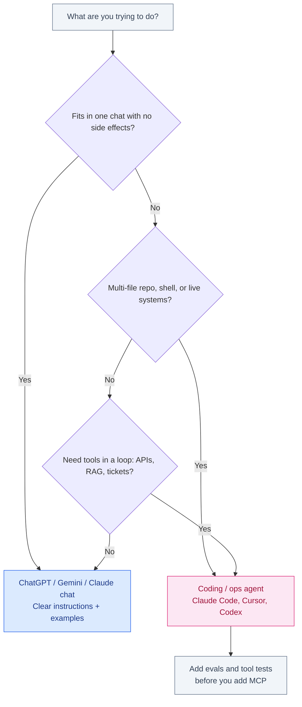

# Prompt Engineering vs AI Agents

**Do you still need to learn prompts?** Yes — but not as a stack of magic templates. Prompt engineering is how you instruct a model in one shot or one chat. AI agents are models that **loop**: they call tools, read the result, and decide the next step. You still write prompts *inside* agents (`CLAUDE.md`, skills, tool instructions). What stopped mattering is collecting “ultimate prompt packs.” What started mattering is evals, tool design, and context.

This is a beginner map for that split. It is not a claim that prompt engineering is dead, and it is not a recap of every MCP server.


## Table of contents

1. [Two different jobs](#two-jobs)
2. [What prompt engineering actually is](#prompts)
3. [What an AI agent actually is](#agents)
4. [You still prompt inside the agent](#inside)
5. [When a chat prompt is enough](#when-prompts)
6. [When you need an agent](#when-agents)
7. [MCP in one paragraph](#mcp)
8. [Decision tree](#decision)
9. [Beginner curriculum](#curriculum)
10. [FAQ](#faq)

## Two different jobs {#two-jobs}

| | Prompt engineering | AI agents |
|---|--------------------|-----------|
| **Unit of work** | One message, or a short chat | A loop: think → tool → observe → repeat |
| **What you write** | Instructions, examples, constraints | Those, plus tool schemas, memory files, stop conditions |
| **Where it lives** | ChatGPT, Gemini, Claude.ai, a system prompt | Claude Code, Cursor Agent, Codex, custom loops |
| **Failure mode** | Vague ask → vague answer | Bad tools / missing evals → confident wrong actions |
| **Skill that compounds** | Clear specs and few-shot examples | Tool design, traces, regression evals |

Prompt engineering did not get replaced. It got **demoted from the product to a layer**. The product, when the work is multi-file or operational, is the agent.


## What prompt engineering actually is {#prompts}

Prompt engineering is the craft of **telling a model what good looks like** in language:

- Role and audience (“you are reviewing a Python PR for a junior teammate”).
- Task and constraints (“return only a unified diff; do not invent files”).
- Examples (one or two input → output pairs beat a paragraph of adjectives).
- Output shape (JSON schema, markdown headings, a table).
- Refusal rules (“if the docs do not contain the answer, say you do not know”).

That is enough for a huge amount of work: brainstorming, rewriting, explaining a stack trace you paste in, drafting an email, asking ChatGPT or Gemini how a regex works.

What it is **not**:

- A secret prefix that “unlocks” the model.
- A 2,000-word persona that you paste into every chat.
- A substitute for tests, retrieval, or reading the diff.

If the entire job fits in one context window and needs no side effects, a good prompt is the whole product. For how to use the consumer chat apps as coding assistants (not agents), see [How to use ChatGPT and Gemini for coding](/blog/posts/how-to-use-chatgpt-and-gemini-for-coding/) and the product split in [ChatGPT vs Gemini vs Claude](/blog/posts/chatgpt-vs-gemini-vs-claude/).

## What an AI agent actually is {#agents}

An agent is a model allowed to **act in a loop**. Typical tools:

- Read/write files
- Run a shell (`pytest`, `git`, `npm test`)
- Search the repo or the web
- Call APIs, databases, or browsers
- Talk to MCP servers (GitHub, Figma, Slack, your internal tools)

The loop is the point. The model proposes an action, sees stdout or a file change, and continues until it hits a stop condition (tests pass, the user interrupts, a budget is spent).


That is why Claude Code, Cursor Agent, and Codex feel different from a chat box. They are not “ChatGPT with a folder attached.” They are a policy: *you may run tools until the job is done or we stop you.* The buyer’s guide for those products is [Best AI for coding](/blog/posts/best-ai-for-coding/). Setup that actually sticks (memory files, rules) is [How to use Claude Code effectively](/blog/posts/how-to-use-claude-code-effectively/).

**RAG operations** are the same shape: retrieve, generate, maybe write back, maybe re-retrieve. A single prompt over a pasted PDF is not an agent. A pipeline that chunks, embeds, retrieves, and refuses when scores are low *is* — even if a human still clicks “run.”

## You still prompt inside the agent {#inside}

Agents do not remove prompts. They **multiply** them, and they hide them in files:

| Prompt-shaped artifact | What it is for |
|------------------------|----------------|
| `CLAUDE.md` / `AGENTS.md` | Project memory: how to build, test, and what not to touch |
| Skills (`SKILL.md`) | Playbooks the agent loads when the task matches |
| Tool descriptions | When to call a tool and what the arguments mean |
| User turn | The actual job: “fix the failing CI on this PR” |
| Subagent brief | Isolated context so a specialist does not inherit the whole chat |

A thin `CLAUDE.md` still beats a viral “god prompt”:

```markdown
# Build
- `python3 -m pytest tests/ -q`

# Do not
- Do not edit `blog/posts.json` unless asked.
- Do not invent metrics.

# Verify
- Re-run tests after every non-trivial edit.
```

The quality of that file is prompt engineering. The quality of the **loop** (did tests actually run? did the agent stop?) is agent engineering.

Magic templates fail here because the next step depends on **tool output**, not on a clever first sentence. If `pytest` failed on line 40, no “think step by step” preface saves you — you need the agent to read the failure and change the code. That is evals and tools, not incantations.

For how skills, MCP, and subagents divide that work, see [Skills vs MCP vs subagents](/blog/posts/skills-vs-mcp-vs-subagents/).

## When a chat prompt is enough {#when-prompts}

Stay in ChatGPT, Gemini, or Claude.ai when:

- You can paste the whole problem (a function, an error, a one-page spec).
- There is no repo to keep consistent.
- You want a draft, an explanation, or a plan — a human will apply it.
- Side effects would be dangerous (you do not want the model to `rm` or push).
- You are learning: a Socratic chat is cheaper than an agent burning tokens on a clean tree.

Examples: “Explain this SQL plan,” “Rewrite this paragraph for a hiring manager,” “Sketch a FastAPI handler for this schema,” “What is wrong with this 40-line snippet?”

If you find yourself pasting file after file, you have already outgrown the chat. That is the signal to open an agent, not to invent a longer prompt.

| Job | Chat prompt is enough | You are kidding yourself |
|-----|----------------------|---------------------------|
| Explain a 40-line function | Yes | — |
| Draft a design doc from bullets | Yes | — |
| Rename a type across 30 files | No | Pasting each file into chat |
| “Make CI green” | No | Screenshotting logs one at a time |
| Answer from a 12-page PDF you uploaded | Often yes | — |
| Answer from a 4,000-page wiki that changes weekly | No | That is RAG + an agent or pipeline |

## When you need an agent {#when-agents}

Reach for an agent when the work **spans files, commands, or live systems**:

- Multi-file coding: rename a type, update callers, run tests, fix what broke.
- Refactors that need `grep` and judgment, not a single gist.
- RAG ops: ingest, chunk, retrieve, judge, maybe re-index.
- CI diagnosis: logs, bisect, patch, re-run.
- Anything you would otherwise do as ten copy-paste rounds in chat.

Cost and risk go up with the loop. An agent can delete the wrong file, push to the wrong branch, or “fix” tests by deleting them. That is why [AI agent testing and evaluation strategies](/blog/posts/ai-agent-testing-evaluation-strategies/) is the adult version of prompt engineering: golden tasks, tool unit tests, trace replay, and a gate that fails the build when the agent regresses.

A tiny eval is more valuable than a prettier system prompt:

```python
def test_agent_does_not_delete_tests(run_agent):
    before = set(Path("tests").rglob("test_*.py"))
    run_agent("make the suite faster")
    after = set(Path("tests").rglob("test_*.py"))
    assert after >= before
```

You still *prompt* that agent (“do not delete tests”). You **measure** whether it obeyed. Measurement is the part template-collectors skip.

Will this eat software jobs? Agents change what juniors are hired to do; they do not remove ownership. See [Will AI replace software engineers?](/blog/posts/will-ai-replace-software-engineers/).

## MCP in one paragraph {#mcp}


**MCP (Model Context Protocol)** is how an agent gets a **stable tool surface** to an external system: GitHub, Postgres, Figma, your internal API. It is plumbing — tools, resources, optional prompt templates — not a second brain. You still need a skill or `CLAUDE.md` to say *when* to use those tools. You still need evals to see if the agent called the right one. Do not start a beginner project by “adding MCP.” Start with clear instructions, then local tools (files + shell), then MCP when curl-every-session is the pain. The full split: [Skills vs MCP vs subagents](/blog/posts/skills-vs-mcp-vs-subagents/).

## Decision tree {#decision}



If you already pay for one coding tool, use that agent until a specific job (Workspace chat, terminal loop, Tab complete) forces a second bill. Product shopping: [Best AI for coding](/blog/posts/best-ai-for-coding/).

## Beginner curriculum {#curriculum}

Learn in this order. Skipping to “I built 12 MCP servers” is how people get impressive architecture diagrams and a model that still cannot follow a README.

1. **Clear instructions** — Task, constraints, output shape, when to refuse. Practice in a chat app. No tools.
2. **Examples** — One or two input → output pairs. Prefer examples over adjectives (“be concise”).
3. **Tools / agents** — Give the model files and a shell. Write a short `CLAUDE.md`. Run one real task (fix a test, add a flag). Read the trace.
4. **Evals** — Three golden tasks you re-run after every prompt or tool change. Then, and only then, MCP or extra skills.

| Week | Practice | Done when |
|------|----------|-----------|
| 1 | Chat prompts with a fixed output schema | You can get JSON that parses without begging |
| 2 | Few-shot on your actual docs, not Twitter templates | The model copies *your* style, not a generic blog voice |
| 3 | Agent on a toy repo with tests | Tests pass without you pasting files |
| 4 | One eval harness (even 5 cases) | You can tell if a prompt change helped |
| later | MCP for one daily system (GitHub is common) | The tool call is boring and logged |

Prompt courses that stop at step 2 are not useless — they are incomplete. Agent courses that skip steps 1–2 produce people who wire tools the model never calls correctly.

**Common beginner mistakes**

- Collecting 50 ChatGPT templates and never measuring a single task twice.
- Adding MCP before the agent can run `pytest` on a local repo.
- One giant `CLAUDE.md` that the model learns to skip.
- Treating a lucky session as proof the prompt is “done.”
- Asking the agent to “be careful” instead of putting the rule in a test.

The career version of this skill is the same as hiring: people who check the work outlast people who generate the first draft. That is also why [Will AI replace software engineers?](/blog/posts/will-ai-replace-software-engineers/) is a process question, not a slogan.

## FAQ {#faq}

### Do I still need to learn prompt engineering?

Yes. You need to write clear tasks, examples, and constraints. You do not need a binder of secret templates. Inside agents, those skills show up as `CLAUDE.md`, skills, and tool descriptions.

### What is the difference between a prompt and an agent?

A prompt is an instruction for one generation (or a short chat). An agent is a model allowed to call tools in a loop until a stop condition. Same underlying model; different control loop.

### Is ChatGPT an agent?

The chat app is usually prompt-in, text-out. Features that browse, run code, or call connectors are agent-shaped. Codex and Claude Code are agents even when the model family is the same as the chat product.

### When should I use Claude Code or Cursor instead of ChatGPT?

When the job is a repo: multiple files, tests, git. Chat is for plans and snippets. Details: [How to use Claude Code effectively](/blog/posts/how-to-use-claude-code-effectively/) and [Best AI for coding](/blog/posts/best-ai-for-coding/).

### Do I need MCP as a beginner?

No. Files and shell are enough to learn the loop. Add MCP when you need a stable connection to a live system you would otherwise wrap in one-off curl. See [Skills vs MCP vs subagents](/blog/posts/skills-vs-mcp-vs-subagents/).

### Why do magic prompt templates stop working in agents?

Because the next action depends on tool output, not on the first paragraph. Evals and tool design fix that; a longer persona does not.

### How do I know my agent is actually better?

Run the same golden tasks before and after the change. Log traces. Do not trust a single lucky session. See [AI agent testing and evaluation strategies](/blog/posts/ai-agent-testing-evaluation-strategies/).

### Will learning prompts still help if models get “smarter”?

Clearer specs still help smarter models — they waste fewer tokens and break fewer constraints. The unskilled part that dies first is copy-pasting viral templates. The skilled part that remains is specifying the job and checking the result.

## Related guides

- [Skills vs MCP vs Subagents](/blog/posts/skills-vs-mcp-vs-subagents/)
- [How to Use Claude Code Effectively](/blog/posts/how-to-use-claude-code-effectively/)
- [How to Use ChatGPT and Gemini for Coding](/blog/posts/how-to-use-chatgpt-and-gemini-for-coding/)
- [Best AI for Coding](/blog/posts/best-ai-for-coding/)
- [AI Agent Testing and Evaluation Strategies](/blog/posts/ai-agent-testing-evaluation-strategies/)
- [ChatGPT vs Gemini vs Claude](/blog/posts/chatgpt-vs-gemini-vs-claude/)
- [Will AI Replace Software Engineers?](/blog/posts/will-ai-replace-software-engineers/)

You still need prompts. You do not need a pack of magic ones. Instruct clearly, give the model tools only when the job loops, and measure whether it obeyed.
