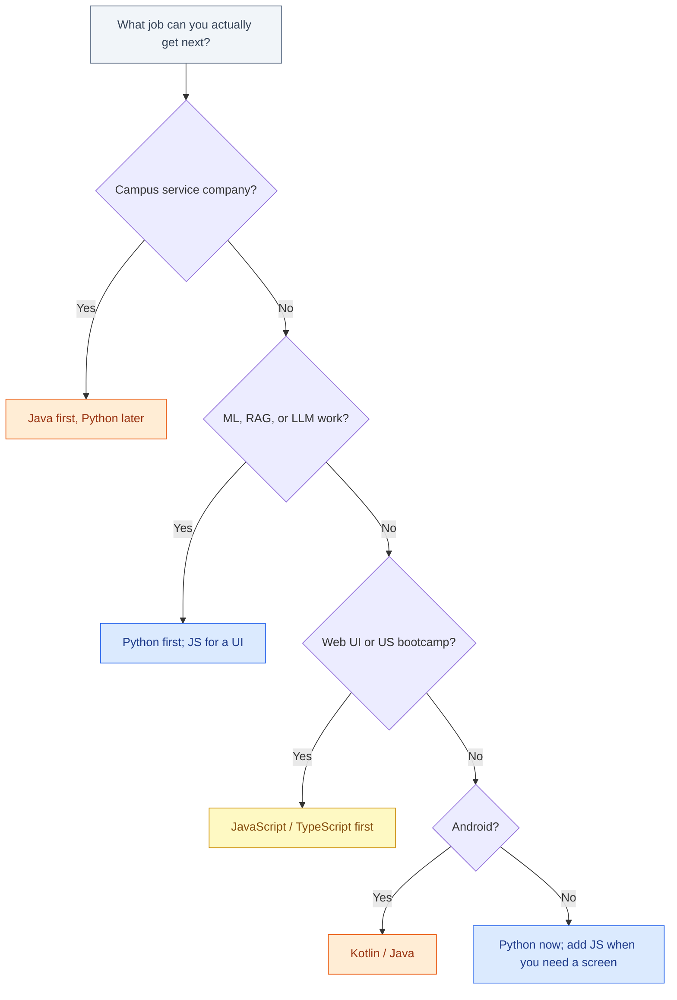

# Python vs Java vs JavaScript

The useful question is not “which language is best.” It is **which language to learn** for the job you can actually get next — in an Indian college placement, a service-company switch, a US bootcamp, or an AI-shaped role. Python, Java, and JavaScript all hire. They hire for different machines.

This post is a decision table, not a winner. Syntax arguments are cheaper than they used to be: ChatGPT, Gemini, Copilot, and Claude will draft a for-loop in all three. They will not pick your employer’s stack, and they will not sit the interview.

## Table of contents

- [Three languages, three machines](#machines)
- [What AI tools change — and what they don’t](#ai-tools)
- [Hiring: India services still Java](#india-services)
- [Hiring: startups, product, and Python/JS](#startups)
- [US bootcamps and JavaScript](#us-bootcamps)
- [AI and ML default to Python](#ai-ml)
- [Ecosystem map](#ecosystem)
- [Decision table](#table)
- [What you still have to understand](#understand)
- [If you learn two](#two)
- [A simple decision tree](#decision)
- [FAQ](#faq)

## Three languages, three machines {#machines}


**Python** is the language of scripts, data, ML, and a lot of new backend. It is the fastest path to a first shipped project and the language almost every RAG tutorial assumes.


**Java** is the language of long-lived enterprise systems: banks, insurers, telcos, and the Indian IT services machine that serves them. Spring is the stack name you will hear in campus drives. The coffee-cup mascot is optional; the JVM jobs are not.


*Unofficial JavaScript logo by Chris Williams, via [Wikimedia Commons](https://commons.wikimedia.org/wiki/File:Unofficial_JavaScript_logo_2.svg).*

**JavaScript** (and TypeScript, which is what serious teams actually type) is the language of the web: browsers, Node, and a large share of US bootcamp curricula. It is also how you ship UI around an AI backend, and how a lot of Node-based agents and tool servers get written.

| | Python | Java | JavaScript / TypeScript |
|---|--------|------|-------------------------|
| **Typical first job shape** | Backend, data, ML, scripting | Spring services, Android-adjacent, enterprise | Frontend, full-stack, Node APIs |
| **How you start** | Fast | Stricter, more ceremony | Fast in the browser; messy without TypeScript |
| **Where the tutorials are** | Dense, especially ML/RAG | Dense for Spring; thin for new AI | Dense for web; growing for Node agents |
| **AI-tool help** | Highest example density | Helpful, fewer ML tutorials | Strong for web; agents via Node |

If you want a two-language version of this argument (Python vs Java only, with campus India in more detail), see [Python vs Java with AI](/blog/posts/python-vs-java-with-ai/). This post adds JavaScript because that is the third language the job market actually uses.

## What AI tools change — and what they don’t {#ai-tools}

Copilot, ChatGPT, Gemini, and Claude help **all three** languages. Completions, refactors, tests, “explain this error” — none of that is Python-only.

What is not equal is **example density**. Models have seen more Python notebooks, more scikit-learn and PyTorch, more LangChain and FastAPI snippets, more RAG READMEs. Beginners in Python get more reliable completions on ML-shaped work because the training data is thicker. Java completions are excellent for Spring CRUD that has lived on GitHub for a decade, and weaker when you want a modern LLM eval harness. JavaScript completions are excellent for React and Node boilerplate, and uneven when you invent an agent protocol that is three months old.

So: **AI tools flatten syntax. They do not flatten ecosystems.**

| Tool | Helps you most when | Still your job |
|------|---------------------|----------------|
| **ChatGPT / Gemini** | Explaining errors, drafting functions, interview prep | Knowing whether the draft matches *your* codebase |
| **GitHub Copilot** | Inline completion in the open file | Architecture and the files you did not open |
| **Claude (and similar coding agents)** | Multi-file edits, tests, iteration | Permissions, secrets, “should we ship this” |

Practical consequence: do not pick Python *only* because Copilot is “better” at it. Pick Python if your target work lives in that ecosystem. Pick Java if the next offer is Spring. Pick JavaScript if the next offer is a web or Node role. Then use the tools in that language. A wider buyer’s guide is [best AI for coding](/blog/posts/best-ai-for-coding/); a workflow guide is [how to use ChatGPT and Gemini for coding](/blog/posts/how-to-use-chatgpt-and-gemini-for-coding/).

## Hiring: India services still Java {#india-services}

In Indian campus placements, **Java plus DSA** is still the mass-hiring language. TCS, Infosys, Wipro, Cognizant, and the rest of the services machine trained a generation on Core Java, then Spring, then whatever the client ran. Their clients still run Java. The machine has not switched to Python because a blog said AI is the future.

If you need a campus service-company offer in the next year, Java first is still the rational move. Add SQL and git. Touch Python later so you can take internal AI tickets instead of watching them go to a vendor.

JavaScript shows up on campus too — often as a “web technologies” elective — but it is rarely the language the service-company written test is built around. Treat it as a useful second skill, not as the placement bet, unless you are targeting product companies off the placement cell.

Agents do not erase this. A TCS interviewer can still ask you to write a Java snippet on a whiteboard. Copilot will not be in the room.

## Hiring: startups, product, and Python/JS {#startups}

Indian product companies, startups, and AI teams (Bangalore, Hyderabad, Pune, remote-first) hire more like the global internet: **Python for backend and ML, JavaScript/TypeScript for the client and often for Node APIs**. Java appears when the product is enterprise-shaped or the founding team came from services.

Off-campus and referral hiring looks like this world, not like the placement cell. GitHub matters. A Spring certificate from college matters less than a FastAPI or Next.js repo you can demo.

Remote work from India follows the same split with US labels. [How to get a remote software job from India](/blog/posts/how-to-get-a-remote-software-job-from-india/) is the logistics post. Language choice still reduces to: what can you show in a 30-minute screen share?

## US bootcamps and JavaScript {#us-bootcamps}

US career-switcher bootcamps standardized on **JavaScript** for a boring reason: one language can touch the browser and the server (Node), and hiring for junior web roles is large. The curriculum is HTML/CSS/JS, React, a SQL database, maybe TypeScript.

That is a coherent path into **web engineering**. It is not a path into ML research. Bootcamp grads who later want AI/ML work usually add Python as a second language — which is the right order if the first job is a React role.

If you are in a US bootcamp now, do not drop JavaScript to “switch to AI.” Finish, get the web job or the intern-shaped role, then add Python for data/LLM work. If you are choosing a bootcamp *in order to* do AI, read [Best AI, ML, and Data Science Courses](/blog/posts/best-ai-ml-data-science-course-india-us/) instead of a generic web bootcamp brochure.

Python-first US programs exist (data bootcamps, some university extension courses). Java-first US bootcamps are rarer; Java in the US is more often a CS-degree language plus enterprise hiring.

## AI and ML default to Python {#ai-ml}

This is the one score that is not close.

- **Python:** NumPy, pandas, scikit-learn, PyTorch, JAX, Hugging Face, LangChain / LlamaIndex, Jupyter, every mainstream RAG tutorial, most agent examples. If the job says ML, LLM, RAG, or evals, this is the language. See [how to build a production RAG chatbot](/blog/posts/how-to-build-a-production-rag-chatbot/).
- **JavaScript:** Strong for **web + Node agents** — the UI, the streaming chat box, MCP-style tool servers in TypeScript, Vercel/serverless wrappers. You will call a Python (or an API) model more often than you will train one in JS. That is a real career: full-stack around models.
- **Java:** Enterprise inference, Spark jobs, DJL, calling a Python scoring service from Spring. Serious, hired, and not where new AI product tutorials are written. Agents help you write the Spring side. They will not move PyTorch onto the JVM.

So: Python richest ML/RAG ecosystem; JS for web plus Node agents; Java for enterprise where AI still helps but fewer tutorials exist.

If you are choosing a first language *because you want to work on models*, choose Python. If you are choosing because you want to ship a product UI around models, JavaScript is not a detour. If you are choosing because a bank will hire you, Java is not legacy — it is the job.

## Ecosystem map {#ecosystem}

| Layer | Python | Java | JavaScript / TypeScript |
|-------|--------|------|-------------------------|
| **Web UI** | Possible (Streamlit, Django templates) — not the default career | Possible (Vaadin, JSF) — not the default career | **Default:** React, Next, Vue |
| **HTTP API** | FastAPI, Django, Flask | **Spring Boot** | Express, Nest, Next route handlers |
| **Data / ML** | **Default** | Spark, some scoring services | Thin; tf.js exists; production ML rarely lives here |
| **Agents / tools** | Python agents, LangGraph-style graphs | Possible; fewer copy-pasteable examples | Node agents, MCP servers, browser tools |
| **Mobile** | Not a career (ignore Kivy) | **Android** (Java/Kotlin) | React Native, if that is the shop |
| **Campus India** | Product/off-campus | **Service-company default** | Elective / frontend |
| **US junior web** | Data bootcamps | CS programs, enterprise | **Web bootcamp default** |

Tiny “hello” in each, only to show the texture — not to teach the language:

```python
def greet(name: str) -> str:
    return f"hello, {name}"
```

```java
public class Greet {
    static String greet(String name) {
        return "hello, " + name;
    }
}
```

```javascript
export function greet(name) {
  return `hello, ${name}`;
}
```

Agents will write all three. You still need to know where the file lives, how it is tested, and how it is deployed.

## Decision table {#table}

Use this as a default, then override it if you already have an offer path.

| If you are… | Learn first | Add second | Why |
|-------------|-------------|------------|-----|
| Indian campus, service-company target | **Java** + DSA | Python | That is what the written test and the client stack are |
| Indian off-campus / product / AI team | **Python** | TypeScript | GitHub-shaped hiring; UI still needs JS |
| Wanting Android | **Kotlin/Java** | Optional JS | The platform is the JVM/Android stack |
| US web bootcamp or junior frontend | **JavaScript/TypeScript** | Python later | One language to a first web job |
| Targeting ML / RAG / LLM engineering | **Python** | JS for a UI | Tutorial and library gravity |
| Already a Spring engineer | Keep **Java** | Python for AI side-cars | Do not throw away production depth |
| Already a React engineer | Keep **JS/TS** | Python for RAG/scripts | Same reason |
| No signal, no campus constraint | **Python** | JS | Fastest to a demo; add UI when the project needs a screen |

There is no row that says “everyone should learn X.” If someone sells you that row, they are selling a course.

## What you still have to understand {#understand}

Agents made the syntax argument cheap. They did not make these cheap:

- **Python:** pandas pipelines, vector indexes, eval sets, why retrieval missed, FastAPI auth and deploys.
- **Java:** Spring beans, security filters, JPA transactions, the way *this* company’s module is wired, Android lifecycles if that is the job.
- **JavaScript:** the browser, the bundler, async and the event loop, TypeScript types that actually constrain, CSS when you said you would not need CSS.

Those are the things interviews still poke. They are also the things that break at 2 a.m. Use AI tools to draft. Use your brain to own.

Will models eventually own more of that? Some of it. Not the “this is our production system” part on a useful timeline for your next job. [Will AI replace software engineers](/blog/posts/will-ai-replace-software-engineers/) is the longer version.

## If you learn two {#two}

Seniors who are useful in two of these three are normal. The failure mode is **three syntax collections and zero production systems**.

A workable shape:

1. One language you can ship in without an agent (you debug, test, deploy).
2. A second language you can read, review, and drive an agent in.
3. One real project in the first language you can talk about for twenty minutes.

Common pairs:

- **Java + Python** — campus or enterprise job, plus AI/scripting. Very common in India.
- **JavaScript + Python** — web job plus RAG/data. Very common in startups and US bootcamp alumni.
- **Java + JavaScript** — full-stack in an enterprise that still wants a JSP or a React front on a Spring back.

All three at once is a hobby, not a plan, until you have one shipped system.

## A simple decision tree {#decision}



Pick the language of the next job. Use ChatGPT, Gemini, Copilot, or Claude *in that language*. Add the second language when a real task or a real posting needs it — not when a tweet says the first one is dead.

## FAQ {#faq}

### Which language should I learn first for a software job?

The language of the next job you can get. In Indian campus services, that is often Java. In US web bootcamps, JavaScript. In AI/ML, Python. AI tools help all three; they do not change who is hiring you this year.

### Is JavaScript enough for AI work?

Enough to ship the product around models: UI, Node APIs, tool servers. Not enough if you want to live in the ML/RAG ecosystem, which is Python. Many strong engineers are JS-primary and Python-secondary.

### Did AI make Java obsolete?

No. Banks, insurers, telcos, and a large share of Indian IT still run on Java and Spring. Agents help you write Java faster. They do not migrate those estates to Python or Node.

### Why do AI coding tools feel better in Python?

Example density. More public ML, RAG, and notebook code exists in Python, so completions for that work are more reliable for beginners. Copilot and chat tools still help a lot in Java and JavaScript for web and enterprise patterns.

### Should I learn TypeScript or JavaScript?

If you are serious about JS for a job, learn TypeScript as soon as you can stand it. Hiring is increasingly TS-shaped. JavaScript is the runtime; TypeScript is what teams want in the repo.

### Can I be employable in all three?

Eventually, as a senior who reads PRs. As a plan for year one: one language deep, a second good enough to drive an agent, zero as a third until you have shipped something.

## Related guides

- [How to Use ChatGPT and Gemini for Coding](/blog/posts/how-to-use-chatgpt-and-gemini-for-coding/)
- [Best AI for Coding](/blog/posts/best-ai-for-coding/)
- [Best AI, ML, and Data Science Courses](/blog/posts/best-ai-ml-data-science-course-india-us/)
- [How to Get a Remote Software Job from India](/blog/posts/how-to-get-a-remote-software-job-from-india/)
- [Will AI Replace Software Engineers?](/blog/posts/will-ai-replace-software-engineers/)
- [How to Build a Production RAG Chatbot](/blog/posts/how-to-build-a-production-rag-chatbot/)

Agents made the syntax war cheap. They did not make Spring shops disappear, they did not move PyTorch into the browser, and they did not cancel JavaScript on the web. Pick the stack of the next job, ship something in it, then add the next language when you have a reason.
