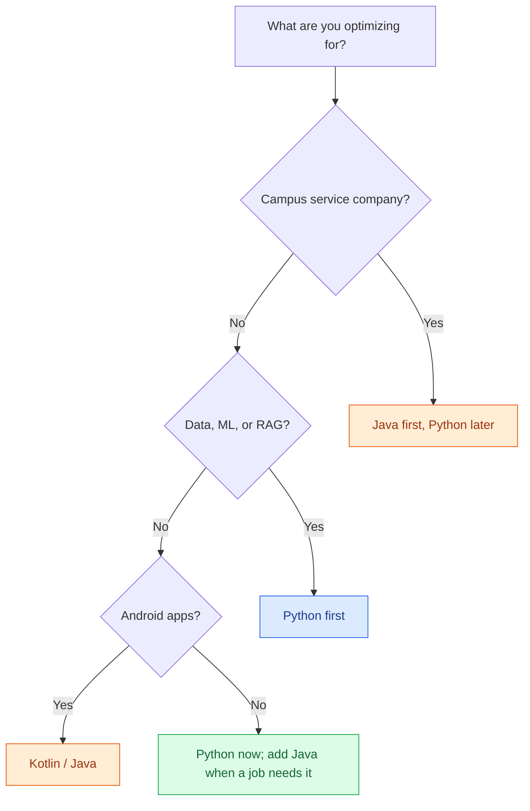

# Python vs Java with AI

The old Python vs Java argument was about syntax, speed, and whose tutorial was nicer. That argument is mostly over. Copilot, Claude Code, and Cursor will write a for-loop in either language while you are still deciding the variable name.

The argument that remains is about **jobs, ecosystems, and what the agent cannot fake**: Spring internals, Android lifecycles, pandas pipelines, production ops. This post is that argument — not a syntax war.

## Table of contents

- [Not a syntax war](#not-syntax)
- [What coding agents changed](#agents)
- [Jobs: backend, Android, data and ML](#jobs)
- [Ecosystem: Spring vs FastAPI and Django](#ecosystem)
- [AI libraries: Python wins ML, Java keeps enterprise](#ai-libs)
- [Campus India: TCS and Infosys vs startups](#india)
- [What to learn first](#first)
- [Both is fine](#both)
- [A decision tree](#decision)
- [FAQ](#faq)

## Not a syntax war {#not-syntax}

You can still find threads that count semicolons and indentation. They are entertainment. For a career, the relevant differences are:

- **Who hires it** in your city and remote market.
- **Which libraries and runtimes** those employers already run.
- **How well agents and tutorials** cover that stack when you are stuck.
- **What you still have to understand** after the agent drafts the file.

Python is easier to start. Java is stricter and more verbose. Agents flatten that gap. They do not flatten the gap between "I generated a Spring Boot service that I cannot debug" and "I know why the bean did not load."

If you want language fundamentals with exercises, use the stackcone tracks: [Python](/learn/programming/python/hello-world/), [Java](/learn/programming/java/hello-world/), and [frameworks](/learn/frameworks/) (FastAPI, Django, Spring).

## What coding agents changed {#agents}

Three products changed the daily cost of writing code. None of them changed the daily cost of owning a system.

| Tool | What it is good at | What still sits with you |
|------|--------------------|--------------------------|
| **GitHub Copilot** | Inline completion, boilerplate, tests in the open file | Architecture, the files you did not open, review |
| **Cursor** | Repo-aware edits, chat over many files | Whether the edit was the right one; evals; prod |
| **Claude Code** | Terminal agent: tests, multi-file changes, iteration | Permissions, secrets, "should we ship this" |

Agents are stronger in Python for AI-shaped work because the training data and the libraries are Python-heavy. They are plenty strong in Java for CRUD, tests, and Spring patterns that have been on GitHub for a decade. They are weaker in both languages when the problem is *your* legacy module with no comments.

The calculus shift is this: **picking a language because it has fewer lines of syntax is a weak reason now.** Picking a language because it is what your next employer runs, or because the AI/data ecosystem lives there, is still a strong reason. For a wider look at tools, see [best AI for coding](/blog/posts/best-ai-for-coding/). For what that does to hiring, see [will AI take coding jobs](/blog/posts/will-ai-take-coding-jobs/).

## Jobs: backend, Android, data and ML {#jobs}

Talk in roles, not in "which language is better."

| Role | Python | Java | With agents |
|------|--------|------|-------------|
| **Backend / APIs** | FastAPI, Django, Flask — startups, SaaS, AI products | Spring Boot — banks, IT services, large product companies | Agents draft controllers in both; you still own auth, transactions, ops |
| **Android** | Rare as the app language (Kivy is not a career) | Java and Kotlin are the platform | Agents help, but Android APIs and lifecycles are the skill |
| **Data / ML / RAG** | Default: notebooks, PyTorch, RAG stacks | Spark, some enterprise scoring services | Python is the language agents expect for this work |
| **Enterprise integration** | Glue scripts, ETL, internal tools | The system of record is often still Java | Agents write the glue; the domain lives in Java services |

Remote hiring from India follows the same split with different labels. US startups posting on job boards want Python + cloud + "comfortable with AI tools." Large product companies and banks want Java (or Kotlin) plus the domain. A practical remote-job path is in [how to get a remote tech job from India](/blog/posts/how-to-get-a-remote-tech-job-from-india/).

Kotlin sits next to Java on the JVM. If your goal is Android, learn Kotlin and treat Java as the language you can read. This post still says "Java" because that is what campus placements and Spring shops call the stack.

## Ecosystem: Spring vs FastAPI and Django {#ecosystem}

Languages do not get you hired. Stacks do.

|  | Python web | Java web |
|--|------------|----------|
| **Default framework** | FastAPI for APIs; Django when you want batteries included | Spring Boot |
| **Feel** | Small surface, you compose libraries | Large platform: DI, security, data, messaging |
| **Hiring signal** | Ship a service, tests, Docker, one cloud deploy | Understand beans, Spring Security, JPA, the way the company already works |
| **Agent fit** | Excellent. Short files, popular snippets | Good at generating, easy to generate a mess of annotations you do not understand |
| **Ops culture** | Containers, serverless, "just run uvicorn" | App servers, JVM tuning, long-lived services |

Django still matters for CRUD products and admin-heavy internal tools. FastAPI is the current default for Python APIs and for wrapping RAG or agent backends. Flask is what you inherit. On the Java side, Spring is the default; Quarkus and Micronaut show up in newer JVM shops but will not decide your first job.

Do not learn "Python" or "Java" in the abstract for six months. Learn enough language to read errors, then pick one framework and ship something that has auth, a database, and tests. The [frameworks track](/learn/frameworks/) is built that way.

## AI libraries: Python wins ML, Java keeps enterprise {#ai-libs}

This is the one place the score is not close.

- **Python:** NumPy, pandas, scikit-learn, PyTorch, JAX, Hugging Face, LangChain / LlamaIndex, every RAG tutorial, every agent demo, Jupyter. If you want to work on models, evals, or RAG, this is the language.
- **Java:** Deep Java libraries exist (DJL, Tribuo, Spark MLlib, ONNX Runtime). Banks use them. They are not where new AI product work is happening, and agents have far less high-quality Java ML code to copy.

Enterprise Java teams still need people who can *call* a Python scoring service from a Spring app, or run Spark jobs on the JVM. That is integration, not research. If your identity is "I want to build AI products," start Python. If your identity is "I want to be the person who keeps the bank's platform alive while it grows an AI side-car," Java (plus enough Python to read the side-car) is a serious career.

The skills that sit on top of either language — RAG, evals, agents — are covered in [best AI courses and skills to learn](/blog/posts/best-ai-courses-and-skills-to-learn/).

## Campus India: TCS and Infosys vs startups {#india}

In Indian campus placements, **Java is still the mass-hiring language**. TCS, Infosys, Wipro, Cognizant, and the rest of the service-company machine trained a generation on Core Java, then Spring, then whatever the client ran. That machine has not switched to Python because a blog said so. Their clients run Java.

Startups, product companies, and AI/ML teams in Bangalore, Hyderabad, Pune, and remote-first shops hire Python as the default, plus JavaScript/TypeScript on the front. Off-campus and referral hiring looks more like that world than like the placement cell.

| Path | What they screen | What to learn |
|------|------------------|---------------|
| **Service-company campus** | DSA + Core Java, sometimes Spring basics | Java first; Python as a second language after you have an offer |
| **Product / startup / AI** | Projects, GitHub, Python, SQL, system sense | Python first; Java later if the team needs it |
| **Android shops** | Kotlin/Java, app portfolio | Kotlin/Java; Python is optional |
| **US remote / freelance** | Shipped work, English writing, a stack you can demo | Usually Python + JS, or Java if you already have Spring depth |

A common mistake is treating Twitter as the labour market. Another is treating the placement cell as the whole labour market. They are different markets that happen to share a campus.

Agents do not erase this. A TCS interviewer can still ask you to write a Java snippet on a whiteboard. A startup interviewer can still ask you to explain a FastAPI repo you claim you built. The agent helps you prepare. It will not sit the round for you, and it will not rewrite the employer's stack.

## What to learn first {#first}

Use this as a default, then override it if you already have a job target.

1. **If you need a campus service-company offer in the next year:** Java + DSA. Add SQL and git. Touch Python later so you are not locked out of internal AI projects.
2. **If you want data, ML, RAG, or AI product work:** Python + SQL + git, then a small FastAPI service, then RAG. Java is optional until a specific job asks.
3. **If you want Android:** Kotlin (and enough Java to read older code). Python is a side language for scripts.
4. **If you have no signal yet:** Python. Faster to a first shipped project, better agent support for the AI-shaped work that is growing, easy to add Java later. The [Python track](/learn/programming/python/hello-world/) is the shortest path to that first project.

In all four cases, learn git on day one. Agents produce diffs. If you cannot review a diff, you cannot use an agent safely. SQL is the other non-negotiable: both ecosystems talk to databases, and interviews still use it as a filter.

## Both is fine {#both}

The industry is not asking you to marry a language. Seniors who move between Python services and JVM services are normal. The failure mode is **two shallow syntax collections and zero production systems**.

A workable shape:

- One language you can ship in without an agent (you debug, you test, you deploy).
- A second language you can read, review, and drive an agent in.
- One real project in the first language that you can talk about for twenty minutes.

If you already know Java from college, do not throw it away because Python is fashionable. Keep Java, add Python for AI and scripting. If you already know Python, adding enough Java to survive a Spring codebase is a few focused months, not a new personality. Agents make the second language cheaper than they make the first.

## A decision tree {#decision}

Pick the language of the next job you can actually get. Agents make the second language cheaper; they do not pick the job for you.

## FAQ {#faq}

### Should I learn Python or Java first if I use Copilot or Claude Code?

Learn the language of the job you can get next, then add the other. Agents make syntax cheaper; they do not make Spring internals, Android lifecycles, or pandas pipelines cheap. If you are targeting campus service companies in India, Java still opens more doors. If you are targeting data, ML, or startups, start with Python.

### Did AI make Java obsolete?

No. Banks, insurers, telcos, and a large share of Indian IT still run on Java and Spring. Agents help you write Java faster. They do not migrate those estates to Python.

### Is Python enough for a backend career now?

Yes in startups, SaaS, and AI-adjacent teams — FastAPI and Django are hired. It is not enough if your target employers are Spring shops. Read the job posts in your city, not Twitter.

### Can I be employable in both Python and Java?

Yes, and that is a normal senior shape. One language deep enough to ship, the other good enough to read a PR and use an agent without getting lost. Do not collect syntax; collect one production system in each.

### Which language is better for AI and machine learning?

Python, by a wide margin: PyTorch, JAX, Hugging Face, LangChain, the RAG ecosystem, notebooks. Java still shows up in enterprise inference and Spark jobs, but the research and tooling gravity is Python.

## Related guides

- [Best AI Courses and Skills to Learn](/blog/posts/best-ai-courses-and-skills-to-learn/)
- [Will AI Take Coding Jobs?](/blog/posts/will-ai-take-coding-jobs/)
- [Best AI for Coding](/blog/posts/best-ai-for-coding/)
- [How to Get a Remote Tech Job from India](/blog/posts/how-to-get-a-remote-tech-job-from-india/)

Agents made the syntax argument cheap. They did not make Spring shops disappear, and they did not move PyTorch to the JVM. Pick the stack of the next job, ship something in it, then add the other language when you have a reason.
