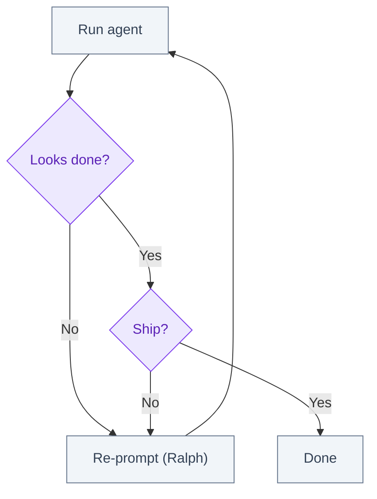
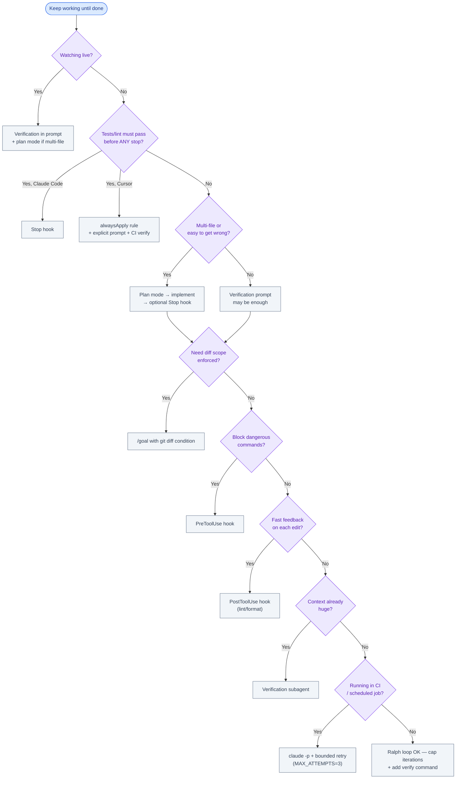

# Ralph Loop Alternatives for Claude Code and Cursor

August 2026 · Published by Amar Kumar

You have probably seen the **Ralph loop** meme: paste a prompt, let Claude run in a loop, walk away, come back to finished code. The pattern works — but it is blunt. No verification gates, context bloats, and loops burn tokens on repeated mistakes.

The **Ralph loop** (named after Ralph Wiggum from *The Simpsons*) is an iterative pattern — run the agent, check if done, if not run again with the same or updated prompt until completion. It works, but it is blunt: no verification gates, context bloats, and loops burn tokens on repeated mistakes.

This guide covers **better alternatives** built into Claude Code and Cursor — `/goal`, Stop hooks, PreToolUse and PostToolUse gates, verification subagents, plan mode, and CI headless runs — that achieve "keep working until done" with less waste. Every alternative includes a **full worked example** you can copy into a real repo.

**Related:** [How to Use Claude Code Effectively](/blog/posts/how-to-use-claude-code-effectively/) · [Skills vs Rules](/blog/posts/skills-vs-rules-claude-code-cursor/)

## Table of contents

1. [Origin of the Ralph loop](#origin)
2. [When people use Ralph loops](#when-ralph)
3. [Why alternatives are better](#why-alternatives)
4. [Alternative 1: Verification in the prompt](#verification-prompt)
5. [Alternative 2: `/goal` condition](#goal)
6. [Alternative 3: Hooks (Stop, PreToolUse, PostToolUse)](#stop-hooks)
7. [Alternative 4: Verification subagent](#verification-subagent)
8. [Alternative 5: Plan mode then implement](#plan-mode)
9. [Alternative 6: Headless CI (`claude -p`)](#headless)
10. [Cursor-specific patterns](#cursor)
11. [Failure modes and debugging stalled loops](#failure-modes)
12. [Decision tree: which alternative to pick](#decision-tree)
13. [Comparison table](#comparison)
14. [FAQ](#faq)

## Origin of the Ralph loop

The name comes from Ralph Wiggum — the Simpsons character who keeps trying the same thing with cheerful persistence despite obvious failure. In AI coding circles, "Ralph loop" became shorthand for:

1. Give the agent a task
2. Let it run until it stops
3. If not done, re-prompt with "continue" or the same instructions
4. Repeat

The pattern predates any single tool. Early ChatGPT users pasted "keep going" after every truncation. Terminal-agent users wrapped `claude`, `aider`, or custom scripts in `while` loops. The Ralph meme crystallized when developers realized **persistence without verification** looks productive but often re-implements the same bug three times.

Core insight the community extracted: **the loop is fine; the missing piece is a machine-checkable done condition.**



Better patterns insert a **verification step** between "agent stopped" and "actually done."

## When people use Ralph loops

Ralph loops appear in predictable situations:

| Situation | Why Ralph feels tempting | What goes wrong |
|-----------|--------------------------|-----------------|
| Long refactor | Agent stops after 20 files; you want it to finish | Context fills; later iterations re-read everything |
| "Fix until tests pass" | Simple mental model | Agent declares victory without running tests |
| Overnight runs | Walk away, check morning | Unbounded spend; same error looped 40 times |
| CI automation | Shell script is easy | No exit-code discipline; silent partial fixes |
| New tool onboarding | Fastest thing that "works" | No project memory; every iteration starts cold |

**Use a Ralph loop when:** you are prototyping, the task is tiny, or you are actively watching and intervening.

**Stop using Ralph when:** tests must pass, money or time is bounded, or you have walked away from the session.

## Why alternatives are better

| Ralph loop problem | Built-in alternative |
|--------------------|----------------------|
| Claude stops when it *looks* done | Verification command in prompt or Stop hook |
| Same mistakes every iteration | Plan mode first; fresh subagent for review |
| Context window fills | Subagent isolates exploration; main thread stays clean |
| No hard stop condition | `/goal` with evaluator |
| Manual re-prompting | Stop hook blocks turn until check passes |
| Edits land before checks | PostToolUse hook runs lint on touched files |
| Dangerous commands slip through | PreToolUse hook blocks `git push --force` |

**Rule:** replace "loop until I say stop" with "loop until **check passes**."

---

## Alternative 1: Verification in the prompt

Simplest upgrade — no config files. You encode done criteria and the verification command directly in the task.

### Worked example: rate limiting on login

**Task:** Add rate limiting to `POST /api/login` in a Node/Express API.

**Prompt:**

```
Add rate limiting to POST /api/login — max 10 requests per minute per IP.

Requirements:
- Use express-rate-limit (already in package.json)
- Return 429 with { error: "Too many requests" }
- Write src/api/login.rate-limit.test.ts that sends 11 requests and expects 429 on the 11th

Verification:
Run `pnpm test src/api/login.rate-limit.test.ts` and fix until green.
Do not stop until the test passes.
Show me the final test output.
```

**Why this beats Ralph:** Claude loops internally on test failures within a single session. You are not re-pasting "continue" every five minutes.

**Soft limit:** Claude can still skip the test or misread output. For hard enforcement, add a Stop hook (Alternative 3).

### Worked example: `CLAUDE.md` verification block

Add a standing verification instruction so every session inherits it:

```markdown
# acme-api

## Commands
- Test: `pnpm test`
- Lint: `pnpm lint`
- Typecheck: `pnpm typecheck`

## Verification (required before stopping)
After any code change:
1. Run `pnpm typecheck`
2. Run `pnpm test` for the touched package
3. If either fails, fix and re-run until green

Do not declare the task complete until both commands exit 0.
```

Pair with prompts that reference the verification block:

```
@CLAUDE.md Add OAuth callback handler per issue #412.
Follow the Verification section before stopping.
```

---

## Alternative 2: `/goal` condition

Claude Code `/goal` sets a **completion condition** evaluated after every turn. A separate evaluator checks whether the goal is met; Claude keeps working until it resolves or hits a stall limit.

### Worked example: scoped diff + green tests

**Scenario:** Fix login bug but only touch files under `src/api/login/`.

```
/goal All tests in `pnpm test` pass AND `git diff --name-only` only lists paths under src/api/login/
```

Then your implementation prompt:

```
Fix the session expiry bug in src/api/login/session.ts (issue #842).
The refresh token should rotate on use. Match error handling in session.test.ts.
```

**What happens:**

1. Claude implements the fix
2. Tries to end the turn
3. Evaluator checks: tests green? diff scoped?
4. If no → Claude continues without you re-prompting
5. If yes → turn ends

### Worked example: documentation goal

```
/goal README.md contains a "Rate limiting" section with curl example, and `pnpm test` exits 0
```

```
Document the new POST /api/login rate limit in README.md.
Include a curl example that shows a 429 response.
```

### When to use `/goal`

| Use `/goal` | Skip `/goal` |
|-------------|--------------|
| Walking away mid-session | One-line typo fix |
| Diff scope matters (security, billing) | Exploratory spike |
| Multiple criteria (tests + files + docs) | You are pair-programming live |

**vs Ralph:** Explicit, evaluable done criteria instead of vague "keep going."

---

## Alternative 3: Hooks (Stop, PreToolUse, PostToolUse)

Claude Code hooks run shell commands at lifecycle points. They are **hard gates** — unlike prompt instructions, a failing hook blocks the action.

| Hook | Fires when | Blocks if exit ≠ 0 |
|------|------------|-------------------|
| **Stop** | Claude tries to end a turn | Turn continues (max 8 consecutive blocks) |
| **PreToolUse** | Before a tool runs (Bash, Edit, etc.) | Tool call is denied |
| **PostToolUse** | After a tool completes | Next step blocked until resolved |

Hooks live in `.claude/settings.json` (team) or `.claude/settings.local.json` (personal, gitignored).

### Complete `settings.json` — all three hook types

```json
{
  "permissions": {
    "allow": [
      "Bash(pnpm test *)",
      "Bash(pnpm lint *)",
      "Bash(pnpm typecheck)"
    ],
    "deny": [
      "Read(.env)",
      "Read(.env.*)"
    ]
  },
  "hooks": {
    "PreToolUse": [
      {
        "matcher": "Bash",
        "hooks": [
          {
            "type": "command",
            "command": ".claude/hooks/prevent-dangerous-git.sh"
          }
        ]
      }
    ],
    "PostToolUse": [
      {
        "matcher": "Edit|Write",
        "hooks": [
          {
            "type": "command",
            "command": ".claude/hooks/lint-touched-files.sh"
          }
        ]
      }
    ],
    "Stop": [
      {
        "matcher": "",
        "hooks": [
          {
            "type": "command",
            "command": ".claude/hooks/verify-before-stop.sh"
          }
        ]
      }
    ]
  }
}
```

### Hook script: `prevent-dangerous-git.sh` (PreToolUse)

Blocks destructive git commands before they run:

```bash
#!/usr/bin/env bash
# .claude/hooks/prevent-dangerous-git.sh
# PreToolUse — reads tool input from stdin (JSON)

set -euo pipefail

INPUT=$(cat)
COMMAND=$(echo "$INPUT" | jq -r '.tool_input.command // empty')

if [[ -z "$COMMAND" ]]; then
  exit 0
fi

BLOCKED_PATTERNS=(
  'git push --force'
  'git push -f'
  'git reset --hard'
  'git clean -fd'
  'rm -rf /'
  'rm -rf /*'
)

for pattern in "${BLOCKED_PATTERNS[@]}"; do
  if [[ "$COMMAND" == *"$pattern"* ]]; then
    echo "Blocked by PreToolUse hook: command matches '$pattern'" >&2
    exit 2
  fi
done

exit 0
```

Make executable: `chmod +x .claude/hooks/prevent-dangerous-git.sh`

### Hook script: `lint-touched-files.sh` (PostToolUse)

Runs ESLint on edited TypeScript files immediately after each edit:

```bash
#!/usr/bin/env bash
# .claude/hooks/lint-touched-files.sh
# PostToolUse — lint files Claude just edited

set -euo pipefail

INPUT=$(cat)
FILE_PATH=$(echo "$INPUT" | jq -r '.tool_input.file_path // empty')

if [[ -z "$FILE_PATH" ]]; then
  exit 0
fi

# Only lint TypeScript under src/
if [[ "$FILE_PATH" == src/*.ts ]] || [[ "$FILE_PATH" == src/*.tsx ]]; then
  echo "PostToolUse: linting $FILE_PATH" >&2
  pnpm exec eslint "$FILE_PATH" --max-warnings 0
fi

exit 0
```

### Hook script: `verify-before-stop.sh` (Stop)

Full verification gate — tests, lint, typecheck — before any turn ends:

```bash
#!/usr/bin/env bash
# .claude/hooks/verify-before-stop.sh
# Stop hook — must pass before Claude ends a turn

set -euo pipefail

echo "Stop hook: running verification suite..." >&2

pnpm typecheck || {
  echo "Stop hook FAILED: typecheck" >&2
  exit 1
}

pnpm lint || {
  echo "Stop hook FAILED: lint" >&2
  exit 1
}

pnpm test --passWithNoTests || {
  echo "Stop hook FAILED: tests" >&2
  exit 1
}

echo "Stop hook: all checks passed" >&2
exit 0
```

### Stop hook — minimal test-only variant

For repos where full lint on every stop is too slow:

```json
{
  "hooks": {
    "Stop": [
      {
        "matcher": "",
        "hooks": [
          {
            "type": "command",
            "command": "pnpm test --passWithNoTests"
          }
        ]
      }
    ]
  }
}
```

### Stop hook — scoped to API changes

Run heavier checks only when API files changed:

```bash
#!/usr/bin/env bash
# .claude/hooks/verify-api-stop.sh

set -euo pipefail

if git diff --name-only | grep -q '^src/api/'; then
  echo "API files changed — running api test suite" >&2
  pnpm test src/api/
else
  echo "No api changes — running smoke tests" >&2
  pnpm test --passWithNoTests --testPathIgnorePatterns=integration
fi
```

```json
{
  "hooks": {
    "Stop": [{
      "matcher": "",
      "hooks": [{
        "type": "command",
        "command": ".claude/hooks/verify-api-stop.sh"
      }]
    }]
  }
}
```

### PostToolUse — format on save

Auto-format after every write:

```json
{
  "hooks": {
    "PostToolUse": [
      {
        "matcher": "Edit|Write",
        "hooks": [
          {
            "type": "command",
            "command": "pnpm exec prettier --write $(jq -r '.tool_input.file_path')"
          }
        ]
      }
    ]
  }
}
```

For production, prefer a wrapper script that validates `file_path` exists before formatting.

### Hook behavior limits

- **Stop hook:** After **8 consecutive blocks**, Claude Code overrides and stops anyway. Design hooks to fail fast with actionable stderr output.
- **PreToolUse:** Exit code `2` = block with message to Claude. Other non-zero = error.
- **PostToolUse:** Failures force Claude to fix before proceeding — catches drift early instead of at Stop.

**vs Ralph:** Deterministic enforcement. Ralph relies on Claude deciding to continue.

Claude can also write hooks for you: *"Write a Stop hook that runs `pnpm test src/billing/` when files under `src/billing/` changed."*

---

## Alternative 4: Verification subagent

Spawn a **fresh subagent** to review work the main agent cannot grade itself. The subagent gets a clean context window — no 200k tokens of failed attempts.

### Worked example: diff review against plan

**Phase 1 — plan (main agent or plan mode):**

```
Read src/auth/ and design OAuth callback flow for Google sign-in.
Output a numbered plan with files to create/modify. Do not edit yet.
```

**Phase 2 — implement:**

```
Implement the OAuth callback plan. Run pnpm test src/auth/ after.
```

**Phase 3 — verification subagent:**

```
Use a subagent to review the current git diff against this plan:

1. src/auth/oauth/google.ts — callback handler
2. src/auth/oauth/google.test.ts — happy path + invalid state
3. src/api/routes/auth.ts — wire GET /auth/google/callback
4. All responses use { data, error } envelope

Reject if:
- Tests are missing for error cases
- State parameter is not validated
- Any file outside src/auth/ or src/api/routes/ was modified

Return PASS or a bullet list of blockers.
```

If the subagent returns blockers, the main agent fixes and re-runs review.

### Worked example: `/code-review` skill

Claude Code's built-in review skill isolates the diff:

```
/code-review

Focus on:
- SQL injection in new query builders
- Missing input validation on POST /api/users
```

### Subagent prompt template

```
Subagent task: verification only — do not edit files.

Context:
- Plan: [paste plan]
- Verification command: pnpm test src/feature/

Check:
1. Run the verification command
2. Compare diff to plan scope
3. Return structured result:

VERDICT: PASS | FAIL
TESTS: pass | fail (paste last 20 lines if fail)
SCOPE: ok | drift (list extra files)
BLOCKERS: (empty if PASS)
```

**Use when:** Correctness checks need a second opinion; main transcript is already bloated.

**vs Ralph:** Fresh context for review; Ralph reuses the same bloated thread and re-argues old mistakes.

---

## Alternative 5: Plan mode then implement

Press `Shift+Tab` for plan mode (or start with `claude --permission-mode plan`). Claude explores and plans **without editing**. Approve the plan, switch to implement mode, verify against the plan.

### Worked example: OAuth callback (two-phase)

**Phase 1 — plan mode:**

```
Read src/auth/ and design OAuth callback flow for Google sign-in.
List files to create/modify, error cases, and test strategy.
Do not edit any files.
```

Example plan output (abbreviated):

```
1. Create src/auth/oauth/google.ts — exchange code, validate state
2. Create src/auth/oauth/google.test.ts — mock Google token endpoint
3. Update src/api/routes/auth.ts — add GET /auth/google/callback
4. Update CLAUDE.md — document env vars GOOGLE_CLIENT_ID, GOOGLE_CLIENT_SECRET
5. Tests: pnpm test src/auth/oauth/
```

**Phase 2 — implement mode:**

```
Implement the OAuth plan above exactly.
After each file, run pnpm test src/auth/oauth/.
Do not add files not in the plan without asking.
```

**Phase 3 — optional Stop hook or subagent review** (Alternatives 3 and 4).

### Worked example: plan mode for database migration

```
Plan mode: Design a migration to add `last_login_at` to users table.
- Drizzle schema change in src/db/schema/users.ts
- Migration file naming convention: YYYYMMDD_description.sql
- Backfill strategy for existing rows
- Rollback plan

Do not run migrations or edit files.
```

After approval:

```
Implement the migration plan. Run pnpm test src/db/ and pnpm typecheck before stopping.
```

**Use when:** Ralph loops fail because Claude solves the wrong problem each iteration.

**vs Ralph:** Separates exploration from execution — fewer wrong-direction loops.

---

## Alternative 6: Headless CI (`claude -p`)

`claude -p` runs a single prompt non-interactively and exits. Pair with `CLAUDE.md` for project context. Wrap in a shell script for **bounded retries** — the CI-native alternative to infinite Ralph loops.

### Complete CI script with bounded retries

Save as `scripts/claude-fix-loop.sh`:

```bash
#!/usr/bin/env bash
# scripts/claude-fix-loop.sh
# Bounded agent retry loop for CI — NOT an unbounded Ralph loop.
#
# Usage:
#   ./scripts/claude-fix-loop.sh "Fix failing test in src/api/health.test.ts"
#   MAX_ATTEMPTS=5 ./scripts/claude-fix-loop.sh "$PROMPT"
#
# Exit codes:
#   0 — verification passed
#   1 — exhausted retries or verification failed
#   2 — missing dependencies

set -euo pipefail

PROMPT="${1:-}"
MAX_ATTEMPTS="${MAX_ATTEMPTS:-3}"
VERIFY_CMD="${VERIFY_CMD:-pnpm test --passWithNoTests}"
CLAUDE_TIMEOUT="${CLAUDE_TIMEOUT:-1800}"
LOG_DIR="${LOG_DIR:-./.claude-ci-logs}"

if [[ -z "$PROMPT" ]]; then
  echo "Usage: $0 \"<prompt>\"" >&2
  exit 2
fi

if ! command -v claude &>/dev/null; then
  echo "claude CLI not found" >&2
  exit 2
fi

mkdir -p "$LOG_DIR"
TIMESTAMP=$(date +%Y%m%d-%H%M%S)

echo "=== Claude CI fix loop ==="
echo "Max attempts: $MAX_ATTEMPTS"
echo "Verify cmd:   $VERIFY_CMD"
echo "Prompt:       $PROMPT"
echo ""

for attempt in $(seq 1 "$MAX_ATTEMPTS"); do
  LOG_FILE="$LOG_DIR/run-${TIMESTAMP}-attempt-${attempt}.log"
  echo "--- Attempt $attempt / $MAX_ATTEMPTS ---"

  # Run agent with timeout
  if timeout "$CLAUDE_TIMEOUT" claude -p "$PROMPT" 2>&1 | tee "$LOG_FILE"; then
    AGENT_EXIT=0
  else
    AGENT_EXIT=$?
    echo "Agent exited with code $AGENT_EXIT (log: $LOG_FILE)" >&2
  fi

  # Always verify — agent may exit 0 without fixing
  echo "Running verification: $VERIFY_CMD"
  if eval "$VERIFY_CMD"; then
    echo "Verification passed on attempt $attempt"
    exit 0
  fi

  echo "Verification failed on attempt $attempt" >&2

  if [[ "$attempt" -lt "$MAX_ATTEMPTS" ]]; then
    # Enrich prompt for next attempt with signal, not blind "continue"
    PROMPT="Previous attempt failed verification ($VERIFY_CMD).

Read the test/lint output in the repo state. Diagnose root cause.
Do not repeat the same fix if it already failed.

Original task: ${1}"
  fi
done

echo "FAILED: exhausted $MAX_ATTEMPTS attempts" >&2
echo "Logs in $LOG_DIR" >&2
exit 1
```

Make executable: `chmod +x scripts/claude-fix-loop.sh`

### GitHub Actions workflow

```yaml
# .github/workflows/claude-fix.yml
name: Claude fix loop

on:
  workflow_dispatch:
    inputs:
      prompt:
        description: "Agent prompt"
        required: true
        default: "Fix failing CI tests. Run pnpm test after."

jobs:
  claude-fix:
    runs-on: ubuntu-latest
    timeout-minutes: 45
    steps:
      - uses: actions/checkout@v4

      - uses: pnpm/action-setup@v4
        with:
          version: 9

      - uses: actions/setup-node@v4
        with:
          node-version: 22
          cache: pnpm

      - run: pnpm install --frozen-lockfile

      - name: Run bounded Claude fix loop
        env:
          ANTHROPIC_API_KEY: ${{ secrets.ANTHROPIC_API_KEY }}
          MAX_ATTEMPTS: 3
          VERIFY_CMD: pnpm test --passWithNoTests
        run: ./scripts/claude-fix-loop.sh "${{ github.event.inputs.prompt }}"

      - name: Upload agent logs on failure
        if: failure()
        uses: actions/upload-artifact@v4
        with:
          name: claude-ci-logs
          path: .claude-ci-logs/
```

### `CLAUDE.md` for CI context

CI sessions do not have your chat history. Put standing instructions in the repo:

```markdown
# acme-api

## CI agent instructions
- Run `pnpm test` after every fix attempt
- Do not modify .github/workflows/ without explicit instruction
- Create a branch `claude/ci-fix-*` — never commit directly to main
- Max scope: fix the failing test, do not refactor unrelated code

## Commands
- Test: `pnpm test`
- Lint: `pnpm lint`
```

### Single-shot `claude -p` (no retry wrapper)

For simple, bounded tasks:

```bash
claude -p "Fix failing test in src/api/health.test.ts. Run pnpm test after. Stop when green."
```

**Use when:** Scheduled fix loops, PR comment bots, nightly maintenance.

**vs Ralph:** Bounded retries, explicit exit codes, enriched prompts on failure instead of copy-paste "continue."

---

## Cursor-specific patterns

Cursor Agent does not have Claude Code's Stop hooks yet. You replicate "keep working until done" with **rules**, **explicit prompts**, **@ file context**, and **CI re-runs**.

### Project rule: verification before finish

`.cursor/rules/verify-before-done.mdc`:

```markdown
---
description: Require test verification before completing agent tasks
alwaysApply: true
---

# Verification before done

When implementing code changes:

1. Run the project's test command (`pnpm test` or equivalent) before declaring completion
2. If tests fail, fix and re-run until green — do not stop with failing tests
3. Run lint on touched files if the project has a linter
4. Summarize what you ran and paste the final passing output

Never say "done" or "complete" without evidence of passing verification.
```

### Path-scoped rule for API work

`.cursor/rules/api-changes.mdc`:

```markdown
---
description: API handler conventions and verification
globs: src/api/**/*
---

# API rules

- Handlers return `{ data, error }` envelope
- Add or update tests in `src/api/**/*.test.ts` for every behavior change
- After edits, run: `pnpm test src/api/`
- Do not modify files outside `src/api/` unless the user explicitly asks
```

### User rule (global)

Cursor Settings → Rules → User Rules:

```
For multi-file tasks: outline a short plan before editing.
After implementation, run tests and show output.
If tests fail, fix without asking permission unless blocked.
```

### Agent settings that help persistence

| Setting | Recommendation |
|---------|----------------|
| **Agent mode** | Use Agent (not Ask) for implement-until-done tasks |
| **Auto-run terminal** | Enable for test/lint commands — reduces "may I run?" stalls |
| **Large context** | Enable when touching many files; disable for small fixes to save cost |
| **Rules** | `alwaysApply: true` for verification; path globs for domain rules |
| **@ mentions** | `@src/foo.test.ts` anchors the done condition to a real file |

### Cursor prompt pattern (verification loop)

```
@src/api/login.ts @src/api/login.test.ts

Fix the 401 on valid refresh tokens (issue #842).

Done when:
- pnpm test src/api/login.test.ts exits 0
- You paste the final test summary

Keep fixing until done. Do not ask me to run tests.
```

### Cursor + CI re-run (headless equivalent)

Cursor does not ship `cursor -p` for CI the same way Claude Code does. Options:

1. **Cursor CLI / Cloud Agents** — trigger from CI where available
2. **Claude Code in CI** — use `claude -p` for automated fix loops on Cursor repos (both read `AGENTS.md`)
3. **GitHub Action** that comments "tests failed" and triggers a manual agent session

Bridge shared instructions:

```markdown
# CLAUDE.md
@AGENTS.md

## Verification
Run `pnpm test` before stopping.
```

```markdown
# AGENTS.md (read by Cursor via rules import or manual copy)
## Verification
Run `pnpm test` before stopping.
```

### Cursor vs Claude Code feature matrix

| Capability | Claude Code | Cursor |
|------------|-------------|--------|
| Stop hook (hard gate) | Yes | No — use rules + prompt |
| PreToolUse / PostToolUse | Yes | No |
| `/goal` | Yes | No — encode in prompt |
| Plan mode | `Shift+Tab` | Plan mode in agent |
| Subagents | Yes | Task/subagent patterns |
| Headless `-p` | `claude -p` | CI / Cloud Agents |
| Path-scoped rules | `.claude/rules/` | `.cursor/rules/*.mdc` |

---

## Failure modes and debugging stalled loops

Loops stall when the agent cannot satisfy the done condition. Symptoms and fixes:

### Symptom: Stop hook blocks 8 times then gives up

**Cause:** Verification fails every time; Claude cannot fix the underlying issue (flaky test, missing dependency, wrong architecture).

**Debug:**

```bash
# Run the hook script manually
.claude/hooks/verify-before-stop.sh
echo "exit code: $?"

# Check what Claude last changed
git diff --stat
git diff
```

**Fix:**

- Narrow the Stop hook (scope tests to touched package)
- Fix flaky tests before agent runs
- Split task — plan mode first, smaller implement prompt

### Symptom: Agent declares "done" but tests fail

**Cause:** Soft verification (prompt only); no Stop hook.

**Fix:** Add Stop hook or `/goal`. Move verification into `CLAUDE.md`.

### Symptom: Same error every Ralph iteration

**Cause:** Context bloat; agent re-reads failures but repeats the same fix strategy.

**Fix:**

1. `/clear` or start fresh session
2. Plan mode — confirm approach before implement
3. Verification subagent — "why did the last three attempts fail?"
4. Enrich CI prompt with "do not repeat fix X" (see `claude-fix-loop.sh`)

### Symptom: PostToolUse hook slows every edit to a crawl

**Cause:** Running full test suite after each file touch.

**Fix:** Lint single file in PostToolUse; full suite in Stop hook only.

### Symptom: PreToolUse blocks legitimate commands

**Cause:** Overly broad pattern match in `prevent-dangerous-git.sh`.

**Debug:** Log `$COMMAND` to stderr; test against patterns.

**Fix:** Tighten patterns; allowlist safe variants.

### Symptom: `/goal` never resolves

**Cause:** Goal is ambiguous or impossible ("make code perfect").

**Fix:** Goals must be machine-checkable:

| Bad goal | Good goal |
|----------|-----------|
| Code is clean | `pnpm lint` exits 0 |
| Feature works | `pnpm test src/feature/` exits 0 |
| Only touched login | `git diff --name-only` matches `^src/api/login/` |

### Symptom: CI loop exhausts retries, logs show timeout

**Cause:** `CLAUDE_TIMEOUT` too low for task size.

**Fix:** Increase timeout; reduce scope per prompt; split into multiple CI jobs.

### Debugging checklist

```
□ Run verification command manually — does it pass on current branch?
□ Run hook scripts manually — same exit code as in session?
□ Check /context — is CLAUDE.md overloaded?
□ git diff — did agent edit unexpected files?
□ Read .claude-ci-logs/ — what did agent try on each attempt?
□ Reproduce in plan mode — is the approach wrong, not the implementation?
```

---

## Decision tree: which alternative to pick



### Quick picks by scenario

| Scenario | Recommended stack |
|----------|-------------------|
| Daily bug fix | Verification prompt |
| Multi-file feature | Plan mode → implement → verification prompt |
| Production repo | Stop hook + `CLAUDE.md` verification |
| Walk away for lunch | `/goal` + Stop hook |
| Pre-merge on critical path | Subagent review + Stop hook |
| Nightly CI fixer | `claude-fix-loop.sh` with MAX_ATTEMPTS=3 |
| Cursor-only team | Rules (`alwaysApply`) + @ test files + CI verify |
| Prevent force-push | PreToolUse hook |

---

## Comparison table

| Approach | Setup | Enforcement | Best for |
|----------|-------|-------------|----------|
| Ralph loop (manual re-prompt) | None | Soft | Quick experiments |
| Verification in prompt | None | Soft | Daily tasks |
| `/goal` | One command | Medium | Unattended sessions |
| Stop hooks | settings.json + scripts | **Hard** | Tests/lint must pass |
| PreToolUse hooks | settings.json + scripts | **Hard** | Block dangerous ops |
| PostToolUse hooks | settings.json + scripts | **Hard** | Per-edit lint/format |
| Verification subagent | Prompt or skill | Medium | Code review, plan check |
| Plan mode → implement | Shift+Tab | Medium | Multi-file features |
| `claude -p` + CI wrapper | Script + workflow | Hard (exit code) | Pipelines |

**Recommended stack:**

1. **Plan mode** for multi-file work
2. **Verification in prompt** for every task
3. **Stop hook** for test suite on production repos
4. **`/goal`** when walking away mid-session
5. **Subagent review** before merge on critical paths
6. **Bounded CI script** instead of unbounded shell `while` loops

---

## FAQ

### Is the Ralph loop bad?

Not bad — underspecified. It is a valid mental model ("keep going until done"). The failure mode is **implementation**: infinite re-prompts without a check. Add explicit verification and bounded retries instead.

### Where did the name "Ralph loop" come from?

From Ralph Wiggum on *The Simpsons* — persistent, optimistic repetition. The AI community adopted it for "run the agent again until finished" shell loops and manual re-pasting.

### What is the Cursor equivalent of a Stop hook?

Cursor does not have Stop hooks. Closest substitutes: `alwaysApply` rules that require test output before completion, explicit "do not stop until green" prompts, `@` mentioning test files, and CI that fails if verification does not pass after an agent run.

### Stop hook vs Ralph loop — which wins?

Stop hook wins on enforcement. The shell script must exit 0 or Claude cannot end the turn. Ralph relies on Claude (or you) deciding to continue. Use Stop hooks when "looks done" is not good enough.

### PreToolUse vs PostToolUse vs Stop — when do I use each?

- **PreToolUse:** Before an action — block bad commands before they run
- **PostToolUse:** After an action — catch lint/format issues immediately after edits
- **Stop:** Before turn ends — full verification suite (tests, typecheck)

Use all three together for defense in depth on production repos.

### How many loop iterations should I allow?

Cap at **3–5 in CI** (`MAX_ATTEMPTS`). Claude Code stops after **8 consecutive Stop hook blocks** per session. Unbounded Ralph loops have no ceiling — that is how overnight jobs burn budget on the same failure.

### Can I combine plan mode + Stop hook + `/goal`?

Yes — that is the strongest unattended pattern:

1. Plan mode → approved plan
2. Implement with verification prompt
3. `/goal` for diff scope + test pass
4. Stop hook as final hard gate

### What should I put in the CI prompt vs CLAUDE.md?

**CLAUDE.md:** Standing project context — commands, layout, boundaries, default verification.

**CI prompt:** Task-specific — which test failed, issue number, scope limits. The retry script should enrich the prompt on failure, not blindly repeat the original.

### My agent keeps editing the wrong files — what do I do?

Use `/goal` with a `git diff --name-only` condition, path-scoped rules, and plan mode. Add a subagent review step that rejects scope drift.

### Does `/goal` work in headless `claude -p`?

`/goal` is an interactive slash command — it applies to interactive sessions. For CI, encode goal conditions in the prompt and enforce with `VERIFY_CMD` in your retry script.

### How do I debug a hook that always fails?

Run the hook script manually from repo root with the same environment. Check `jq` is installed for hooks that parse stdin. Read stderr — Claude sees hook failure messages and uses them to fix issues.

### Is a subagent the same as a Ralph loop?

No. A subagent spawns **fresh context** for a bounded review task. A Ralph loop reuses the same session (or restarts cold) with the same bloated history. Subagents are for verification; Ralph is for persistence without structure.

---

## Bottom line

The Ralph loop pattern — **keep working until done** — is right. The implementation — **re-paste the same prompt forever** — is not.

Replace it with verification commands, `/goal`, Stop/PreToolUse/PostToolUse hooks, plan mode, subagent review, and bounded CI scripts. You get the same persistence with fewer token loops, clearer done criteria, and exit codes your pipeline can trust.

## Related guides

- [How to Use Claude Code Effectively: CLAUDE.md, AGENTS.md, and Rules](/blog/posts/how-to-use-claude-code-effectively/)
- [Skills vs Rules in Claude Code and Cursor](/blog/posts/skills-vs-rules-claude-code-cursor/)
- [Claude Code vs Cursor vs Copilot](/blog/posts/claude-code-vs-cursor-vs-copilot/)
- [How to Build a Cursor-Like AI Coding Agent](/blog/posts/how-to-build-cursor-like-ai-coding-agent/)
