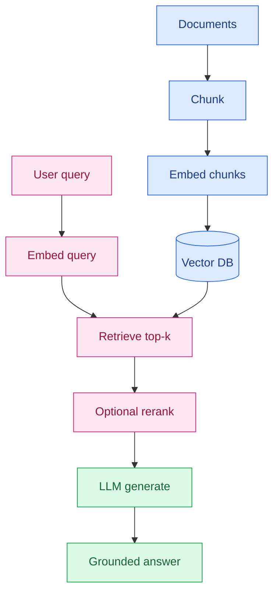

# What Is RAG

Ask a language model a question about *your* product and it will often invent a confident, well-written wrong answer. That is not a bug in the chat UI. The model was trained on public text. It does not have your wiki, your contracts, or last Tuesday's policy change sitting in its weights.

**RAG (retrieval-augmented generation)** is the pattern that fixes that: look up the relevant pages first, then ask the model to answer from those pages. This post is the simple explainer. The later RAG posts on this site assume you already have this picture.

## Table of contents

- [The open-book exam](#open-book)
- [Why models hallucinate without docs](#hallucinate)
- [The pipeline: query, retrieve, rerank, generate](#pipeline)
- [Embeddings and vector search](#embeddings)
- [Chunking: why you do not embed whole PDFs](#chunking)
- [A tiny retrieve-and-prompt example](#example)
- [Architecture](#architecture)
- [RAG vs fine-tune vs long context](#vs)
- [Failure modes](#failures)
- [Glossary](#glossary)
- [FAQ](#faq)

## The open-book exam {#open-book}

A closed-book exam is what you get from ChatGPT out of the box. The student (the model) studied a huge pile of books years ago and now answers from memory. If the question is about a book that was not in that pile — or that was revised after the exam paper was printed — you get a guess dressed up as an essay.

RAG is an **open-book exam**. The student may still be smart, but they are allowed to flip to the relevant chapter before writing. You do not re-train the student every time the handbook changes. You update the handbook and let them look it up.

That analogy carries further than it first looks:

- **The book is your knowledge base** — markdown, PDFs, tickets, Notion exports, API docs.
- **The index at the back is embeddings plus a vector database** — a way to find the right page without reading every page.
- **The citation is the retrieved chunk** — you can show the user which paragraph the answer came from.
- **A bad index fails the exam even if the student is brilliant** — if you hand them the wrong chapter, they will write a wrong answer with great grammar.

Teams often blame the model when the index is the problem. Keep that in mind as you read the rest of this explainer, and when you later get to [evaluating retrieval](/blog/posts/how-to-evaluate-rag-retrieval/).

## Why models hallucinate without docs {#hallucinate}

Language models predict the next token. They are extremely good at producing text that *looks* like an answer. They are not a database. When they have no source, they still complete the sentence, because that is the only job they were trained to do.

Three common failure shapes follow from that:

1. **Invented policy.** "Refunds are available within 30 days." Sounds right. Your actual policy is 14 days for digital goods. The model has seen thousands of refund policies and averaged them.
2. **Invented API.** A plausible function name that does not exist in your SDK. Coding agents do this constantly unless the right docs or source files are in context.
3. **Stale memory.** A fact that used to be true on the public web and is now wrong. Training cutoffs are not a product feature you can schedule around.

Telling the model "do not hallucinate" in the system prompt helps a little. It does not substitute for giving it the paragraph that contains the answer. RAG is how you put that paragraph in the prompt at question time.

There is a second, quieter reason RAG exists: **privacy and control**. You often cannot fine-tune a frontier model on internal documents, and you should not paste the entire drive into a 200k-token window. Retrieval lets you send only the few snippets needed for this question.

## The pipeline: query, retrieve, rerank, generate {#pipeline}

Every RAG system, from a weekend demo to a production chatbot, is the same four beats. Some skip rerank. None skip retrieve.

| Step | What happens | What can go wrong |
|------|----------------|-------------------|
| **Query** | The user asks a question. You may rewrite it ("password reset" from "I can't log in"). | A vague question retrieves the wrong topic. |
| **Retrieve** | Embed the query, search the vector index, take the top-k similar chunks. | The right chunk is not in the top-k, or was never ingested. |
| **Rerank** (optional) | A second model scores those chunks against the query and keeps the best few. | Skipped on cheap demos; worth it when top-k is noisy. See [Cohere reranking](/blog/posts/cohere-reranking-production-rag-retrieval/). |
| **Generate** | The LLM writes an answer using the kept chunks as context, plus your system prompt. | Context is right but the prompt does not say "if it is not here, say so." |

Two jobs run on different clocks:

- **Ingest (offline).** When docs change: parse → chunk → embed → upsert into the index. This is a batch job, a webhook, or a nightly crawl.
- **Ask (online).** On every user message: embed query → retrieve → optional rerank → generate. This is the request path you measure for latency.

If you remember only one design rule: **get retrieval right before you tune the prompt.** A beautiful system prompt cannot quote a paragraph that never arrived.

## Embeddings and vector search {#embeddings}

An **embedding** is a list of numbers that stands in for meaning. You send a sentence to an embedding model and get back something like 1,536 floats. Sentences about the same topic land close together in that space; unrelated sentences land far apart.

```
"How do I reset my password?"  →  [0.12, -0.45, 0.88, ...]
"Password recovery steps"      →  [0.11, -0.42, 0.91, ...]   ← close
"Office wifi password"         →  [0.09, -0.40, 0.70, ...]   ← also close (trap)
"Weather in Tokyo"             →  [-0.67, 0.22, -0.11, ...]  ← far
```

Vector search is nearest-neighbour lookup: embed the question, find the stored chunks whose vectors are closest, return their text. That is why RAG can match "I can't get into my account" to a page titled "Password recovery" even when the words barely overlap.

Keyword search (BM25, Postgres `tsvector`) is still useful. It wins on exact IDs, error codes, and product SKUs. Many production systems run **hybrid search**: vector + keyword, then merge. You do not need hybrid on day one. You do need to know that embeddings are not magic — they miss rare tokens that a keyword index would catch.

You store embeddings in a **vector database** (Pinecone, Qdrant, pgvector, Chroma). Each record is usually: an id, the vector, and metadata (source title, URL, the raw text). The database's only job at query time is "here are the k nearest rows."

## Chunking: why you do not embed whole PDFs {#chunking}

If you embed a 40-page handbook as one vector, the nearest-neighbour hit is the whole handbook. The model then either overflows the context window or drowns in irrelevant sections. **Chunking** splits documents into pieces small enough to retrieve precisely and large enough to stay coherent.

Practical defaults that are good enough to start:

- **Size:** roughly 500–1,000 tokens per chunk (a few paragraphs).
- **Overlap:** 50–200 tokens so a sentence that straddles a boundary is not lost.
- **Boundaries:** split on headings and paragraphs, not mid-sentence, when you can.
- **Metadata:** keep title, URL, and section heading on every chunk so you can cite it.

Chunking is the unglamorous half of RAG quality. Too small, and you retrieve a fragment with no subject. Too large, and you retrieve a chapter that buries the answer. Tables, code, and API reference pages often need different rules than prose. That is a later post. For this explainer, know that *ingest quality is retrieval quality*.

## A tiny retrieve-and-prompt example {#example}

This is the whole idea in Python-shaped pseudocode. `embed`, `index`, and `llm` are stand-ins for your vendor of choice. There is no framework required.

```python
def retrieve(query, index, k=5):
    qvec = embed(query)
    return index.search(qvec, top_k=k)

def answer(query, index):
    chunks = retrieve(query, index)
    context = "\n\n".join(c["text"] for c in chunks)
    prompt = (
        "Answer using only this context. "
        "If the answer is not there, say you do not know.\n\n"
        "Context:\n" + context +
        "\n\nQuestion: " + query
    )
    return llm.generate(prompt)
```

That is RAG. Production adds chunking at ingest, metadata filters, reranking, evals, citations in the UI, and a model choice that does not bankrupt you. Those are covered in [how to build a production RAG chatbot](/blog/posts/how-to-build-a-production-rag-chatbot/) and [economical models for RAG](/blog/posts/best-economical-llm-models-rag-openai-gemini-anthropic/).

## Architecture {#architecture}



Ingest runs when docs change. The ask path runs on every question: retrieve, optionally rerank, then generate.

## RAG vs fine-tune vs long context {#vs}

These three techniques solve different problems. Mixing them up is how teams spend a quarter fine-tuning when they needed a search index.

|  | RAG | Fine-tune | Long context |
|--|-----|-----------|--------------|
| **What you change** | Documents in an index | Model weights | How much you paste into one prompt |
| **Best for** | Facts that update; citations; private corpora | Voice, format, a narrow skill | A handful of files already in hand |
| **Freshness** | Re-ingest; minutes to hours | Re-train; days and a dataset | Only as fresh as what you pasted |
| **Cost shape** | Embed + retrieve cheap; generate on a small prompt | Upfront training; inference similar to base | Every token of the dump, every question |
| **Failure mode** | Wrong or missing chunk | Still invents facts; expensive to update | Lost-in-the-middle; cost; still no index |

Use them together when you have a reason. A light fine-tune can teach the model to always emit citations in your JSON shape. A long context window can hold the top eight chunks plus the last five chat turns. Neither replaces the index.

If your question is "how do I make the bot know our refund policy," the answer is RAG. If the question is "how do I make every reply a structured ticket summary in our tone," fine-tune (or a strict prompt plus constrained decoding) is closer. If the question is "I have three PDFs open and I want a summary," just paste them.

## Failure modes {#failures}

When a RAG bot is wrong, it is usually one of these — not "the LLM is dumb."

### Wrong chunk

The index returned something *near* the question. "Office wifi password" beat "account password reset" because both talk about passwords. Fix with better chunk metadata, hybrid search, a reranker, or query rewriting. Measure with hit@k on a golden set, not vibes — that is the [evaluation post](/blog/posts/how-to-evaluate-rag-retrieval/).

### Stale knowledge base

The right document existed last quarter. Legal updated the PDF. Nobody re-ran ingest. The bot cites last quarter with a straight face. Fix with an ingest pipeline tied to the source of truth: a git repo, a Drive webhook, a CMS publish hook. Treat the index like a cache. Caches that nobody invalidates become lies.

### Never ingested

The answer lives in a Slack thread or a spreadsheet the crawler never saw. Retrieval cannot find what you did not store. This looks identical to hallucination from the user's seat. Log "no high-scoring hits" and teach the model to abstain.

### Right chunk, wrong generation

The paragraph is in the prompt and the model still paraphrases it into a different number. Tighten the system prompt: answer only from context, quote figures, cite the source id. If it still drifts, the generator is too creative for this job — switch models or lower temperature. Do not start here. Start with retrieval.

### Context stuffing

You retrieve 30 chunks "to be safe" and the model skims. Rerank down to a handful. Diversity (MMR) helps when several sections are all somewhat relevant. More tokens is not more truth.

## Glossary {#glossary}

| Term | Meaning |
|------|---------|
| **RAG** | Retrieve relevant docs, add them to the prompt, generate an answer. |
| **LLM** | Large language model that writes the answer. |
| **Embedding** | Numeric vector that represents the meaning of a text span. |
| **Vector database** | Store of embeddings with fast nearest-neighbour search. |
| **Chunk** | A slice of a document stored and retrieved as a unit. |
| **top-k** | How many nearest chunks retrieval returns (for example 20). |
| **Reranker** | A second model that re-orders retrieved chunks by true relevance. |
| **Ingest** | Offline parse → chunk → embed → upsert. |
| **Context window** | Maximum tokens the LLM can read in one request. |
| **Hallucination** | Fluent text that is not supported by sources (or by reality). |
| **Hybrid search** | Vector similarity plus keyword search, merged. |
| **Grounding** | Forcing the answer to follow retrieved context, often with citations. |

## FAQ {#faq}

### What does RAG stand for?

Retrieval-Augmented Generation. You retrieve relevant document snippets, add them to the prompt, and let the language model generate an answer from that context instead of from memory alone.

### Is RAG the same as fine-tuning?

No. Fine-tuning changes the model's weights so it tends to talk in a certain style or format. RAG leaves the model alone and injects fresh documents at question time. Use RAG when facts change; use fine-tuning when you need a stable voice or a structured output style.

### Do I still need RAG if the model has a huge context window?

Often yes. Long context can hold a handful of files, not a knowledge base. It is slower and more expensive, it does not solve stale or missing docs, and models still get lost when you dump thousands of tokens of mixed relevance. Retrieval is how you pick the few pages that matter.

### Why do RAG chatbots still hallucinate?

Usually because retrieval returned the wrong chunk, the right document was never ingested, or the prompt did not tell the model to refuse when context is missing. Generation is only as grounded as the snippets you retrieve.

### What is an embedding in RAG?

A list of numbers that represents the meaning of a piece of text. Similar sentences land near each other in that space, so you can search by meaning instead of by exact keywords.

## Related guides

- [How to Build a Production RAG Chatbot](/blog/posts/how-to-build-a-production-rag-chatbot/)
- [How to Evaluate RAG Retrieval](/blog/posts/how-to-evaluate-rag-retrieval/)
- [Cohere Reranking for Production RAG](/blog/posts/cohere-reranking-production-rag-retrieval/)
- [Best Economical LLM Models for RAG](/blog/posts/best-economical-llm-models-rag-openai-gemini-anthropic/)

RAG is an open-book exam for models that otherwise guess. Index the handbook, retrieve the chapter, then let the model write. Everything else in the RAG series is how to keep that chapter the right one.
