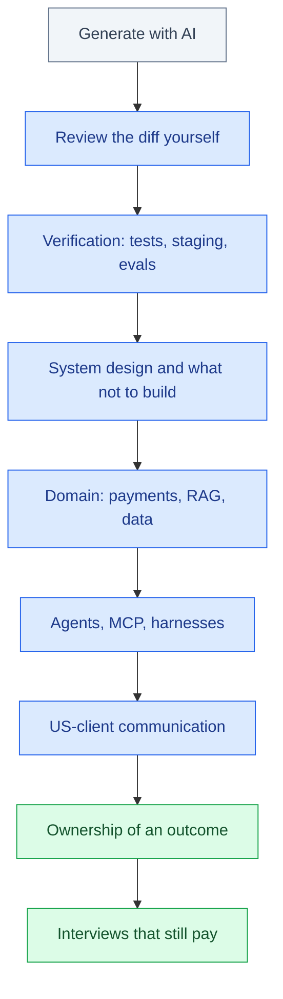

# Will AI Replace Software Engineers?

September 2026 · Published by Amar Kumar

The previous piece — [Will AI Take Coding Jobs?](/blog/posts/will-ai-take-coding-jobs/) — covered the timeline, which roles get hit first, and what a real employment shock would do to the economy. This is the follow-up people search after that: **what do engineers still get paid** in India and the US, **which skills still clear interviews**, and whether “AI jobs” are a lifeboat.

It is not another recap of GPT-1 through Copilot. The short career answer is unchanged: tasks compress, jobs do not vanish on a demo cycle, and the ladder is steeper at the bottom. The new part is money and a skill list you can plan against — as **planning bands**, not offers, and not a promise that your city or company sits at the midpoint.


## Table of contents

1. [What this follow-up is](#follow-up)
2. [India CTC planning bands](#india)
3. [US total-comp planning bands](#us)
4. [Remote US pay from India](#remote)
5. [India vs US mid-level](#chart)
6. [Skills that still pay](#skills)
7. [Junior hiring got tighter](#juniors)
8. [What AI jobs actually are](#ai-jobs)
9. [A practical path](#path)
10. [FAQ](#faq)

## What this follow-up is {#follow-up}

If you want the historical and economic argument, stop and read [Will AI Take Coding Jobs?](/blog/posts/will-ai-take-coding-jobs/) first. That post is the “will the profession exist” layer. This post is the “what should I do with a career in this market” layer.

| Question | Where it lives |
|----------|----------------|
| Which waves of tools ate which tasks? | The earlier post |
| What happens if millions of developers lose paychecks? | The earlier post |
| What CTC / TC should I plan around? | This post |
| What skills still get interviews? | This post |
| Are “AI engineer” reqs a safer bet? | This post |

Replacement, in salary terms, would look like bands collapsing toward intern wages while headcount falls. That is not what offer data looks like at senior and staff levels. What *has* changed is the **entry auction**: more applicants per generic junior seat, more take-home tests that assume you will use a model, and less patience for people who cannot explain a diff they did not type.

## India CTC planning bands {#india}

These are **approximate planning bands** for full-time software roles in India. They vary by city (Bengaluru / Hyderabad vs smaller markets), company (services vs product vs startup), stock, and whether you are on-site in a GCC. They are not an offer, not an average from a survey we ran, and not a promise.

| Level (planning) | CTC band | How to read it |
|------------------|----------|----------------|
| Fresher / campus | ₹4–14 LPA | Wide on purpose. Services vs product is the real split (below). |
| Mid (~2–5 years) | ₹15–35 LPA | Most working engineers live here; product and brand sit toward the top. |
| Senior (~5–8 years) | ₹30–70 LPA | Ownership, on-call, and “you can run a workstream” show up in the number. |
| Staff / principal | ₹60 LPA–₹1.5 Cr+ | The right tail is real and rare. Do not plan your mortgage on ₹1.5 Cr. |

**Fresher split that people actually mean:**

- **Services** (large IT, many campus offers): often about **₹4.5–7 LPA**.
- **Product** (and stronger GCCs): often about **₹12–18 LPA** for the same “new graduate” label.

That split is why “average fresher salary” articles are mush. A TCS-style services band and a product-company band are different labor markets that share a degree title. Switching from services to product later is a skills and signal problem (public work, interviews, sometimes a pay cut that is actually a raise in optionality) — not an AI problem.

AI tools in the IDE do not, by themselves, move you from ₹6 LPA to ₹18 LPA. They can make you faster at the work that product companies already screened for: shipping, tests, and explaining tradeoffs. Language choice still matters for campus vs off-campus paths; see [Python vs Java vs JavaScript](/blog/posts/python-vs-java-vs-javascript/).

## US total-comp planning bands {#us}

US numbers below are **total compensation planning bands** (salary + typical bonus + equity as people quote “TC”). Cost of living, remote vs bay-area, and whether equity is real or a slide deck matter more than the midpoint. Again: planning bands, not a Levels.fyi scrape presented as destiny.

| Level (planning) | TC band | How to read it |
|------------------|---------|----------------|
| Entry | $110–150k | Common planning range at product companies that still hire new grads. |
| Broader junior base | $80–130k | Smaller firms, non-coastal, or “developer” titles that are not FAANG-shaped. |
| Mid | $150–220k | The comparison point used in the chart below (~$185k midpoint of this band). |
| Senior | $200–350k | Scope and on-call; equity dominates at the top of the band. |
| Staff+ | $300k+ | Open-ended. Staff at large product firms is not the same job as “senior” at a 20-person shop. |

**One-company snapshot, not the market:** public Levels.fyi-style figures for Google have sat around **~$199k TC at L3** and **~$401k TC at L5**. Treat that as “what one well-documented employer pays,” not as US median software pay. Most of the country does not work there. Most of India does not either.

Macro hiring (rates, IPO windows, Big Tech headcount cycles) still moves these bands more than a new chatbot. AI is an overlay: it changes *who they hire into the band*, not whether senior TC suddenly equals barista wages.

## Remote US pay from India {#remote}

US companies that hire in India — contractor, employer of record, or an India entity — often pay **$50–120k+ USD**. That is usually **above domestic India CTC bands** at the same years of experience, and still below US-onshore TC for the same level. Currency, benefits, and tax treatment differ; take-home is not “multiply CTC by 83.”

The catch is the same as it was before agents: you need a signal US teams trust (English writing, overlapping hours, a portfolio, a referral) and you need to survive payroll legality. A practical playbook is [How to Get a Remote Software Job from India](/blog/posts/how-to-get-a-remote-software-job-from-india/). If you price yourself as a contractor on Upwork, work backwards from in-hand INR after fees and tax — [Upwork hourly rate in India (new tax regime)](/blog/posts/upwork-hourly-rate-india-new-tax-regime/) — not from a Twitter USD vanity rate.

AI made the remote interview slightly stranger: some take-homes are easier to fake, so companies add live review, “explain this diff,” and paid trials. That is good for people who actually own work. It is bad for people whose only demo is a generated CRUD app.

## India vs US mid-level {#chart}

To put one number next to another, convert a planning midpoint. **India mid ~₹32 LPA** (inside the ₹15–35 LPA band; toward product / stronger GCCs, not a services floor). **US mid ~$185k TC** (midpoint of $150–220k). At a **planning FX of about ₹84 per USD**, ₹32 Lakh is roughly **$38k**. That FX gap is real for imported goods and travel. It is not PPP: rent and food in many Indian cities go further than $38k implies on a San Francisco spreadsheet.

Chart (published HTML): India mid (FX) ~$38k, remote US-hire in India midpoint of $50–120k (~$85k), US mid ~$185k TC. Planning bands converted to USD, not offers. FX is not purchasing-power parity.

Read the chart as **three labor markets**, not as “Indian engineers are underpaid by 5× so AI will equalize them.” Domestic India, remote-for-US from India, and US onshore buy different hours, legal risk, and scope. Models did not create that wedge; they did make it easier for a US team to try a smaller, higher-leverage remote hire instead of a larger junior bench onshore.

## Skills that still pay {#skills}

If the model writes the first draft of the function, the scarce work moves one layer up. That is the same story as compilers and Stack Overflow, with a faster loop. The skills that still show up in offers:

| Skill | Why it still clears interviews | What “good” looks like |
|-------|--------------------------------|------------------------|
| **Verification** | Models are fluent and wrong | You catch a bad diff, write the test, refuse to merge theater |
| **System design** | Agents implement tickets; they do not own failure modes | You can say what breaks on Friday and what you will not build |
| **Agents / MCP** | The harness is the new intern manager | You can wire tools, evals, and permissions — see [Prompt Engineering vs AI Agents](/blog/posts/prompt-engineering-vs-ai-agents/) |
| **Domain** | Generic CRUD is the most automatable layer | Payments, RAG, data, health, logistics — pick one and go deep |
| **US-client communication** | Remote pay is a language and trust premium | Async writing, saying no, summarizing risk without hedging into mush |
| **Ownership** | Anyone can close a ticket | A metric, an on-call rotation, a “this is my system” sentence |

Prompting is a thin layer. If your upskilling plan is “better prompts,” you are competing with the model’s next release. The hired AI-shaped skills are retrieval, evals, tool use, and enough engineering to ship. Course types and a six-month shape of work: [Best AI / ML / Data Science Course (India & US)](/blog/posts/best-ai-ml-data-science-course-india-us/). Which editor or agent to buy is a separate purchase: [Best AI for Coding](/blog/posts/best-ai-for-coding/).



Each step is a filter. Generating code is the bottom rung; it is also the part models already do.

## Junior hiring got tighter {#juniors}

This is the uncomfortable part of the follow-up, and it matches what the earlier post called **compression**: fewer people doing routine implementation, more value on judgment. Teams that used to hire two juniors to feed a mid-level now try one junior plus an agent, or no junior at all.

That is not “programming is over.” It is “the bar for the first job moved.” What used to be enough — a bootcamp, a cloned Netflix UI, a certificate PDF — is weaker evidence when a model can emit the same artifact in an afternoon. What still works:

- A repo you can demo **and** explain: why this schema, what you would redo, where the tests fail.
- Evidence you **review AI output** instead of pasting it. Keep a note of a wrong suggestion you rejected. Interviewers have started asking.
- A domain hook (even a small one): a payments toy, a RAG bot on a real corpus, a data pipeline with an SLA you invented and kept.

If you are early career in India, campus services offers still exist; they are not the only path and they are not a trap if you treat the first two years as paid practice plus a public portfolio. If you are a US career changer, one domain you already know plus one shipped AI-shaped project is a tighter story than a generic “I learned Python with Copilot” line.

## What AI jobs actually are {#ai-jobs}

Job boards filled with “GenAI engineer” titles. Some of those roles are real systems work. Some are prompt theatre with a salary attached until the budget cycle ends.

| More durable | More fragile |
|--------------|--------------|
| RAG / search with evals and a corpus you own | “Prompt engineer” with no product, no evals |
| Agent harnesses, MCP tools, permission gates | Wrapping a single ChatGPT call in a Streamlit demo |
| Data / ML ops: pipelines, quality, cost | Fine-tune from scratch as a first job (lab work, not upskilling) |
| Applied domain + AI (payments, support, docs) | Title-only “AI” on a generic CRUD team |

The ironic hiring pattern from the earlier post still holds: **AI-adjacent engineering** (evals, routing, RAG, harnesses) is in demand because models are bad at being unsupervised employees. That demand is not infinite and it is not a substitute for being able to ship. If you chase only the title, you will compete with every bootcamp that added “LangChain” to a slide.

For how prompting relates to agents as a skill, not a job title, read [Prompt Engineering vs AI Agents](/blog/posts/prompt-engineering-vs-ai-agents/).

## A practical path {#path}

1. **Keep a paying engineering job if you have one.** Side-project your way into AI-shaped work; do not quit on a demo.
2. **Pick a domain** you can talk about for thirty minutes without a model in the room.
3. **Learn verification before you learn a second agent.** Tests, staging, reading diffs. The tool list is in [Best AI for Coding](/blog/posts/best-ai-for-coding/).
4. **Ship one public system** with a corpus, an eval, and a cost note. That beats three certificates. Shape of study: [Best AI / ML / Data Science Course](/blog/posts/best-ai-ml-data-science-course-india-us/).
5. **If remote US pay is the goal,** treat it as a separate funnel (legal shape, writing, hours), not as a raise you get for installing Cursor. Start with [the remote job playbook](/blog/posts/how-to-get-a-remote-software-job-from-india/).

```text
# A week that trains review, not generation
Mon: take an AI patch on a toy repo. Write tests that fail on purpose.
Tue: fix the patch until tests pass. Note every wrong API it invented.
Wed: design (on paper) what you would not let an agent touch in prod.
Thu: add one domain constraint (payments idempotency, PII, etc.).
Fri: explain the system in a 1-page note a US client could read.
```

None of that guarantees a band on the tables above. It is the work that still shows up when the interview stops being “can you write a for-loop” and becomes “can you own this when the model lies.”

## FAQ {#faq}

### Will AI replace software engineers?

It is replacing **tasks**, not the job in the strong sense. The previous post covered the timeline and economy. This one: pay bands still exist, junior hiring is tighter, and the people who get paid verify, design, and own outcomes rather than only generating code.

### What is a realistic software salary in India?

Use planning bands, not promises. Freshers often sit around **₹4–14 LPA** overall, with services roles commonly ~₹4.5–7 LPA and product roles often ~₹12–18 LPA. Mid (about 2–5 years) **₹15–35 LPA**; senior (5–8) **₹30–70 LPA**; staff **₹60 LPA to ₹1.5 Cr+**. City, company, and stock move the number more than a blog post.

### What is a realistic US software salary?

Planning total compensation: entry often **$110–150k**, with a broader junior base around **$80–130k**; mid **$150–220k**; senior **$200–350k**; staff **$300k+**. Big Tech is higher — Google L3 around **$199k TC** and L5 around **$401k** on Levels.fyi is one company, not the market.

### What skills still pay if AI writes the code?

Verification, system design, agents and MCP, a domain (payments, RAG, data), communication with US clients, and ownership of outcomes. Juniors who only generate patches are competing with the model. Juniors who can review the model still get interviews.

### Are AI jobs safer than general software engineering?

Some are, some are prompt-theatre. Roles that ship retrieval, evals, agents, and data pipelines hire. Job titles that only say “generative AI” with no system to own are as automatable as generic CRUD. Pair AI-shaped work with a domain.

### Is junior hiring over because of AI?

It is tighter, not closed. Teams need fewer people for boilerplate. The remaining junior bar is: ship something, explain it, and catch a wrong AI diff. Bootcamp certificates without that evidence are weaker than they were.

## Related guides

- [Will AI Take Coding Jobs?](/blog/posts/will-ai-take-coding-jobs/)
- [Best AI for Coding](/blog/posts/best-ai-for-coding/)
- [How to Get a Remote Software Job from India](/blog/posts/how-to-get-a-remote-software-job-from-india/)
- [Python vs Java vs JavaScript](/blog/posts/python-vs-java-vs-javascript/)
- [Best AI / ML / Data Science Course (India & US)](/blog/posts/best-ai-ml-data-science-course-india-us/)
- [Prompt Engineering vs AI Agents](/blog/posts/prompt-engineering-vs-ai-agents/)
- [Upwork Hourly Rate in India (New Tax Regime)](/blog/posts/upwork-hourly-rate-india-new-tax-regime/)
